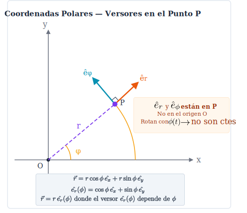
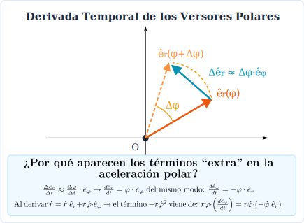
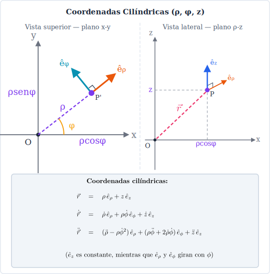
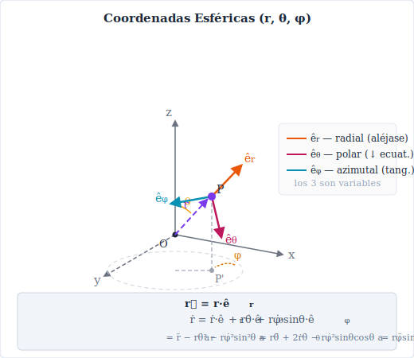

# 1. Vectores Posición, Velocidad y Aceleración

## Coordenadas Cartesianas

### Vector Posición

La posición de un punto material $P$ en el espacio se describe mediante el vector:

$$\vec{r}(t) = x(t)\,\hat{e_x} + y(t)\,\hat{e_y} + z(t)\,\hat{e_z}$$

donde $x(t)$, $y(t)$, $z(t)$ son las coordenadas del punto en función del tiempo, y $\hat{e_x}$, $\hat{e_y}$, $\hat{e_z}$ son los versores del sistema cartesiano, que son **constantes** (no cambian con la posición ni con el tiempo).

---

### Vector Velocidad

La velocidad es la derivada temporal del vector posición. Como los versores cartesianos son constantes, la derivada se aplica directamente a las componentes escalares:

$$\vec{v}(t) = \dot{\vec{r}}(t) = \dot{x}\,\hat{e_x} + \dot{y}\,\hat{e_y} + \dot{z}\,\hat{e_z}$$

donde la notación punto indica derivada respecto al tiempo:

$$\dot{x} = \frac{dx}{dt}, \qquad \dot{y} = \frac{dy}{dt}, \qquad \dot{z} = \frac{dz}{dt}$$

El **módulo de la velocidad** (rapidez) es:

$$v = |\vec{v}| = \sqrt{\dot{x}^2 + \dot{y}^2 + \dot{z}^2}$$

---

### Vector Aceleración

La aceleración es la derivada temporal de la velocidad, o equivalentemente la segunda derivada de la posición:

$$\vec{a}(t) = \dot{\vec{v}}(t) = \ddot{\vec{r}}(t) = \ddot{x}\,\hat{e_x} + \ddot{y}\,\hat{e_y} + \ddot{z}\,\hat{e_z}$$

donde:

$$\ddot{x} = \frac{d^2x}{dt^2}, \qquad \ddot{y} = \frac{d^2y}{dt^2}, \qquad \ddot{z} = \frac{d^2z}{dt^2}$$

---

## Coordenadas Polares (en el plano)

### Definición y relación con cartesianas

En 2D, cualquier punto $P$ puede localizarse con dos números:
- **$r$**: distancia desde el origen (coordenada radial)
- **$\phi$**: ángulo medido desde el eje $x$ (coordenada angular)

La posición en polares se expresa como:

$$\vec{r} = r\,\hat{e_r}$$

donde $\hat{e_r}$ es el versor radial (unitario, apunta desde el origen hacia $P$).

#### Transformación de cartesianas a polares

Dado un punto $(x, y)$ en cartesianas, obtenemos $(r, \phi)$ mediante:

$$r = \sqrt{x^2 + y^2} \qquad \text{(siempre } r \geq 0\text{)}$$

$$\phi = \arctan2(y, x) \qquad \text{(ángulo en el rango } [-\pi, \pi]\text{)}$$

**Nota:** Es importante usar `atan2` en lugar de `arctan` porque preserva el cuadrante correcto.

#### Transformación de polares a cartesianas

Inversamente, si conocemos $(r, \phi)$:

$$x = r\cos\phi \qquad y = r\sin\phi$$

Por lo tanto:

$$\vec{r} = r\cos\phi\,\hat{e_x} + r\sin\phi\,\hat{e_y}$$

---

### Versores en coordenadas polares: dónde está $\phi$?

En coordenadas polares especificamos la posición con dos números: $(r, \phi)$. Pero cuando escribimos $\vec{r} = r\,\hat{e_r}$, solo aparece $r$ explícitamente. **¿Dónde quedó $\phi$?**

La respuesta es: **$\phi$ está implícita en el versor $\hat{e_r}$.**

El versor radial $\hat{e_r}$ es un vector unitario que apunta radialmente hacia afuera, pero su *dirección* está completamente determinada por el ángulo $\phi$. En términos de los versores cartesianos (que sí tienen dirección fija):

$$\hat{e_r}(\phi) = \cos\phi\,\hat{e_x} + \sin\phi\,\hat{e_y}$$

Por lo tanto, especificar $\hat{e_r}$ es equivalente a especificar $\phi$. Son dos formas de decir lo mismo:
- **Forma polar:** la posición está a distancia $r$ en la dirección del ángulo $\phi$
- **Forma vectorial:** $\vec{r} = r\,\hat{e_r}(\phi)$ donde el versor $\hat{e_r}(\phi)$ depende de $\phi$

De la misma manera, el versor transversal (o tangencial) $\hat{e_\phi}$ apunta en la dirección perpendicular a $\hat{e_r}$, hacia donde aumenta $\phi$:

$$\hat{e_\phi}(\phi) = -\sin\phi\,\hat{e_x} + \cos\phi\,\hat{e_y}$$

**Propiedad fundamental:** A diferencia de los versores cartesianos, tanto $\hat{e_r}$ como $\hat{e_\phi}$ **dependen del ángulo $\phi$** y, por lo tanto, **cambian en el tiempo** cuando el punto se mueve y $\phi(t)$ varía.

**Analogía:** Así como en cartesianas escribimos $\vec{r} = x\hat{e_x} + y\hat{e_y}$ (dos coordenadas explícitas $x, y$ y dos versores constantes), en polares escribimos $\vec{r} = r\hat{e_r}$ (una coordenada radial explícita $r$ y un versor que ya incluye la información de $\phi$).

---

### Derivadas de los versores: la relación con $\hat{e_\phi}$

**¿Es $\hat{e_\phi}$ la derivada de $\hat{e_r}$?** Casi, pero hay que ser cuidadoso: depende de **con respecto a qué** derivamos.

#### Derivada respecto al ángulo $\phi$ (no al tiempo)

Si derivamos $\hat{e_r}$ con respecto a la coordenada angular $\phi$ (no con respecto al tiempo):

$$\frac{d\hat{e_r}}{d\phi} = \frac{d}{d\phi}\left(\cos\phi\,\hat{e_x} + \sin\phi\,\hat{e_y}\right) = -\sin\phi\,\hat{e_x} + \cos\phi\,\hat{e_y} = \hat{e_\phi}(\phi)$$

$$\frac{d\hat{e_\phi}}{d\phi} = \frac{d}{d\phi}\left(-\sin\phi\,\hat{e_x} + \cos\phi\,\hat{e_y}\right) = -\cos\phi\,\hat{e_x} - \sin\phi\,\hat{e_y} = -\hat{e_r}(\phi)$$

**Resultado:** Sí, $\hat{e_\phi} = \frac{d\hat{e_r}}{d\phi}$ (derivada respecto a la coordenada angular).

#### Derivada respecto al tiempo $t$ (regla de la cadena)

Pero lo que necesitamos para la cinemática es la derivada temporal (respecto a $t$). Usando la regla de la cadena:

$$\frac{d\hat{e_r}}{dt} = \frac{d\hat{e_r}}{d\phi}\frac{d\phi}{dt} = \hat{e_\phi} \cdot \dot{\phi}$$

Por lo tanto:

$$\boxed{\dot{\hat{e_r}} = \dot{\phi}\,\hat{e_\phi}, \qquad \dot{\hat{e_\phi}} = -\dot{\phi}\,\hat{e_r}}$$

**Interpretación:** El versor $\hat{e_r}$ no es exactamente la derivada temporal de nada. Pero sí es la derivada parcial de $\hat{e_r}$ respecto a la coordenada $\phi$. Cuando el punto se mueve y $\phi$ cambia a razón $\dot{\phi}$, el versor $\hat{e_r}$ cambia a razón $\dot{\phi}\,\hat{e_\phi}$.

---

### Posición en polares

El vector posición en coordenadas polares se escribe:

$$\vec{r}(t) = r(t)\,\hat{e_r}\left(\phi(t)\right)$$

Esta fórmula contiene **implícitamente** las dos coordenadas polares $(r, \phi)$:
- **$r(t)$** es la distancia radial (número explícito)
- **$\phi(t)$** está codificada en la dirección del versor $\hat{e_r}$ (que depende de $\phi$)

Ambas funciones $r(t)$ y $\phi(t)$ se obtienen de las coordenadas cartesianas:

$$r(t) = \sqrt{x(t)^2 + y(t)^2}$$

$$\phi(t) = \arctan2(y(t), x(t))$$

Equivalentemente, puedes expandir el versor y obtener:

$$\vec{r} = r\cos\phi\,\hat{e_x} + r\sin\phi\,\hat{e_y} \equiv x\hat{e_x} + y\hat{e_y}$$

que es exactamente la forma cartesiana. Los tres son la misma posición, solo expresados en diferentes coordenadas.

---

### Las tres formas equivalentes de expresar la posición

Una misma posición geométrica puede escribirse de tres formas:

| Forma | Expresión | Qué está explícito | Qué está implícito |
|---|---|---|---|
| **Cartesiana** | $\vec{r} = x\hat{e_x} + y\hat{e_y}$ | Dos números: $x, y$ | Nada (versores son fijos) |
| **Polar (con versor)** | $\vec{r} = r\,\hat{e_r}(\phi)$ | Número $r$; versor que depende de $\phi$ | El ángulo $\phi$ está en la dirección de $\hat{e_r}$ |
| **Polar (expandida)** | $\vec{r} = r\cos\phi\,\hat{e_x} + r\sin\phi\,\hat{e_y}$ | Dos números: $r, \phi$ | Nada (todo está explícito) |

**Conclusión:** En $\vec{r} = r\,\hat{e_r}$, la coordenada $\phi$ **NO desaparece**. Está contenida en la dirección del versor $\hat{e_r}(\phi)$. Cuando el punto se mueve y $\phi$ cambia, el versor $\hat{e_r}$ rota, y por eso tiene derivada temporal distinta de cero.

---

### Derivadas de $r$ y $\phi$ respecto al tiempo

Para obtener la velocidad y la aceleración en polares, necesitamos $\dot{r}$ y $\dot{\phi}$. Se calculan derivando respecto al tiempo:

$$\dot{r} = \frac{dr}{dt} = \frac{d}{dt}\sqrt{x^2 + y^2} = \frac{x\dot{x} + y\dot{y}}{r} = \frac{\vec{r} \cdot \vec{v}}{r}$$

$$\dot{\phi} = \frac{d\phi}{dt} = \frac{d}{dt}\arctan2(y, x) = \frac{x\dot{y} - y\dot{x}}{x^2 + y^2} = \frac{x\dot{y} - y\dot{x}}{r^2}$$

**Interpretación física:**
- $\dot{r}$: qué tan rápido cambia la distancia al origen (velocidad radial)
- $\dot{\phi}$: qué tan rápido gira el vector posición (velocidad angular)

**Relación importante:** Si conoces $x$, $y$, $\dot{x}$, $\dot{y}$ en cualquier instante, puedes calcular $r$, $\phi$, $\dot{r}$, $\dot{\phi}$ usando estas fórmulas.

---

### Velocidad en polares

El vector velocidad es la derivada temporal de la posición. Partiendo de $\vec{r} = r\,\hat{e_r}$ y aplicando la regla del producto:

$$\vec{v} = \frac{d\vec{r}}{dt} = \frac{d(r\,\hat{e_r})}{dt} = \frac{dr}{dt}\hat{e_r} + r\frac{d\hat{e_r}}{dt}$$

El primer término es directo: $\frac{dr}{dt} = \dot{r}$. 

Para el segundo término, usamos la relación que obtuvimos anteriormente: $\frac{d\hat{e_r}}{dt} = \dot{\phi}\,\hat{e_\phi}$

$$\vec{v} = \dot{r}\,\hat{e_r} + r\dot{\phi}\,\hat{e_\phi}$$

$$\boxed{\vec{v} = \dot{r}\,\hat{e_r} + r\dot{\phi}\,\hat{e_\phi}}$$

| Componente | Expresión | Significado físico |
|---|---|---|
| $v_r = \dot{r}$ | Variación del módulo de $r$ | Velocidad radial: qué tan rápido nos acercamos o alejamos del origen |
| $v_\phi = r\dot{\phi}$ | Arco recorrido por unidad de tiempo | Velocidad transversal (tangencial): qué tan rápido se gira alrededor del origen. Aumenta con $r$: a mayor distancia, más rápido se mueve uno girando. |

**Relación con la velocidad cartesiana:**

Como ambas componentes son ortogonales (versores perpendiculares), por el teorema de Pitágoras:

$$v^2 = v_r^2 + v_\phi^2 = \dot{r}^2 + r^2\dot{\phi}^2 = \dot{x}^2 + \dot{y}^2$$

Por lo tanto: 
$$v = \sqrt{\dot{r}^2 + r^2\dot{\phi}^2}$$

**Nota importante:** A diferencia de las cartesianas donde todos los términos son derivadas simples de coordenadas, aquí el término $r\dot{\phi}$ depende de ambas coordenadas $r$ y $\dot{\phi}$. Esto es característico de los sistemas curvilíneos.

### Aceleración en polares

#### Derivación paso a paso

La aceleración es la derivada temporal de la velocidad. Partiendo de:

$$\vec{v} = \dot{r}\,\hat{e_r} + r\dot{\phi}\,\hat{e_\phi}$$

$$\vec{a} = \frac{d\vec{v}}{dt} = \frac{d}{dt}\left(\dot{r}\,\hat{e_r}\right) + \frac{d}{dt}\left(r\dot{\phi}\,\hat{e_\phi}\right)$$

**Derivando el primer término** $\frac{d(\dot{r}\,\hat{e_r})}{dt}$ (aplicar regla del producto):

$$\frac{d(\dot{r}\,\hat{e_r})}{dt} = \ddot{r}\,\hat{e_r} + \dot{r}\frac{d\hat{e_r}}{dt} = \ddot{r}\,\hat{e_r} + \dot{r}\dot{\phi}\,\hat{e_\phi}$$

**Derivando el segundo término** $\frac{d(r\dot{\phi}\,\hat{e_\phi})}{dt}$ (aplicar regla del producto):

$$\frac{d(r\dot{\phi}\,\hat{e_\phi})}{dt} = \frac{d(r\dot{\phi})}{dt}\hat{e_\phi} + r\dot{\phi}\frac{d\hat{e_\phi}}{dt}$$

Calculamos cada parte:

**Parte 1:** $\frac{d(r\dot{\phi})}{dt} = \dot{r}\dot{\phi} + r\ddot{\phi}$ (regla del producto)

**Parte 2:** $\frac{d\hat{e_\phi}}{dt} = -\dot{\phi}\,\hat{e_r}$ **(derivada del versor tangencial)** — Explicación detallada:

Recordemos que el versor tangencial es:
$$\hat{e_\phi}(\phi) = -\sin\phi\,\hat{e_x} + \cos\phi\,\hat{e_y}$$

Derivando respecto al tiempo (y usando la regla de la cadena):
$$\frac{d\hat{e_\phi}}{dt} = \frac{d}{dt}\left(-\sin\phi\,\hat{e_x} + \cos\phi\,\hat{e_y}\right)$$

$$= -\cos\phi \cdot \frac{d\phi}{dt}\,\hat{e_x} - \sin\phi \cdot \frac{d\phi}{dt}\,\hat{e_y}$$

$$= -\dot{\phi}\,\left(\cos\phi\,\hat{e_x} + \sin\phi\,\hat{e_y}\right)$$

$$= -\dot{\phi}\,\hat{e_r}$$

**¿Por qué apunta en dirección opuesta a $\hat{e_r}$?**

El versor $\hat{e_\phi}$ es tangente a un círculo de radio $r$ centrado en el origen. Cuando el ángulo $\phi$ aumenta en $d\phi$, el versor $\hat{e_\phi}$ rota en el plano. El cambio (la derivada) siempre apunta **hacia el centro del círculo**, que es exactamente la dirección **opuesta** a $\hat{e_r}$ (que apunta hacia afuera).

Intuitivamente: cuando giras alrededor de un círculo, tu vector "dirección" gira, y esa rotación siempre te "jala" hacia el centro. Por eso el signo negativo.

**Visualización geométrica:**

Considera un punto $P(\phi)$ en coordenadas polares:

$$\text{Cuando } \phi \text{ aumenta un poco: } \phi \to \phi + d\phi$$

- El punto se mueve a $P(\phi + d\phi)$ sobre un arco de círculo
- El versor radial $\hat{e_r}$ rota desde apuntar a $P(\phi)$ a apuntar a $P(\phi + d\phi)$
- El versor tangencial $\hat{e_\phi}$ (perpendicular a $\hat{e_r}$) también rota

**El cambio de $\hat{e_\phi}$ es siempre radial:**

Si colocas ambos versores en el mismo punto $P(\phi)$:

$$
\begin{aligned}
\hat{e_\phi}(\phi) &= \text{versor tangencial (perpendicular a } \hat{e_r}\text{, tangente al círculo)} \\
\hat{e_\phi}(\phi + d\phi) &= \text{versor tangencial rotado}
\end{aligned}
$$

Cuando transportas ambos vectores al mismo punto, el cambio $d\hat{e_\phi} = \hat{e_\phi}(\phi + d\phi) - \hat{e_\phi}(\phi)$ apunta **siempre hacia adentro**, es decir, en dirección $-\hat{e_r}$.

**Por qué ocurre esto:**

El versor $\hat{e_\phi}$ es tangente a un círculo centrado en $O$. Cuando ese círculo se "expande" (en la dirección de aumento de $\phi$), la tangente también rota. Como el círculo es convexo (centrado en $O$), la rotación de la tangente siempre apunta **hacia el centro**.

**Regla de la cadena resumida:**

$$\frac{d\hat{e_\phi}}{dt} = \underbrace{\frac{d\hat{e_\phi}}{d\phi}}_{\text{derivada geométrica}} \cdot \underbrace{\frac{d\phi}{dt}}_{\dot{\phi}} = (-\hat{e_r}) \cdot \dot{\phi} = -\dot{\phi}\,\hat{e_r}$$

---

Sustituyendo:

$$\frac{d(r\dot{\phi}\,\hat{e_\phi})}{dt} = (\dot{r}\dot{\phi} + r\ddot{\phi})\,\hat{e_\phi} + r\dot{\phi}(-\dot{\phi}\,\hat{e_r})$$

$$= (\dot{r}\dot{\phi} + r\ddot{\phi})\,\hat{e_\phi} - r\dot{\phi}^2\,\hat{e_r}$$

**Combinando ambos términos:**

$$\vec{a} = \left[\ddot{r}\,\hat{e_r} + \dot{r}\dot{\phi}\,\hat{e_\phi}\right] + \left[(\dot{r}\dot{\phi} + r\ddot{\phi})\,\hat{e_\phi} - r\dot{\phi}^2\,\hat{e_r}\right]$$

**Agrupando por dirección:**

$$\vec{a} = \left(\ddot{r} - r\dot{\phi}^2\right)\hat{e_r} + \left(r\ddot{\phi} + 2\dot{r}\dot{\phi}\right)\hat{e_\phi}$$

$$\boxed{\vec{a} = a_r\,\hat{e_r} + a_\phi\,\hat{e_\phi}}$$

#### Componentes e interpretación

| Componente | Expresión | Nombre y significado |
|---|---|---|
| $a_r = \ddot{r} - r\dot{\phi}^2$ | **Radial** | El término $\ddot{r}$ es el cambio de velocidad radial. El término $-r\dot{\phi}^2$ es la **aceleración centrípeta** (siempre apunta hacia el origen, incluso si $\dot{r} = \ddot{r} = 0$) |
| $a_\phi = r\ddot{\phi} + 2\dot{r}\dot{\phi}$ | **Transversal** | El término $r\ddot{\phi}$ es la aceleración tangencial por cambio de velocidad angular. El término $2\dot{r}\dot{\phi}$ es la **aceleración de Coriolis** (aparece cuando hay simultáneamente rotación y cambio de radio) |

#### ¿Por qué aparecen los términos "extra"?

Los términos $-r\dot{\phi}^2$ y $2\dot{r}\dot{\phi}$ no existen en las cartesianas. **¿De dónde salen?**

La razón fundamental es que **los versores polares $\hat{e_r}$ y $\hat{e_\phi}$ cambian de dirección** cuando el punto se mueve. En cartesianas, los versores son fijos.

**Ejemplo visual del término centrípeto** ($-r\dot{\phi}^2$):

Cuando el versor $\hat{e_\phi}$ cambia su dirección al rotar, la componente tangencial $r\dot{\phi}\,\hat{e_\phi}$ también cambia aunque $r\dot{\phi}$ sea constante. Específicamente:

$$\frac{d(r\dot{\phi}\,\hat{e_\phi})}{dt} \neq r\dot{\phi}\frac{d(\text{dirección})}{dt}$$

aunque $r\dot{\phi}$ sea constante, su **dirección cambia**, por eso la derivada es no-cero.

El término $\frac{d\hat{e_\phi}}{dt} = -\dot{\phi}\,\hat{e_r}$ genera el término $-r\dot{\phi}^2\,\hat{e_r}$.

En un movimiento circular puro ($\dot{r} = 0$, $r = R$, $\dot{\phi} = \omega$ constante):
- Las cartesianas dan: $\vec{a} = -R\omega^2(\cos\omega t\,\hat{e_x} + \sin\omega t\,\hat{e_y})$ (varía continuamente)
- Las polares dan: $\vec{a} = -R\omega^2\,\hat{e_r}$ (siempre hacia el centro, mucho más elegante)

**Ejemplo del término de Coriolis** ($2\dot{r}\dot{\phi}$):

Si te acercas al origen ($\dot{r} < 0$) mientras giras ($\dot{\phi} > 0$), la ley de conservación del momento angular hace que tu velocidad de rotación deba aumentar. Esto requiere una aceleración transversal adicional: el término $2\dot{r}\dot{\phi}$.

Intuitivamente: imagina un tiovivo rotando. Si caminas hacia el centro, tienes que frenar tu avance tangencial (aceleración de Coriolis).

**Regla mnemotécnica:**
- **Radial:** cambio de rapidez radial MENOS fuerza centrífuga
- **Transversal:** cambio de velocidad angular PLUS efecto Coriolis

---

## Resumen de relaciones clave en coordenadas polares

En coordenadas polares, todo depende de cómo cambian $r$ y $\phi$ en el tiempo. Aquí está el "mapa mental" completo:

### Datos conocidos (desde cartesianas)
- Posición: $x(t)$, $y(t)$
- Velocidad: $\dot{x}(t)$, $\dot{y}(t)$
- Aceleración: $\ddot{x}(t)$, $\ddot{y}(t)$

### Paso 1: Convertir a polares

$$r(t) = \sqrt{x^2 + y^2}, \quad \phi(t) = \arctan2(y, x)$$

### Paso 2: Obtener velocidades angulares

$$\dot{r} = \frac{x\dot{x} + y\dot{y}}{r}, \quad \dot{\phi} = \frac{x\dot{y} - y\dot{x}}{r^2}$$

### Paso 3: Obtener aceleraciones angulares

$$\ddot{r} = \frac{d\dot{r}}{dt}, \quad \ddot{\phi} = \frac{d\dot{\phi}}{dt}$$

(Estas se derivan de $\ddot{x}$ e $\ddot{y}$ mediante fórmulas similares a $\dot{r}$ y $\dot{\phi}$)

### Paso 4: Obtener velocidad y aceleración en polares

$$\vec{v} = \dot{r}\,\hat{e_r} + r\dot{\phi}\,\hat{e_\phi}$$

$$\vec{a} = (\ddot{r} - r\dot{\phi}^2)\,\hat{e_r} + (r\ddot{\phi} + 2\dot{r}\dot{\phi})\,\hat{e_\phi}$$

### Casos especiales importantes

**Movimiento circular puro** ($r = R = \text{cte}$):
$$\dot{r} = \ddot{r} = 0$$
$$\vec{v} = R\dot{\phi}\,\hat{e_\phi} \quad \Rightarrow \quad v = R|\dot{\phi}|$$
$$\vec{a} = -R\dot{\phi}^2\,\hat{e_r} \quad \Rightarrow \quad a = R\dot{\phi}^2 \text{ (centrípeta)}$$

**Movimiento radial puro** ($\phi = \text{cte}$):
$$\dot{\phi} = \ddot{\phi} = 0$$
$$\vec{v} = \dot{r}\,\hat{e_r}$$
$$\vec{a} = \ddot{r}\,\hat{e_r}$$

---

## Coordenadas Cilíndricas

Las coordenadas cilíndricas $(\rho, \phi, z)$ extienden las polares al espacio 3D. El versor axial $\hat{e_z}$ es constante.

$$\vec{r} = \rho\,\hat{e_\rho} + z\,\hat{e_z}$$

Las derivadas de los versores son las mismas que en polares:

$$\dot{\hat{e_\rho}} = \dot{\phi}\,\hat{e_\phi}, \qquad \dot{\hat{e_\phi}} = -\dot{\phi}\,\hat{e_\rho}, \qquad \dot{\hat{e_z}} = 0$$

### Velocidad en cilíndricas

$$\vec{v} = \dot{\rho}\,\hat{e_\rho} + \rho\dot{\phi}\,\hat{e_\phi} + \dot{z}\,\hat{e_z}$$

### Aceleración en cilíndricas

$$\boxed{\vec{a} = \left(\ddot{\rho} - \rho\dot{\phi}^2\right)\hat{e_\rho} + \left(\rho\ddot{\phi} + 2\dot{\rho}\dot{\phi}\right)\hat{e_\phi} + \ddot{z}\,\hat{e_z}}$$

---

## Coordenadas Esféricas

Las coordenadas esféricas $(r, \theta, \phi)$ son las más generales. Los tres versores $\hat{e_r}$, $\hat{e_\theta}$, $\hat{e_\phi}$ dependen de la posición y sus derivadas son:

$$\dot{\hat{e_r}} = \dot{\theta}\,\hat{e_\theta} + \dot{\phi}\sin\theta\,\hat{e_\phi}$$

$$\dot{\hat{e_\theta}} = -\dot{\theta}\,\hat{e_r} + \dot{\phi}\cos\theta\,\hat{e_\phi}$$

$$\dot{\hat{e_\phi}} = -\dot{\phi}\sin\theta\,\hat{e_r} - \dot{\phi}\cos\theta\,\hat{e_\theta}$$

### Posición en esféricas

$$\vec{r} = r\,\hat{e_r}$$

### Velocidad en esféricas

$$\vec{v} = \dot{r}\,\hat{e_r} + r\dot{\theta}\,\hat{e_\theta} + r\dot{\phi}\sin\theta\,\hat{e_\phi}$$

### Aceleración en esféricas

$$\vec{a} = a_r\,\hat{e_r} + a_\theta\,\hat{e_\theta} + a_\phi\,\hat{e_\phi}$$

donde:

$$a_r = \ddot{r} - r\dot{\theta}^2 - r\dot{\phi}^2\sin^2\theta$$

$$a_\theta = r\ddot{\theta} + 2\dot{r}\dot{\theta} - r\dot{\phi}^2\sin\theta\cos\theta$$

$$a_\phi = r\ddot{\phi}\sin\theta + 2\dot{r}\dot{\phi}\sin\theta + 2r\dot{\theta}\dot{\phi}\cos\theta$$

---

## Resumen comparativo

| Sistema | $\vec{v}$ | Versores constantes |
|---|---|---|
| Cartesiano | $\dot{x}\,\hat{e_x} + \dot{y}\,\hat{e_y} + \dot{z}\,\hat{e_z}$ | ✅ Sí |
| Polar (2D) | $\dot{r}\,\hat{e_r} + r\dot{\phi}\,\hat{e_\phi}$ | ❌ Dependen de $\phi$ |
| Cilíndrico | $\dot{\rho}\,\hat{e_\rho} + \rho\dot{\phi}\,\hat{e_\phi} + \dot{z}\,\hat{e_z}$ | ❌ ($\hat{e_\rho}$, $\hat{e_\phi}$) |
| Esférico | $\dot{r}\,\hat{e_r} + r\dot{\theta}\,\hat{e_\theta} + r\dot{\phi}\sin\theta\,\hat{e_\phi}$ | ❌ Los tres |

> **Regla general:** En cualquier sistema curvilíneo, al derivar $\vec{r}$ hay que derivar **también los versores**. Esto genera los términos "extra" (centrípetos, de Coriolis, etc.) en la aceleración.

---

## Ejemplo resuelto — Movimiento circular uniforme

Un punto se mueve en un círculo de radio $R$ con velocidad angular constante $\omega$ en el plano $xy$.

**En cartesianas:**

$$\vec{r}(t) = R\cos(\omega t)\,\hat{e_x} + R\sin(\omega t)\,\hat{e_y}$$

$$\vec{v}(t) = -R\omega\sin(\omega t)\,\hat{e_x} + R\omega\cos(\omega t)\,\hat{e_y}$$

$$\vec{a}(t) = -R\omega^2\cos(\omega t)\,\hat{e_x} - R\omega^2\sin(\omega t)\,\hat{e_y} = -\omega^2\vec{r}$$

**En polares** (mucho más directo):

$$r = R = \text{cte} \Rightarrow \dot{r} = \ddot{r} = 0, \qquad \dot{\phi} = \omega = \text{cte} \Rightarrow \ddot{\phi} = 0$$

$$\vec{v} = R\omega\,\hat{e_\phi}$$

$$\vec{a} = -R\omega^2\,\hat{e_r}$$

El resultado es el mismo: la aceleración apunta hacia el centro con módulo $R\omega^2 = v^2/R$.

---

*Próximo tema: [Componentes intrínsecas y radio de curvatura →](./02-componentes-intrinsecas.md)*
