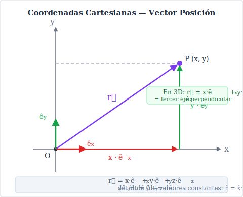
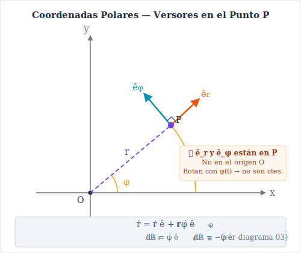

# 1. Vectores Posición, Velocidad y Aceleración

## Coordenadas Cartesianas

### Vector Posición

La posición de un punto material $P$ en el espacio se describe mediante el vector:

$$\vec{r}(t) = x(t)\,\hat{e_x} + y(t)\,\hat{e_y} + z(t)\,\hat{e_z}$$

donde $x(t)$, $y(t)$, $z(t)$ son las coordenadas del punto en función del tiempo, y $\hat{e_x}$, $\hat{e_y}$, $\hat{e_z}$ son los versores del sistema cartesiano, que son **constantes** (no cambian con la posición ni con el tiempo).

---

### Vector Velocidad

La velocidad es la derivada temporal del vector posición. Como los versores cartesianos son constantes, la derivada se aplica directamente a las componentes escalares:

$$\vec{v}(t) = \dot{\vec{r}}(t) = \dot{x}\,\hat{e_x} + \dot{y}\,\hat{e_y} + \dot{z}\,\hat{e_z}$$

donde la notación punto indica derivada respecto al tiempo:

$$\dot{x} = \frac{dx}{dt}, \qquad \dot{y} = \frac{dy}{dt}, \qquad \dot{z} = \frac{dz}{dt}$$

El **módulo de la velocidad** (rapidez) es:

$$v = |\vec{v}| = \sqrt{\dot{x}^2 + \dot{y}^2 + \dot{z}^2}$$

---

### Vector Aceleración

La aceleración es la derivada temporal de la velocidad, o equivalentemente la segunda derivada de la posición:

$$\vec{a}(t) = \dot{\vec{v}}(t) = \ddot{\vec{r}}(t) = \ddot{x}\,\hat{e_x} + \ddot{y}\,\hat{e_y} + \ddot{z}\,\hat{e_z}$$

donde:

$$\ddot{x} = \frac{d^2x}{dt^2}, \qquad \ddot{y} = \frac{d^2y}{dt^2}, \qquad \ddot{z} = \frac{d^2z}{dt^2}$$

---

## Coordenadas Polares (en el plano)

En 2D, la posición se describe con las coordenadas $(r, \phi)$:

$$\vec{r} = r\,\hat{e_r}$$

Los versores $\hat{e_r}$ y $\hat{e_\phi}$ **no son constantes**: dependen del ángulo $\phi$ y rotan con el punto. Sus derivadas temporales son:

$$\dot{\hat{e_r}} = \dot{\phi}\,\hat{e_\phi}, \qquad \dot{\hat{e_\phi}} = -\dot{\phi}\,\hat{e_r}$$

### Velocidad en polares

Derivando $\vec{r} = r\,\hat{e_r}$:

$$\vec{v} = \dot{r}\,\hat{e_r} + r\,\dot{\hat{e_r}} = \dot{r}\,\hat{e_r} + r\dot{\phi}\,\hat{e_\phi}$$

| Componente | Expresión | Significado físico |
|---|---|---|
| $v_r = \dot{r}$ | Variación del módulo de $r$ | Velocidad radial |
| $v_\phi = r\dot{\phi}$ | Arco por unidad de tiempo | Velocidad transversal |

### Aceleración en polares

Derivando $\vec{v}$ y usando las derivadas de los versores:

$$\vec{a} = \dot{\vec{v}} = \ddot{r}\,\hat{e_r} + \dot{r}\,\dot{\hat{e_r}} + \dot{r}\dot{\phi}\,\hat{e_\phi} + r\ddot{\phi}\,\hat{e_\phi} + r\dot{\phi}\,\dot{\hat{e_\phi}}$$

Sustituyendo $\dot{\hat{e_r}} = \dot{\phi}\,\hat{e_\phi}$ y $\dot{\hat{e_\phi}} = -\dot{\phi}\,\hat{e_r}$:

$$\boxed{\vec{a} = \left(\ddot{r} - r\dot{\phi}^2\right)\hat{e_r} + \left(r\ddot{\phi} + 2\dot{r}\dot{\phi}\right)\hat{e_\phi}}$$

| Componente | Expresión | Nombre |
|---|---|---|
| $a_r = \ddot{r} - r\dot{\phi}^2$ | Radial | Incluye la **aceleración centrípeta** $-r\dot{\phi}^2$ |
| $a_\phi = r\ddot{\phi} + 2\dot{r}\dot{\phi}$ | Transversal | El término $2\dot{r}\dot{\phi}$ es la **aceleración de Coriolis** |

> **Nota:** El término $-r\dot{\phi}^2$ apunta hacia el centro (negativo en $\hat{e_r}$), es la responsable de mantener el movimiento circular. El término $2\dot{r}\dot{\phi}$ aparece cuando el punto se aleja del origen mientras gira.

---

## Coordenadas Cilíndricas

Las coordenadas cilíndricas $(\rho, \phi, z)$ extienden las polares al espacio 3D. El versor axial $\hat{e_z}$ es constante.

$$\vec{r} = \rho\,\hat{e_\rho} + z\,\hat{e_z}$$

Las derivadas de los versores son las mismas que en polares:

$$\dot{\hat{e_\rho}} = \dot{\phi}\,\hat{e_\phi}, \qquad \dot{\hat{e_\phi}} = -\dot{\phi}\,\hat{e_\rho}, \qquad \dot{\hat{e_z}} = 0$$

### Velocidad en cilíndricas

$$\vec{v} = \dot{\rho}\,\hat{e_\rho} + \rho\dot{\phi}\,\hat{e_\phi} + \dot{z}\,\hat{e_z}$$

### Aceleración en cilíndricas

$$\boxed{\vec{a} = \left(\ddot{\rho} - \rho\dot{\phi}^2\right)\hat{e_\rho} + \left(\rho\ddot{\phi} + 2\dot{\rho}\dot{\phi}\right)\hat{e_\phi} + \ddot{z}\,\hat{e_z}}$$

---

## Coordenadas Esféricas

Las coordenadas esféricas $(r, \theta, \phi)$ son las más generales. Los tres versores $\hat{e_r}$, $\hat{e_\theta}$, $\hat{e_\phi}$ dependen de la posición y sus derivadas son:

$$\dot{\hat{e_r}} = \dot{\theta}\,\hat{e_\theta} + \dot{\phi}\sin\theta\,\hat{e_\phi}$$

$$\dot{\hat{e_\theta}} = -\dot{\theta}\,\hat{e_r} + \dot{\phi}\cos\theta\,\hat{e_\phi}$$

$$\dot{\hat{e_\phi}} = -\dot{\phi}\sin\theta\,\hat{e_r} - \dot{\phi}\cos\theta\,\hat{e_\theta}$$

### Posición en esféricas

$$\vec{r} = r\,\hat{e_r}$$

### Velocidad en esféricas

$$\vec{v} = \dot{r}\,\hat{e_r} + r\dot{\theta}\,\hat{e_\theta} + r\dot{\phi}\sin\theta\,\hat{e_\phi}$$

### Aceleración en esféricas

$$\vec{a} = a_r\,\hat{e_r} + a_\theta\,\hat{e_\theta} + a_\phi\,\hat{e_\phi}$$

donde:

$$a_r = \ddot{r} - r\dot{\theta}^2 - r\dot{\phi}^2\sin^2\theta$$

$$a_\theta = r\ddot{\theta} + 2\dot{r}\dot{\theta} - r\dot{\phi}^2\sin\theta\cos\theta$$

$$a_\phi = r\ddot{\phi}\sin\theta + 2\dot{r}\dot{\phi}\sin\theta + 2r\dot{\theta}\dot{\phi}\cos\theta$$

---

## Resumen comparativo

| Sistema | $\vec{v}$ | Versores constantes |
|---|---|---|
| Cartesiano | $\dot{x}\,\hat{e_x} + \dot{y}\,\hat{e_y} + \dot{z}\,\hat{e_z}$ | ✅ Sí |
| Polar (2D) | $\dot{r}\,\hat{e_r} + r\dot{\phi}\,\hat{e_\phi}$ | ❌ Dependen de $\phi$ |
| Cilíndrico | $\dot{\rho}\,\hat{e_\rho} + \rho\dot{\phi}\,\hat{e_\phi} + \dot{z}\,\hat{e_z}$ | ❌ ($\hat{e_\rho}$, $\hat{e_\phi}$) |
| Esférico | $\dot{r}\,\hat{e_r} + r\dot{\theta}\,\hat{e_\theta} + r\dot{\phi}\sin\theta\,\hat{e_\phi}$ | ❌ Los tres |

> **Regla general:** En cualquier sistema curvilíneo, al derivar $\vec{r}$ hay que derivar **también los versores**. Esto genera los términos "extra" (centrípetos, de Coriolis, etc.) en la aceleración.

---

## Ejemplo resuelto — Movimiento circular uniforme

Un punto se mueve en un círculo de radio $R$ con velocidad angular constante $\omega$ en el plano $xy$.

**En cartesianas:**

$$\vec{r}(t) = R\cos(\omega t)\,\hat{e_x} + R\sin(\omega t)\,\hat{e_y}$$

$$\vec{v}(t) = -R\omega\sin(\omega t)\,\hat{e_x} + R\omega\cos(\omega t)\,\hat{e_y}$$

$$\vec{a}(t) = -R\omega^2\cos(\omega t)\,\hat{e_x} - R\omega^2\sin(\omega t)\,\hat{e_y} = -\omega^2\vec{r}$$

**En polares** (mucho más directo):

$$r = R = \text{cte} \Rightarrow \dot{r} = \ddot{r} = 0, \qquad \dot{\phi} = \omega = \text{cte} \Rightarrow \ddot{\phi} = 0$$

$$\vec{v} = R\omega\,\hat{e_\phi}$$

$$\vec{a} = -R\omega^2\,\hat{e_r}$$

El resultado es el mismo: la aceleración apunta hacia el centro con módulo $R\omega^2 = v^2/R$.

---

*Próximo tema: [Componentes intrínsecas y radio de curvatura →](./02-componentes-intrinsecas.md)*
