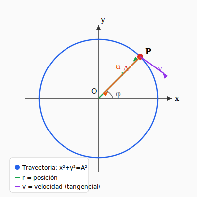
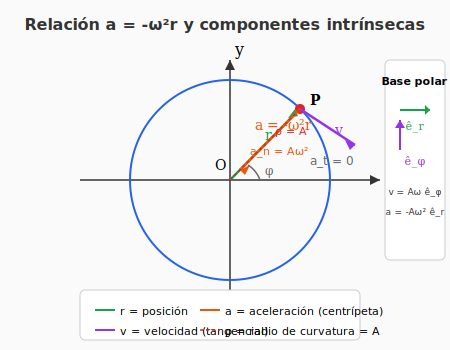

# Ejercicio 10 — Solución

**INSPT – UTN** | **Física Teórica I** | **Prof. Carlos Dibarbora**  
**Bloque 2:** Movimiento Plano (Cartesianas)  
**Dificultad:** ⭐⭐ Intermedio | **Tiempo estimado:** 20 min

---

## Enunciado

El vector posición de un punto material es:

$$\mathbf{r}(t) = A\cos(\omega t)\,\hat{\mathbf{i}} + A\sin(\omega t)\,\hat{\mathbf{j}}$$

a) Hallar la ecuación de la trayectoria.  
b) Hallar el vector velocidad y el vector aceleración.  
c) Demostrar que el vector aceleración está dirigido hacia el origen y que tiene módulo proporcional a la distancia al origen.  
d) Hallar las componentes intrínsecas del vector aceleración y el radio de curvatura.  
e) Los vectores velocidad y aceleración en coordenadas polares.

---

## a) Ecuación de la trayectoria

**Objetivo:** Eliminar el parámetro $t$ para obtener una relación entre $x$ e $y$.

### Paso 1 — Identificar las componentes

$$x = A\cos(\omega t) \qquad y = A\sin(\omega t)$$

### Paso 2 — Despejar las funciones trigonométricas

$$\cos(\omega t) = \frac{x}{A} \qquad \sin(\omega t) = \frac{y}{A}$$

### Paso 3 — Usar la identidad fundamental

$$\cos^2(\omega t) + \sin^2(\omega t) = 1$$

Sustituyendo:

$$\left(\frac{x}{A}\right)^2 + \left(\frac{y}{A}\right)^2 = 1$$

### Paso 4 — Simplificar

$$\frac{x^2}{A^2} + \frac{y^2}{A^2} = 1$$

$$\boxed{x^2 + y^2 = A^2}$$

**Interpretación:** La trayectoria es una **circunferencia** de radio $A$ centrada en el origen.

*Figura 1: Movimiento circular uniforme. El vector posición $\mathbf{r}$ apunta desde el origen hacia P, la velocidad $\mathbf{v}$ es tangente a la trayectoria, y la aceleración $\mathbf{a}$ apunta hacia el centro.*

---

## b) Vector velocidad y vector aceleración

**Objetivo:** Derivar $\mathbf{r}(t)$ respecto al tiempo.

### Velocidad: $\mathbf{v} = \dot{\mathbf{r}}$

$$\mathbf{v}(t) = \frac{d}{dt}\left[A\cos(\omega t)\,\hat{\mathbf{i}} + A\sin(\omega t)\,\hat{\mathbf{j}}\right]$$

Derivando componente a componente (regla de la cadena):

$$\frac{d}{dt}[\cos(\omega t)] = -\omega\sin(\omega t)$$
$$\frac{d}{dt}[\sin(\omega t)] = \omega\cos(\omega t)$$

$$\boxed{\mathbf{v}(t) = -A\omega\sin(\omega t)\,\hat{\mathbf{i}} + A\omega\cos(\omega t)\,\hat{\mathbf{j}}}$$

### Aceleración: $\mathbf{a} = \dot{\mathbf{v}} = \ddot{\mathbf{r}}$

$$\mathbf{a}(t) = \frac{d}{dt}\left[-A\omega\sin(\omega t)\,\hat{\mathbf{i}} + A\omega\cos(\omega t)\,\hat{\mathbf{j}}\right]$$

Derivando nuevamente:

$$\frac{d}{dt}[\sin(\omega t)] = \omega\cos(\omega t)$$
$$\frac{d}{dt}[\cos(\omega t)] = -\omega\sin(\omega t)$$

$$\mathbf{a}(t) = -A\omega^2\cos(\omega t)\,\hat{\mathbf{i}} - A\omega^2\sin(\omega t)\,\hat{\mathbf{j}}$$

$$\boxed{\mathbf{a}(t) = -A\omega^2\cos(\omega t)\,\hat{\mathbf{i}} - A\omega^2\sin(\omega t)\,\hat{\mathbf{j}}}$$

---

## c) Demostrar que $\mathbf{a}$ apunta al origen y es proporcional a la distancia

**Objetivo:** Relacionar $\mathbf{a}$ con $\mathbf{r}$.

### Demostración

Observamos que la aceleración se puede reescribir factorizando $-\omega^2$:

$$\mathbf{a}(t) = -\omega^2\left[A\cos(\omega t)\,\hat{\mathbf{i}} + A\sin(\omega t)\,\hat{\mathbf{j}}\right]$$

El término entre corchetes es exactamente $\mathbf{r}(t)$:

$$\boxed{\mathbf{a}(t) = -\omega^2\,\mathbf{r}(t)}$$

### Conclusiones

1. **Dirección:** El signo **menos** indica que $\mathbf{a}$ tiene dirección opuesta a $\mathbf{r}$. Como $\mathbf{r}$ apunta desde el origen hacia la partícula, $\mathbf{a}$ apunta **desde la partícula hacia el origen** → aceleración centrípeta.

2. **Módulo proporcional a la distancia:**

$$|\mathbf{a}| = \omega^2|\mathbf{r}| = \omega^2 A$$

El módulo de la aceleración es proporcional a la distancia al origen (que es constante e igual a $A$).

---

## d) Componentes intrínsecas de la aceleración y radio de curvatura

**Objetivo:** Descomponer $\mathbf{a}$ en componente tangencial ($a_t$) y normal ($a_n$).

### Fórmulas de referencia

- **Componente tangencial:** $a_t = \dfrac{dv}{dt}$ (variación de la rapidez)
- **Componente normal:** $a_n = \dfrac{v^2}{\rho}$ (aceleración centrípeta)
- **Radio de curvatura:** $\rho = \dfrac{v^2}{a_n}$

### Paso 1 — Calcular la rapidez

$$v = |\mathbf{v}| = \sqrt{(-A\omega\sin(\omega t))^2 + (A\omega\cos(\omega t))^2}$$

$$v = \sqrt{A^2\omega^2\sin^2(\omega t) + A^2\omega^2\cos^2(\omega t)}$$

$$v = A\omega\sqrt{\sin^2(\omega t) + \cos^2(\omega t)}$$

$$\boxed{v = A\omega}$$

**La rapidez es constante** → se trata de un movimiento circular uniforme (MCU).

### Paso 2 — Componente tangencial

$$a_t = \frac{dv}{dt} = \frac{d}{dt}(A\omega) = \boxed{0}$$

Como la rapidez no cambia, no hay aceleración tangencial.

### Paso 3 — Componente normal

Dado que $a_t = 0$, toda la aceleración es normal:

$$a_n = |\mathbf{a}| = \sqrt{(-A\omega^2\cos(\omega t))^2 + (-A\omega^2\sin(\omega t))^2}$$

$$a_n = A\omega^2\sqrt{\cos^2(\omega t) + \sin^2(\omega t)}$$

$$\boxed{a_n = A\omega^2}$$

### Paso 4 — Radio de curvatura

$$\rho = \frac{v^2}{a_n} = \frac{(A\omega)^2}{A\omega^2} = \frac{A^2\omega^2}{A\omega^2}$$

$$\boxed{\rho = A}$$

**Interpretación:** El radio de curvatura es igual al radio de la circunferencia, como era de esperar para un MCU.

*Figura 2: Descomposición de la aceleración en componentes intrínsecas. La aceleración es puramente normal ($a_t = 0$), apuntando hacia el centro con módulo $a_n = A\omega^2$. El radio de curvatura $\rho = A$ coincide con el radio de la trayectoria.*

---

## e) Vectores velocidad y aceleración en coordenadas polares

**Objetivo:** Expresar $\mathbf{v}$ y $\mathbf{a}$ en la base polar $\{\hat{e}_r, \hat{e}_\phi\}$.

### Versores polares en función de cartesianos

$$\hat{e}_r = \cos\phi\,\hat{\mathbf{i}} + \sin\phi\,\hat{\mathbf{j}}$$
$$\hat{e}_\phi = -\sin\phi\,\hat{\mathbf{i}} + \cos\phi\,\hat{\mathbf{j}}$$

En este caso, $\phi = \omega t$.

### Velocidad en coordenadas polares

$$\mathbf{v} = -A\omega\sin(\omega t)\,\hat{\mathbf{i}} + A\omega\cos(\omega t)\,\hat{\mathbf{j}}$$

Factorizando $A\omega$:

$$\mathbf{v} = A\omega\left[-\sin(\omega t)\,\hat{\mathbf{i}} + \cos(\omega t)\,\hat{\mathbf{j}}\right]$$

Comparando con $\hat{e}_\phi$ (con $\phi = \omega t$):

$$\hat{e}_\phi = -\sin(\omega t)\,\hat{\mathbf{i}} + \cos(\omega t)\,\hat{\mathbf{j}}$$

$$\boxed{\mathbf{v} = A\omega\,\hat{e}_\phi}$$

**Interpretación:** La velocidad es puramente tangencial (no hay componente radial), como corresponde a un movimiento circular.

### Aceleración en coordenadas polares

$$\mathbf{a} = -A\omega^2\cos(\omega t)\,\hat{\mathbf{i}} - A\omega^2\sin(\omega t)\,\hat{\mathbf{j}}$$

Factorizando $-A\omega^2$:

$$\mathbf{a} = -A\omega^2\left[\cos(\omega t)\,\hat{\mathbf{i}} + \sin(\omega t)\,\hat{\mathbf{j}}\right]$$

Comparando con $\hat{e}_r$ (con $\phi = \omega t$):

$$\hat{e}_r = \cos(\omega t)\,\hat{\mathbf{i}} + \sin(\omega t)\,\hat{\mathbf{j}}$$

$$\boxed{\mathbf{a} = -A\omega^2\,\hat{e}_r}$$

**Interpretación:** La aceleración es puramente radial (no hay componente angular), apuntando hacia el centro.

---

## 📋 Resumen de resultados

| Inciso | Resultado |
|--------|-----------|
| a) Trayectoria | $x^2 + y^2 = A^2$ (circunferencia de radio $A$) |
| b) Velocidad | $\mathbf{v} = -A\omega\sin(\omega t)\,\hat{\mathbf{i}} + A\omega\cos(\omega t)\,\hat{\mathbf{j}}$ |
| b) Aceleración | $\mathbf{a} = -A\omega^2\cos(\omega t)\,\hat{\mathbf{i}} - A\omega^2\sin(\omega t)\,\hat{\mathbf{j}}$ |
| c) Relación | $\mathbf{a} = -\omega^2\mathbf{r}$ (apunta al origen, proporcional a $|\mathbf{r}|$) |
| d) $a_t$ | $0$ |
| d) $a_n$ | $A\omega^2$ |
| d) $\rho$ | $A$ |
| e) $\mathbf{v}$ en polares | $A\omega\,\hat{e}_\phi$ |
| e) $\mathbf{a}$ en polares | $-A\omega^2\,\hat{e}_r$ |

---

## 💡 Conceptos clave para el final

1. **Reconocer el patrón:** Cuando veas $\cos(\omega t)$ y $\sin(\omega t)$ con el mismo coeficiente, pensá inmediatamente en **movimiento circular uniforme**.

2. **La relación $\mathbf{a} = -\omega^2\mathbf{r}$** es fundamental: aparece en todo movimiento armónico y circular. Es la firma del MCU.

3. **Componentes intrínsecas:**
   - Si la rapidez es constante → $a_t = 0$
   - Toda la aceleración es normal → $a_n = \dfrac{v^2}{\rho}$

4. **Radio de curvatura:** Para MCU, $\rho = R$ (el radio de la trayectoria).

5. **Coordenadas polares para MCU:**
   - $\mathbf{v} = v\,\hat{e}_\phi$ (puramente tangencial)
   - $\mathbf{a} = -\dfrac{v^2}{R}\,\hat{e}_r$ (puramente radial, hacia el centro)
