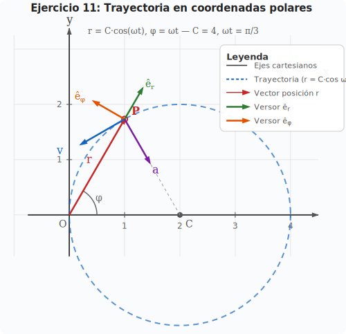

# Ejercicio 11 — Solución

**INSPT – UTN** | **Física Teórica I** | **Prof. Carlos Dibarbora**  
**Bloque 3:** Coordenadas Polares 2D  
**Dificultad:** ⭐⭐ Intermedio | **Tiempo estimado:** 20 min

---

## Enunciado

Las ecuaciones polares de movimiento de un punto material son:

$$r = C\cos(\omega t) \qquad \phi = \omega t$$

a) Hallar las componentes polares de los vectores velocidad y aceleración.
b) Las componentes intrínsecas del vector aceleración.
c) El radio de curvatura.

---

## 📐 Recordatorio — Fórmulas polares

En la base polar $\{\hat{e}_r, \hat{e}_\phi\}$:

| Vector | Expresión |
|---|---|
| Posición | $\mathbf{r} = r\,\hat{e}_r$ |
| Velocidad | $\mathbf{v} = \dot{r}\,\hat{e}_r + r\dot{\phi}\,\hat{e}_\phi$ |
| Aceleración | $\mathbf{a} = (\ddot{r} - r\dot{\phi}^2)\,\hat{e}_r + (r\ddot{\phi} + 2\dot{r}\dot{\phi})\,\hat{e}_\phi$ |

> **Tip clave:** Estas fórmulas se deducen derivando $\mathbf{r}=r\hat{e}_r$ y sabiendo que $\dot{\hat{e}}_r = \dot{\phi}\hat{e}_\phi$ y $\dot{\hat{e}}_\phi = -\dot{\phi}\hat{e}_r$. No hace falta memorizarlas si sabés derivar con regla de la cadena.

---

## a) Componentes polares de velocidad y aceleración

### Paso 1 — Derivadas de $r$ y $\phi$

*Figura 1: Trayectoria descripta por las ecuaciones polares $r = C\cos(\omega t)$, $\phi = \omega t$. Es una circunferencia de radio $C/2$ centrada en $(C/2, 0)$.*

| Magnitud | Expresión |
|---|---|
| $r$ | $C\cos(\omega t)$ |
| $\dot{r}$ | $-C\omega\sin(\omega t)$ |
| $\ddot{r}$ | $-C\omega^2\cos(\omega t)$ |
| $\dot{\phi}$ | $\omega$ |
| $\ddot{\phi}$ | $0$ |

### Paso 2 — Velocidad en polares

$$\mathbf{v} = \dot{r}\,\hat{e}_r + r\dot{\phi}\,\hat{e}_\phi$$

Sustituyendo:

$$\mathbf{v} = -C\omega\sin(\omega t)\,\hat{e}_r + C\cos(\omega t) \cdot \omega \,\hat{e}_\phi$$

$$\boxed{\mathbf{v} = -C\omega\sin(\omega t)\,\hat{e}_r + C\omega\cos(\omega t)\,\hat{e}_\phi}$$

### Paso 3 — Aceleración en polares

$$\mathbf{a} = (\ddot{r} - r\dot{\phi}^2)\,\hat{e}_r + (r\ddot{\phi} + 2\dot{r}\dot{\phi})\,\hat{e}_\phi$$

**Componente radial ($\hat{e}_r$):**

$$\ddot{r} - r\dot{\phi}^2 = -C\omega^2\cos(\omega t) - C\cos(\omega t) \cdot \omega^2$$
$$= -C\omega^2\cos(\omega t) - C\omega^2\cos(\omega t)$$
$$= -2C\omega^2\cos(\omega t)$$

**Componente transversal ($\hat{e}_\phi$):**

$$r\ddot{\phi} + 2\dot{r}\dot{\phi} = C\cos(\omega t) \cdot 0 + 2(-C\omega\sin(\omega t)) \cdot \omega$$
$$= -2C\omega^2\sin(\omega t)$$

$$\boxed{\mathbf{a} = -2C\omega^2\cos(\omega t)\,\hat{e}_r - 2C\omega^2\sin(\omega t)\,\hat{e}_\phi}$$

---

## b) Componentes intrínsecas de la aceleración

**Objetivo:** Descomponer $\mathbf{a}$ en componente tangencial ($a_t$) y normal ($a_n$).

### Fórmulas de referencia
- **Componente tangencial:** $a_t = \dfrac{dv}{dt}$ (variación de la rapidez)
- **Componente normal:** $a_n = \dfrac{v^2}{\rho}$ (aceleración centrípeta)
- **Relación:** $|\mathbf{a}|^2 = a_t^2 + a_n^2$

### Paso 1 — Calcular la rapidez

$$v = |\mathbf{v}| = \sqrt{(-C\omega\sin(\omega t))^2 + (C\omega\cos(\omega t))^2}$$

$$v = \sqrt{C^2\omega^2\sin^2(\omega t) + C^2\omega^2\cos^2(\omega t)}$$

$$v = C\omega\sqrt{\sin^2(\omega t) + \cos^2(\omega t)}$$

$$\boxed{v = C\omega}$$

**La rapidez es constante.**

### Paso 2 — Componente tangencial

$$a_t = \frac{dv}{dt} = \frac{d}{dt}(C\omega) = \boxed{0}$$

Como la rapidez no cambia, no hay aceleración tangencial.

### Paso 3 — Componente normal

Dado que $a_t = 0$, toda la aceleración es normal:

$$|\mathbf{a}| = \sqrt{(-2C\omega^2\cos(\omega t))^2 + (-2C\omega^2\sin(\omega t))^2}$$

$$|\mathbf{a}| = 2C\omega^2\sqrt{\cos^2(\omega t) + \sin^2(\omega t)}$$

Dado que toda la aceleración es normal:

$$\boxed{a_n = |\mathbf{a}| = 2C\omega^2}$$

### Resumen
| Componente | Valor |
|---|---|
| $a_t$ | $0$ |
| $a_n$ | $2C\omega^2$ |

---

## c) Radio de curvatura

**Objetivo:** Calcular $\rho = \dfrac{v^2}{a_n}$.

$$\rho = \frac{v^2}{a_n} = \frac{(C\omega)^2}{2C\omega^2}$$

$$\rho = \frac{C^2\omega^2}{2C\omega^2}$$

$$\boxed{\rho = \frac{C}{2}}$$

### Interpretación

La trayectoria descrita por $r = C\cos(\omega t)$, $\phi = \omega t$ es una **circunferencia** de diámetro $C$ centrada en $(C/2, 0)$. El radio de curvatura constante $\rho = C/2$ confirma que se trata de un movimiento circular.

**Verificación en coordenadas cartesianas:**

$$x = r\cos\phi = C\cos(\omega t)\cos(\omega t) = C\cos^2(\omega t)$$
$$y = r\sin\phi = C\cos(\omega t)\sin(\omega t)$$

Usando identidades trigonométricas:

$$x = \frac{C}{2}\big[1 + \cos(2\omega t)\big] \qquad y = \frac{C}{2}\sin(2\omega t)$$

$$\left(x - \frac{C}{2}\right)^2 + y^2 = \left(\frac{C}{2}\right)^2$$

que es la ecuación de una circunferencia de radio $C/2$.

---

## 📝 Notas de estudio

### Derivación de las derivadas de los versores polares

Si $\hat{e}_r$ rota un ángulo $d\phi$:
- $\hat{e}_r$ cambia en dirección $\hat{e}_\phi$: $d\hat{e}_r = d\phi\,\hat{e}_\phi \implies \dot{\hat{e}}_r = \dot{\phi}\,\hat{e}_\phi$
- $\hat{e}_\phi$ cambia en dirección $-\hat{e}_r$: $d\hat{e}_\phi = -d\phi\,\hat{e}_r \implies \dot{\hat{e}}_\phi = -\dot{\phi}\,\hat{e}_r$

### Regla memotécnica para velocidad en polares

> **"Punto r en e_r, más r punto phi en e_phi"**

La velocidad siempre tiene dos partes:
1. Lo que **aleja/acerca** del centro → $\dot{r}\,\hat{e}_r$
2. Lo que **gira alrededor** del centro → $r\dot{\phi}\,\hat{e}_\phi$