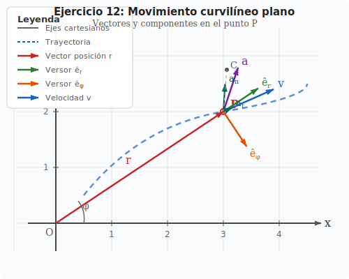

# Ejercicio 12 — Solución

**INSPT – UTN** | **Física Teórica I** | **Prof. Carlos Dibarbora**  
**Bloque 3:** Coordenadas Polares 2D  
**Dificultad:** ⭐⭐⭐ Difícil | **Tiempo estimado:** 25 min

---

## Enunciado

Considerar un movimiento curvilíneo plano. En un instante $t$, un punto material pasa por $P$. Dibujar en ese punto los vectores velocidad y aceleración, indicando sus componentes intrínsecas y polares. (Elegir como polo el origen de las coordenadas cartesianas).

---

## 📐 Conceptos clave

### 1. Sistema de coordenadas polares

En coordenadas polares, la posición de un punto $P$ se describe mediante:
- **$r$**: distancia desde el origen (polo) hasta el punto
- **$\phi$**: ángulo que forma el vector posición con el eje $x$

Los **versores polares** son:
- $\hat{e}_r$: versor radial, apunta desde el origen hacia el punto $P$
- $\hat{e}_\phi$: versor transversal, perpendicular a $\hat{e}_r$ en sentido antihorario

**Relación con cartesianas:**
$$\hat{e}_r = \cos\phi\,\hat{i} + \sin\phi\,\hat{j}$$
$$\hat{e}_\phi = -\sin\phi\,\hat{i} + \cos\phi\,\hat{j}$$

### 2. Componentes intrínsecas

Las componentes intrínsecas se definen respecto a la **trayectoria**:
- **Componente tangencial ($a_t$)**: paralela a la velocidad, mide la variación de la rapidez
- **Componente normal ($a_n$)**: perpendicular a la velocidad, apunta hacia el centro de curvatura

**Versores intrínsecos:**
- $\hat{t}$: versor tangente a la trayectoria (dirección de $\mathbf{v}$)
- $\hat{n}$: versor normal, perpendicular a $\hat{t}$ hacia el centro de curvatura

### 3. Vectores en movimiento curvilíneo

**Velocidad:**
$$\mathbf{v} = v\,\hat{t} = \dot{r}\,\hat{e}_r + r\dot{\phi}\,\hat{e}_\phi$$

**Aceleración:**
$$\mathbf{a} = a_t\,\hat{t} + a_n\,\hat{n} = (\ddot{r} - r\dot{\phi}^2)\,\hat{e}_r + (r\ddot{\phi} + 2\dot{r}\dot{\phi})\,\hat{e}_\phi$$

Donde:
- $a_t = \dfrac{dv}{dt}$ (variación de la rapidez)
- $a_n = \dfrac{v^2}{\rho}$ (aceleración centrípeta, $\rho$ = radio de curvatura)

---

## Diagrama completo

*Figura 1: Trayectoria curvilínea plana con todos los vectores y sus descomposiciones en el punto P.*

---

## Análisis detallado de cada vector

### 1. Vector posición $\mathbf{r}$ (rojo)

El vector posición va desde el origen $O$ hasta el punto $P$:

$$\mathbf{r} = x_P\,\hat{i} + y_P\,\hat{j}$$

En el diagrama, $P$ está en $(3, 2)$, entonces:
$$\mathbf{r} = 3\,\hat{i} + 2\,\hat{j}$$

**Módulo:**
$$r = |\mathbf{r}| = \sqrt{3^2 + 2^2} = \sqrt{13} \approx 3.61$$

**Ángulo polar:**
$$\phi = \arctan\left(\frac{2}{3}\right) \approx 33.7°$$

### 2. Versores polares $\hat{e}_r$ y $\hat{e}_\phi$

**Versor radial $\hat{e}_r$ (verde):**
$$\hat{e}_r = \frac{\mathbf{r}}{|\mathbf{r}|} = \frac{3\,\hat{i} + 2\,\hat{j}}{\sqrt{13}} \approx 0.832\,\hat{i} + 0.555\,\hat{j}$$

Apunta desde el origen hacia $P$.

**Versor transversal $\hat{e}_\phi$ (naranja):**
$$\hat{e}_\phi = -\sin\phi\,\hat{i} + \cos\phi\,\hat{j} \approx -0.555\,\hat{i} + 0.832\,\hat{j}$$

Es perpendicular a $\hat{e}_r$ en sentido antihorario.

**Verificación de ortogonalidad:**
$$\hat{e}_r \cdot \hat{e}_\phi = (0.832)(-0.555) + (0.555)(0.832) = 0 \quad ✓$$

### 3. Vector velocidad $\mathbf{v}$ (azul)

La velocidad es **siempre tangente a la trayectoria**. En el punto $P$, la tangente a la curva tiene una dirección aproximada de $(0.9, -0.4)$ (normalizada).

$$\mathbf{v} = v\,\hat{t}$$

Donde $\hat{t}$ es el versor tangente a la trayectoria en $P$.

**En componentes polares:**
$$\mathbf{v} = \dot{r}\,\hat{e}_r + r\dot{\phi}\,\hat{e}_\phi$$

- $\dot{r}$: velocidad radial (qué tan rápido se aleja/acerca del origen)
- $r\dot{\phi}$: velocidad transversal (qué tan rápido gira alrededor del origen)

### 4. Vector aceleración $\mathbf{a}$ (violeta)

La aceleración tiene dos componentes:

**En componentes intrínsecas:**
$$\mathbf{a} = a_t\,\hat{t} + a_n\,\hat{n}$$

- **$a_t$ (teal)**: componente tangencial, paralela a $\mathbf{v}$
  - Si $a_t > 0$: el móvil acelera
  - Si $a_t < 0$: el móvil frena
  - Si $a_t = 0$: rapidez constante

- **$a_n$ (teal oscuro)**: componente normal, perpendicular a $\mathbf{v}$
  - Siempre apunta hacia el centro de curvatura $C$
  - $a_n = \dfrac{v^2}{\rho}$, donde $\rho$ es el radio de curvatura
  - Si la trayectoria es recta, $a_n = 0$

**En componentes polares:**
$$\mathbf{a} = (\ddot{r} - r\dot{\phi}^2)\,\hat{e}_r + (r\ddot{\phi} + 2\dot{r}\dot{\phi})\,\hat{e}_\phi$$

- **Componente radial:** $a_r = \ddot{r} - r\dot{\phi}^2$
  - El término $-r\dot{\phi}^2$ es la aceleración centrípeta (siempre negativa)
  
- **Componente transversal:** $a_\phi = r\ddot{\phi} + 2\dot{r}\dot{\phi}$
  - El término $2\dot{r}\dot{\phi}$ es la aceleración de Coriolis

### 5. Centro de curvatura $C$

El centro de curvatura $C$ es el centro del círculo osculador (el círculo que mejor aproxima la curva en $P$).

**Propiedades:**
- Está sobre la normal a la trayectoria en $P$
- La distancia $PC = \rho$ (radio de curvatura)
- La aceleración normal $\mathbf{a}_n$ apunta hacia $C$

En el diagrama, $C$ está aproximadamente en $(3.06, 1.25)$, con $\rho \approx 0.75$ unidades.

---

## Relaciones entre las bases

### Transformación de polares a intrínsecas

Dado que $\mathbf{v} = \dot{r}\,\hat{e}_r + r\dot{\phi}\,\hat{e}_\phi$ y $\mathbf{v} = v\,\hat{t}$:

$$\hat{t} = \frac{\dot{r}}{v}\,\hat{e}_r + \frac{r\dot{\phi}}{v}\,\hat{e}_\phi$$

Donde $v = \sqrt{\dot{r}^2 + (r\dot{\phi})^2}$.

El versor normal $\hat{n}$ es perpendicular a $\hat{t}$:
$$\hat{n} = -\frac{r\dot{\phi}}{v}\,\hat{e}_r + \frac{\dot{r}}{v}\,\hat{e}_\phi$$

### Casos particulares

**1. Movimiento circular uniforme ($r = \text{cte}$, $\dot{\phi} = \text{cte}$):**
- $\dot{r} = 0$, $\ddot{r} = 0$, $\ddot{\phi} = 0$
- $\mathbf{v} = r\dot{\phi}\,\hat{e}_\phi$ (solo componente transversal)
- $\mathbf{a} = -r\dot{\phi}^2\,\hat{e}_r$ (solo componente radial, centrípeta)
- $a_t = 0$, $a_n = r\dot{\phi}^2 = v^2/r$

**2. Movimiento rectilíneo ($\phi = \text{cte}$):**
- $\dot{\phi} = 0$, $\ddot{\phi} = 0$
- $\mathbf{v} = \dot{r}\,\hat{e}_r$ (solo componente radial)
- $\mathbf{a} = \ddot{r}\,\hat{e}_r$ (solo componente radial)
- $a_n = 0$, $a_t = \ddot{r}$

---

## Resumen visual

| Vector | Color | Dirección | Significado físico |
|--------|-------|-----------|-------------------|
| $\mathbf{r}$ | Rojo | Desde $O$ hasta $P$ | Posición del punto |
| $\hat{e}_r$ | Verde | Misma dirección que $\mathbf{r}$ | Versor radial |
| $\hat{e}_\phi$ | Naranja | Perpendicular a $\hat{e}_r$ | Versor transversal |
| $\mathbf{v}$ | Azul | Tangente a la trayectoria | Velocidad instantánea |
| $\mathbf{a}$ | Violeta | Hacia el centro de curvatura | Aceleración total |
| $a_t$ | Teal | Paralela a $\mathbf{v}$ | Variación de rapidez |
| $a_n$ | Teal oscuro | Perpendicular a $\mathbf{v}$ | Aceleración centrípeta |

---

## 📝 Notas de estudio

### ¿Por qué la velocidad es tangente a la trayectoria?

La velocidad es la derivada de la posición:
$$\mathbf{v} = \frac{d\mathbf{r}}{dt} = \lim_{\Delta t \to 0} \frac{\mathbf{r}(t+\Delta t) - \mathbf{r}(t)}{\Delta t}$$

El vector $\mathbf{r}(t+\Delta t) - \mathbf{r}(t)$ es una cuerda de la trayectoria. Cuando $\Delta t \to 0$, la cuerda se convierte en tangente.

### ¿Por qué la aceleración normal apunta al centro de curvatura?

La aceleración normal surge del cambio de **dirección** de la velocidad. Si la trayectoria se curva, la velocidad cambia de dirección hacia el interior de la curva (hacia el centro de curvatura).

Matemáticamente:
$$\mathbf{a}_n = \frac{v^2}{\rho}\,\hat{n}$$

Como $v^2/\rho > 0$ y $\hat{n}$ apunta hacia el centro de curvatura, $\mathbf{a}_n$ siempre apunta hacia adentro de la curva.

### Relación entre aceleración de Coriolis y componentes intrínsecas

El término $2\dot{r}\dot{\phi}$ en la aceleración transversal polar es la **aceleración de Coriolis**. Surge cuando hay movimiento radial ($\dot{r} \neq 0$) y rotación ($\dot{\phi} \neq 0$) simultáneamente.

En componentes intrínsecas, este efecto se distribuye entre $a_t$ y $a_n$ dependiendo de la geometría de la trayectoria.

---

## Verificación con un ejemplo concreto

Supongamos que en el punto $P(3, 2)$:
- $\dot{r} = 2$ m/s (se aleja del origen)
- $\dot{\phi} = 0.5$ rad/s (gira en sentido antihorario)
- $\ddot{r} = 0$ m/s²
- $\ddot{\phi} = 0$ rad/s²

**Velocidad en polares:**
$$\mathbf{v} = 2\,\hat{e}_r + (3.61)(0.5)\,\hat{e}_\phi = 2\,\hat{e}_r + 1.805\,\hat{e}_\phi$$

**Rapidez:**
$$v = \sqrt{2^2 + 1.805^2} = \sqrt{4 + 3.258} = \sqrt{7.258} \approx 2.69 \text{ m/s}$$

**Aceleración en polares:**
$$a_r = 0 - (3.61)(0.5)^2 = -0.903 \text{ m/s}^2$$
$$a_\phi = (3.61)(0) + 2(2)(0.5) = 2 \text{ m/s}^2$$

$$\mathbf{a} = -0.903\,\hat{e}_r + 2\,\hat{e}_\phi$$

**Módulo de la aceleración:**
$$a = \sqrt{(-0.903)^2 + 2^2} = \sqrt{0.815 + 4} = \sqrt{4.815} \approx 2.19 \text{ m/s}^2$$

**Componentes intrínsecas:**

Primero calculamos $\hat{t}$:
$$\hat{t} = \frac{2}{2.69}\,\hat{e}_r + \frac{1.805}{2.69}\,\hat{e}_\phi = 0.743\,\hat{e}_r + 0.671\,\hat{e}_\phi$$

Componente tangencial:
$$a_t = \mathbf{a} \cdot \hat{t} = (-0.903)(0.743) + (2)(0.671) = -0.671 + 1.342 = 0.671 \text{ m/s}^2$$

Componente normal:
$$a_n = \sqrt{a^2 - a_t^2} = \sqrt{4.815 - 0.450} = \sqrt{4.365} \approx 2.09 \text{ m/s}^2$$

**Radio de curvatura:**
$$\rho = \frac{v^2}{a_n} = \frac{7.258}{2.09} \approx 3.47 \text{ m}$$

---

## Conclusión

El ejercicio 12 es un ejercicio **conceptual** que requiere comprender:

1. **La velocidad siempre es tangente a la trayectoria**
2. **La aceleración tiene dos componentes intrínsecas:**
   - Tangencial: cambia la rapidez
   - Normal: cambia la dirección (apunta al centro de curvatura)
3. **Las componentes polares dependen de la elección del polo** (en este caso, el origen)
4. **Las bases (cartesiana, polar, intrínseca) son equivalentes** y se pueden transformar entre sí

El diagrama muestra todas estas relaciones geométricamente, permitiendo visualizar cómo los diferentes sistemas de coordenadas describen el mismo movimiento desde perspectivas distintas pero equivalentes.
