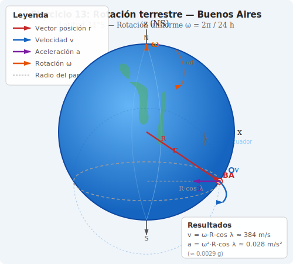

# Ejercicio 13 — Solución

**INSPT – UTN** | **Física Teórica I** | **Prof. Carlos Dibarbora**  
**Bloque 4:** Análisis de Movimiento 2D  
**Dificultad:** ⭐⭐ Intermedio | **Tiempo estimado:** 20 min

---

## Enunciado

La Tierra rota uniformemente con respecto a su eje. Calcular la velocidad y la aceleración de un punto situado en Buenos Aires ($34^\circ$ latitud sur).

---

## 📐 Datos

| Magnitud | Símbolo | Valor |
|----------|---------|-------|
| Radio terrestre | $R$ | $6{,}37 \times 10^6$ m |
| Latitud de Buenos Aires | $\lambda$ | $34^\circ$ S |
| Colatitud | $\theta$ | $124^\circ$ ($= 90^\circ + 34^\circ$) |
| Período de rotación | $T$ | $24$ h $= 86{,}400$ s |
| Velocidad angular terrestre | $\omega$ | $\dfrac{2\pi}{T}$ |

---

## Diagrama de la situación

*Figura 1: Geometría de la rotación terrestre. Buenos Aires está a latitud λ = 34° S. La velocidad $\vec{v}$ es tangente al paralelo y la aceleración $\vec{a}$ apunta hacia el eje de rotación.*

---

## Resolución

### 1. Sistema de coordenadas

Definimos un sistema de **coordenadas esféricas** $(r, \theta, \phi)$ con origen en el centro de la Tierra y eje $z$ coincidente con el eje de rotación (polo norte en $+\hat{e}_z$):

| Coordenada | Descripción |
|---|---|
| $r$ | Distancia radial desde el centro de la Tierra |
| $\theta$ | Colatitud (ángulo desde el eje $z$) |
| $\phi$ | Longitud (ángulo azimutal alrededor del eje $z$) |

Los versores de la base esférica son $\{\hat{e}_r, \hat{e}_\theta, \hat{e}_\phi\}$. Sus derivadas temporales (según el apunte) son:

$$\dot{\hat{e}}_r = \dot{\theta}\,\hat{e}_\theta + \dot{\phi}\sin\theta\,\hat{e}_\phi$$
$$\dot{\hat{e}}_\theta = -\dot{\theta}\,\hat{e}_r + \dot{\phi}\cos\theta\,\hat{e}_\phi$$
$$\dot{\hat{e}}_\phi = -\dot{\phi}\sin\theta\,\hat{e}_r - \dot{\phi}\cos\theta\,\hat{e}_\theta$$

---

### 2. Velocidad angular de la Tierra

La Tierra da una vuelta completa ($2\pi$ rad) en un período $T$:

$$\omega = \frac{2\pi}{T} = \frac{2\pi}{86{,}400\ \text{s}}$$

$$\boxed{\omega = 7{,}27 \times 10^{-5}\ \text{rad/s}}$$

---

### 3. Coordenadas esféricas de Buenos Aires

El punto sobre la superficie terrestre tiene $r = R$ constante y se ubica a latitud $\lambda = 34^\circ$ S. La **colatitud** (ángulo desde el polo norte) es:

$$\theta = 90^\circ - \lambda = 90^\circ - (-34^\circ) = 124^\circ$$

Por tratarse de una rotación uniforme, las derivadas de las coordenadas son:

| Coordenada | Valor | $\dot{(\,)}$ | $\ddot{(\,)}$ |
|---|---|---|---|
| $r$ | $R$ (cte) | $0$ | $0$ |
| $\theta$ | $124^\circ$ (cte) | $0$ | $0$ |
| $\phi$ | $\omega t$ | $\omega$ | $0$ |

Es decir: el punto no se aleja del centro ($\dot{r}=0$), no cambia de latitud ($\dot{\theta}=0$), y rota con velocidad angular constante ($\ddot{\phi}=0$).

---

### 4. Vector velocidad

La velocidad en coordenadas esféricas es (apunte, sección esféricas):

$$\vec{v} = \dot{r}\,\hat{e}_r + r\dot{\theta}\,\hat{e}_\theta + r\dot{\phi}\sin\theta\,\hat{e}_\phi$$

Sustituyendo $\dot{r}=0$, $\dot{\theta}=0$, $\dot{\phi}=\omega$:

$$\boxed{\vec{v} = R\omega\sin\theta\,\hat{e}_\phi}$$

**Interpretación:** La velocidad es puramente azimutal (dirección $\hat{e}_\phi$), tangente al paralelo, hacia el este.

**Módulo:**

$$\sin\theta = \sin 124^\circ = \sin 56^\circ = 0{,}829$$

$$v = R\omega\sin\theta = (6{,}37\times10^6\ \text{m})(7{,}27\times10^{-5}\ \text{rad/s})(0{,}829)$$

$$\boxed{v = 384\ \text{m/s}}$$

---

### 5. Vector aceleración

La aceleración en coordenadas esféricas es (apunte):

$$\vec{a} = a_r\,\hat{e}_r + a_\theta\,\hat{e}_\theta + a_\phi\,\hat{e}_\phi$$

donde:

$$a_r = \ddot{r} - r\dot{\theta}^2 - r\dot{\phi}^2\sin^2\theta$$
$$a_\theta = r\ddot{\theta} + 2\dot{r}\dot{\theta} - r\dot{\phi}^2\sin\theta\cos\theta$$
$$a_\phi = r\ddot{\phi}\sin\theta + 2\dot{r}\dot{\phi}\sin\theta + 2r\dot{\theta}\dot{\phi}\cos\theta$$

Sustituyendo $\dot{r}=0$, $\ddot{r}=0$, $\dot{\theta}=0$, $\ddot{\theta}=0$, $\ddot{\phi}=0$:

$$a_r = 0 - 0 - R\omega^2\sin^2\theta = -R\omega^2\sin^2\theta$$
$$a_\theta = 0 + 0 - R\omega^2\sin\theta\cos\theta = -R\omega^2\sin\theta\cos\theta$$
$$a_\phi = 0$$

$$\boxed{\vec{a} = -R\omega^2\sin^2\theta\,\hat{e}_r - R\omega^2\sin\theta\cos\theta\,\hat{e}_\theta}$$

#### Dirección de la aceleración

La aceleración tiene dos componentes no nulas: $a_r$ y $a_\theta$. Ambas se combinan para dar un vector que apunta **perpendicularmente hacia el eje de rotación**. Para verlo:

El vector que va desde el punto $P$ hasta el eje de rotación (en perpendicular) se escribe en la base esférica como:

$$\vec{d} = -R\sin\theta\,(\sin\theta\,\hat{e}_r + \cos\theta\,\hat{e}_\theta)$$

Comparando con $\vec{a} = -R\omega^2\sin^2\theta\,\hat{e}_r - R\omega^2\sin\theta\cos\theta\,\hat{e}_\theta$:

$$\vec{a} = \omega^2\,\vec{d}$$

La aceleración es, efectivamente, **centrípeta hacia el eje de rotación**. Las componentes $a_r$ y $a_\theta$ no son independientes: juntas apuntan en la dirección que va del punto $P$ al eje, que en general no coincide ni con $\hat{e}_r$ ni con $\hat{e}_\theta$ por separado.

En el Ecuador ($\theta = 90^\circ$, $\cos\theta = 0$) la aceleración es puramente radial: $a_r = -R\omega^2\hat{e}_r$. En los polos ($\theta = 0^\circ$ o $180^\circ$, $\sin\theta = 0$) la aceleración es nula.

#### Módulo

$$|\vec{a}| = R\omega^2\sin\theta\sqrt{\sin^2\theta + \cos^2\theta} = R\omega^2\sin\theta$$

Numéricamente:

$$|\vec{a}| = (6{,}37\times10^6\ \text{m})(7{,}27\times10^{-5}\ \text{rad/s})^2(0{,}829)$$

$$\boxed{|\vec{a}| = 0{,}028\ \text{m/s}^2}$$

---

### 6. Componentes intrínsecas

La rapidez es constante ($v = R\omega\sin\theta$), por lo tanto:

- **Aceleración tangencial:** $a_t = \dfrac{dv}{dt} = 0$
- **Aceleración normal:** $a_n = |\vec{a}| = 0{,}028\ \text{m/s}^2$

Toda la aceleración es normal (centrípeta).

---

### 7. Relación con el radio del paralelo

El radio del paralelo que describe Buenos Aires está relacionado con la colatitud mediante:

$$R_\lambda = R\sin\theta = R\cos\lambda$$

En términos de este radio:

$$\vec{v} = \omega R_\lambda\,\hat{e}_\phi \qquad \Rightarrow \qquad v = \omega R_\lambda$$
$$|\vec{a}| = \omega^2 R_\lambda$$

que son las expresiones clásicas del movimiento circular uniforme alrededor del eje de rotación.

---

## 📊 Resumen de resultados

| Magnitud | Expresión vectorial | Módulo |
|---|---|---|
| $\vec{r}$ | $R\,\hat{e}_r$ | $6{,}37\times10^6$ m |
| $\vec{v}$ | $R\omega\sin\theta\,\hat{e}_\phi$ | $384$ m/s |
| $\vec{a}$ | $-R\omega^2\sin^2\theta\,\hat{e}_r - R\omega^2\sin\theta\cos\theta\,\hat{e}_\theta$ | $0{,}028$ m/s² |

---

## 🔍 Verificación numérica

$$\omega = \frac{2\pi}{86400} = 7{,}272205 \times 10^{-5}\ \text{rad/s}$$

$$\sin 124^\circ = \sin 56^\circ = 0{,}8290376$$

$$v = 7{,}272205 \times 10^{-5} \cdot 6{,}37\times10^6 \cdot 0{,}8290376 = 383{,}99\ \text{m/s}$$

$$|\vec{a}| = (7{,}272205 \times 10^{-5})^2 \cdot 6{,}37\times10^6 \cdot 0{,}8290376 = 0{,}02793\ \text{m/s}^2$$

---

## Observación

La aceleración centrípeta debida a la rotación terrestre es del orden del $0{,}3\%$ de $g$. Esto explica por qué $g$ varía ligeramente con la latitud: en el Ecuador ($R_\lambda = R$) la aceleración centrípeta es máxima ($\approx 0{,}034$ m/s²), mientras que en los polos ($R_\lambda = 0$) es nula. Si la Tierra rotara unas 17 veces más rápido, la aceleración centrípeta en el Ecuador igualaría a $g$.