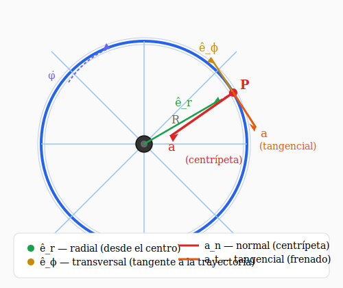

# Ejercicio 14 — Solución

**INSPT – UTN** | **Física Teórica I** | **Prof. Carlos Dibarbora**  
**Bloque 4:** Análisis de Movimiento 2D  
**Dificultad:** ⭐⭐ Intermedio | **Tiempo estimado:** 20 min

---

## Enunciado

Un volante cuyo diámetro es $2{,}40\,\text{m}$ tiene una velocidad angular que disminuye uniformemente de $100\,\text{rpm}$ en $t = 0$ hasta detenerse cuando $t = 4\,\text{s}$. Calcular las aceleraciones tangencial y normal de un punto situado sobre el borde del volante cuando $t = 2\,\text{s}$.

---

## 📐 Datos

| Magnitud | Símbolo | Valor |
|---|---|---|
| Radio del volante | $R$ | $1{,}20$ m |
| Velocidad angular inicial | $\dot{\phi}(0) = \omega_0$ | $100$ rpm |
| Tiempo hasta detenerse | $t_f$ | $4$ s |
| Instante de interés | $t$ | $2$ s |

---

## Diagrama

*Figura 1: Volante de radio $R$ girando con velocidad angular $\dot{\phi}(t)$. Sobre el borde se muestran la aceleración tangencial $\vec{a}_t$ (en la dirección de $\hat{e}_\phi$, frenando) y la aceleración normal $\vec{a}_n$ (hacia el centro, en dirección $-\hat{e}_r$).*

---

## Resolución

### 1. Velocidad angular inicial en rad/s

Convertimos las revoluciones por minuto a radianes por segundo.

$$ \omega_0 = 100\ \frac{\text{rev}}{\text{min}} \cdot \frac{2\pi\ \text{rad}}{1\ \text{rev}} \cdot \frac{1\ \text{min}}{60\ \text{s}} = \frac{200\pi}{60} = \frac{10\pi}{3}\ \text{rad/s} $$

$$ \boxed{\dot{\phi}(0) = \frac{10\pi}{3}\ \text{rad/s}} $$

---

### 2. Aceleración angular $\ddot{\phi}$

El enunciado dice que la velocidad angular "disminuye uniformemente". Esto significa que la **aceleración angular es constante**:

$$ \ddot{\phi}(t) = \alpha = \text{cte} $$

Integrando una vez:

$$ \dot{\phi}(t) = \dot{\phi}(0) + \alpha t $$

Sabemos que el volante se detiene en $t_f = 4$ s, es decir $\dot{\phi}(4) = 0$:

$$ 0 = \frac{10\pi}{3} + \alpha \cdot 4 $$

$$ \boxed{\alpha = -\frac{5\pi}{6}\ \text{rad/s}^2} $$

El signo negativo indica que la aceleración angular se opone al giro (movimiento desacelerado).

---

### 3. Velocidad angular en $t = 2$ s

$$ \dot{\phi}(2) = \frac{10\pi}{3} + \left(-\frac{5\pi}{6}\right) \cdot 2 = \frac{10\pi}{3} - \frac{5\pi}{3} $$

$$ \boxed{\dot{\phi}(2) = \frac{5\pi}{3}\ \text{rad/s}} $$

---

### 4. Vector aceleración en coordenadas polares

Un punto en el borde del volante tiene **$r = R$ constante**, por lo tanto $\dot{r} = \ddot{r} = 0$.

Partimos de la expresión general de la aceleración en polares (apunte, sección "Aceleración en polares"):

$$ \vec{a} = (\ddot{r} - r\dot{\phi}^2)\,\hat{e}_r + (r\ddot{\phi} + 2\dot{r}\dot{\phi})\,\hat{e}_\phi $$

Simplificando con $\dot{r} = \ddot{r} = 0$:

$$ \boxed{\vec{a} = -R\dot{\phi}^2\,\hat{e}_r + R\ddot{\phi}\,\hat{e}_\phi} $$

En este caso concreto:

$$ \vec{a}(t) = -R\dot{\phi}(t)^2\,\hat{e}_r + R\alpha\,\hat{e}_\phi $$

Tenemos dos componentes:

| Componente | Expresión | Rol físico |
|---|---|---|
| **Radial** $a_r$ | $-R\dot{\phi}^2$ | Siempre apunta hacia el centro ($-\hat{e}_r$): es la aceleración centrípeta |
| **Transversal** $a_\phi$ | $R\alpha$ | Es tangente a la trayectoria: es la aceleración tangencial |

> 💡 **Observación:** En el movimiento circular con $r$ constante, la base polar $\{\hat{e}_r, \hat{e}_\phi\}$ y la base intrínseca $\{\hat{t}, \hat{n}\}$ están alineadas:
> - $\hat{e}_\phi = \hat{t}$ (tangente a la trayectoria)
> - $-\hat{e}_r = \hat{n}$ (normal hacia el centro de curvatura)

---

### 5. Aceleración tangencial $a_t$

La aceleración tangencial es la componente **transversal** (según $\hat{e}_\phi$):

$$ a_t = R\alpha = (1{,}20) \cdot \left(-\frac{5\pi}{6}\right) $$

$$ \boxed{a_t = -\pi\ \text{m/s}^2 \approx -3{,}14\ \text{m/s}^2} $$

El signo negativo indica que se opone al movimiento (el volante está frenando).

---

### 6. Aceleración normal $a_n$

La aceleración normal es la componente **radial** (según $-\hat{e}_r$), tomada en módulo:

$$ a_n = R\dot{\phi}(2)^2 = (1{,}20) \cdot \left(\frac{5\pi}{3}\right)^2 $$

$$ a_n = 1{,}20 \cdot \frac{25\pi^2}{9} $$

$$ \boxed{a_n = \frac{10\pi^2}{3}\ \text{m/s}^2 \approx 32{,}9\ \text{m/s}^2} $$

---

### 7. Aceleración total

El vector aceleración completo en $t = 2$ s es:

$$ \boxed{\vec{a} = -\frac{10\pi^2}{3}\,\hat{e}_r - \pi\,\hat{e}_\phi\ \text{m/s}^2} $$

Su módulo:

$$ |\vec{a}| = \sqrt{a_t^2 + a_n^2} = \sqrt{\pi^2 + \left(\frac{10\pi^2}{3}\right)^2} \approx \sqrt{9{,}87 + 1082} \approx 33{,}0\ \text{m/s}^2 $$

---

## 📊 Resumen de resultados

| Componente | Expresión | Valor exacto | Valor numérico |
|---|---|---|---|
| $a_t$ (tangencial) | $R\alpha$ | $-\pi$ m/s² | $\approx 3{,}14$ m/s², frenando |
| $a_n$ (normal) | $R\dot{\phi}^2$ | $\dfrac{10\pi^2}{3}$ m/s² | $\approx 32{,}9$ m/s², centrípeta |
| $\vec{a}$ total | $-R\dot{\phi}^2\hat{e}_r + R\alpha\hat{e}_\phi$ | — | $\approx 33{,}0$ m/s² |

---

## 🔍 Verificación con cuentas precisas

$$ \alpha = -\frac{5\pi}{6} = -2{,}61799\ \text{rad/s}^2 $$

$$ R\alpha = 1{,}20 \cdot (-2{,}61799) = -3{,}14159\ \text{m/s}^2 \quad (= -\pi) $$

$$ \dot{\phi}(2) = \frac{5\pi}{3} = 5{,}23599\ \text{rad/s} $$

$$ R\dot{\phi}^2 = 1{,}20 \cdot 27{,}4149 = 32{,}898\ \text{m/s}^2 $$

---

## 💡 Observación conceptual

El resultado muestra que $a_n \gg a_t$: la aceleración normal (centrípeta) es **unas 10 veces mayor** que la tangencial. Esto es típico de movimientos rotacionales donde la velocidad angular es alta: aunque el volante esté frenando, el cambio de dirección de la velocidad domina sobre el cambio de rapidez.

Para que $a_t$ y $a_n$ fueran comparables, la desaceleración angular tendría que ser mucho más intensa.
