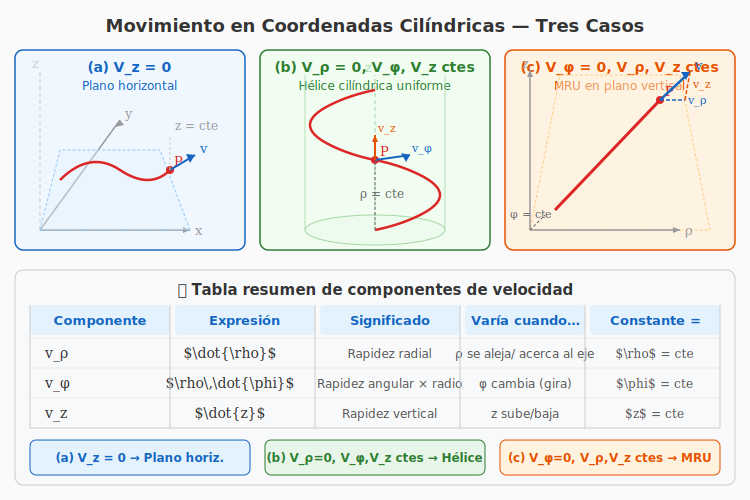

# Ejercicio 15 — Solución

**INSPT – UTN** | **Física Teórica I** | **Prof. Carlos Dibarbora**  
**Bloque 4:** Análisis de Movimiento 2D  
**Dificultad:** ⭐⭐ Intermedio | **Tiempo estimado:** 15 min

---

## Enunciado

Indicar el tipo de movimiento que realiza un punto material si las componentes cilíndricas del vector velocidad son:

a) $V_z = 0$
b) $V_\rho = 0$ y las demás componentes son constantes
c) $V_\phi = 0$ y las demás componentes son constantes

---

## Recordatorio: coordenadas cilíndricas

En coordenadas cilíndricas $(\rho, \phi, z)$, el vector velocidad se expresa como:

$$\vec{v} = v_\rho\,\hat{e}_\rho + v_\phi\,\hat{e}_\phi + v_z\,\hat{e}_z$$

donde cada componente se relaciona con las coordenadas mediante:

| Componente | Expresión | Significado físico |
|---|---|---|
| $v_\rho$ | $\dot{\rho}$ | Rapidez de cambio del radio cilíndrico (alejamiento/acercamiento al eje $z$) |
| $v_\phi$ | $\rho\,\dot{\phi}$ | Rapidez de cambio del ángulo azimutal (movimiento de rotación alrededor del eje $z$) |
| $v_z$ | $\dot{z}$ | Rapidez de cambio de la altura vertical (movimiento a lo largo del eje $z$) |

---

## Diagrama general — Coordenadas cilíndricas

*Figura 1: Representación de los tres casos de movimiento en coordenadas cilíndricas. (a) $V_z=0$: movimiento plano horizontal. (b) $V_\rho=0$, $V_\phi$, $V_z$ ctes: hélice cilíndrica uniforme. (c) $V_\phi=0$, $V_\rho$, $V_z$ ctes: movimiento rectilíneo en un plano vertical.*

---

## Resolución

### Notación

Para cada caso analizamos qué coordenadas varían y cuáles permanecen constantes. Partimos de las ecuaciones cinemáticas en cilíndricas:

$$
\begin{cases}
v_\rho = \dot{\rho} \\[4pt]
v_\phi = \rho\,\dot{\phi} \\[4pt]
v_z = \dot{z}
\end{cases}
$$

---

### Caso (a) — $V_z = 0$

#### Paso 1: Interpretación

$$v_z = 0 \quad\Longrightarrow\quad \dot{z} = 0$$

Si la derivada temporal de $z$ es nula, entonces $z$ es constante:

$$\boxed{z = \text{cte}}$$

#### Paso 2: Tipo de movimiento

La coordenada vertical no cambia. Esto significa que la partícula se mueve **exclusivamente en un plano horizontal** (paralelo al plano $xy$). No hay restricciones sobre $v_\rho$ ni $v_\phi$, por lo que dentro de ese plano el movimiento puede ser cualquier trayectoria (curvilínea, rectilínea, circular, etc.).

> **Respuesta (a):** Movimiento **plano horizontal** (contenido en un plano $z = \text{cte}$).

---

### Caso (b) — $V_\rho = 0$ y las demás componentes son constantes

#### Paso 1: Interpretación de $V_\rho = 0$

$$v_\rho = 0 \quad\Longrightarrow\quad \dot{\rho} = 0 \quad\Longrightarrow\quad \boxed{\rho = \text{cte}}$$

El radio cilíndrico es constante. La partícula se mantiene siempre a la misma distancia del eje $z$.

#### Paso 2: Interpretación de $V_\phi$ constante

$$v_\phi = \rho\,\dot{\phi} = \text{cte}$$

Como $\rho$ es constante, esto implica que $\dot{\phi}$ también es constante:

$$\boxed{\dot{\phi} = \text{cte}}$$

Es decir, la velocidad angular alrededor del eje $z$ es uniforme.

#### Paso 3: Interpretación de $V_z$ constante

$$v_z = \dot{z} = \text{cte} \quad\Longrightarrow\quad \boxed{z(t) = z_0 + v_z t}$$

La coordenada vertical crece (o decrece) linealmente con el tiempo.

#### Paso 4: Tipo de movimiento resultante

Combinando las tres condiciones:

- $\rho = \text{cte}$ → trayectoria sobre un cilindro de radio fijo
- $\dot{\phi} = \text{cte}$ → giro uniforme alrededor del eje $z$
- $\dot{z} = \text{cte}$ → ascenso/descenso uniforme

La partícula describe una **hélice cilíndrica uniforme**: avanza rodeando el cilindro con paso constante.

> **Respuesta (b):** Movimiento **helicoidal uniforme** (hélice cilíndrica de radio constante, velocidad angular constante y velocidad vertical constante).

---

### Caso (c) — $V_\phi = 0$ y las demás componentes son constantes

#### Paso 1: Interpretación de $V_\phi = 0$

$$v_\phi = 0 \quad\Longrightarrow\quad \rho\,\dot{\phi} = 0$$

Si $\rho \neq 0$ (la partícula no está sobre el eje), entonces necesariamente:

$$\dot{\phi} = 0 \quad\Longrightarrow\quad \boxed{\phi = \text{cte}}$$

El ángulo azimutal no cambia. La partícula se mueve dentro de un **plano vertical fijo** (meridiano).

> Si $\rho = 0$, la partícula estaría sobre el eje $z$ y $\phi$ no está definido, pero podemos considerar que se mueve a lo largo del eje.

#### Paso 2: Interpretación de $V_\rho$ constante

$$v_\rho = \dot{\rho} = \text{cte} \quad\Longrightarrow\quad \boxed{\rho(t) = \rho_0 + v_\rho t}$$

La coordenada radial cambia linealmente con el tiempo.

#### Paso 3: Interpretación de $V_z$ constante

$$v_z = \dot{z} = \text{cte} \quad\Longrightarrow\quad \boxed{z(t) = z_0 + v_z t}$$

La coordenada vertical cambia linealmente con el tiempo.

#### Paso 4: Tipo de movimiento resultante

Las coordenadas $\rho(t)$ y $z(t)$ varían linealmente (ambas derivadas constantes), mientras que $\phi$ permanece fijo. Esto significa que la partícula se mueve en línea recta dentro de un plano vertical. En coordenadas cartesianas, dentro de ese plano fijo ($\phi = \text{cte}$), el movimiento es rectilíneo uniforme (MRU), ya que:

$$\rho(t) = \rho_0 + v_\rho t$$
$$z(t) = z_0 + v_z t$$

El vector velocidad total es constante en magnitud y dirección.

> **Respuesta (c):** Movimiento **rectilíneo uniforme (MRU)** contenido en un plano vertical (meridiano fijo $\phi = \text{cte}$).

---

## 📊 Resumen de resultados

| Caso | Condición | Coordenadas variables | Coordenadas constantes | Tipo de movimiento |
|---|---|---|---|---|
| (a) | $V_z = 0$ | $\rho$, $\phi$ | $z$ | Plano horizontal ($z = \text{cte}$) |
| (b) | $V_\rho = 0$; $V_\phi$, $V_z$ ctes | $\phi$, $z$ | $\rho$ | Hélice cilíndrica uniforme |
| (c) | $V_\phi = 0$; $V_\rho$, $V_z$ ctes | $\rho$, $z$ | $\phi$ | MRU en plano vertical ($\phi = \text{cte}$) |

---

## 💡 Observaciones adicionales

### Sobre el caso (a)

$V_z = 0$ solo implica que no hay movimiento vertical. Dentro del plano horizontal la partícula puede tener cualquier trayectoria. Si además $V_\rho$ y $V_\phi$ fueran constantes, tendríamos un **MCU** (movimiento circular uniforme) cuando $\rho = \text{cte}$, o una **espiral** si $\rho$ varía.

### Sobre el caso (b)

La hélice es uno de los movimientos tridimensionales más importantes. Surge naturalmente cuando una partícula tiene:
- Un movimiento circular uniforme en el plano horizontal (componente $v_\phi$ constante con $\rho$ fijo)
- Un movimiento rectilíneo uniforme en la dirección vertical (componente $v_z$ constante)

El **paso de la hélice** (distancia vertical recorrida en una vuelta completa) es:

$$p = v_z \cdot T = v_z \cdot \frac{2\pi}{\dot{\phi}}$$

### Sobre el caso (c)

Que $V_\phi = 0$ implica que no hay rotación alrededor del eje $z$. La trayectoria está confinada a un semiplano que forma un ángulo $\phi$ fijo con el eje $x$. Siendo $V_\rho$ y $V_z$ constantes, la velocidad total en ese plano es:

$$v = \sqrt{V_\rho^2 + V_z^2} = \text{cte}$$

Por lo tanto es un MRU en ese plano.
