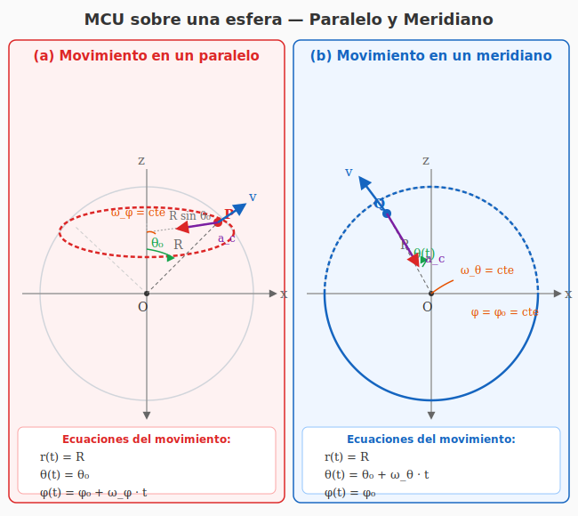

# Ejercicio 16 — Solución

**INSPT – UTN** | **Física Teórica I** | **Prof. Carlos Dibarbora**  
**Bloque 5:** Rotación Rígida y Cinemática Angular  
**Dificultad:** ⭐⭐ Intermedio | **Tiempo estimado:** 20 min

---

## Enunciado

Indicar las ecuaciones del movimiento en coordenadas esféricas de un cuerpo que describe un movimiento circular uniforme en:
a) Un paralelo.
b) Un meridiano.

---

## Recordatorio: coordenadas esféricas

Las coordenadas esféricas $(r, \theta, \phi)$ describen un punto en el espacio mediante tres parámetros:

| Coordenada | Rango | Nombre | Significado físico |
|---|---|---|---|
| $r$ | $[0, \infty)$ | Radio | Distancia desde el origen hasta el punto |
| $\theta$ | $[0, \pi]$ | Ángulo polar (colatitud) | Ángulo medido desde el semieje $z$ positivo |
| $\phi$ | $[0, 2\pi)$ | Ángulo azimutal (longitud) | Ángulo medido desde el semieje $x$ positivo en el plano $xy$ |

> ⚠️ **Precaución con la notación:** En muchos textos de matemáticas, el ángulo polar se denota $\phi$ y el azimutal $\theta$. Aquí seguimos la convención usual en física: $\theta$ = polar (colatitud), $\phi$ = azimutal (longitud).

A su vez, la relación con las coordenadas cartesianas es:

$$
\begin{cases}
x = r \sin\theta \cos\phi \\[4pt]
y = r \sin\theta \sin\phi \\[4pt]
z = r \cos\theta
\end{cases}
$$

---

## Conceptos previos: paralelos y meridianos

Sobre una esfera de radio $R$, podemos definir dos familias de curvas ortogonales:

| Curva | $\theta$ | $\phi$ | Descripción |
|---|---|---|---|
| **Paralelo** | $\theta = \theta_0$, constante | $\phi$ varía | Círculo horizontal a latitud constante. Su radio es $R\sin\theta_0$ |
| **Meridiano** | $\theta$ varía | $\phi = \phi_0$, constante | Semicírculo vertical que pasa por ambos polos |

En términos geográficos:
- **Latitud** $\lambda$ se relaciona con $\theta$ mediante $\displaystyle \lambda = \frac{\pi}{2} - \theta$
  - Ecuador: $\theta = \pi/2$ ($\lambda = 0$)
  - Polo Norte: $\theta = 0$ ($\lambda = \pi/2$)
  - Polo Sur: $\theta = \pi$ ($\lambda = -\pi/2$)
- **Longitud** es directamente $\phi$: mide la posición angular este/oeste desde el meridiano de Greenwich.

---

## Diagrama del problema

*Figura 1: Esfera de radio $R$ mostrando un paralelo (en rojo, a $\theta = \theta_0$) y un meridiano (en azul, a $\phi = \phi_0$). Los puntos P y Q representan partículas en MCU sobre cada trayectoria.*

---

## Resolución

### Marco general

Un **movimiento circular uniforme (MCU)** se caracteriza por:
1. **Radio constante**: la partícula se mantiene siempre a la misma distancia del centro.
2. **Rapidez angular constante**: el ángulo que barre la partícula por unidad de tiempo es constante.

En coordenadas esféricas, la condición $r = \text{cte}$ asegura que la trayectoria está sobre una esfera. El MCU sobre una esfera implica que la partícula recorre círculos máximos o menores con velocidad angular constante.

---

### Caso (a) — MCU en un paralelo

#### Paso 1: ¿Qué coordenada permanece fija?

Sobre un paralelo, la **latitud** es constante. Como la latitud se relaciona con $\theta$ mediante $\lambda = \pi/2 - \theta$, tener latitud constante equivale a:

$$\boxed{\theta(t) = \theta_0 = \text{cte}}$$

#### Paso 2: Radio constante

El movimiento ocurre sobre la superficie de una esfera de radio $R$ (no hay movimiento radial):

$$\boxed{r(t) = R = \text{cte}}$$

#### Paso 3: Movimiento a lo largo del paralelo

Sobre un paralelo, la única coordenada que puede variar es $\phi$ (la longitud). El paralelo es un círculo de radio $R\sin\theta_0$. Si el movimiento es circular **uniforme**, la velocidad angular $\dot{\phi}$ es constante:

$$\dot{\phi}(t) = \omega_\phi = \text{cte}$$

Integrando respecto del tiempo:

$$\phi(t) = \int \dot{\phi}\, dt = \omega_\phi t + \phi_0$$

donde $\phi_0$ es la longitud inicial en $t = 0$.

#### Paso 4: Ecuaciones del movimiento

Reuniendo todo:

$$
\boxed{
\begin{cases}
r(t) = R \\[4pt]
\theta(t) = \theta_0 \\[4pt]
\phi(t) = \phi_0 + \omega_\phi t
\end{cases}}
$$

#### Paso 5: Interpretación física

- La partícula se mueve en un círculo horizontal (paralelo) de radio $R\sin\theta_0$.
- Su velocidad lineal (tangencial) es:

$$v = (R\sin\theta_0)\,\omega_\phi$$

- La aceleración es puramente centrípeta, dirigida hacia el eje $z$:

$$a_c = \frac{v^2}{R\sin\theta_0} = R\sin\theta_0\,\omega_\phi^2$$

> 💡 **Ejemplo concreto:** La Tierra rota sobre su eje. Un punto en la superficie terrestre (excepto los polos) describe un paralelo. Por ejemplo, un punto en el ecuador ($\theta_0 = \pi/2$) tiene $R\sin(\pi/2) = R$, mientras que en Buenos Aires ($\lambda \approx -34.6^\circ$, $\theta \approx 124.6^\circ$) tiene $R\sin\theta \approx 0.57R$.

---

### Caso (b) — MCU en un meridiano

#### Paso 1: ¿Qué coordenada permanece fija?

Sobre un meridiano, la **longitud** es constante. Es decir, la partícula se mueve en un plano vertical fijo que contiene al eje $z$:

$$\boxed{\phi(t) = \phi_0 = \text{cte}}$$

#### Paso 2: Radio constante

Nuevamente, la trayectoria está sobre la superficie esférica:

$$\boxed{r(t) = R = \text{cte}}$$

#### Paso 3: Movimiento a lo largo del meridiano

La coordenada que varía es $\theta$ (la colatitud). Al movernos a lo largo del meridiano, $\theta$ cambia con el tiempo.

El meridiano es un **círculo máximo** de radio $R$. Para que el movimiento sea circular uniforme, la rapidez angular alrededor del centro de la esfera debe ser constante:

$$
\omega_\theta \equiv \dot{\theta}(t) = \text{cte}
$$

Integrando:

$$\theta(t) = \int \dot{\theta}\, dt = \omega_\theta t + \theta_0$$

donde $\theta_0$ es la colatitud inicial en $t = 0$.

#### Paso 4: Ecuaciones del movimiento

$$
\boxed{
\begin{cases}
r(t) = R \\[4pt]
\theta(t) = \theta_0 + \omega_\theta t \\[4pt]
\phi(t) = \phi_0
\end{cases}}
$$

#### Paso 5: Interpretación física

- La partícula se mueve en un círculo vertical de radio $R$ (meridiano).
- Su velocidad lineal (tangencial) es:

$$v = R\,\omega_\theta$$

- La aceleración es puramente centrípeta, dirigida hacia el centro de la esfera:

$$a_c = \frac{v^2}{R} = R\,\omega_\theta^2$$

> 💡 **Una sutileza importante:** La coordenada $\theta$ solo está definida en $[0, \pi]$. Si la partícula da una vuelta completa, cuando $\theta$ alcanza $\pi$ (polo Sur), el sistema de coordenadas esféricas tiene una singularidad: para continuar, $\phi$ saltaría en $\pi$ y $\theta$ comenzaría a decrecer. Por eso, las ecuaciones $\theta(t) = \theta_0 + \omega_\theta t$ describen correctamente un **tramo** del movimiento (por ejemplo, de $\theta_0$ a $\theta_0 + \Delta\theta$), pero para una vuelta completa habría que usar una parametrización más cuidadosa que tenga en cuenta la topología de la esfera.

---

## 📊 Comparación entre ambos casos

| Magnitud | Paralelo (a) | Meridiano (b) |
|---|---|---|
| **Coordenada fija** | $\theta = \theta_0$ (latitud cte) | $\phi = \phi_0$ (longitud cte) |
| **Coordenada variable** | $\phi$ (azimut) | $\theta$ (colatitud) |
| **Radio de la trayectoria** | $R\sin\theta_0$ | $R$ |
| **Velocidad angular** | $\omega_\phi$ | $\omega_\theta$ |
| **Velocidad lineal** | $v = R\sin\theta_0 \cdot \omega_\phi$ | $v = R \cdot \omega_\theta$ |
| **Aceleración centrípeta** | $a_c = R\sin\theta_0\,\omega_\phi^2$ | $a_c = R\,\omega_\theta^2$ |
| **Dirección de $\vec{a}_c$** | Hacia el eje $z$ | Hacia el centro de la esfera |

---

## 💡 Observaciones adicionales

### Sobre la diferencia esencial

Aunque ambos son MCU sobre una esfera, hay una diferencia geométrica fundamental:

- En el **paralelo**, el centro del círculo NO es el centro de la esfera, sino un punto sobre el eje $z$. El radio del círculo es $R\sin\theta_0 < R$ (excepto en el ecuador).
- En el **meridiano**, el círculo es un **círculo máximo**: su centro SÍ coincide con el centro de la esfera y su radio es $R$.

### Vector velocidad en coordenadas esféricas

Podemos expresar el vector velocidad para ambos casos usando la expresión general en coordenadas esféricas:

$$\vec{v} = \dot{r}\,\hat{e}_r + r\dot{\theta}\,\hat{e}_\theta + r\sin\theta\,\dot{\phi}\,\hat{e}_\phi$$

Como $r = R$ es constante ($\dot{r} = 0$):

| Caso | $\vec{v}$ | $\|\vec{v}\|$ |
|---|---|---|
| Paralelo | $\vec{v} = R\sin\theta_0 \cdot \omega_\phi\,\hat{e}_\phi$ | $R\sin\theta_0\,\omega_\phi$ |
| Meridiano | $\vec{v} = R \cdot \omega_\theta\,\hat{e}_\theta$ | $R\,\omega_\theta$ |

### Vector aceleración en coordenadas esféricas

La expresión general de la aceleración en esféricas es:

$$
\begin{aligned}
\vec{a} =& (\ddot{r} - r\dot{\theta}^2 - r\sin^2\theta\,\dot{\phi}^2)\,\hat{e}_r \\
&+ (r\ddot{\theta} + 2\dot{r}\dot{\theta} - r\sin\theta\cos\theta\,\dot{\phi}^2)\,\hat{e}_\theta \\
&+ (r\sin\theta\,\ddot{\phi} + 2\dot{r}\sin\theta\,\dot{\phi} + 2r\cos\theta\,\dot{\theta}\dot{\phi})\,\hat{e}_\phi
\end{aligned}
$$

Para nuestros casos particular:

**Paralelo:** $r = R$, $\dot{r}=0$, $\theta = \theta_0$, $\dot{\theta}=0$, $\ddot{\theta}=0$, $\dot{\phi}=\omega_\phi$, $\ddot{\phi}=0$:

$$
\vec{a} = (-R\sin^2\theta_0\,\omega_\phi^2)\,\hat{e}_r + (-R\sin\theta_0\cos\theta_0\,\omega_\phi^2)\,\hat{e}_\theta
$$

La suma vectorial de ambas componentes da la aceleración centrípeta total, que apunta hacia el eje $z$ (no hacia el centro de la esfera, excepto en el ecuador).

**Meridiano:** $r = R$, $\dot{r}=0$, $\dot{\theta}=\omega_\theta$, $\ddot{\theta}=0$, $\phi = \phi_0$, $\dot{\phi}=0$:

$$
\vec{a} = (-R\,\omega_\theta^2)\,\hat{e}_r
$$

La aceleración es puramente radial, apuntando hacia el centro de la esfera — como cabría esperar para un MCU en un círculo máximo.

---

## 📐 Ejemplo numérico

Un satélite describe un MCU en un meridiano terrestre a $400$ km de altitud ($R \approx 6778$ km) con un período de $90$ minutos.

**Velocidad angular:**

$$\omega_\theta = \frac{2\pi}{T} = \frac{2\pi}{90 \times 60} \approx 1{,}163 \times 10^{-3}\ \text{rad/s}$$

**Ecuaciones del movimiento** (con $\phi_0 = 0$ y $\theta_0 = 0$):

$$
\begin{cases}
r(t) = 6{,}778 \times 10^6\ \text{m} \\[4pt]
\theta(t) = \omega_\theta t \\[4pt]
\phi(t) = 0
\end{cases}
$$

**Velocidad lineal:**

$$v = R\,\omega_\theta \approx 6{,}778 \times 10^6 \cdot 1{,}163 \times 10^{-3} \approx 7{,}880\ \text{m/s}$$

**Aceleración centrípeta:**

$$a_c = R\,\omega_\theta^2 \approx 6{,}778 \times 10^6 \cdot (1{,}163 \times 10^{-3})^2 \approx 9{,}16\ \text{m/s}^2$$

> Este es el típico valor de $g$ a esa altitud, que es precisamente lo que mantiene al satélite en órbita.