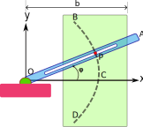

d# TP1 – Cinemática

**INSPT – UTN** | **Física Teórica I** | **Prof. Carlos Dibarbora**

---

## Ejercicio 1

¿Qué se quiere decir con "el movimiento es relativo"?

---

## Ejercicio 2

¿Por qué un observador debe definir un sistema de referencia para el análisis del movimiento de los cuerpos? ¿Qué criterios se siguen para elegir dicho sistema?

---

## Ejercicio 3

Si se conocen la posición y velocidad iniciales de un vehículo y se registra la aceleración en cada instante, ¿puede determinarse la posición después de cierto tiempo con estos datos? Si se puede, explicar cómo.

---

## Ejercicio 4

Un péndulo simple describe una trayectoria en forma de arco de circunferencia. ¿Qué dirección y sentido tiene su aceleración en los extremos del arco? ¿Y en su punto medio?

---

## Ejercicio 5

La posición de una partícula que se mueve a lo largo de una línea recta está definida por la relación:

$$x = t^3 - 6t^2 - 15t + 40$$

donde $x$ se expresa en pies y $t$ en segundos. Determine:

a) El tiempo al cual la velocidad será cero.
b) La posición y la distancia recorrida por la partícula en ese tiempo.
c) La aceleración de la partícula en ese tiempo.
d) La distancia recorrida por la partícula desde $t = 4\,\text{s}$ hasta $t = 6\,\text{s}$.

---

## Ejercicio 6

El mecanismo de freno que se usa para reducir el retroceso en ciertos tipos de cañones consiste esencialmente en un émbolo unido a un cañón que se mueve en un cilindro fijo lleno de aceite. Cuando el cañón retrocede con una velocidad inicial $v_0$, el émbolo se mueve y el aceite es forzado a través de los orificios en el émbolo, provocando que este último y el cañón se desaceleren a una razón proporcional a su velocidad; esto es:

$$a = -kv$$

Exprese:

a) $v$ en términos de $t$
b) $x$ en términos de $t$
c) $v$ en términos de $x$

Dibuje las curvas del movimiento correspondiente.

### Diagrama — Mecanismo de freno hidráulico

```
  ◄── retroceso (v₀)
  ╔═══════════════════════════════════════════════╗
  ║                                               ║
  ║   Aceite         ┌──────────┐       Aceite    ║
  ║   ~~~~~~~~~~~    │  Émbolo  │    ~~~~~~~~~~~  ║
  ║   ~~~~~~~~~~~    │  ╫╫╫╫╫╫  │    ~~~~~~~~~~~  ║
  ║   ~~~~~~~~~~~    │  ╫╫╫╫╫╫  │    ~~~~~~~~~~~  ║
  ║                  └──────────┘                 ║
  ║        cilindro fijo (lleno de aceite)        ║
  ╚═══════════════════════════════════════════════╝
         ↑ orificios en el émbolo: el aceite
           fluye de un lado al otro frenando el mov.
```

*El émbolo se desplaza dentro del cilindro fijo. El aceite fluye a través de los orificios del émbolo, generando la fuerza de amortiguación $F \propto v$.*

---

## Ejercicio 7

**[11.18]** Una partícula parte desde el reposo en el origen y recibe una aceleración:

$$a = k(x + 4)^2$$

donde $a$ y $x$ se expresan en $\text{m/s}^2$ y $\text{m}$ respectivamente, y $k$ es una constante. Si se sabe que la velocidad de la partícula es de $4\,\text{m/s}$ cuando $x = 8\,\text{m}$, determine:

a) El valor de $k$.
b) La posición de la partícula cuando $v = 4{,}5\,\text{m/s}$.
c) La velocidad máxima de la partícula.

---

## Ejercicio 8

**[11.30]** La aceleración debida a la gravedad de una partícula que cae hacia la Tierra es:

$$a = -\frac{gR^2}{r^2}$$

donde $r$ es la distancia desde el centro de la Tierra a la partícula, $R = 3960\,\text{mi}$ es el radio terrestre y $g$ es la aceleración de la gravedad en la superficie. Calcule la **velocidad de escape**, esto es, la velocidad mínima con la cual una partícula debe proyectarse hacia arriba desde la superficie terrestre para no regresar a la Tierra.

> *Sugerencia: $v = 0$ para $r = \infty$.*

---

## Ejercicio 9

**[11.31]** La velocidad de una partícula es:

$$v = v_0\left[1 - \sin\!\left(\frac{\pi t}{T}\right)\right]$$

Si se sabe que la partícula parte desde el origen con velocidad inicial $v_0$, determine:

a) Su posición y su aceleración en $t = 3T$.
b) Su velocidad promedio durante el intervalo de $t = 0$ a $t = T$.

---

## Ejercicio 10

El vector posición de un punto material es:

$$\mathbf{r}(t) = A\cos(\omega t)\,\hat{\mathbf{i}} + A\sin(\omega t)\,\hat{\mathbf{j}}$$

a) Hallar la ecuación de la trayectoria.
b) Hallar el vector velocidad y el vector aceleración.
c) Demostrar que el vector aceleración está dirigido hacia el origen y que tiene módulo proporcional a la distancia al origen.
d) Hallar las componentes intrínsecas del vector aceleración y el radio de curvatura.
e) Los vectores velocidad y aceleración en coordenadas polares.

---

## Ejercicio 11

Las ecuaciones polares de movimiento de un punto material son:

$$r = C\cos(\omega t) \qquad \phi = \omega t$$

a) Hallar las componentes polares de los vectores velocidad y aceleración.
b) Las componentes intrínsecas del vector aceleración.
c) El radio de curvatura.

---

## Ejercicio 12

Considerar un movimiento curvilíneo plano. En un instante $t$, un punto material pasa por $P$. Dibujar en ese punto los vectores velocidad y aceleración, indicando sus componentes intrínsecas y polares. (Elegir como polo el origen de las coordenadas cartesianas).

---

## Ejercicio 13

La Tierra rota uniformemente con respecto a su eje. Calcular la velocidad y la aceleración de un punto situado en Buenos Aires ($34°$ latitud sur).

---

## Ejercicio 14

Un volante cuyo diámetro es $2{,}40\,\text{m}$ tiene una velocidad angular que disminuye uniformemente de $100\,\text{rpm}$ en $t = 0$ hasta detenerse cuando $t = 4\,\text{s}$. Calcular las aceleraciones tangencial y normal de un punto situado sobre el borde del volante cuando $t = 2\,\text{s}$.

---

## Ejercicio 15

Indicar el tipo de movimiento que realiza un punto material si las componentes cilíndricas del vector velocidad son:

a) $V_z = 0$
b) $V_\rho = 0$ y las demás componentes son constantes
c) $V_\phi = 0$ y las demás componentes son constantes

---

## Ejercicio 16

Indicar las ecuaciones del movimiento en coordenadas esféricas de un cuerpo que describe un movimiento circular uniforme en:

a) Un paralelo.
b) Un meridiano.

---

## Ejercicio 17

Indicar las características de las posibles trayectorias de un punto material cuyas coordenadas esféricas cumplen las siguientes condiciones:

a) $r = \text{constante}$
b) $\theta = \text{constante}$ con $r$ y $V_\phi$ constantes
c) $\phi = \text{constante}$ con $r$ y $V_\theta$ constantes

---

## Ejercicio 18

El punto $P$ se mueve por una línea helicoidal. Las ecuaciones horarias de movimiento de este punto en el sistema de coordenadas cilíndricas son:

$$\rho = a \qquad \phi = b\,t \qquad z = c\,t$$

donde $a$, $b$ y $c$ son constantes positivas. Hallar:

a) La aceleración en coordenadas cilíndricas.
b) Las componentes intrínsecas de la aceleración.

---

## Ejercicio 19

**(1.25 Argüello)** Cuando gira la barra $OA$ de la figura, el perno $P$ se mueve a lo largo de la parábola $BCD$. Sabiendo que la ecuación de la parábola es:

$$r = \frac{2b}{1 + \cos\phi}$$

y $\phi = k\,t$, siendo $b$ y $k$ constantes positivas, determinar las componentes polares de los vectores velocidad y aceleración cuando $\phi = 0$ y cuando $\phi = \pi/2$.

### Diagrama (Fig. 1-17)

|  |
| :-------------------------------------------------------------------------------: |
|                                                                                   |

*La barra $OA$ rota alrededor del origen $O$ con $\dot{\phi} = k$. El perno $P$ queda restringido a la curva $BCD$; su distancia al origen $r$ varía según la ecuación de la parábola. En cartesianas: $y^2 = 4b(b - x)$, parábola con vértice en $(b,\,0)$ que abre hacia la izquierda.*

---

## Ejercicio 20

**(1.26 Argüello)** El vector posición de una partícula es:

$$\mathbf{r} = a\cos(\omega t)\,\hat{\mathbf{i}} + a\sin(\omega t)\,\hat{\mathbf{j}} + c\,t^2\,\hat{\mathbf{k}}$$

a) Demostrar que aunque el módulo de la velocidad aumenta con el tiempo, el módulo de la aceleración es constante.
b) Describir geométricamente el movimiento de la partícula.

---

## Ejercicio 21

**(1.31 Argüello)** El perno $B$ se desliza libremente en la ranura recta a lo largo de la barra giratoria $OC$. Si el perno $B$ gira en sentido antihorario con velocidad lineal constante $v_0$, calcular la velocidad angular de la barra $OC$ y la componente radial de la velocidad del perno $B$:

a) Para $\phi = 0$
b) Para $\phi = \pi/2$

Datos: $a = 30\,\text{cm}$, $R = 12{,}5\,\text{cm}$

### Resultados dados

| Caso             | $\dot{\theta}$      | $v_r$             |
|------------------|---------------------|-------------------|
| a) $\phi = 0$    | $0{,}0235\, v_0$    | $0$               |
| b) $\phi = \pi/2$| $0{,}012\, v_0$     | $-0{,}923\, v_0$  |

### Diagrama (Fig. 1-18)

```
         y
         ↑         C
         │        ╱╮
         │       ╱   ╲  R (radio de la trayectoria de B)
         │      ╱  B  ╲
         │     ╱───●───╲
         │    ╱    │    ╲
         O───╱─────┼─────╲──────→ x
              ←─── a ────→

  - O: origen (pivote de la barra OC)
  - B: perno que se mueve sobre una circunferencia de radio R
       centrada en el punto (a, 0)
  - OC: barra giratoria que pasa por O y B
  - θ: ángulo que forma OC con el eje x
  - φ: ángulo que describe B sobre su trayectoria circular
  - v₀: velocidad lineal constante de B sobre la circunferencia
```

*El perno $B$ se mueve sobre una circunferencia de radio $R$ con centro en $(a,\,0)$. La barra $OC$ pasa por el origen $O$ y fuerza a $B$ a deslizarse en su ranura; su ángulo de rotación es $\theta$.*

---

## Ejercicio 22

La rotación del brazo $OA$ de $0{,}9\,\text{m}$ alrededor de $O$ se define mediante la relación:

$$\theta = 0{,}15\,t^2$$

donde $\theta$ se expresa en radianes y $t$ en segundos. El collarín $B$ desliza a lo largo del brazo de modo tal que su distancia desde $O$ es:

$$r = 0{,}9 - 0{,}12\,t^2$$

donde $r$ se expresa en metros y $t$ en segundos. Después de que el brazo $OA$ ha girado $30°$, determinar:

a) La velocidad del collarín.
b) La aceleración del collarín.
c) La aceleración en coordenadas intrínsecas del collarín.

### Diagrama

```
               A
              ╱
             B  ← collarín deslizante (distancia r desde O)
            ╱     r = 0.9 − 0.12 t²
           ╱
          ╱  ) θ
    ─────O─────────→
         θ = 0.15 t²  (radianes)
```

*El brazo $OA$ rota con aceleración angular constante. El collarín $B$ se acerca a $O$ con el tiempo. Cuando $\theta = 30° = \pi/6\,\text{rad}$, se pide el estado cinemático completo.*

---

## Ejercicio 23

### 11.173 y 11.174

Una partícula se mueve a lo largo de la espiral que se muestra en las figuras; determinar la magnitud de la velocidad de la partícula en términos de $b$, $\theta$ y $\dot{\theta}$.

### 11.175 y 11.176

Una partícula se mueve a lo largo de la espiral que se muestra en la figura. Si se sabe que $\dot{\theta}$ es constante e igual a $\omega$, determinar la magnitud de la aceleración de la partícula en términos de $b$, $\theta$ y $\omega$.

| Problema | Resultado — aceleración |
|----------|------------------------|
| **11.175** | $\dfrac{b\omega^2}{\theta^3}\sqrt{4 + \theta^4}$ |
| **11.176** | $(1 + b^2)\,\omega^2\,e^{b\theta}$ |

### Figura P11.173 y P11.175 — Espiral hiperbólica $r\theta = b$

```
         ↑
      b  ┼ ─ ─ ─ ─ ─ ─ ─ (asíntota horizontal: y = b)
         │    ╭──────────────── r·θ = b  →  r = b/θ
         │  ╭─╯           (para θ→0,  r→∞)
         │╭─╯             (para θ→∞,  r→0, se enrosca en O)
    ─────O──────────────→
         │
```

*Espiral hiperbólica: a medida que $\theta$ crece desde $0$, $r$ decrece. La curva tiene como asíntota la recta horizontal $y = b$.*

### Figura P11.174 y P11.176 — Espiral logarítmica $r = e^{b\theta}$

```
         ↑
         │       ╭─╮
         │     ╭─╯  ╲
         │   ╭─╯  O  ╲      r = e^(b·θ)
         │  ─╯    ↑   ╲
    ─────┼─╯      │    ╰────→
         │    cada vuelta completa (Δθ = 2π)
         │    multiplica r por el factor e^(2πb)
```

*Espiral logarítmica: el radio crece exponencialmente con el ángulo. Propiedad notable: el ángulo entre la tangente y el radio vector es constante ($\tan\alpha = 1/b$).*
