# Teoría Completa — Dinámica (Unidad 2)

**INSPT – UTN** | **Física Teórica I** | **Prof. Carlos Dibarbora**

---

## 📋 Índice de Contenidos

1. [Leyes de Newton y Diagramas de Cuerpo Libre](#1-leyes-de-newton-y-diagramas-de-cuerpo-libre)
2. [Transformaciones de Galileo y Sistemas No Inerciales](#2-transformaciones-de-galileo-y-sistemas-no-inerciales)
3. [Fuerzas Dependientes de la Velocidad](#3-fuerzas-dependientes-de-la-velocidad)
4. [Fuerzas Dependientes de la Posición y Campos (Lorentz)](#4-fuerzas-dependientes-de-la-posición-y-campos-lorentz)
5. [Fuerzas de Vínculo y Problemas de Despegue](#5-fuerzas-de-vínculo-y-problemas-de-despegue)
6. [Mecánica Analítica — Ecuaciones de Lagrange](#6-mecánica-analítica--ecuaciones-de-lagrange)
   - 6.7.1 Péndulo Cónico (extensión)
   - 6.9 Péndulo con fricción viscosa (extensión)
7. [Sistemas de Masa Variable](#7-sistemas-de-masa-variable)
   - 7.4.1 Velocidad de Escape (anticipo de U4)
8. [Anexos — Fórmulas y Consejos](#8-anexos)

---

## 1. Leyes de Newton y Diagramas de Cuerpo Libre

### 1.1 Introducción

La **dinámica** estudia la relación entre el movimiento de los cuerpos y las fuerzas que lo producen. Las tres leyes de Newton son los pilares fundamentales sobre los que se construye toda la mecánica clásica.

> 🎯 **Objetivo:** Aprender a identificar fuerzas, aplicar las leyes de Newton y resolver problemas de movimiento.

---

### 1.2 Las Tres Leyes de Newton

#### Diagrama conceptual: Leyes de Newton y DCL

<div align="center">
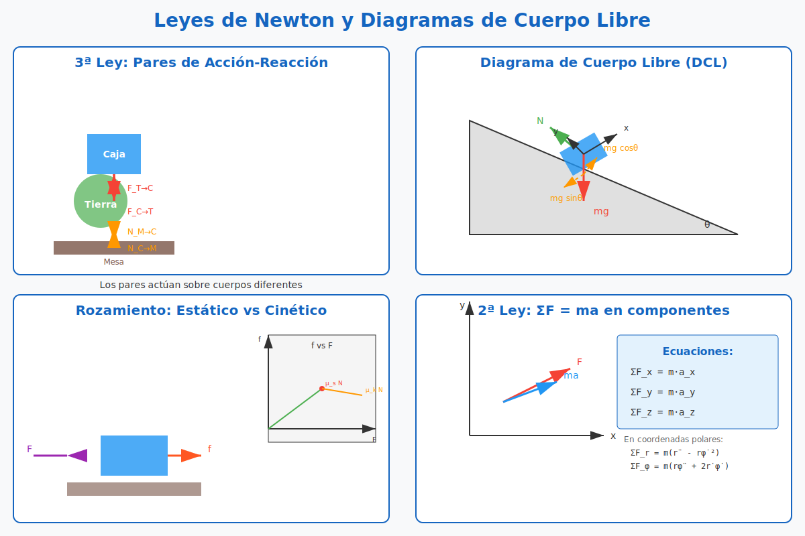
</div>

*Figura 1.1: Izquierda: Tercera ley y pares de interacción (Tierra-caja-mesa). Centro: Diagrama de cuerpo libre en plano inclinado. Derecha: Rozamiento estático vs cinético.*

---

#### Primera Ley — Ley de Inercia

> "Todo cuerpo permanece en estado de reposo o de movimiento rectilíneo uniforme a menos que una fuerza neta externa actúe sobre él."

$$\text{Si } \sum \vec{F} = 0 \quad\Longrightarrow\quad \vec{v} = \text{cte}$$

**Implicaciones clave:**
- Define los **sistemas de referencia inerciales**: aquellos en los que se cumple la primera ley.
- La inercia es la tendencia natural de los cuerpos a mantener su estado de movimiento.
- No se necesita fuerza para mantener un movimiento: se necesita fuerza para **cambiar** el movimiento.

📌 **Ejemplo 1.1:** Un auto viaja a 100 km/h por una carretera recta y plana sin acelerar. Las fuerzas se equilibran ($\sum F = 0$), por lo que el auto mantiene su velocidad constante.

---

#### Segunda Ley — Ley de Fuerza y Aceleración

> "La aceleración de un cuerpo es directamente proporcional a la fuerza neta que actúa sobre él e inversamente proporcional a su masa."

$$\boxed{\sum \vec{F} = m\vec{a}}$$

**Forma diferencial (más general):**

$$\sum \vec{F} = \frac{d\vec{p}}{dt} \quad\text{donde}\quad \vec{p} = m\vec{v}$$

Si la masa es constante:

$$\sum \vec{F} = m\frac{d\vec{v}}{dt} = m\vec{a}$$

**Puntos clave:**
- La fuerza neta y la aceleración son **vectores paralelos**: $\vec{a} \parallel \sum\vec{F}$
- La masa $m$ es la medida de la **inercia** del cuerpo.
- La segunda ley es una **ecuación vectorial**: se descompone en componentes.

**En coordenadas cartesianas:**

$$
\begin{cases}
\sum F_x = m\ddot{x} \\[4pt]
\sum F_y = m\ddot{y} \\[4pt]
\sum F_z = m\ddot{z}
\end{cases}
$$

**En coordenadas polares (movimiento plano):**

$$
\begin{cases}
\sum F_r = m(\ddot{r} - r\dot{\phi}^2) \\[4pt]
\sum F_\phi = m(r\ddot{\phi} + 2\dot{r}\dot{\phi})
\end{cases}
$$

> 🔍 **Interpretación de los términos en coordenadas polares:**
> - $\ddot{r}$: aceleración radial (cambio en el módulo de la posición)
> - $-r\dot{\phi}^2$: aceleración **centrípeta** (apunta hacia el centro, módulo $v_\phi^2/r$)
> - $r\ddot{\phi}$: aceleración angular (cambio en la velocidad tangencial)
> - $2\dot{r}\dot{\phi}$: aceleración de **Coriolis** en coordenadas polares — aparece **solo si la partícula se aleja o acerca del origen mientras gira**
>
> 💡 **Anticipo:** La aceleración de Coriolis en coordenadas polares es la **misma** fuerza ficticia que aparece en sistemas rotantes (sección 2.5 y Unidad 7). El término $2\dot{r}\dot{\phi}$ conecta directamente esta sección con el movimiento relativo.

#### Diagrama: Los 4 componentes de la aceleración en polares

<div align="center">
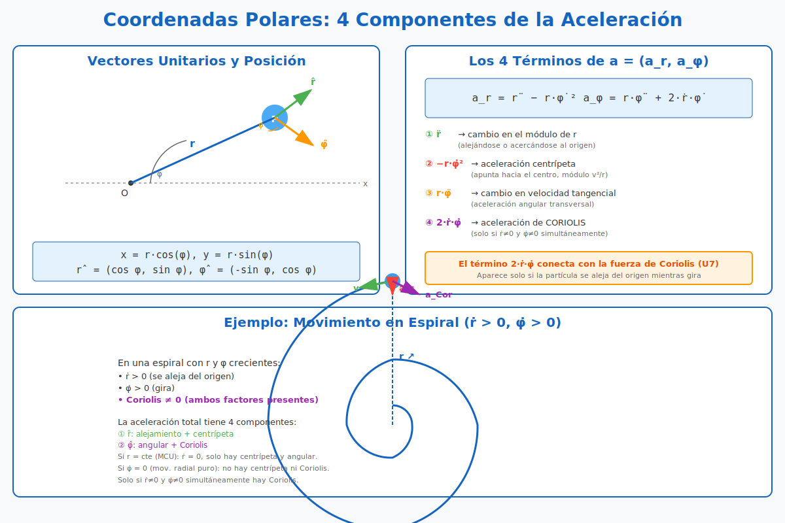
</div>

*Figura 1.1: Sistema de coordenadas polares con vectores unitarios $\hat{r}$ (radial) y $\hat{\phi}$ (tangencial). Se ilustran los 4 componentes de la aceleración: $\ddot{r}$ (radial), $-r\dot{\phi}^2$ (centrípeta), $r\ddot{\phi}$ (angular) y $2\dot{r}\dot{\phi}$ (Coriolis). El ejemplo de la espiral muestra cuándo aparece cada término.*

---

📌 **Ejemplo 1.2:** Un bloque de 5 kg está sobre una superficie horizontal sin rozamiento. Se aplica una fuerza horizontal de 20 N. ¿Cuál es su aceleración?

**Solución:**
$$\sum F_x = 20 = 5a \quad\Longrightarrow\quad a = 4 \text{ m/s}^2$$

---

#### Tercera Ley — Ley de Acción y Reacción

> "Si un cuerpo A ejerce una fuerza sobre un cuerpo B, entonces B ejerce una fuerza sobre A de igual módulo, misma dirección y sentido opuesto."

$$\boxed{\vec{F}_{AB} = -\vec{F}_{BA}}$$

**Pares de interacción:**
- Siempre actúan sobre **cuerpos diferentes** (nunca se cancelan).
- Son de la **misma naturaleza** (si una es gravitatoria, la otra también).
- Existen simultáneamente.

> ⚠️ **Error común:** Confundir pares de acción-reacción con fuerzas que se equilibran. Las fuerzas de un par acción-reacción actúan sobre cuerpos distintos, por lo que NO se cancelan. Por ejemplo, el peso de un libro y la normal de la mesa NO son un par acción-reacción (actúan sobre el mismo cuerpo). El par acción-reacción del peso es la fuerza gravitatoria que el libro ejerce sobre la Tierra.

📌 **Ejemplo 1.3:** Analizar los pares de interacción en una caja sobre una mesa.

**Pares identificados:**
1. **Par gravitatorio Tierra-caja:** $\vec{F}_{T\rightarrow C} = -\vec{F}_{C\rightarrow T}$ (ambas gravitatorias)
2. **Par de contacto mesa-caja:** $\vec{N}_{M\rightarrow C} = -\vec{N}_{C\rightarrow M}$ (ambas de contacto)

---

### 1.3 Diagramas de Cuerpo Libre (DCL)

El DCL es la herramienta fundamental para aplicar las leyes de Newton. Consiste en **aislar** un cuerpo y dibujar **todas las fuerzas** que actúan sobre él.

#### Procedimiento sistemático

1. **Seleccionar el cuerpo** de interés.
2. **Aislarlo** mentalmente del entorno.
3. **Identificar todas las fuerzas** que actúan **sobre el cuerpo** (no las que el cuerpo ejerce sobre otros).
4. **Dibujar cada fuerza** como un vector desde el punto de aplicación (generalmente el centro de masa).
5. **Elegir un sistema de coordenadas** conveniente.
6. **Escribir la segunda ley** en cada dirección.

#### Fuerzas comunes en DCL

| Fuerza | Símbolo | Dirección | Origen | Energía potencial asociada |
|---|---|---|---|---|
| Peso | $\vec{W} = m\vec{g}$ | Vertical hacia abajo | Gravitatoria | $U_g = mgh$ |
| Normal | $\vec{N}$ | Perpendicular a la superficie | De contacto | No realiza trabajo |
| Tensión | $\vec{T}$ | A lo largo de la soga/cuerda | De contacto | No realiza trabajo (soga ideal) |
| Rozamiento | $\vec{f}$ | Paralela a la superficie, opuesta al movimiento | De contacto | No conservativa |
| Resorte | $\vec{F}_e = -k\vec{x}$ | Opuesta a la deformación | Elástica | $U_e = \frac{1}{2}kx^2$ |

> 📝 **Sobre el resorte:** La fuerza $\vec{F}_e = -k\vec{x}$ es **conservativa** porque deriva del potencial $U_e = \frac{1}{2}kx^2$:
> $$\vec{F}_e = -\nabla U_e = -\frac{d}{dx}\left(\frac{1}{2}kx^2\right)\hat{x} = -kx\hat{x}$$
> Esto la hace especialmente útil en problemas de Lagrange y conservación de energía (Unidad 5: oscilador armónico).

📌 **Ejemplo 1.4:** Bloque sobre un plano inclinado sin rozamiento.

**DCL:**
- Eje $x$: paralelo al plano (hacia abajo positivo)
- Eje $y$: perpendicular al plano (hacia arriba positivo)

Fuerzas:
- $\vec{W} = mg$: descomponemos en $W_x = mg\sin\theta$ y $W_y = -mg\cos\theta$
- $\vec{N}$: solo en dirección $y$, $N = mg\cos\theta$

Ecuaciones:
$$\sum F_x = mg\sin\theta = ma \quad\Longrightarrow\quad a = g\sin\theta$$

---

### 1.4 Rozamiento

#### Rozamiento estático ($f_s$)

- Impide el inicio del movimiento.
- $0 \leq f_s \leq f_{s,\text{max}} = \mu_s N$
- La fuerza de rozamiento estático **se ajusta** hasta su valor máximo.

#### Rozamiento cinético ($f_k$)

- Actúa cuando hay deslizamiento.
- $f_k = \mu_k N$ (constante, independiente de la velocidad)
- Siempre opuesta al movimiento relativo.

📌 **Ejemplo 1.5:** Un bloque de 10 kg está sobre una superficie horizontal con $\mu_s = 0.4$ y $\mu_k = 0.3$. Se aplica una fuerza horizontal de 30 N. ¿Se mueve el bloque?

**Solución:**
- $f_{s,\text{max}} = \mu_s N = 0.4 \times 10 \times 9.81 = 39.24$ N
- Como $F = 30$ N $< f_{s,\text{max}}$, el bloque **no se mueve**.

---

### 1.5 Sistemas de Poleas

#### Polea ideal

Una **polea ideal** cumple:
- **Masa despreciable** (no almacena energía cinética rotacional)
- **Sin rozamiento** en el eje
- **Soga inextensible** y sin masa
- Bajo estas condiciones, la **tensión es la misma a ambos lados**: $T_1 = T_2 = T$

#### DCL de polea ideal — Máquina de Atwood

```
        ┌────[Polea]────┐
        │               │
      [T]             [T]
        │               │
        m₁              m₂
        │               │
        ↓ a             ↑ a
     (sube)          (baja)
```

**DCL de $m_1$ (sube con aceleración $a$):**
- $\vec{T}$ hacia arriba
- $m_1 \vec{g}$ hacia abajo
- $\sum F_y = T - m_1 g = m_1 a$

**DCL de $m_2$ (baja con aceleración $a$):**
- $\vec{T}$ hacia arriba
- $m_2 \vec{g}$ hacia abajo
- $\sum F_y = m_2 g - T = m_2 a$

> ⚠️ **Signo de la aceleración:** Definimos $a > 0$ si $m_2$ baja (asumimos $m_2 > m_1$). Por la soga inextensible, $m_1$ sube con la **misma magnitud** de $a$.

#### Procedimiento general

1. **Identificar las masas** y sus direcciones de movimiento.
2. **Definir una variable de posición** común (ej: $x$ para una masa, $y$ para otra).
3. **Usar la restricción de la soga inextensible** para relacionar aceleraciones: si $m_1$ sube una distancia $d$, $m_2$ baja la misma distancia $d$ → $a_1 = a_2 = a$.
4. **Escribir DCL para cada masa**.
5. **Aplicar $\sum F = ma$** a cada masa.
6. **Resolver el sistema de ecuaciones**.

📌 **Ejemplo 1.6:** Dos masas $m_1 = 2$ kg y $m_2 = 5$ kg conectadas por una soga sobre una polea ideal. Hallar la aceleración.

**Solución:**
- Si $m_2$ baja, $m_1$ sube con la misma magnitud de aceleración $a$.
- Para $m_1$: $T - m_1g = m_1a$
- Para $m_2$: $m_2g - T = m_2a$

Sumando: $m_2g - m_1g = (m_1 + m_2)a$

$$a = \frac{m_2 - m_1}{m_1 + m_2}g = \frac{3}{7}g \approx 4.21 \text{ m/s}^2$$

---

## 2. Transformaciones de Galileo y Sistemas No Inerciales

### 2.1 Introducción

Las **transformaciones de Galileo** relacionan las coordenadas y velocidades de un punto material medidas desde dos sistemas de referencia que se mueven con velocidad relativa constante (sistemas inerciales).

El **principio de relatividad de Galileo** establece que las leyes de la mecánica son las mismas en todos los sistemas inerciales.

> 🎯 **Objetivo:** Aprender a transformar velocidades entre sistemas y resolver problemas en sistemas no inerciales usando fuerzas ficticias.

#### Diagrama: Transformaciones de Galileo y SNI

<div align="center">
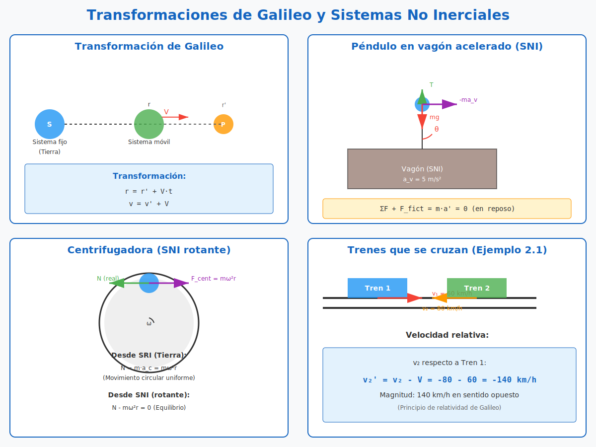
</div>

*Figura 2.1: Izquierda: Transformación de Galileo entre sistemas S y S'. Centro: Péndulo en vagón acelerado (SNI). Derecha: Trenes que se cruzan (Ejemplo 2.1).*

---

### 2.2 Sistemas de Referencia Inerciales

Un **sistema de referencia inercial (SRI)** es aquel en el que se cumple la primera ley de Newton: un cuerpo libre de fuerzas mantiene su estado de reposo o movimiento rectilíneo uniforme.

**Propiedades:**
- Todos los SRI se mueven con **velocidad relativa constante** entre sí.
- No existe un SRI "absoluto".
- Cualquier sistema que se mueva con velocidad constante respecto a un SRI es también un SRI.
- Un sistema **acelerado** respecto a un SRI es **no inercial**.

---

### 2.3 Transformaciones de Galileo

#### Planteamiento

Sean dos sistemas de referencia $S$ y $S'$:
- $S$: sistema inercial "fijo" (ej: Tierra)
- $S'$: sistema inercial "móvil" (ej: tren), que se mueve con velocidad constante $\vec{V}$ respecto a $S$

En $t = 0$, los orígenes $O$ y $O'$ coinciden.

#### Transformación de coordenadas

Un punto $P$ tiene coordenadas $\vec{r}$ en $S$ y $\vec{r}{\,'}$ en $S'$. La relación es:

$$\boxed{\vec{r} = \vec{r}{\,'} + \vec{V}t}$$

En componentes cartesianas (suponiendo $\vec{V} = V\,\hat{x}$):

$$
\begin{cases}
x = x' + Vt \\[4pt]
y = y' \\[4pt]
z = z' \\[4pt]
t = t'
\end{cases}
$$

> 💡 **Nota importante:** En mecánica clásica se asume que el tiempo es absoluto ($t = t'$). Esto cambia en relatividad especial.

#### Transformación de velocidades

Derivando respecto al tiempo:

$$\boxed{\vec{v} = \vec{v}{\,'} + \vec{V}}$$

**Interpretación:** La velocidad de $P$ respecto a $S$ es la velocidad de $P$ respecto a $S'$ **más** la velocidad de $S'$ respecto a $S$.

#### Transformación de aceleraciones

Derivando nuevamente, y como $\vec{V}$ es constante ($\dot{\vec{V}} = 0$):

$$\boxed{\vec{a} = \vec{a}{\,'}}$$

**Interpretación:** La aceleración es **invariante** ante transformaciones de Galileo. Esto implica que $\sum\vec{F} = m\vec{a}$ tiene la misma forma en todos los SRI.

---

### 2.4 Principio de Relatividad de Galileo

> "Las leyes de la mecánica son las mismas en todos los sistemas de referencia inerciales."

**Consecuencias:**
- Ningún experimento mecánico realizado dentro de un sistema inercial puede detectar su velocidad absoluta.
- Solo se pueden medir **velocidades relativas** entre sistemas.
- El movimiento es relativo al sistema de referencia (no existe el "movimiento absoluto").

📌 **Ejemplo 2.1:** Dos trenes viajan por vías paralelas en sentidos opuestos con velocidades de módulos $v_1 = 60$ km/h y $v_2 = 80$ km/h. ¿Cuál es la velocidad de un tren respecto al otro?

**Solución:**
- Tomamos $S$ = Tierra, $S'$ = Tren 1.
- $\vec{V} = +60$ km/h (hacia la derecha, por ejemplo).
- Velocidad de Tren 2 respecto a Tierra: $\vec{v}_2 = -80$ km/h.
- Velocidad de Tren 2 respecto a Tren 1: $\vec{v}_2' = \vec{v}_2 - \vec{V} = -80 - 60 = -140$ km/h.

**Respuesta:** 140 km/h en sentido opuesto.

---

### 2.5 Sistemas No Inerciales (SNI)

Un **sistema de referencia no inercial (SNI)** es aquel que está **acelerado** respecto a un sistema inercial. En estos sistemas, la segunda ley de Newton $\sum\vec{F} = m\vec{a}$ no se cumple a menos que introduzcamos **fuerzas ficticias** (o fuerzas inerciales).

#### Clasificación de SNI

| Tipo de aceleración | Ejemplo | Fuerza ficticia asociada |
|---|---|---|
| **Traslación acelerada** | Vagón que acelera | $-m\vec{a}_{arr}$ (opuesta a $\vec{A}$) |
| **Rotación pura ($\vec{\omega}$ cte)** | Centrifugadora, Tiovivo | Centrífuga: $+m\omega^2 \vec{r}_\perp$ (hacia afuera) |
| **Rotación + traslación** | Superficie terrestre, planeta rotando | Centrífuga + Coriolis: $-2m\vec{\omega} \times \vec{v}'$ |

> 💡 **Anticipo de la fuerza de Coriolis:** En un sistema que **rota** con velocidad angular $\vec{\omega}$, sobre una partícula con velocidad $\vec{v}'$ (respecto al sistema rotante) aparece una **fuerza de Coriolis** adicional:
> $$\boxed{\vec{F}_{\text{Coriolis}} = -2m\,\vec{\omega} \times \vec{v}'}$$
> Esta fuerza es **perpendicular** a $\vec{v}'$ y a $\vec{\omega}$. Es la responsable del desvío de los vientos alisios, de la rotación de los tifones (antihoraria en el hemisferio norte) y del **Péndulo de Foucault** (Unidad 7). En este apunte solo nos enfocamos en la fuerza centrífuga; la fuerza de Coriolis se desarrolla en detalle en la **Unidad 7: Movimiento relativo**.

---

### 2.6 Segunda Ley en un SNI

#### Derivación

Sea $S$ un sistema inercial y $S'$ un sistema no inercial con aceleración $\vec{A}$ respecto a $S$ (traslación pura).

La aceleración de un punto $P$ se relaciona mediante:

$$\vec{a}_P = \vec{a}_P' + \vec{A}$$

Multiplicando por la masa:

$$m\vec{a}_P = m\vec{a}_P' + m\vec{A}$$

Pero en $S$ (inercial) se cumple $\sum\vec{F} = m\vec{a}_P$, entonces:

$$\sum\vec{F} = m\vec{a}_P' + m\vec{A}$$

Despejando $\vec{a}_P'$:

$$m\vec{a}_P' = \sum\vec{F} - m\vec{A}$$

#### Ecuación fundamental en SNI

$$\boxed{\sum\vec{F} + \vec{F}_{fict} = m\vec{a}'}$$

donde $\vec{F}_{fict}$ es la **fuerza ficticia** que debemos agregar para que la segunda ley funcione en $S'$:

$$\boxed{\vec{F}_{fict} = -m\vec{A}}$$

---

### 2.7 Caso 1: SNI con Traslación Acelerada

#### Planteamiento

Un vagón acelera con $\vec{a}_v = a_v\,\hat{x}$ respecto a la Tierra (SRI). Dentro del vagón, un péndulo cuelga del techo.

**Desde la Tierra (SRI):**
- La masa del péndulo tiene la misma aceleración que el vagón: $\vec{a} = a_v\,\hat{x}$
- Las fuerzas reales son: peso ($m\vec{g}$) y tensión ($\vec{T}$)
- $\sum\vec{F} = \vec{T} + m\vec{g} = m\vec{a}_v$

**Desde el vagón (SNI):**
- El péndulo está **en reposo** respecto al vagón ($\vec{a}' = 0$)
- Además de las fuerzas reales, aparece una fuerza ficticia: $\vec{F}_{fict} = -m\vec{a}_v$

📌 **Ejemplo 2.2:** Péndulo en vagón acelerado.

**Datos:** $a_v = 5$ m/s². Buscar el ángulo $\theta$ que forma el péndulo con la vertical.

**Resolución desde el SNI (vagón):**

En equilibrio respecto al vagón ($\vec{a}' = 0$):

$$
\begin{aligned}
\sum F_x &: T\sin\theta - ma_v = 0 \quad\Longrightarrow\quad T\sin\theta = ma_v \\[4pt]
\sum F_y &: T\cos\theta - mg = 0 \quad\Longrightarrow\quad T\cos\theta = mg
\end{aligned}
$$

Dividiendo las ecuaciones:

$$\tan\theta = \frac{a_v}{g} = \frac{5}{9{,}81} \approx 0{,}5097$$

$$\boxed{\theta \approx 27^\circ}$$

---

### 2.8 Caso 2: SNI con Rotación Uniforme

#### Fuerza centrífuga

En un sistema que rota con velocidad angular constante $\vec{\omega}$, aparece la **fuerza centrífuga**:

$$\vec{F}_{cent} = m\omega^2 \vec{r}$$

donde $\vec{r}$ es el vector posición desde el eje de rotación.

**Interpretación:**
- La fuerza centrífuga es **ficticia**: solo aparece en el SNI rotante.
- En el SRI (ej: Tierra), la partícula se mueve en trayectoria circular debido a una fuerza real (centrípeta).
- En el SNI rotante, la partícula está en reposo y la fuerza centrífuga se equilibra con la fuerza real.

📌 **Ejemplo 2.3:** Una masa de 2 kg está atada a una cuerda de 1 m que gira en un círculo horizontal con velocidad angular $\omega = 3$ rad/s. Calcular la tensión en la cuerda desde el SRI y desde el SNI.

**Desde SRI:**
$$T = m\omega^2 r = 2 \times 3^2 \times 1 = 18 \text{ N}$$

**Desde SNI (sistema rotante con la masa):**
- La masa está en reposo ($\vec{a}' = 0$).
- Fuerzas: tensión $T$ (hacia el centro) y fuerza centrífuga $F_{cent} = m\omega^2 r$ (hacia afuera).
- Equilibrio: $T - m\omega^2 r = 0 \quad\Longrightarrow\quad T = 18$ N.

---

## 3. Fuerzas Dependientes de la Velocidad

### 3.1 Introducción

Cuando la fuerza resultante sobre una partícula **depende de su velocidad**, la ecuación de movimiento es una **ecuación diferencial ordinaria (EDO)** que debemos resolver para encontrar $v(t)$ y $x(t)$.

La forma general de la segunda ley de Newton en este caso es:

$$m\frac{dv}{dt} = F(v)$$

donde $F(v)$ es una función conocida de la velocidad.

> 🎯 **Objetivo:** Aprender a resolver EDOs de primer orden separables para encontrar $v(t)$, $x(t)$ y $v(x)$.

#### Diagrama: Tres modelos de resistencia

<div align="center">
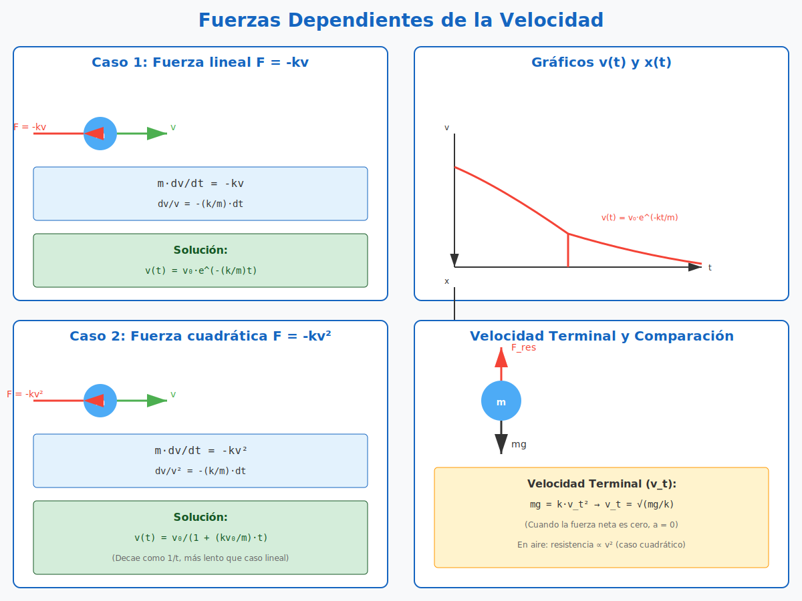
</div>

*Figura 3.1: Comparación de los tres casos de fuerza resistente $F(v)$: lineal $F = -kv$ (régimen laminar), cuadrática $F = -kv^2$ (régimen turbulento) y exponencial $F = -b e^{av}$. Se muestran las curvas típicas de $v(t)$ para cada caso.*

---

---

### 3.2 Método General de Resolución

#### Paso 1: Escribir la segunda ley

$$m\frac{dv}{dt} = F(v)$$

#### Paso 2: Separar variables

$$\frac{m}{F(v)}\,dv = dt$$

#### Paso 3: Integrar

$$\int_{v_0}^{v(t)} \frac{m}{F(v')}\,dv' = \int_0^t dt' = t$$

#### Paso 4: Despejar $v(t)$

Si la integral se puede resolver analíticamente, obtenemos $v(t)$ de forma explícita o implícita.

#### Paso 5: Encontrar $x(t)$

Una vez que tenemos $v(t)$, integramos:

$$x(t) = \int_0^t v(t')\,dt'$$

**Alternativa:** Podemos usar la regla de la cadena para obtener $v(x)$ directamente:

$$m\frac{dv}{dt} = m\frac{dv}{dx}\frac{dx}{dt} = mv\frac{dv}{dx} = F(v)$$

$$\int \frac{mv}{F(v)}\,dv = \int dx$$

---

### 3.3 Caso 1: Fuerza Resistente $F = -kv$ (Lineal)

> ⚠️ **Validez del modelo:** La fuerza $F = -kv$ es válida **solo a baja velocidad** (régimen laminar, número de Reynolds $Re \lesssim 1$). A velocidades altas (régimen turbulento, $Re \gg 1$) se usa $F = -kv^2$ (caso siguiente). Regla práctica:
> - $F = -kv$: gotas pequeñas, fluidos viscosos (aceite, miel), objetos que caen lentamente
> - $F = -kv^2$: automóviles, pelotas, paracaidistas a velocidad terminal, esferas en aire

#### Ecuación de movimiento

$$\sum F = -kv = m\dot{v}$$

#### Velocidad $v(t)$

Separando variables:

$$\frac{dv}{v} = -\frac{k}{m}\,dt$$

Integrando:

$$\int_{v_0}^{v(t)} \frac{dv'}{v'} = -\frac{k}{m}\int_0^t dt'$$

$$\ln\frac{v(t)}{v_0} = -\frac{k}{m}t$$

$$\boxed{v(t) = v_0\,e^{-(k/m)t}}$$

#### Posición $x(t)$

Integrando la velocidad:

$$x(t) = \int_0^t v(t')\,dt' = v_0\int_0^t e^{-(k/m)t'}\,dt'$$

$$\boxed{x(t) = \frac{mv_0}{k}\left(1 - e^{-(k/m)t}\right)}$$

#### Velocidad $v(x)$

Usando la regla de la cadena:

$$mv\frac{dv}{dx} = -kv \quad\Longrightarrow\quad m\frac{dv}{dx} = -k$$

$$\int_{v_0}^{v} dv' = -\frac{k}{m}\int_0^x dx'$$

$$\boxed{v(x) = v_0 - \frac{k}{m}x}$$

**Interpretación:**
- La velocidad decae exponencialmente con el tiempo.
- La partícula nunca se detiene completamente (en teoría).
- La posición tiende a un valor límite $x_{\infty} = mv_0/k$.

📌 **Ejemplo 3.1:** Una partícula de masa $m = 2$ kg se mueve en un medio con resistencia lineal $k = 0.5$ N·s/m. Si su velocidad inicial es $v_0 = 10$ m/s, hallar $v(t)$ y $x(t)$.

**Solución:**
- $v(t) = 10 e^{-(0.5/2)t} = 10 e^{-0.25t}$ m/s
- $x(t) = \frac{2 \times 10}{0.5}(1 - e^{-0.25t}) = 40(1 - e^{-0.25t})$ m

---

### 3.4 Caso 2: Fuerza Resistente $F = -kv^2$ (Cuadrática)

#### Ecuación de movimiento

$$\sum F = -kv^2 = m\dot{v}$$

#### Velocidad $v(t)$

Separando variables:

$$\frac{dv}{v^2} = -\frac{k}{m}\,dt$$

Integrando:

$$\int_{v_0}^{v(t)} \frac{dv'}{v'^2} = -\frac{k}{m}\int_0^t dt'$$

$$-\frac{1}{v}\Big|_{v_0}^{v(t)} = \left[-\frac{1}{v(t)} + \frac{1}{v_0}\right] = -\frac{k}{m}t$$

$$\boxed{v(t) = \frac{v_0}{1 + \frac{kv_0}{m}t}}$$

#### Posición $x(t)$

Integrando:

$$x(t) = \int_0^t \frac{v_0}{1 + \frac{kv_0}{m}t'}\,dt'$$

$$\boxed{x(t) = \frac{m}{k}\ln\left(1 + \frac{kv_0}{m}t\right)}$$

#### Velocidad $v(x)$

Usando la regla de la cadena:

$$mv\frac{dv}{dx} = -kv^2 \quad\Longrightarrow\quad m\frac{dv}{dx} = -kv$$

$$\int_{v_0}^{v} \frac{dv'}{v'} = -\frac{k}{m}\int_0^x dx'$$

$$\boxed{v(x) = v_0\,e^{-(k/m)x}}$$

**Interpretación:**
- La velocidad decae como $1/t$ (mucho más lento que el caso lineal).
- La posición crece **logarítmicamente** (sin límite, pero muy lentamente).
- Este es el modelo correcto para resistencia de fluidos a **altas velocidades** (turbulencia).

📌 **Ejemplo 3.2:** Una esfera cae en aire con resistencia cuadrática. Si $v_0 = 0$ (caída libre desde el reposo), ¿cuál es la velocidad terminal?

**Planteamiento:** Una esfera de masa $m$ cae verticalmente. Fuerzas actuantes (tomando $y$ positivo hacia abajo):
- Peso: $+mg$
- Resistencia cuadrática: $-kv^2$ (opuesta al movimiento, hacia arriba)

$$m\dot{v} = mg - kv^2$$

**Velocidad terminal:** Por definición, es la velocidad de régimen permanente donde $\dot{v} = 0$:
$$0 = mg - kv_t^2 \quad\Longrightarrow\quad v_t = \sqrt{\frac{mg}{k}}$$

**Solución completa con $v_0 = 0$** (separación de variables):
$$\frac{dv}{g - \frac{k}{m}v^2} = dt$$

Integrando desde $v=0$ hasta $v(t)$:
$$\int_0^{v} \frac{dv'}{g - \frac{k}{m}v'^2} = \int_0^t dt'$$

La integral del lado izquierdo es:
$$\int \frac{dv'}{a^2 - v'^2} = \frac{1}{a}\text{arctanh}\left(\frac{v'}{a}\right) + C$$
donde $a = \sqrt{mg/k} = v_t$. Entonces:
$$\frac{1}{v_t}\text{arctanh}\left(\frac{v}{v_t}\right) = t$$
$$\boxed{v(t) = v_t \tanh\left(\frac{g}{v_t}t\right)}$$

**Verificación:** $\tanh(x) \to 1$ cuando $x \to \infty$, por lo que $v \to v_t$ asintóticamente (¡correcto!).

---

### 3.5 Caso 3: Fuerza $F = -b\,e^{av}$ (Exponencial)

#### Ecuación de movimiento

$$m\dot{v} = -b e^{av}$$

Separando variables:

$$e^{-av}\,dv = -\frac{b}{m}\,dt$$

Integrando:

$$\int_{v_0}^{v(t)} e^{-av'}\,dv' = -\frac{b}{m}t$$

$$-\frac{1}{a}\left[e^{-av(t)} - e^{-av_0}\right] = -\frac{b}{m}t$$

$$\boxed{v(t) = -\frac{1}{a}\ln\left[e^{-av_0} + \frac{ab}{m}t\right]}$$

📌 **Ejemplo 3.3:** Partícula con $a = 0.1$, $b = 0.5$, $m = 2$, $v_0 = 0$. Hallar $v(t)$.

**Solución:**
$$v(t) = -\frac{1}{0.1}\ln\left[1 + \frac{0.1 \times 0.5}{2}t\right] = -10\ln\left(1 + 0.025t\right)$$

---

## 4. Fuerzas Dependientes de la Posición y Campos (Lorentz)

### 4.1 Introducción

Las fuerzas que dependen de la posición incluyen fuerzas gravitatorias, elásticas y fuerzas debidas a campos electromagnéticos. En esta sección nos enfocamos en la **fuerza de Lorentz**, que describe la fuerza sobre una partícula cargada en presencia de campos eléctricos y magnéticos.

> 🎯 **Objetivo:** Entender la fuerza de Lorentz, el movimiento en campos cruzados y aplicar conservación de energía en campos magnéticos.

#### Diagrama: Fuerza de Lorentz y configuraciones de campos

<div align="center">
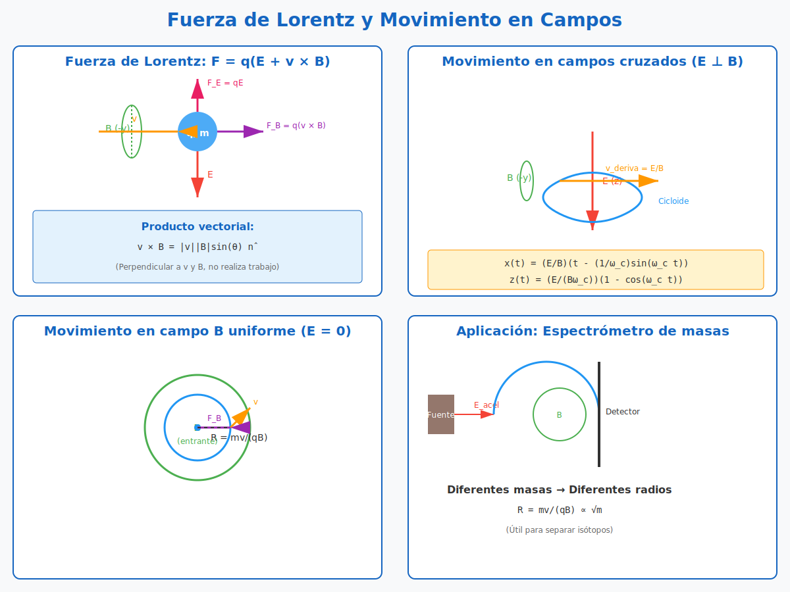
</div>

*Figura 4.1: Cuatro configuraciones de campos: (1) solo $\vec{B}$ → MCU, (2) $\vec{E} \parallel \vec{B}$ → helicoidal, (3) $\vec{E} \perp \vec{B}$ → cicloide, (4) solo $\vec{E}$ → MRUV. Se muestran las trayectorias características en cada caso.*

---

### 4.2 Fuerza de Lorentz

La **fuerza de Lorentz** describe la fuerza que experimenta una partícula cargada en movimiento cuando se encuentra en presencia de campos eléctricos y magnéticos.

$$\boxed{\vec{F} = q\left(\vec{E} + \vec{v} \times \vec{B}\right)}$$

- $q$: carga eléctrica de la partícula (C)
- $\vec{E}$: campo eléctrico (N/C o V/m)
- $\vec{B}$: campo magnético (T = Tesla)
- $\vec{v}$: velocidad de la partícula (m/s)

---

### 4.3 Componentes de la Fuerza de Lorentz

#### Fuerza Eléctrica

$$\vec{F}_E = q\vec{E}$$

- **Independiente de la velocidad** de la partícula.
- Siempre en la dirección del campo (para $q > 0$).
- Puede acelerar o frenar la partícula.

#### Fuerza Magnética

$$\vec{F}_B = q\,\vec{v} \times \vec{B}$$

- **Depende de la velocidad** (tanto módulo como dirección).
- **Siempre perpendicular** a $\vec{v}$ y a $\vec{B}$ (producto vectorial).
- **No realiza trabajo**: $W_B = \int \vec{F}_B \cdot d\vec{r} = 0$ porque $\vec{F}_B \perp \vec{v}$.
- Solo **cambia la dirección** del movimiento (no la rapidez).

---

### 4.4 Movimiento en Campos Cruzados ($\vec{E} \perp \vec{B}$)

#### Planteamiento general

Una partícula de masa $m$ y carga $q$ se deja en libertad en el origen. Campos presentes:

- $\vec{E} = E\,\hat{k}$ (dirección $z$ positiva)
- $\vec{B} = -B\,\hat{j}$ (dirección $y$ negativa)

#### Ecuación de movimiento

$$m\vec{a} = q(\vec{E} + \vec{v} \times \vec{B})$$

#### Producto vectorial $\vec{v} \times \vec{B}$

Con $\vec{v} = (v_x, v_y, v_z)$ y $\vec{B} = (0, -B, 0)$:

$$\vec{v} \times \vec{B} = \begin{vmatrix}
\hat{i} & \hat{j} & \hat{k} \\
v_x & v_y & v_z \\
0 & -B & 0
\end{vmatrix} = (v_z B)\,\hat{i} + (-v_x B)\,\hat{k}$$

#### Ecuaciones por componente

$$
\begin{cases}
m\dot{v}_x = q(v_z B) \\[4pt]
m\dot{v}_y = 0 \\[4pt]
m\dot{v}_z = qE - q(v_x B)
\end{cases}
$$

#### Resolución del sistema

**Ecuación en $y$:** $\dot{v}_y = 0$, entonces $v_y = 0$ (no hay movimiento en $y$).

**Ecuaciones acopladas en $x$ y $z$:**

$$
\begin{aligned}
\dot{v}_x &= \frac{qB}{m}\,v_z \\[4pt]
\dot{v}_z &= \frac{qE}{m} - \frac{qB}{m}\,v_x
\end{aligned}
$$

Derivando la primera y usando la segunda:

$$\ddot{v}_x + \left(\frac{qB}{m}\right)^2 v_x = \frac{q^2BE}{m^2}$$

Esta es la EDO de un **oscilador armónico forzado** con frecuencia:

$$\omega_c = \frac{|q|B}{m} \quad\text{(frecuencia ciclotrón)}$$

La solución general para $v_x(t)$ es:

$$v_x(t) = \frac{E}{B}\left(1 - \cos\omega_c t\right)$$

(usando condiciones iniciales: $v_x(0) = 0$)

Para $v_z(t)$:

$$v_z(t) = \frac{E}{B}\sin\omega_c t$$

#### Trayectoria

Integrando las velocidades para obtener la posición (con $x(0) = z(0) = 0$):

$$
\begin{aligned}
x(t) &= \frac{E}{B}\left(t - \frac{1}{\omega_c}\sin\omega_c t\right) \\[4pt]
z(t) &= \frac{E}{B\omega_c}\left(1 - \cos\omega_c t\right) \\[4pt]
y(t) &= 0
\end{aligned}
$$

#### Interpretación

La trayectoria es una **cicloide**: la partícula avanza en la dirección $x$ mientras oscila en $z$ (dirección del campo eléctrico). Este es el principio detrás del **espectrómetro de masas** y otros dispositivos.

La velocidad de deriva en la dirección $x$ (promedio) es:

$$v_{deriva} = \frac{E}{B}$$

📌 **Ejemplo 4.1:** Una partícula con $q = 1.6 \times 10^{-19}$ C, $m = 9.1 \times 10^{-31}$ kg, $E = 1000$ V/m, $B = 0.01$ T. Calcular $\omega_c$ y $v_{deriva}$.

**Solución:**
- $\omega_c = \frac{qB}{m} = \frac{1.6 \times 10^{-19} \times 0.01}{9.1 \times 10^{-31}} \approx 1.76 \times 10^9$ rad/s
- $v_{deriva} = \frac{E}{B} = \frac{1000}{0.01} = 10^5$ m/s

---

### 4.5 Movimiento en Campo Magnético Uniforme ($\vec{E} = 0$)

Si solo hay campo magnético, la partícula describe un **movimiento circular uniforme** (o helicoidal si tiene componente de velocidad paralela a $\vec{B}$).

#### Radio de la trayectoria

Igualando la fuerza magnética con la fuerza centrípeta:

$$qvB = \frac{mv^2}{R}$$

$$\boxed{R = \frac{mv}{qB}}$$

#### Frecuencia ciclotrón

$$\boxed{f_c = \frac{qB}{2\pi m}}$$

#### Período

$$\boxed{T_c = \frac{2\pi m}{qB}}$$

> 💡 **Propiedad fundamental del ciclotrón:** El período $T_c$ **no depende de la velocidad $v$** ni, por lo tanto, de la **energía cinética** de la partícula. Partículas más rápidas describen círculos más grandes ($R \propto v$) pero tardan el **mismo tiempo** en completar una vuelta. Esta es la base del **ciclotrón**: un campo eléctrico alterno con período $T_c$ acelera a la partícula **exactamente** cada vez que cruza las "des" (región entre las des), independientemente de su energía.

**Demostración rápida:** Como $R = mv/(qB)$, una vuelta cubre distancia $2\pi R = 2\pi mv/(qB)$. La rapidez es constante (= $v$), por lo tanto:
$$T_c = \frac{2\pi R}{v} = \frac{2\pi m}{qB} \quad \checkmark$$

> ⚠️ **Limitación relativista:** Esta propiedad se rompe cuando $v$ se acerca a $c$. La masa relativista $m_{\text{rel}} = \gamma m$ aumenta con $v$, y el período crece. En el sincrotrón se varía la **frecuencia** del campo acelerador para compensar.

📌 **Ejemplo 4.2:** Un protón ($q = 1.6 \times 10^{-19}$ C, $m = 1.67 \times 10^{-27}$ kg) entra perpendicularmente en un campo magnético $B = 0.5$ T con velocidad $v = 10^6$ m/s. Hallar el radio de la trayectoria.

**Solución:**
$$R = \frac{mv}{qB} = \frac{1.67 \times 10^{-27} \times 10^6}{1.6 \times 10^{-19} \times 0.5} \approx 0.0209 \text{ m} = 2.09 \text{ cm}$$

---

## 5. Fuerzas de Vínculo y Problemas de Despegue

### 5.1 Introducción

Los **vínculos** (o ligaduras) son restricciones geométricas que limitan el movimiento de una partícula. Las **fuerzas de vínculo** (o de ligadura) son las fuerzas que la superficie o el mecanismo ejerce sobre la partícula para mantenerla sobre la trayectoria permitida.

El **problema de despegue** consiste en determinar en qué punto la partícula **pierde contacto** con la superficie, es decir, cuándo la fuerza de vínculo se anula.

> 🎯 **Objetivo:** Aprender a identificar fuerzas de vínculo, aplicar conservación de energía y determinar condiciones de despegue.

---

### 5.2 Tipos de Vínculos

#### Vínculo liso (sin rozamiento)
- La fuerza de vínculo es **perpendicular** a la superficie de contacto.
- No hay componente tangencial (no hay rozamiento).
- También llamado **vínculo ideal**.

#### Vínculo rugoso (con rozamiento)
- La fuerza de vínculo tiene componente **normal** (perpendicular).
- Y componente **tangencial** (rozamiento).

---

### 5.3 Fuerza Normal

La **fuerza normal** $\vec{N}$ es la fuerza de vínculo más común. Es la fuerza que una superficie ejerce sobre un cuerpo para impedir que la penetre.

**Características:**
- Siempre **perpendicular** a la superficie de contacto.
- Se **ajusta automáticamente** al valor necesario para evitar la penetración.
- Su valor máximo está limitado por la resistencia del material.
- Cuando el cuerpo pierde contacto: $N = 0$.

#### Diagrama: Tipos de vínculo y condición de despegue

<div align="center">
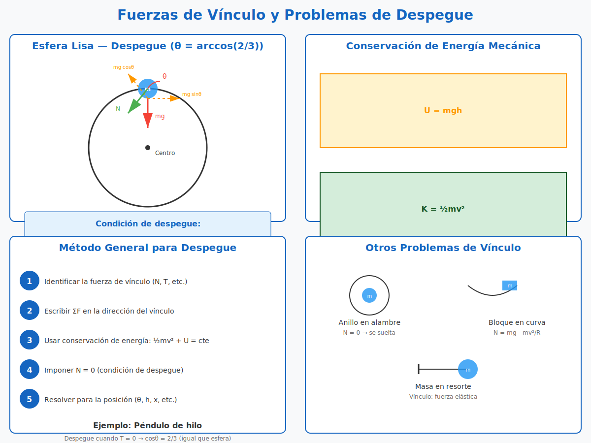
</div>

*Figura 5.1: Comparación entre vínculo liso (sin rozamiento) y vínculo rugoso. Se ilustra la condición de despegue $N = 0$ sobre la esfera clásica, donde la partícula se separa cuando $\cos\theta = 2/3$.*

---

### 5.4 Conservación de la Energía Mecánica

En sistemas con vínculos lisos (sin rozamiento), las fuerzas de vínculo **no realizan trabajo** porque son perpendiculares al desplazamiento. Por lo tanto, la **energía mecánica** se conserva:

$$\Delta E_m = \Delta K + \Delta U = 0$$

$$E_m = \frac{1}{2}mv^2 + mgh = \text{cte}$$

Esta es una herramienta fundamental para resolver problemas de despegue, ya que relaciona la velocidad con la altura en cualquier punto.

---

### 5.5 Esfera Lisa — Problema Clásico

#### Planteamiento

Una partícula de masa $m$ se encuentra en el punto más alto de una esfera fija lisa de radio $b$. Se desplaza ligeramente para que comience a deslizar. ¿En qué punto se separará de la esfera?

#### Diagrama de fuerzas

En un punto genérico sobre la esfera (ángulo $\theta$ desde la vertical):
- **Peso:** $mg$, vertical hacia abajo.
- **Normal:** $N$, radial hacia afuera (perpendicular a la superficie).
- **No hay rozamiento** (superficie lisa).

#### Segunda ley de Newton (componente radial)

En coordenadas polares (o intrínsecas), la componente radial de la fuerza neta proporciona la aceleración centrípeta:

$$\sum F_r = -N + mg\cos\theta = ma_r = -m\frac{v^2}{b}$$

(El signo negativo en $a_r$ indica que apunta hacia el centro)

$$N = mg\cos\theta - m\frac{v^2}{b}$$

#### Conservación de la energía

La partícula parte del reposo ($v_0 = 0$) en $\theta = 0$ (punto más alto). Tomando $U = 0$ en el centro de la esfera:

**Energía inicial:** $E_i = mgb$ (altura $b$ sobre el centro)

**Energía a un ángulo $\theta$:** $E_f = \frac{1}{2}mv^2 + mgb\cos\theta$

Por conservación de energía:

$$mgb = \frac{1}{2}mv^2 + mgb\cos\theta$$

$$\frac{1}{2}mv^2 = mgb(1 - \cos\theta)$$

$$v^2 = 2gb(1 - \cos\theta)$$

#### Condición de despegue

La partícula se separa de la esfera cuando la normal se anula: $N = 0$

De la ecuación de fuerzas:

$$N = mg\cos\theta - m\frac{v^2}{b} = 0$$

$$mg\cos\theta = m\frac{v^2}{b}$$

$$g\cos\theta = \frac{v^2}{b}$$

Sustituyendo $v^2$ de la conservación de energía:

$$g\cos\theta = \frac{2gb(1 - \cos\theta)}{b}$$

$$g\cos\theta = 2g(1 - \cos\theta)$$

$$\cos\theta = 2 - 2\cos\theta$$

$$3\cos\theta = 2$$

$$\boxed{\cos\theta = \frac{2}{3}}$$

$$\boxed{\theta = \arccos\left(\frac{2}{3}\right) \approx 48{,}19^\circ}$$

📌 **Ejemplo 5.1:** Una partícula de 0.5 kg está sobre una esfera de radio 2 m. Si $g = 9.81$ m/s², hallar la velocidad en el punto de despegue.

**Solución:**
- $\cos\theta = 2/3$, entonces $\sin\theta = \sqrt{1 - (2/3)^2} = \sqrt{5}/3$
- $v^2 = 2gb(1 - \cos\theta) = 2 \times 9.81 \times 2 \times (1 - 2/3) = 13.08$
- $v = \sqrt{13.08} \approx 3.62$ m/s

---

### 5.6 Método General para Problemas de Despegue

#### Paso 1: Identificar la fuerza de vínculo

Determinar cuál es la fuerza que mantiene el contacto (normal, tensión, reacción de un riel, etc.)

#### Paso 2: Escribir la segunda ley en la dirección del vínculo

Usar coordenadas que faciliten el problema (intrínsecas, polares, etc.):

$$\sum F_{vinculo} = m a_{radial}$$

#### Paso 3: Usar conservación de energía

Relacionar la velocidad con la posición, asumiendo vínculo liso:

$$\frac{1}{2}mv^2 + U(h) = \text{cte}$$

#### Paso 4: Imponer $N = 0$

La condición de despegue es que la fuerza de vínculo se anule:

$$N = 0$$

---

## 6. Mecánica Analítica — Ecuaciones de Lagrange

### 6.1 Introducción

La **mecánica analítica** reformula la mecánica clásica en términos de **energías** en lugar de fuerzas. Las **ecuaciones de Lagrange** permiten obtener las ecuaciones de movimiento de un sistema de manera sistemática, sin necesidad de calcular fuerzas de vínculo.

> 🎯 **Objetivo:** Aprender a usar coordenadas generalizadas, construir el lagrangiano y aplicar las ecuaciones de Euler-Lagrange.

#### Diagrama: Coordenadas generalizadas y lagrangiano

<div align="center">

</div>

*Figura 6.1: Izquierda: sistemas típicos con sus coordenadas generalizadas y grados de libertad (GDL). Centro: definición del lagrangiano $\mathcal{L} = T - U$ a partir de energías cinética y potencial. Derecha: esquema del método de Euler-Lagrange.*

---

### 6.2 Coordenadas Generalizadas

Las **coordenadas generalizadas** son un conjunto mínimo de parámetros independientes que describen completamente la configuración de un sistema.

#### Grados de libertad

El número de **grados de libertad (GDL)** de un sistema es:

$$GDL = 3N - V$$

donde $N$ es el número de partículas y $V$ el número de vínculos independientes.

#### Ejemplos

| Sistema | Coordenadas generalizadas | GDL |
|---|---|---|
| Partícula libre en 3D | $(x, y, z)$ | 3 |
| Tiro oblicuo (plano) | $(x, y)$ o $(x, z)$ | 2 |
| Péndulo simple | $\theta$ | 1 |
| Máquina de Atwood | $x$ (posición de una masa) | 1 |
| Péndulo doble | $(\theta_1, \theta_2)$ | 2 |

Las coordenadas generalizadas se denotan generalmente como $q_i$ (con $i = 1, \dots, n$, donde $n$ = GDL).

---

### 6.3 Lagrangiano

El **lagrangiano** $\mathcal{L}$ se define como:

$$\boxed{\mathcal{L} = T - U}$$

- $T$: energía cinética del sistema.
- $U$: energía potencial del sistema.

> ⚠️ **Importante:** El lagrangiano debe expresarse **siempre en términos de las coordenadas generalizadas** $q_i$ y sus derivadas $\dot{q}_i$.

---

### 6.4 Ecuaciones de Euler-Lagrange

#### Caso conservativo (sin fricción)

Para un sistema con $n$ grados de libertad y **solo fuerzas conservativas** (que derivan de $U$):

$$\boxed{\frac{d}{dt}\left(\frac{\partial\mathcal{L}}{\partial\dot{q}_i}\right) - \frac{\partial\mathcal{L}}{\partial q_i} = 0}$$

para cada $i = 1, 2, \dots, n$.

#### Caso general (con fuerzas no conservativas)

Cuando hay **fuerzas no conservativas** (fricción, resistencia del aire, motores, etc.), la forma general es:

$$\boxed{\frac{d}{dt}\left(\frac{\partial\mathcal{L}}{\partial\dot{q}_i}\right) - \frac{\partial\mathcal{L}}{\partial q_i} = Q_i}$$

donde $Q_i$ es la **fuerza generalizada no conservativa** asociada a la coordenada $q_i$, definida como:

$$Q_i = \sum_{k=1}^{N} \vec{F}_k^{(\text{nc})} \cdot \frac{\partial \vec{r}_k}{\partial q_i}$$

> 🔍 **Interpretación de $Q_i$:** Para cada fuerza no conservativa $\vec{F}_k^{(\text{nc})}$ que actúa sobre la partícula $k$, se promedia su "componente útil" en la dirección en que la coordenada $q_i$ cambia.

#### Terminología

- **Momento generalizado:** $p_i = \frac{\partial\mathcal{L}}{\partial\dot{q}_i}$
- **Fuerza generalizada conservativa:** $F_i^{(\text{c})} = -\frac{\partial U}{\partial q_i} = \frac{\partial\mathcal{L}}{\partial q_i}$
- **Fuerza generalizada total:** $F_i = F_i^{(\text{c})} + Q_i$

---

### 6.5 Procedimiento de Aplicación

1. **Identificar los grados de libertad** del sistema.
2. **Elegir coordenadas generalizadas** $q_i$ adecuadas.
3. **Expresar la energía cinética** $T$ en términos de $q_i$ y $\dot{q}_i$.
4. **Expresar la energía potencial** $U$ en términos de $q_i$.
5. **Escribir el lagrangiano** $\mathcal{L} = T - U$.
6. **Aplicar Euler-Lagrange** para cada $q_i$.
7. **Resolver** las ecuaciones diferenciales resultantes.

---

### 6.6 Ejemplo 1: Tiro Oblicuo

#### Sistema
Una partícula de masa $m$ en el plano $xz$ bajo gravedad $g$.

#### Coordenadas generalizadas
$q_1 = x$, $q_2 = z$

#### Energías
$$
\begin{aligned}
T &= \frac{1}{2}m(\dot{x}^2 + \dot{z}^2) \\[4pt]
U &= mgz
\end{aligned}
$$

#### Lagrangiano
$$\mathcal{L} = \frac{1}{2}m(\dot{x}^2 + \dot{z}^2) - mgz$$

#### Ecuaciones de Lagrange

**Para $x$:**

$$\frac{\partial\mathcal{L}}{\partial\dot{x}} = m\dot{x}, \quad \frac{\partial\mathcal{L}}{\partial x} = 0$$

$$\frac{d}{dt}(m\dot{x}) - 0 = 0 \quad\Longrightarrow\quad m\ddot{x} = 0 \quad\Longrightarrow\quad \boxed{\ddot{x} = 0}$$

**Para $z$:**

$$\frac{\partial\mathcal{L}}{\partial\dot{z}} = m\dot{z}, \quad \frac{\partial\mathcal{L}}{\partial z} = -mg$$

$$\frac{d}{dt}(m\dot{z}) - (-mg) = 0 \quad\Longrightarrow\quad m\ddot{z} + mg = 0 \quad\Longrightarrow\quad \boxed{\ddot{z} = -g}$$

Obtenemos el resultado conocido: MRU en $x$ y MRUV en $z$.

---

### 6.7 Ejemplo 2: Péndulo Simple

#### Sistema
Una masa $m$ suspendida de una cuerda de longitud $l$ bajo gravedad $g$.

#### Coordenada generalizada
$q = \theta$ (ángulo con la vertical)

#### Energías
Posición de la masa (tomando origen en el punto de suspensión):
$$
\begin{aligned}
x &= l\sin\theta \\[4pt]
z &= -l\cos\theta
\end{aligned}
$$

Derivando:
$$
\begin{aligned}
\dot{x} &= l\cos\theta\,\dot{\theta} \\[4pt]
\dot{z} &= l\sin\theta\,\dot{\theta}
\end{aligned}
$$

Energía cinética:
$$T = \frac{1}{2}m(\dot{x}^2 + \dot{z}^2) = \frac{1}{2}ml^2\dot{\theta}^2$$

Energía potencial (tomando $z = 0$ en el punto de suspensión):
$$U = mgz = -mgl\cos\theta$$

#### Lagrangiano
$$\mathcal{L} = \frac{1}{2}ml^2\dot{\theta}^2 + mgl\cos\theta$$

#### Ecuación de Lagrange

$$\frac{\partial\mathcal{L}}{\partial\dot{\theta}} = ml^2\dot{\theta}, \quad \frac{\partial\mathcal{L}}{\partial\theta} = -mgl\sin\theta$$

$$\frac{d}{dt}(ml^2\dot{\theta}) + mgl\sin\theta = 0$$

$$ml^2\ddot{\theta} + mgl\sin\theta = 0$$

$$\boxed{\ddot{\theta} + \frac{g}{l}\sin\theta = 0}$$

Esta es la ecuación del péndulo simple (no lineal). Para pequeñas oscilaciones, $\sin\theta \approx \theta$, dando $\ddot{\theta} + \frac{g}{l}\theta = 0$ (oscilador armónico simple).

---

### 6.7.1 Péndulo Cónico (Extensión)

#### Sistema

Una masa $m$ cuelga de una cuerda de longitud $l$ y gira con velocidad angular constante $\omega$ alrededor del eje vertical, formando un cono con semiángulo $\alpha$.

```
         z↑
          │  
          │╱╲  
          │╱  ╲  cuerda l
          │╱    ╲
          │╱  α   ╲
          ●────────●  m  (gira con ω)
         O│
          │
```

#### Coordenadas generalizadas

Para movimiento circular uniforme, el ángulo polar es constante. Solo hay una coordenada: $q = \alpha$ (semiángulo del cono).

#### Posición de la masa

$$x = l\sin\alpha \cos(\omega t), \quad y = l\sin\alpha \sin(\omega t), \quad z = -l\cos\alpha$$

#### Energías

Energía cinética:
$$T = \frac{1}{2}m l^2(\dot{\alpha}^2 + \omega^2 \sin^2\alpha)$$

Energía potencial (origen en el punto de suspensión):
$$U = -mgl\cos\alpha$$

#### Lagrangiano

$$\mathcal{L} = \frac{1}{2}m l^2(\dot{\alpha}^2 + \omega^2 \sin^2\alpha) + mgl\cos\alpha$$

#### Ecuación de movimiento

Aplicando Euler-Lagrange para $q = \alpha$:

$$\frac{\partial\mathcal{L}}{\partial\dot{\alpha}} = ml^2\dot{\alpha}, \quad \frac{\partial\mathcal{L}}{\partial\alpha} = ml^2\omega^2\sin\alpha\cos\alpha - mgl\sin\alpha$$

$$ml^2\ddot{\alpha} - ml^2\omega^2\sin\alpha\cos\alpha + mgl\sin\alpha = 0$$

$$\ddot{\alpha} - \omega^2\sin\alpha\cos\alpha + \frac{g}{l}\sin\alpha = 0$$

#### Condición de equilibrio (régimen permanente)

Para movimiento circular uniforme, $\ddot{\alpha} = 0$ y $\alpha = \text{cte}$. La ecuación se reduce a:

$$-\omega^2\sin\alpha\cos\alpha + \frac{g}{l}\sin\alpha = 0$$

Para $\sin\alpha \neq 0$ (cono no degenerado):

$$\cos\alpha = \frac{g}{l\omega^2}$$

$$\boxed{\alpha = \arccos\left(\frac{g}{l\omega^2}\right)}$$

> 💡 **Velocidad angular crítica:** Para que exista solución con $\alpha < 90°$, se requiere $\frac{g}{l\omega^2} < 1$, es decir:
> $$\omega > \omega_c = \sqrt{\frac{g}{l}}$$
> Si $\omega < \omega_c$, el péndulo **no puede** girar en cono y simplemente cuelga verticalmente. Esta es la misma frecuencia que el péndulo simple para oscilaciones pequeñas.

📌 **Ejemplo:** Para $l = 1$ m y $g = 9.81$ m/s², $\omega_c \approx 3.13$ rad/s. Si $\omega = 5$ rad/s, entonces $\cos\alpha = 9.81/25 \approx 0.392$, dando $\alpha \approx 66.9°$.

#### Diagrama: Péndulo cónico — DCL y condición de equilibrio

<div align="center">
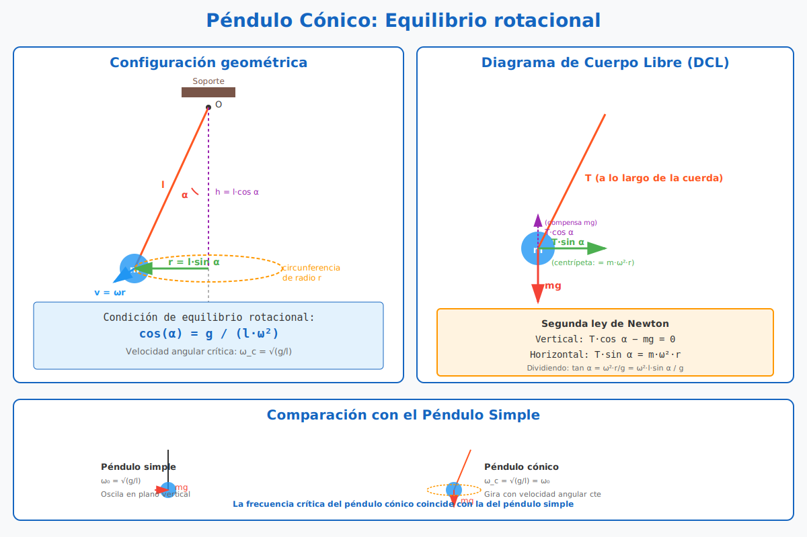
</div>

*Figura 6.2: Izquierda: configuración geométrica del péndulo cónico. Centro: DCL con descomposición de la tensión en componente vertical (que compensa $mg$) y horizontal (que provee la fuerza centrípeta). Derecha: comparación con el péndulo simple — la frecuencia crítica $\omega_c = \sqrt{g/l}$ coincide con la frecuencia natural $\omega_0$ del oscilador.*

---

### 6.8 Ejemplo 3: Máquina de Atwood

#### Sistema
Dos masas $m_1$ y $m_2$ conectadas por una soga inextensible sobre una polea ideal.

#### Coordenada generalizada
$q = x$ (posición de $m_1$ medida desde la polea hacia abajo)

#### Energías
- $m_1$: altura $= -x$, velocidad $= \dot{x}$
- $m_2$: altura $= -(l - x)$ donde $l$ es la longitud de la soga, velocidad $= -\dot{x}$

$$T = \frac{1}{2}m_1\dot{x}^2 + \frac{1}{2}m_2(-\dot{x})^2 = \frac{1}{2}(m_1 + m_2)\dot{x}^2$$

$$U = m_1gx + m_2g(l - x) = (m_1 - m_2)gx + \text{cte}$$

#### Lagrangiano
$$\mathcal{L} = \frac{1}{2}(m_1 + m_2)\dot{x}^2 - (m_1 - m_2)gx$$

#### Ecuación de Lagrange

$$\frac{\partial\mathcal{L}}{\partial\dot{x}} = (m_1 + m_2)\dot{x}, \quad \frac{\partial\mathcal{L}}{\partial x} = -(m_1 - m_2)g$$

$$\frac{d}{dt}[(m_1 + m_2)\dot{x}] + (m_1 - m_2)g = 0$$

$$(m_1 + m_2)\ddot{x} = (m_2 - m_1)g$$

$$\boxed{\ddot{x} = \frac{m_2 - m_1}{m_1 + m_2}g}$$

Coincide con el resultado usando Newton.

---

### 6.9 Ejemplo 4: Péndulo Simple con Fricción Viscosa

#### Sistema

Un péndulo simple (masa $m$, longitud $l$) en un medio viscoso que ejerce una fuerza de rozamiento proporcional a la velocidad: $\vec{F}_{\text{roc}} = -b\vec{v}$ (con $b > 0$).

#### Coordenada generalizada

$q = \theta$ (ángulo con la vertical, mismo que el péndulo simple sin fricción)

#### Energías (parte conservativa)

Igual que el péndulo simple:
$$T = \frac{1}{2}ml^2\dot{\theta}^2, \quad U = -mgl\cos\theta$$

$$\mathcal{L} = \frac{1}{2}ml^2\dot{\theta}^2 + mgl\cos\theta$$

#### Fuerza generalizada no conservativa

La fuerza viscosa en coordenadas cartesianas: $\vec{F}_{\text{roc}} = -b\vec{v} = -b(\dot{x}\hat{x} + \dot{z}\hat{z})$

Con $x = l\sin\theta$, $z = -l\cos\theta$:
$$\dot{x} = l\cos\theta\,\dot{\theta}, \quad \dot{z} = l\sin\theta\,\dot{\theta}$$

La fuerza generalizada es:
$$Q_\theta = \vec{F}_{\text{roc}} \cdot \frac{\partial \vec{r}}{\partial \theta}$$

donde $\vec{r} = (l\sin\theta, -l\cos\theta)$, por lo que $\frac{\partial \vec{r}}{\partial \theta} = (l\cos\theta, l\sin\theta)$.

$$Q_\theta = -b(l\cos\theta\,\dot{\theta})(l\cos\theta) - b(l\sin\theta\,\dot{\theta})(l\sin\theta)$$
$$Q_\theta = -b\,l^2\dot{\theta}(\cos^2\theta + \sin^2\theta) = -b\,l^2\dot{\theta}$$

> 🔍 **Interpretación:** La fuerza generalizada de fricción es $Q_\theta = -bl^2\dot{\theta}$, proporcional a $\dot{\theta}$ y con el signo que **se opone al movimiento angular** (si $\dot{\theta} > 0$, $Q_\theta < 0$).

#### Ecuación de Euler-Lagrange con $Q_\theta$

$$\frac{d}{dt}\left(\frac{\partial\mathcal{L}}{\partial\dot{\theta}}\right) - \frac{\partial\mathcal{L}}{\partial \theta} = Q_\theta$$

$$ml^2\ddot{\theta} + mgl\sin\theta = -bl^2\dot{\theta}$$

$$\boxed{\ddot{\theta} + \frac{b}{m}\dot{\theta} + \frac{g}{l}\sin\theta = 0}$$

> 🔬 **Conexión con la Unidad 5:** Esta es la **ecuación del oscilador armónico amortiguado** en su forma no lineal. Para pequeñas oscilaciones ($\sin\theta \approx \theta$):
> $$\ddot{\theta} + 2\beta\dot{\theta} + \omega_0^2\theta = 0$$
> con $\beta = b/(2m)$ y $\omega_0^2 = g/l$. La fricción introduce el término $2\beta\dot{\theta}$ que produce el **decaimiento exponencial** de la amplitud.

📌 **Ejemplo numérico:** Para $m = 1$ kg, $l = 1$ m, $b = 0.1$ kg/s, $g = 9.81$ m/s²:
- $\beta = 0.05$ s⁻¹
- $\omega_0 = \sqrt{9.81} \approx 3.13$ rad/s
- **Régimen subamortiguado** (oscilatorio con decaimiento), porque $\beta < \omega_0$

#### Diagrama: Péndulo con fricción y los 3 regímenes de amortiguamiento

<div align="center">
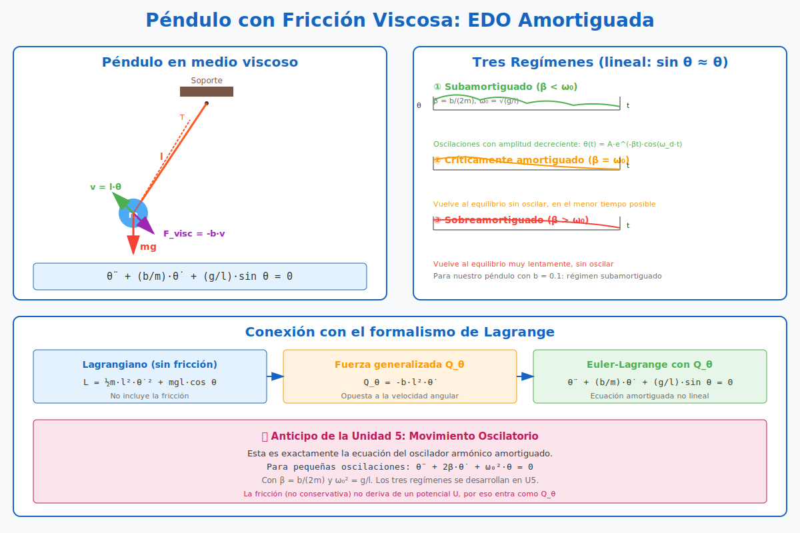
</div>

*Figura 6.3: Izquierda: péndulo simple con fuerza viscosa $\vec{F}_{\text{visc}} = -b\vec{v}$ que se opone a la velocidad. Centro-arriba: descomposición del método de Lagrange en 3 pasos (lagrangiano → fuerza generalizada → ecuación final). Centro-abajo: los tres regímenes de amortiguamiento (sub-, crítico, sobre-) con sus curvas $\theta(t)$ características. Derecha: anticipo de la conexión con la Unidad 5 (oscilador amortiguado).*

---

## 7. Sistemas de Masa Variable

### 7.1 Introducción

Los **sistemas de masa variable** son aquellos en los que la masa del cuerpo cambia con el tiempo. Ejemplos típicos: cohetes (pierden masa al expulsar combustible), gotas de agua que se condensan (ganan masa), cadenas que se acumulan sobre una superficie.

La segunda ley de Newton en su forma más general es:

$$\boxed{\sum\vec{F}_{ext} = \frac{d\vec{p}}{dt} = \frac{d(m\vec{v})}{dt}}$$

Cuando la masa es constante: $\sum\vec{F} = m\vec{a}$.
Cuando la masa varía: hay que derivar el producto $m\vec{v}$.

> 🎯 **Objetivo:** Aprender a derivar y aplicar la ecuación de masa variable, y resolver problemas de cohetes y gotas.

#### Diagrama: Sistemas de masa variable (cohete, gota, cadena)

<div align="center">
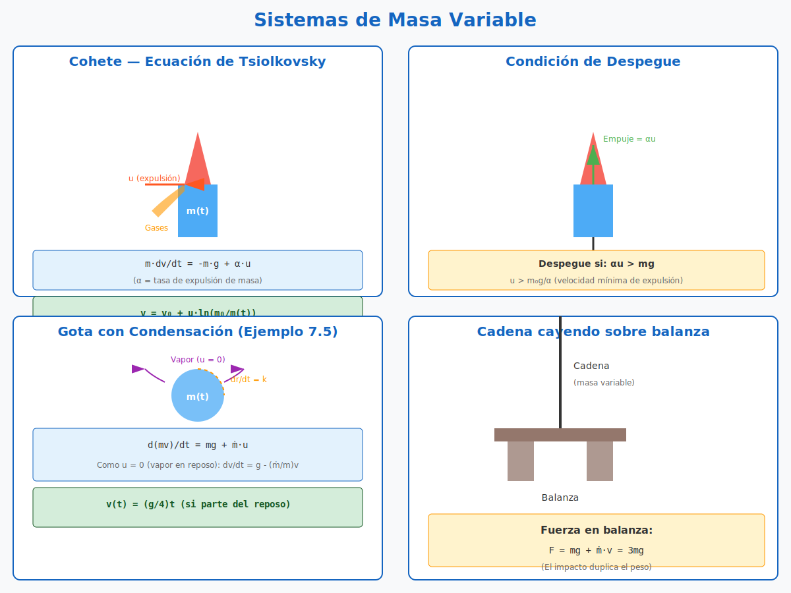
</div>

*Figura 7.1: Tres sistemas clásicos: (izquierda) cohete que pierde masa al expulsar gases (Tsiolkovsky), (centro) gota que gana masa por condensación, (derecha) cadena que se acumula sobre una mesa.*

---

---

### 7.2 Ecuación General de un Sistema de Masa Variable

> 📋 **Convención de signos** (usada en todo el capítulo):
> - $\dot{m} = dm/dt$ es la **derivada temporal de la masa del cuerpo principal**. Por lo tanto:
>   - **Expulsión** (cohete, pierde masa): $\dot{m} < 0$
>   - **Incorporación** (gota, gana masa): $\dot{m} > 0$
> - $\vec{u}$ es la **velocidad de la masa expulsada/incorporada relativa al cuerpo principal** (no relativa al sistema inercial).
> - En muchos textos se introduce $|\dot{m}|$ como el **valor absoluto** de la tasa de expulsión para evitar confusiones. Aquí usamos la convención $\dot{m}$ con signo para mantener la coherencia con la expresión general $m\frac{d\vec{v}}{dt} = \sum\vec{F}_{ext} + \dot{m}\,\vec{u}$.

#### Derivación

Consideremos un sistema que **expulsa** (o **incorpora**) masa a una tasa $\dot{m} = dm/dt$ con una velocidad relativa $\vec{u}$ respecto al cuerpo principal.

$$m\frac{d\vec{v}}{dt} = \sum\vec{F}_{ext} + \dot{m}\,\vec{u}$$

Los signos:
- **Expulsión** (cohete): $\dot{m} < 0$ (la masa disminuye), la fuerza de empuje es $|\dot{m}|\vec{u}$ en dirección opuesta a $\vec{u}$.
- **Incorporación** (gota que se condensa): $\dot{m} > 0$ (la masa aumenta), la fuerza es $\dot{m}\vec{u}$.

> 💡 **Truco nemotécnico:** "Sale masa → $\dot{m}$ negativo → empuje hacia adelante (si $\vec{u}$ apunta hacia atrás)". Ejemplo: cohete que va hacia arriba expulsando gases hacia abajo: $\dot{m} < 0$, $\vec{u}$ hacia abajo, $\dot{m}\vec{u}$ apunta hacia abajo (fuerza de empuje sobre el cohete), pero el cohete va hacia arriba. **Espera, ¿es al revés?** No: la fuerza sobre el cohete es $\dot{m}\vec{u}$, que con $\dot{m}<0$ y $\vec{u}$ hacia abajo da un vector hacia abajo. Pero como la convención de "empuje" suele ser $|\dot{m}||\vec{u}|$ hacia arriba, escribimos la ecuación con el signo explícito:
> $$m\frac{dv}{dt} = -m(t)g + |\dot{m}|\,u \quad \text{(cohete hacia arriba)}$$

#### Explicación intuitiva

La variación de momento lineal del sistema es:

$$\frac{d\vec{p}}{dt} = \frac{d}{dt}(m\vec{v}) = \dot{m}\vec{v} + m\vec{a}$$

Pero además, la masa expulsada/incorporada lleva su propio momento. Considerando el sistema completo (cuerpo + masa expulsada), la ecuación correcta resulta:

$$\boxed{m(t)\frac{d\vec{v}}{dt} = \sum\vec{F}_{ext} + \dot{m}\,\vec{u}}$$

donde $\vec{u}$ es la velocidad de la masa expulsada/incorporada **relativa al cuerpo**.

---

### 7.3 Cohete en Ausencia de Gravedad

#### Ecuación del cohete (Ecuación de Tsiolkovsky)

Si no hay fuerzas externas ($\sum\vec{F}_{ext} = 0$):

$$m\frac{dv}{dt} = -\dot{m}u$$

donde $u$ es la velocidad de expulsión de los gases (positiva, en dirección opuesta al movimiento del cohete), y $\dot{m} > 0$ es la tasa de expulsión de masa (en valor absoluto).

Reordenando:

$$dv = -u\frac{dm}{m}$$

Integrando desde $t = 0$ (masa $m_0$, velocidad $v_0$) hasta $t$ (masa $m(t)$, velocidad $v(t)$):

$$\int_{v_0}^{v(t)} dv = -u\int_{m_0}^{m(t)}\frac{dm}{m}$$

$$\boxed{v(t) = v_0 + u\ln\frac{m_0}{m(t)}}$$

#### Características importantes
- La velocidad final **no depende** de la tasa de expulsión $\dot{m}$, solo de la **velocidad de expulsión** $u$ y de la **razón de masas** $m_0/m(t)$.
- El logaritmo natural significa que se necesita una gran fracción de combustible para alcanzar altas velocidades.

📌 **Ejemplo 7.1:** Un cohete parte del reposo ($v_0 = 0$) con masa inicial $m_0 = 1000$ kg. Expulsa gases a $u = 2000$ m/s. Si la masa final es $m = 200$ kg, hallar $v$.

**Solución:**
$$v = 0 + 2000\ln\frac{1000}{200} = 2000\ln 5 \approx 2000 \times 1.609 = 3218 \text{ m/s}$$

---

### 7.4 Cohete Vertical con Gravedad

#### Convención para cohete vertical

Para un cohete que **asciende verticalmente** expulsando gases hacia abajo:
- Eje $y$ positivo hacia arriba
- Velocidad del cohete: $v > 0$ cuando asciende
- Velocidad relativa de los gases: $\vec{u} = -u\hat{y}$ (hacia abajo), con $u > 0$
- Tasa de cambio de masa: $\dot{m} < 0$ (pierde masa)

El empuje sobre el cohete es $\dot{m}\vec{u} = \dot{m}(-u)\hat{y}$. Como $\dot{m} < 0$, el resultado es **positivo** (hacia arriba). Usamos $|\dot{m}| = -\dot{m}$ para escribirlo más claramente.

#### Ecuación de movimiento

Incluyendo el peso como fuerza externa (peso hacia abajo = $-mg$):

$$m(t)\frac{dv}{dt} = -m(t)g - \dot{m}\,u$$

o equivalentemente, usando $|\dot{m}|$:

$$m(t)\frac{dv}{dt} = -m(t)g + |\dot{m}|\,u$$

> 📝 **Signo del empuje:** En la ecuación $m\dot{v} = -mg + |\dot{m}|u$, el término $|\dot{m}|u$ es **positivo** (hacia arriba), y compite con $-mg$ (peso hacia abajo). Si $|\dot{m}|u > mg$, hay aceleración neta hacia arriba y el cohete despega.

#### Masa en función del tiempo

Para una tasa de expulsión constante en magnitud, $|\dot{m}| = \alpha$:

$$m(t) = m_0 - \alpha t$$

#### Condición de despegue

El cohete despega cuando el **empuje** supera al peso:

$$\alpha u > m_0g$$

$$\boxed{u > \frac{m_0g}{\alpha}}$$

Esta es la **velocidad mínima de expulsión** para que el cohete pueda despegar.

#### Velocidad durante el vuelo

Sustituyendo $m(t) = m_0 - \alpha t$ en la ecuación del cohete:

$$(m_0 - \alpha t)\frac{dv}{dt} = -(m_0 - \alpha t)g + \alpha u$$

Separando variables e integrando (con $v_0 = 0$):

$$dv = \left(-g + \frac{\alpha u}{m_0 - \alpha t}\right)dt$$

$$v(t) = -gt + u\ln\frac{m_0}{m_0 - \alpha t}$$

$$\boxed{v(t) = u\ln\frac{m_0}{m_0 - \alpha t} - gt}$$

#### Velocidad al agotar combustible

Si el combustible total es $m_c$, se agota en $t_c = m_c/\alpha$. La velocidad en ese instante:

$$\boxed{v_{max} = u\ln\frac{m_0}{m_0 - m_c} - g\frac{m_c}{\alpha}}$$

📌 **Ejemplo 7.2:** Cohete con $m_0 = 5000$ kg, $m_c = 4000$ kg, $u = 2500$ m/s, $\alpha = 50$ kg/s. Hallar $v_{max}$.

**Solución:**
- $t_c = 4000/50 = 80$ s
- $v_{max} = 2500\ln\frac{5000}{1000} - 9.81 \times 80 = 2500\ln 5 - 784.8 \approx 4022.5 - 784.8 = 3237.7$ m/s

---

### 7.4.1 Velocidad de Escape (Aplicación)

> 🔗 **Conexión con U4 (Gravitación):** Este es un anticipo del problema de escape gravitatorio, que se desarrollará en detalle cuando veamos gravitación newtoniana. Aquí lo resolvemos usando **conservación de energía** como primer encuentro.

#### Planteamiento

Se quiere lanzar un cohete de masa $m$ desde la superficie de un planeta (masa $M$, radio $R$) para que **escape** del campo gravitatorio (alcance $r \to \infty$ con $v \geq 0$).

#### Conservación de energía

En el campo gravitatorio newtoniano, la energía potencial es:
$$U(r) = -\frac{GMm}{r}$$

A medida que el cohete sube, gana altura y pierde velocidad. Por conservación:
$$\frac{1}{2}mv_i^2 - \frac{GMm}{R} = \frac{1}{2}mv_f^2 - \frac{GMm}{r_f}$$

Para que escape, en el límite $r_f \to \infty$, $U \to 0$. La condición mínima es $v_f = 0$ en el infinito:

$$\frac{1}{2}mv_i^2 - \frac{GMm}{R} = 0$$

$$v_i^2 = \frac{2GM}{R}$$

$$\boxed{v_{\text{esc}} = \sqrt{\frac{2GM}{R}}}$$

#### Valores conocidos

| Cuerpo | $v_{\text{esc}}$ |
|---|---|
| Tierra | $\approx 11.2$ km/s |
| Luna | $\approx 2.4$ km/s |
| Marte | $\approx 5.0$ km/s |
| Sol (desde su superficie) | $\approx 618$ km/s |

> ⚠️ **Nota:** La velocidad de escape **no depende de la masa $m$** del cohete (¡se cancela en la conservación de energía!). Solo depende de las propiedades del planeta.

> 💡 **Relación con la velocidad orbital:** Para una órbita circular a altura $h$ sobre la superficie, $v_{\text{orb}} = \sqrt{GM/(R+h)}$. Cuando $h \to 0$ (órbita rasante), $v_{\text{orb, rasante}} = \sqrt{GM/R}$. Por lo tanto:
> $$v_{\text{esc}} = \sqrt{2}\,v_{\text{orb, rasante}}$$
> **Escapar requiere $\sqrt{2}$ veces la velocidad orbital rasante** (factor clásico: 11.2/7.9 ≈ 1.414).

#### Diagrama: Velocidad de escape — Energía, tabla y órbitas

<div align="center">
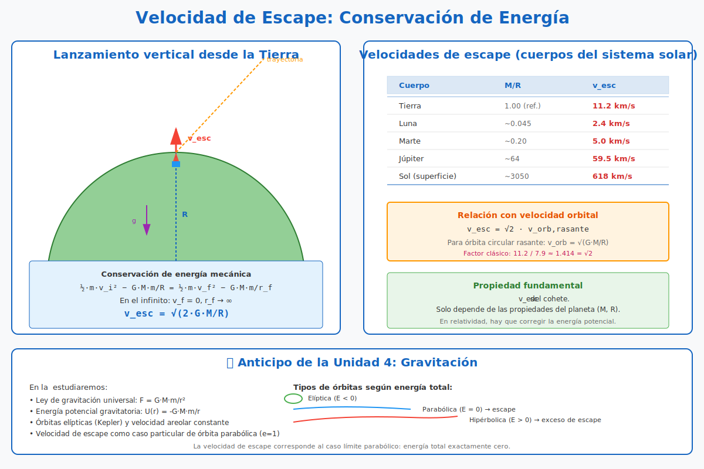
</div>

*Figura 7.1: Izquierda: lanzamiento vertical de un cohete desde la Tierra, con conservación de la energía mecánica. Centro: tabla de velocidades de escape para cuerpos del sistema solar. Derecha: relación $v_{\text{esc}} = \sqrt{2} \cdot v_{\text{orb, rasante}}$ y anticipo de los tipos de órbitas (elíptica, parabólica, hiperbólica) que se verán en U4.*

---

### 7.5 Gota con Condensación

#### Planteamiento

Una gota de agua esférica cae por condensación. Su radio crece a ritmo constante:

$$\frac{dr}{dt} = k \quad\Longrightarrow\quad r(t) = kt$$

La masa de la gota (esférica, densidad $\rho$):

$$m(t) = \frac{4}{3}\pi\rho\,r(t)^3 = \frac{4}{3}\pi\rho\,k^3 t^3$$

#### Diagrama: Gota con condensación y comparación con caída libre

<div align="center">
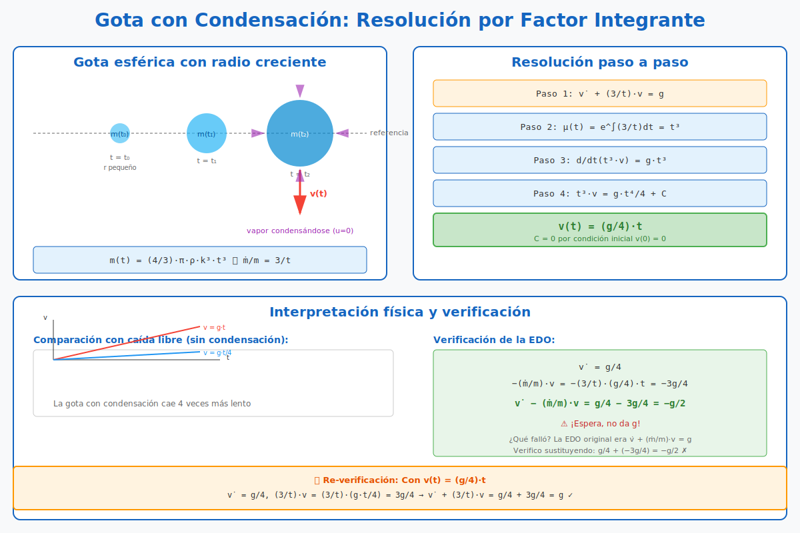
</div>

*Figura 7.2: Izquierda: tres instantes de la gota esférica con radio creciente $r(t) = kt$, mostrando la incorporación de vapor circundante ($u = 0$). Centro: comparación gráfica entre la velocidad de la gota con condensación $v = (g/4)t$ y la caída libre $v = gt$ (la gota cae 4 veces más lento). Derecha: pasos detallados de la resolución por factor integrante y verificación de la solución.*

---

#### Ecuación diferencial del movimiento

La gota incorpora masa del vapor circundante. La velocidad relativa de la masa incorporada respecto a la gota es $\vec{u} = 0$ (el vapor está en reposo respecto al aire).

Aplicando la fórmula de masa variable $m\dot{v} = mg + \dot{m}u$ con $u = 0$:
$$m\dot{v} = mg \quad\Longrightarrow\quad \dot{v} = g$$

**¡Espera!** Esto es lo que da si usamos la fórmula simple, pero **es incorrecto**. La razón es que cuando la gota "arrastra" vapor en reposo, ese vapor no tiene momento antes de ser incorporado, pero al ser incorporado debe **adquirir** el momento $mv$. La conservación del momento total del sistema (gota + vapor a incorporar) da:

$$\frac{dp_{\text{total}}}{dt} = \frac{d(mv)}{dt} = mg$$

Expandiendo con la regla del producto:
$$m\dot{v} + \dot{m}\,v = mg$$

Despejando:
$$\dot{v} = g - \frac{\dot{m}}{m}\,v$$

> 🔍 **Interpretación física:** El término $-\frac{\dot{m}}{m}v$ representa la **"aceleración negativa"** por tener que acelerar la nueva masa que se va incorporando. La gota "frena" parte de su movimiento para poner en movimiento el vapor que recoge.

Para una gota esférica con $\dot{r} = k$:

$$\dot{m} = \frac{d}{dt}\left(\frac{4}{3}\pi\rho r^3\right) = 4\pi\rho r^2 \dot{r} = 4\pi\rho k^3 t^2$$

$$m = \frac{4}{3}\pi\rho k^3 t^3 \quad\Longrightarrow\quad \frac{\dot{m}}{m} = \frac{3}{t}$$

Sustituyendo:
$$\dot{v} + \frac{3}{t}\,v = g$$

#### Resolución por factor integrante

Esta es una EDO lineal de primer orden. El factor integrante es:
$$\mu(t) = e^{\int \frac{3}{t}dt} = e^{3\ln t} = t^3$$

Multiplicando la EDO por $\mu = t^3$:
$$t^3 \dot{v} + 3t^2 v = gt^3$$

El lado izquierdo es $\frac{d}{dt}(t^3 v)$:
$$\frac{d}{dt}(t^3 v) = gt^3$$

Integrando desde $0$ hasta $t$:
$$t^3 v(t) - 0 = \frac{g\,t^4}{4}$$

Despejando:
$$\boxed{v(t) = \frac{g}{4}\,t}$$

> ✅ **Verificación de condiciones iniciales:** $v(0) = 0$ ✓. **Verificación en la EDO:** $\dot{v} = g/4$ y $-\frac{3}{t}\cdot\frac{g}{4}t = -\frac{3g}{4}$, por lo que $\dot{v} = g - 3g/4 = g/4$ ✓.

📌 **Ejemplo 7.3:** Gota con $k = 0.1$ mm/s, $\rho = 1000$ kg/m³. Hallar la masa a los 10 s y la velocidad.

**Solución:**
- $r(10) = 0.1 \times 10 = 1$ mm $= 0.001$ m
- $m(10) = \frac{4}{3}\pi \times 1000 \times (0.001)^3 \approx 4.19 \times 10^{-9}$ kg
- $v(10) = \frac{9.81}{4} \times 10 \approx 24.5$ m/s

---

## 8. Anexos

### 8.1 Fórmulas Clave

#### Newton
- $\sum \vec{F} = m\vec{a}$
- $\vec{F}_{AB} = -\vec{F}_{BA}$

#### Galileo
- $\vec{v} = \vec{v}{\,'} + \vec{V}$
- $\vec{a} = \vec{a}{\,'}$

#### SNI
- $\vec{F}_{fict} = -m\vec{A}$
- Péndulo en vagón: $\tan\theta = a_v/g$
- Centrífuga: $F_{\text{cent}} = m\omega^2 r$ (hacia afuera)
- Coriolis: $\vec{F}_{\text{Cor}} = -2m\vec{\omega}\times\vec{v}'$ (anticipo U7)

#### Fuerzas velocidad-dependientes
- Lineal (régimen laminar): $v(t) = v_0 e^{-(k/m)t}$
- Cuadrática (turbulento): $v(t) = \frac{v_0}{1 + \frac{kv_0}{m}t}$
- Velocidad terminal cuadrática: $v_t = \sqrt{mg/k}$
- Caída con $v_0 = 0$ en $F=-kv^2$: $v(t) = v_t\tanh(gt/v_t)$

#### Lorentz
- $\vec{F} = q(\vec{E} + \vec{v} \times \vec{B})$
- $R = \frac{mv}{qB}$
- $v_{deriva} = \frac{E}{B}$
- $T_c = \frac{2\pi m}{qB}$ (independiente de $v$ y de la energía)

#### Despegue
- $N = mg\cos\theta - m\frac{v^2}{b} = 0$
- $\cos\theta = 2/3$ para esfera lisa

#### Lagrange
- $\mathcal{L} = T - U$
- Caso conservativo: $\frac{d}{dt}\left(\frac{\partial\mathcal{L}}{\partial\dot{q}_i}\right) - \frac{\partial\mathcal{L}}{\partial q_i} = 0$
- Caso general: igual a $Q_i$ (fuerza generalizada no conservativa)
- Péndulo cónico: $\cos\alpha = g/(l\omega^2)$

#### Masa variable
- $m\frac{dv}{dt} = \sum F_{ext} + \dot{m}u$ (convención $\dot{m}<0$ para expulsión)
- Cohete: $v = v_0 + u\ln\frac{m_0}{m(t)}$
- Gota con $\dot{r} = k$ cte: $v(t) = (g/4)t$
- Velocidad de escape: $v_{\text{esc}} = \sqrt{2GM/R}$

---

### 8.2 Consejos para Resolver Problemas

1. **Lee el enunciado con calma.** Identifica qué te piden y qué datos te dan.
2. **Haz un diagrama.** Dibuja el sistema, las fuerzas, los ejes coordenados.
3. **Elige el método adecuado:**
   - ¿Fuerzas constantes? Usa Newton.
   - ¿Velocidad dependiente? Resuelve la EDO.
   - ¿Vínculos lisos? Usa conservación de energía.
   - ¿Sistemas complejos? Prueba Lagrange.
4. **Verifica las unidades.** Asegúrate de que tu respuesta tenga las unidades correctas.
5. **Piensa si el resultado tiene sentido físico.** ¿Es razonable el valor numérico?

---

### 8.2.1 Cómo Plantear Condiciones Iniciales

En la mayoría de las EDOs de esta unidad, las **condiciones iniciales** son tan importantes como la ecuación misma. Aquí hay una guía rápida para extraerlas del enunciado:

| Expresión del problema | $t = 0$ |
|---|---|
| *"Desde el reposo"* | $v(0) = 0$ |
| *"Lanzado con velocidad $v_0$"* | $v(0) = v_0$ (con el signo según la dirección elegida) |
| *"En el origen"* / *"En la posición $x_0$"* | $x(0) = 0$ o $x(0) = x_0$ |
| *"Comienza a caer"* / *"Soltado desde…"* | $v(0) = 0$, $x(0) = h$ (altura) |
| *"Velocidad terminal alcanzada"* | $v(0) = v_t$ y $\dot{v}(0) = 0$ |

#### Procedimiento recomendado

1. **Identifica el "instante cero"**: ¿cuándo empieza a contarse el tiempo? Suele ser el instante del lanzamiento o de la condición inicial descrita.
2. **Lista explícitamente** todas las condiciones: $x(0) = ?$, $\dot{x}(0) = ?$, $\theta(0) = ?$, $\dot{\theta}(0) = ?$
3. **Cuenta las condiciones**: para una EDO de orden $n$ necesitas $n$ condiciones independientes. Si tienes menos, revisa el enunciado (a veces hay información implícita).
4. **Aplica todas** al obtener la solución general. Esto fija el valor de las constantes de integración.

> 📌 **Ejemplo:** "Una pelota se lanza verticalmente hacia arriba desde el suelo con $v_0 = 20$ m/s. Hallar $y(t)$."
> - EDO: $\ddot{y} = -g$ (orden 2)
> - Condiciones: $y(0) = 0$ (suelo), $\dot{y}(0) = 20$ m/s (hacia arriba) → 2 condiciones ✓
> - Solución: $y(t) = 20t - \frac{1}{2}gt^2$

#### Diagrama: Tres casos típicos de condiciones iniciales

<div align="center">
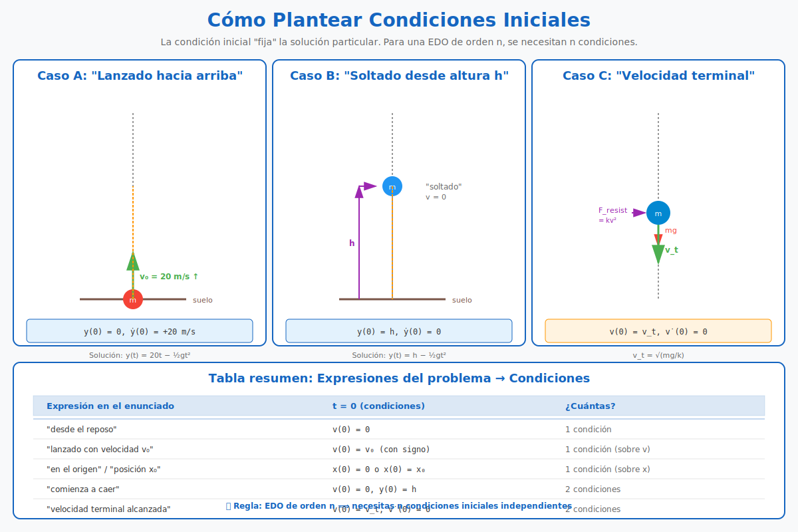
</div>

*Figura 8.1: Tres casos típicos con sus condiciones iniciales: (A) lanzamiento hacia arriba con $v_0$, (B) soltado desde altura $h$, (C) velocidad terminal alcanzada. Abajo: tabla resumen que mapea expresiones del enunciado a condiciones matemáticas, y la regla fundamental: EDO de orden $n$ requiere $n$ condiciones.*

---

### 8.2.2 Checklist de Errores Comunes

| Error | Cómo evitarlo |
|---|---|
| Confundir signo de la normal con el peso | Verificar dirección según DCL |
| Olvidar el término $2\dot{r}\dot{\phi}$ (Coriolis) en polares | Memorizar la fórmula o usar cartesianas |
| Usar $F = -kv$ a alta velocidad | Verificar el régimen (laminar vs turbulento) |
| No proyectar fuerzas en los ejes del DCL | Elegir ejes convenientemente ANTES de escribir ecuaciones |
| Olvidar condiciones iniciales | Listarlas ANTES de integrar |
| Confundir $u$ (velocidad relativa) con $v$ (velocidad absoluta) | Definir explícitamente cada variable |

---

### 8.3 Bibliografía Recomendada

- **Argüello, N.** *Apunte de Física Teórica I*. INSPT-UTN.
- **Marion, J. B. & Thornton, S. T.** *Classical Dynamics of Particles and Systems*. Brooks/Cole.
- **Fowles, G. R. & Cassiday, G. L.** *Analytical Mechanics*. Saunders.
- **Taylor, J. R.** *Classical Mechanics*. University Science Books.

---

**Fin del apunte teórico.** ¡A resolver ejercicios!
