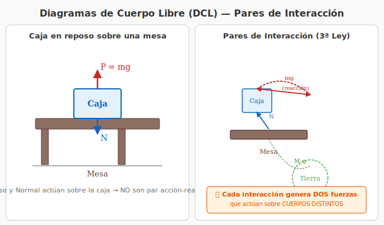

# 1. Leyes de Newton y Diagramas de Cuerpo Libre

## Introducción

La dinámica estudia la relación entre el movimiento de los cuerpos y las fuerzas que lo producen. Las **tres leyes de Newton** son los pilares fundamentales sobre los que se construye toda la mecánica clásica.

---

## Las Tres Leyes de Newton

### Primera Ley — Ley de Inercia

> "Todo cuerpo permanece en estado de reposo o de movimiento rectilíneo uniforme a menos que una fuerza neta externa actúe sobre él."

$$\text{Si } \sum \vec{F} = 0 \quad\Longrightarrow\quad \vec{v} = \text{cte}$$

**Implicaciones:**
- Define los **sistemas de referencia inerciales**: aquellos en los que se cumple la primera ley.
- La inercia es la tendencia natural de los cuerpos a mantener su estado de movimiento.
- No se necesita fuerza para mantener un movimiento: se necesita fuerza para **cambiar** el movimiento.

---

### Segunda Ley — Ley de Fuerza y Aceleración

> "La aceleración de un cuerpo es directamente proporcional a la fuerza neta que actúa sobre él e inversamente proporcional a su masa."

$$\boxed{\sum \vec{F} = m\vec{a}}$$

**Forma diferencial (más general):**

$$\sum \vec{F} = \frac{d\vec{p}}{dt} \quad\text{donde}\quad \vec{p} = m\vec{v}$$

Si la masa es constante:

$$\sum \vec{F} = m\frac{d\vec{v}}{dt} = m\vec{a}$$

**Puntos clave:**
- La fuerza neta y la aceleración son **vectores paralelos**: $\vec{a} \parallel \sum\vec{F}$
- La masa $m$ es la medida de la **inercia** del cuerpo.
- La segunda ley es una **ecuación vectorial**: se descompone en componentes.

**En coordenadas cartesianas:**

$$
\begin{cases}
\sum F_x = m\ddot{x} \\[4pt]
\sum F_y = m\ddot{y} \\[4pt]
\sum F_z = m\ddot{z}
\end{cases}
$$

**En coordenadas polares (movimiento plano):**

$$
\begin{cases}
\sum F_r = m(\ddot{r} - r\dot{\phi}^2) \\[4pt]
\sum F_\phi = m(r\ddot{\phi} + 2\dot{r}\dot{\phi})
\end{cases}
$$

---

### Tercera Ley — Ley de Acción y Reacción

> "Si un cuerpo A ejerce una fuerza sobre un cuerpo B, entonces B ejerce una fuerza sobre A de igual módulo, misma dirección y sentido opuesto."

$$\boxed{\vec{F}_{AB} = -\vec{F}_{BA}}$$

**Pares de interacción:**
- Siempre actúan sobre **cuerpos diferentes** (nunca se cancelan).
- Son de la **misma naturaleza** (si una es gravitatoria, la otra también).
- Existen simultáneamente.

> ⚠️ **Error común:** Confundir pares de acción-reacción con fuerzas que se equilibran. Las fuerzas de un par acción-reacción actúan sobre cuerpos distintos, por lo que NO se cancelan. Por ejemplo, el peso de un libro y la normal de la mesa NO son un par acción-reacción (actúan sobre el mismo cuerpo). El par acción-reacción del peso es la fuerza gravitatoria que el libro ejerce sobre la Tierra.

---

## Diagrama de Pares de Interacción

*Figura 1: Izquierda: DCL de la caja mostrando peso y normal (NO son acción-reacción). Derecha: pares de interacción gravitatorios y de contacto entre Tierra, Caja y Mesa.*

---

## Diagramas de Cuerpo Libre (DCL)

El DCL es la herramienta fundamental para aplicar las leyes de Newton. Consiste en **aislar** un cuerpo y dibujar **todas las fuerzas** que actúan sobre él.

### Procedimiento sistemático

1. **Seleccionar el cuerpo** de interés.
2. **Aislarlo** mentalmente del entorno.
3. **Identificar todas las fuerzas** que actúan **sobre el cuerpo** (no las que el cuerpo ejerce sobre otros).
4. **Dibujar cada fuerza** como un vector desde el punto de aplicación (generalmente el centro de masa).
5. **Elegir un sistema de coordenadas** conveniente.
6. **Escribir la segunda ley** en cada dirección.

### Tipos de fuerzas comunes

| Fuerza | Símbolo | Dirección | Característica |
|---|---|---|---|
| **Peso** | $\vec{P} = m\vec{g}$ | Vertical hacia abajo | Siempre presente cerca de la superficie terrestre |
| **Normal** | $\vec{N}$ | Perpendicular a la superficie | Fuerza de contacto, se ajusta para evitar penetración |
| **Tensión** | $\vec{T}$ | A lo largo de la soga/cable | Transmitida por cuerdas inextensibles y sin masa |
| **Rozamiento estático** | $\vec{f}_e$ | Tangente a la superficie | $f_e \leq \mu_e N$, se opone al inicio del movimiento |
| **Rozamiento cinético** | $\vec{f}_c$ | Opuesta al movimiento | $f_c = \mu_c N$, constante si $N$ y $\mu_c$ lo son |
| **Fuerza elástica** | $\vec{F}_e = -k\vec{x}$ | Opuesta al desplazamiento | Ley de Hooke |
| **Fuerza de vínculo** | $\vec{R}$ | Según la ligadura | Mantiene una restricción geométrica (ej: riel, guía) |

---

## Pares de Interacción — Análisis detallado

### Identificación sistemática

Para identificar todos los pares de interacción en un sistema:

1. **Enumera todos los cuerpos** del sistema.
2. **Para cada par de cuerpos**, pregúntate: ¿existe una fuerza entre ellos?
3. **Clasifica por tipo de interacción:**
   - **Gravitatoria:** entre cuerpos con masa (acción a distancia)
   - **De contacto:** normal, rozamiento, tensión

### Ejemplo: Caja sobre una mesa (Ejercicio 1)

**Cuerpos:** Tierra ($T$), Caja ($C$), Mesa ($M$)

**Pares de interacción:**

| Par | Fuerza 1 (sobre...) | Fuerza 2 (sobre...) | Tipo |
|---|---|---|---|
| Tierra-Caja | $\vec{P}_{C} = m_C\vec{g}$ (peso sobre la caja) | $\vec{F}_{C\to T}$ (atracción de la caja sobre la Tierra) | Gravitatorio |
| Tierra-Mesa | $\vec{P}_{M} = m_M\vec{g}$ (peso sobre la mesa) | $\vec{F}_{M\to T}$ (atracción de la mesa sobre la Tierra) | Gravitatorio |
| Mesa-Caja | $\vec{N}_{M\to C}$ (normal de la mesa sobre la caja) | $\vec{N}_{C\to M}$ (normal de la caja sobre la mesa) | Contacto |
| Mesa-Piso | $\vec{N}_{P\to M}$ (normal del piso sobre la mesa) | $\vec{N}_{M\to P}$ (normal de la mesa sobre el piso) | Contacto |

> 💡 **Observación:** El peso de la caja ($m_C\vec{g}$) y la normal de la mesa sobre la caja ($\vec{N}_{M\to C}$) NO son un par acción-reacción. Son dos fuerzas distintas que actúan sobre el **mismo cuerpo** (la caja) y se equilibran porque la caja está en reposo.

---

## Rozamiento

### Rozamiento Estático

Impide que el cuerpo comience a moverse. Se ajusta automáticamente hasta un valor máximo:

$$f_e \leq \mu_e N$$

- $\mu_e$: coeficiente de rozamiento estático
- $N$: módulo de la fuerza normal
- La dirección es tangente a la superficie, oponiéndose a la tendencia al movimiento

### Rozamiento Cinético

Actúa cuando el cuerpo ya está en movimiento:

$$f_c = \mu_c N$$

- $\mu_c$: coeficiente de rozamiento cinético (generalmente $\mu_c < \mu_e$)
- La dirección es **opuesta al vector velocidad relativa** entre las superficies

### Principio de interacción y rozamiento

Cuando un cuerpo cúbico se desliza sobre un piso:
- El piso ejerce una fuerza de rozamiento $\vec{f}_{P\to C}$ sobre el cuerpo, opuesta a su movimiento.
- El cuerpo ejerce una fuerza de rozamiento $\vec{f}_{C\to P}$ sobre el piso, en la misma dirección que su movimiento.
- Ambos tienen el **mismo módulo** ($f_c$) y **sentidos opuestos** (3ª Ley de Newton).

---

## Poleas y Sistemas Vinculados

### Polea Ideal

Una polea ideal tiene:
- **Masa despreciable**
- **Sin rozamiento** en el eje
- La tensión se **transmite sin cambios** a lo largo de la cuerda

### Cable Inextensible

Un cable ideal:
- **No se estira** (longitud constante)
- **Masa despreciable**
- La tensión es la misma en todos sus puntos

### Método de resolución para sistemas con poleas

1. **Dibujar DCL para cada cuerpo** por separado.
2. **Aplicar 2ª ley de Newton** a cada cuerpo.
3. **Relacionar las aceleraciones** mediante la condición de ligadura (inextensibilidad del cable).
4. **Resolver el sistema de ecuaciones.**

### Relaciones de ligadura típicas

Para una polea fija con dos masas $m_1$ y $m_2$ conectadas por una cuerda:
- $a_1 = a_2$ en módulo (una sube mientras la otra baja)
- Las tensiones son iguales: $T_1 = T_2$

### Ejemplo: Máquina de Atwood

Dos masas $m_1$ y $m_2$ ($m_2 > m_1$) conectadas por una cuerda que pasa por una polea fija.

**DCL:**

Para $m_1$: $T - m_1g = m_1a$ (hacia arriba)
Para $m_2$: $m_2g - T = m_2a$ (hacia abajo donde $a > 0$)

**Resolviendo:**

$$a = \frac{m_2 - m_1}{m_1 + m_2}\,g$$

$$T = \frac{2m_1m_2}{m_1 + m_2}\,g$$

---

## Resumen del método general

Para resolver cualquier problema de dinámica:

1. **Identificar todos los cuerpos** del sistema.
2. **Elegir un sistema de referencia** adecuado.
3. **Dibujar DCL** para cada cuerpo (o para el sistema completo si es posible).
4. **Aplicar $\sum\vec{F} = m\vec{a}$** en componentes.
5. **Incorporar relaciones de ligadura** (vínculos, cuerdas, poleas).
6. **Resolver** el sistema de ecuaciones.
7. **Verificar** que los resultados sean físicamente razonables.

---

*Próximo tema: [Transformaciones de Galileo →](./02-transformaciones-galileo.md)*
