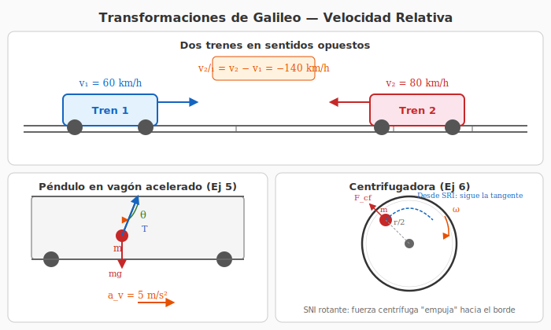
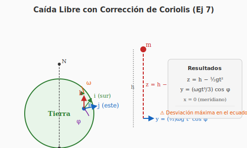

# 3. Sistemas No Inerciales y Fuerzas Ficticias

## Introducción

Un **sistema de referencia no inercial (SNI)** es aquel que está **acelerado** respecto a un sistema inercial. En estos sistemas, la segunda ley de Newton $\sum\vec{F} = m\vec{a}$ no se cumple a menos que introduzcamos **fuerzas ficticias** (o fuerzas inerciales).

---

## Diagrama — Sistemas No Inerciales

La figura siguiente muestra dos ejemplos clásicos de sistemas no inerciales:

*Figura 1: Panel inferior izquierdo: péndulo en un vagón con aceleración $a_v = 5$ m/s² — ejemplo de SNI con traslación. Panel inferior derecho: cuerpo en una centrifugadora rotante — ejemplo de SNI con rotación donde aparece la fuerza centrífuga.*

---

## Clasificación de Sistemas No Inerciales

| Tipo de aceleración | Ejemplo | Fuerza ficticia asociada |
|---|---|---|
| **Traslación acelerada** | Vagón que acelera | $-m\vec{a}_{arr}$ |
| **Rotación uniforme** | Centrifugadora, Tiovivo | Centrífuga ($+m\omega^2 r$) |
| **Rotación + traslación** | Superficie terrestre | Centrífuga + Coriolis |

---

## Segunda Ley en un SNI

### Derivación

Sea $S$ un sistema inercial y $S'$ un sistema no inercial con aceleración $\vec{A}$ respecto a $S$ (traslación pura).

La aceleración de un punto $P$ se relaciona mediante:

$$\vec{a}_P = \vec{a}_P' + \vec{A}$$

Multiplicando por la masa:

$$m\vec{a}_P = m\vec{a}_P' + m\vec{A}$$

Pero en $S$ (inercial) se cumple $\sum\vec{F} = m\vec{a}_P$, entonces:

$$\sum\vec{F} = m\vec{a}_P' + m\vec{A}$$

Despejando $\vec{a}_P'$:

$$m\vec{a}_P' = \sum\vec{F} - m\vec{A}$$

### Ecuación fundamental en SNI

$$\boxed{\sum\vec{F} + \vec{F}_{fict} = m\vec{a}'}$$

donde $\vec{F}_{fict}$ es la **fuerza ficticia** que debemos agregar para que la segunda ley funcione en $S'$:

$$\boxed{\vec{F}_{fict} = -m\vec{A}}$$

---

## Caso 1: SNI con Traslación Acelerada

### Planteamiento

Un vagón acelera con $\vec{a}_v = a_v\,\hat{x}$ respecto a la Tierra (SRI). Dentro del vagón, un péndulo cuelga del techo.

**Desde la Tierra (SRI):**
- La masa del péndulo tiene la misma aceleración que el vagón: $\vec{a} = a_v\,\hat{x}$
- Las fuerzas reales son: peso ($m\vec{g}$) y tensión ($\vec{T}$)
- $\sum\vec{F} = \vec{T} + m\vec{g} = m\vec{a}_v$

**Desde el vagón (SNI):**
- El péndulo está **en reposo** respecto al vagón ($\vec{a}' = 0$)
- Además de las fuerzas reales, aparece una fuerza ficticia: $\vec{F}_{fict} = -m\vec{a}_v$

### Ejemplo: Péndulo en vagón acelerado (Ejercicio 5)

**Datos:** $a_v = 5$ m/s². Buscar el ángulo $\theta$ que forma el péndulo con la vertical.

**Resolución desde el SNI (vagón):**

En equilibrio respecto al vagón ($\vec{a}' = 0$):

$$
\begin{aligned}
\sum F_x &: T\sin\theta - ma_v = 0 \quad\Longrightarrow\quad T\sin\theta = ma_v \\[4pt]
\sum F_y &: T\cos\theta - mg = 0 \quad\Longrightarrow\quad T\cos\theta = mg
\end{aligned}
$$

Dividiendo las ecuaciones:

$$\tan\theta = \frac{a_v}{g} = \frac{5}{9{,}81} \approx 0{,}5097$$

$$\boxed{\theta \approx 27^\circ}$$

**Resolución desde la Tierra (SRI):**

La masa tiene aceleración $\vec{a} = a_v\,\hat{x}$:

$$
\begin{aligned}
\sum F_x &: T\sin\theta = ma_v \\[4pt]
\sum F_y &: T\cos\theta - mg = 0
\end{aligned}
$$

Llegamos a las mismas ecuaciones. El resultado es idéntico.

> 💡 Ambas perspectivas dan el mismo resultado físico. La diferencia es cómo describimos el problema: fuerzas reales + ficticias en SNI, solo fuerzas reales + aceleración aparente en SRI.

---

## Caso 2: SNI con Rotación Uniforme

### Fuerza Centrífuga

En un sistema que gira con velocidad angular constante $\vec{\omega}$, aparece la **fuerza centrífuga**:

$$\boxed{\vec{F}_{cf} = m\omega^2 r\,\hat{e}_r}$$

- **Dirección:** radial hacia **afuera** (opuesta a la aceleración centrípeta)
- **Módulo:** $F_{cf} = m\omega^2 r$
- **Solo existe en el sistema rotante** (en el sistema inercial es la fuerza centrípeta la que mantiene el movimiento circular)

**Ojo con la confusión:**
- **Centrípeta** = fuerza real que apunta hacia el centro (en SRI)
- **Centrífuga** = fuerza ficticia que apunta hacia afuera (en SNI rotante)
- ¡NO existen simultáneamente en el mismo sistema de referencia!

### Fuerza de Coriolis

Cuando un cuerpo se mueve **dentro** de un sistema rotante, aparece una fuerza ficticia adicional:

$$\boxed{\vec{F}_{Cor} = -2m\,\vec{\omega} \times \vec{v}{\,'}}$$

**Características:**
- Es perpendicular tanto a $\vec{\omega}$ como a $\vec{v}{\,'}$ (regla del producto vectorial)
- Solo aparece si el cuerpo tiene **velocidad relativa** al sistema rotante
- Es responsable de: desviación de proyectiles, giro de ciclones, desgaste de rieles

### Fuerza Total en un SNI Rotante

La segunda ley en un sistema que rota con $\vec{\omega}$ y tiene aceleración angular $\dot{\vec{\omega}}$ es:

$$m\vec{a}{\,'} = \sum\vec{F} \;+\; \underbrace{m\omega^2 r\,\hat{e}_r}_{\text{centrífuga}} \;-\; \underbrace{2m\,\vec{\omega} \times \vec{v}{\,'}}_{\text{Coriolis}} \;-\; \underbrace{m\,\dot{\vec{\omega}} \times \vec{r}{\,'}}_{\text{Euler}}$$

> El último término (Euler) solo aparece si la velocidad angular **no** es constante.

---

## Caso 3: La Tierra como SNI (Ejercicio 7)

### Planteamiento

La Tierra **no** es un sistema inercial porque:
- **Gira** sobre su eje (rotación, $\omega \approx 7{,}27 \times 10^{-5}$ rad/s)
- **Orbita** alrededor del Sol (traslación)

Para muchos problemas cotidianos podemos aproximarla como inercial, pero para movimientos a gran escala o de larga duración los efectos no inerciales son detectables.

### Sistemas de referencia en la Tierra

**Sistema geocéntrico (inercial aproximado):**
- Origen en el centro de la Tierra
- Ejes fijos respecto a las estrellas lejanas
- Se considera inercial para problemas de mecánica clásica

**Sistema en la superficie terrestre (SNI rotante):**
- Origen en un punto de la superficie
- Eje $\hat{k}$: dirección radial (vertical local)
- Eje $\hat{i}$: dirección norte-sur (meridiano)
- Eje $\hat{j}$: dirección este-oeste (paralelo)

### Diagrama — Caída libre con Coriolis

*Figura 2: Sistema de referencia local sobre la superficie terrestre. La partícula que cae verticalmente se desvía hacia el este por efecto Coriolis.*

### Caída libre con corrección de Coriolis

Un cuerpo en caída libre desde una altura $h$ experimenta una **desviación hacia el este** debido a la fuerza de Coriolis.

**Ecuaciones de movimiento (aproximadas):**

$$m\ddot{\vec{r}} = m\vec{g} - 2m\,\vec{\omega} \times \vec{v}$$

**Solución (para caída desde el reposo):**

$$
\begin{aligned}
z(t) &= h - \frac{g\,t^2}{2} \\[4pt]
y(t) &= \frac{\omega\,g\,t^3}{3}\cos\varphi
\end{aligned}
$$

donde $\varphi$ es la **latitud** del lugar y $y$ es la desviación hacia el este.

**Interpretación:**
- La caída vertical sigue siendo la misma que en caída libre ($z$)
- Aparece una **desviación lateral** ($y$) proporcional a $\omega$ y a $t^3$
- La desviación es máxima en el **ecuador** ($\varphi = 0$, $\cos\varphi = 1$) y nula en los **polos** ($\varphi = \pm 90^\circ$, $\cos\varphi = 0$)

---

## Centrifugadora (Ejercicio 6)

### Descripción

Una centrifugadora es un tambor que gira a gran velocidad. Un cuerpo dentro de ella "sale despedido" hacia el borde.

### Explicación desde el SRI (exterior)

- El cuerpo tiende a seguir una trayectoria rectilínea (1ª ley de Newton)
- La pared del tambor ejerce una fuerza normal sobre el cuerpo que lo obliga a seguir una trayectoria circular
- Si el cuerpo no está en contacto con la pared, no hay fuerza centrípeta real y el cuerpo se mueve en línea recta
- Desde afuera: el cuerpo **no** "sale", sino que sigue la tangente mientras el tambor gira

### Explicación desde el SNI (centrifugadora)

- El cuerpo está sometido a la fuerza ficticia centrífuga $\vec{F}_{cf} = m\omega^2 r\,\hat{e}_r$
- Si $\vec{F}_{cf}$ supera a las fuerzas de ligadura (rozamiento, normal), el cuerpo se acelera radialmente hacia afuera
- La "tendencia a salir" es un efecto de la fuerza centrífuga en el sistema rotante

---

## Resumen de fuerzas ficticias

| Sistema no inercial | Fuerza ficticia | Expresión | ¿Cuándo aparece? |
|---|---|---|---|
| Traslación acelerada | Inercial lineal | $-m\vec{A}$ | Siempre |
| Rotante ($\omega$ cte) | Centrífuga | $m\omega^2 r\,\hat{e}_r$ | Siempre |
| Rotante ($\omega$ cte, cuerpo móvil) | Coriolis | $-2m\,\vec{\omega} \times \vec{v}{\,'}$ | Si $\vec{v}{\,'} \neq 0$ |
| Rotante ($\omega$ variable) | Euler | $-m\,\dot{\vec{\omega}} \times \vec{r}{\,'}$ | Si $\dot{\omega} \neq 0$ |

---

*Próximo tema: [Fuerzas Dependientes de la Velocidad →](./04-fuerzas-velocidad.md)*
