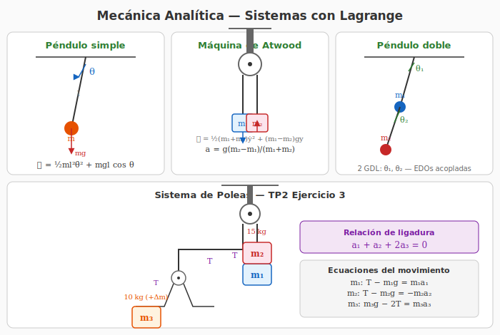
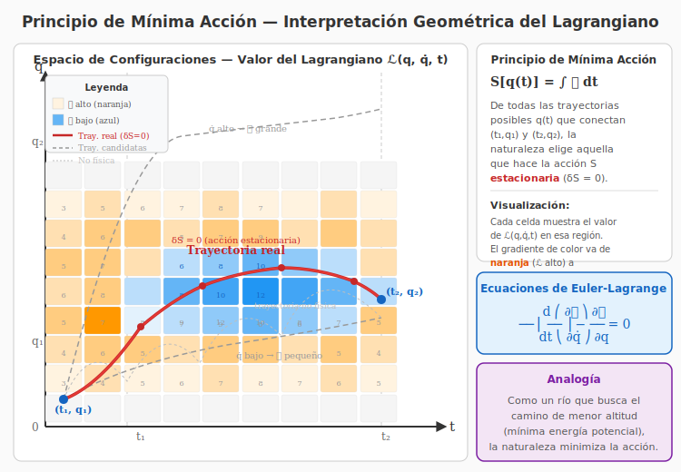

# 7. Mecánica Analítica — Ecuaciones de Lagrange

## Introducción

La **mecánica analítica** reformula la mecánica clásica en términos de **energías** en lugar de fuerzas. Las **ecuaciones de Lagrange** permiten obtener las ecuaciones de movimiento de un sistema de manera sistemática, sin necesidad de calcular fuerzas de vínculo.

---

## Diagrama — Sistemas para Lagrange

*Figura 1: Sistemas analizados mediante ecuaciones de Lagrange: péndulo simple, máquina de Atwood, péndulo doble y el sistema de poleas del Ejercicio 3 del TP2.*

---

## Principio de Mínima Acción — Visualización

La siguiente figura representa el **espacio de configuraciones** $(q, t)$ donde cada punto tiene un valor del lagrangiano $\mathcal{L}(q, \dot{q}, t)$. El gradiente de colores indica regiones donde $\mathcal{L}$ es alto (naranja) o bajo (azul). La trayectoria física real sigue el "valle" de $\mathcal{L}$, haciendo la acción $S = \int \mathcal{L}\,dt$ estacionaria ($\delta S = 0$).

*Figura 2: Espacio de configuraciones $(q,t)$. Cada celda representa el valor de $\mathcal{L}$ en esa región. La trayectoria real (rojo) es la que hace $\delta S = 0$, pasando por los puntos de mínima variación. Las trayectorias candidatas (gris punteado) tienen $\mathcal{L}$ mayor o no cumplen las leyes de la física.*

---

## Coordenadas Generalizadas

Las **coordenadas generalizadas** son un conjunto mínimo de parámetros independientes que describen completamente la configuración de un sistema.

### Grados de libertad

El número de **grados de libertad (GDL)** de un sistema es:

$$GDL = 3N - V$$

donde $N$ es el número de partículas y $V$ el número de vínculos independientes.

### Ejemplos

| Sistema | Coordenadas generalizadas | GDL |
|---|---|---|
| Partícula libre en 3D | $(x, y, z)$ | 3 |
| Tiro oblicuo (plano) | $(x, y)$ o $(x, z)$ | 2 |
| Péndulo simple | $\theta$ | 1 |
| Máquina de Atwood | $x$ (posición de una masa) | 1 |
| Péndulo doble | $(\theta_1, \theta_2)$ | 2 |

Las coordenadas generalizadas se denotan generalmente como $q_i$ (con $i = 1, \dots, n$, donde $n$ = GDL).

---

## Lagrangiano

El **lagrangiano** $\mathcal{L}$ se define como:

$$\boxed{\mathcal{L} = T - U}$$

- $T$: energía cinética del sistema
- $U$: energía potencial del sistema

> ⚠️ **Importante:** El lagrangiano debe expresarse **siempre en términos de las coordenadas generalizadas** $q_i$ y sus derivadas $\dot{q}_i$.

---

## Ecuaciones de Euler-Lagrange

Para un sistema con $n$ grados de libertad, las ecuaciones de movimiento son:

$$\boxed{\frac{d}{dt}\left(\frac{\partial\mathcal{L}}{\partial\dot{q}_i}\right) - \frac{\partial\mathcal{L}}{\partial q_i} = 0}$$

para cada $i = 1, 2, \dots, n$.

### Terminología

- **Momento generalizado:** $p_i = \frac{\partial\mathcal{L}}{\partial\dot{q}_i}$
- **Fuerza generalizada:** $F_i = \frac{\partial\mathcal{L}}{\partial q_i}$

### Procedimiento de aplicación

1. **Identificar los grados de libertad** del sistema.
2. **Elegir coordenadas generalizadas** $q_i$ adecuadas.
3. **Expresar la energía cinética** $T$ en términos de $q_i$ y $\dot{q}_i$.
4. **Expresar la energía potencial** $U$ en términos de $q_i$.
5. **Escribir el lagrangiano** $\mathcal{L} = T - U$.
6. **Aplicar Euler-Lagrange** para cada $q_i$.
7. **Resolver** las ecuaciones diferenciales resultantes.

---

## Ejemplo 1: Tiro Oblicuo (Ejercicio 13.1)

### Sistema
Una partícula de masa $m$ en el plano $xz$ bajo gravedad $g$.

### Coordenadas generalizadas
$q_1 = x$, $q_2 = z$

### Energías
$$
\begin{aligned}
T &= \frac{1}{2}m(\dot{x}^2 + \dot{z}^2) \\[4pt]
U &= mgz
\end{aligned}
$$

### Lagrangiano
$$\mathcal{L} = \frac{1}{2}m(\dot{x}^2 + \dot{z}^2) - mgz$$

### Ecuaciones de Lagrange

**Para $x$:**

$$\frac{\partial\mathcal{L}}{\partial\dot{x}} = m\dot{x}, \quad \frac{\partial\mathcal{L}}{\partial x} = 0$$

$$\frac{d}{dt}(m\dot{x}) - 0 = 0 \quad\Longrightarrow\quad m\ddot{x} = 0 \quad\Longrightarrow\quad \boxed{\ddot{x} = 0}$$

**Para $z$:**

$$\frac{\partial\mathcal{L}}{\partial\dot{z}} = m\dot{z}, \quad \frac{\partial\mathcal{L}}{\partial z} = -mg$$

$$\frac{d}{dt}(m\dot{z}) - (-mg) = 0 \quad\Longrightarrow\quad m\ddot{z} + mg = 0 \quad\Longrightarrow\quad \boxed{\ddot{z} = -g}$$

Obtenemos el resultado conocido: MRU en $x$ y MRUV en $z$.

---

## Ejemplo 2: Péndulo Simple (Ejercicio 13.2)

### Sistema
Una masa $m$ suspendida de una cuerda de longitud $l$ bajo gravedad $g$.

### Coordenada generalizada
$q = \theta$ (ángulo con la vertical)

### Energías
Posición de la masa (tomando origen en el punto de suspensión):
$$
\begin{aligned}
x &= l\sin\theta \\[4pt]
z &= -l\cos\theta
\end{aligned}
$$

Derivando:
$$
\begin{aligned}
\dot{x} &= l\dot{\theta}\cos\theta \\[4pt]
\dot{z} &= l\dot{\theta}\sin\theta
\end{aligned}
$$

Energía cinética:
$$T = \frac{1}{2}m(\dot{x}^2 + \dot{z}^2) = \frac{1}{2}m(l^2\dot{\theta}^2\cos^2\theta + l^2\dot{\theta}^2\sin^2\theta) = \frac{1}{2}ml^2\dot{\theta}^2$$

Energía potencial (tomando $U = 0$ en $\theta = 0$):
$$U = mgz = -mgl\cos\theta$$

### Lagrangiano
$$\mathcal{L} = \frac{1}{2}ml^2\dot{\theta}^2 + mgl\cos\theta$$

### Ecuación de Lagrange

$$\frac{\partial\mathcal{L}}{\partial\dot{\theta}} = ml^2\dot{\theta}, \quad \frac{\partial\mathcal{L}}{\partial\theta} = -mgl\sin\theta$$

$$\frac{d}{dt}(ml^2\dot{\theta}) - (-mgl\sin\theta) = 0$$

$$ml^2\ddot{\theta} + mgl\sin\theta = 0$$

$$\boxed{\ddot{\theta} + \frac{g}{l}\sin\theta = 0}$$

Para pequeñas oscilaciones ($\sin\theta \approx \theta$):

$$\boxed{\ddot{\theta} + \frac{g}{l}\theta = 0}$$

Ecuación del oscilador armónico con frecuencia $\omega = \sqrt{g/l}$.

---

## Ejemplo 3: Máquina de Atwood (Ejercicio 13.3)

### Sistema
Dos masas $m_1$ y $m_2$ conectadas por una cuerda inextensible que pasa por una polea fija.

### Coordenada generalizada
$q = y_1$ (posición vertical de $m_1$). Por la ligadura ($y_1 + y_2 = \text{cte}$), la posición de $m_2$ es $y_2 = L - y_1$ (tomando $L$ constante).

### Energías
$$
\begin{aligned}
T &= \frac{1}{2}m_1\dot{y}_1^2 + \frac{1}{2}m_2(-\dot{y}_1)^2 = \frac{1}{2}(m_1 + m_2)\dot{y}_1^2 \\[4pt]
U &= -m_1gy_1 - m_2gy_2 = -m_1gy_1 - m_2g(L - y_1)
\end{aligned}
$$

### Lagrangiano
$$\mathcal{L} = \frac{1}{2}(m_1 + m_2)\dot{y}_1^2 + m_1gy_1 + m_2g(L - y_1)$$

### Ecuación de Lagrange

$$\frac{\partial\mathcal{L}}{\partial\dot{y}_1} = (m_1 + m_2)\dot{y}_1, \quad \frac{\partial\mathcal{L}}{\partial y_1} = m_1g - m_2g$$

$$\frac{d}{dt}((m_1 + m_2)\dot{y}_1) - (m_1g - m_2g) = 0$$

$$(m_1 + m_2)\ddot{y}_1 - (m_1 - m_2)g = 0$$

$$\boxed{\ddot{y}_1 = \frac{m_1 - m_2}{m_1 + m_2}\,g}$$

La aceleración de las masas, que coincide con el resultado obtenido por Newton.

---

## Sistemas Más Complejos

### Péndulo Doble (Ejercicio 14.1)

Dos masas $m_1$ y $m_2$ con cuerdas de longitudes $l_1$ y $l_2$. Coordenadas generalizadas: $\theta_1$, $\theta_2$.

El lagrangiano se construye expresando las posiciones de ambas masas:

$$x_1 = l_1\sin\theta_1, \quad y_1 = -l_1\cos\theta_1$$
$$x_2 = l_1\sin\theta_1 + l_2\sin\theta_2, \quad y_2 = -l_1\cos\theta_1 - l_2\cos\theta_2$$

La energía cinética:

$$T = \frac{1}{2}m_1l_1^2\dot{\theta}_1^2 + \frac{1}{2}m_2\left[l_1^2\dot{\theta}_1^2 + l_2^2\dot{\theta}_2^2 + 2l_1l_2\dot{\theta}_1\dot{\theta}_2\cos(\theta_1 - \theta_2)\right]$$

La energía potencial:

$$U = -(m_1 + m_2)gl_1\cos\theta_1 - m_2gl_2\cos\theta_2$$

Las ecuaciones de Lagrange para $\theta_1$ y $\theta_2$ producen dos EDOs acopladas que describen el movimiento.

### Péndulo Elástico (Ejercicio 14.2)

Una masa $m$ unida a un resorte de constante $k$ y longitud natural $l_0$ que puede oscilar en 2D.

Coordenadas generalizadas: $r$ (elongación del resorte) y $\theta$ (ángulo).

$$T = \frac{1}{2}m(\dot{r}^2 + r^2\dot{\theta}^2)$$
$$U = \frac{1}{2}k(r - l_0)^2 - mgr\cos\theta$$

Las ecuaciones de Lagrange producen:

$$
\begin{aligned}
m\ddot{r} - mr\dot{\theta}^2 + k(r - l_0) - mg\cos\theta &= 0 \\[4pt]
mr^2\ddot{\theta} + 2mr\dot{r}\dot{\theta} + mgr\sin\theta &= 0
\end{aligned}
$$

---

## Resumen de Lagrangianos Comunes

| Sistema | Coordenadas | $\mathcal{L}$ |
|---|---|---|
| Partícula libre | $(x,y,z)$ | $\frac{1}{2}m(\dot{x}^2+\dot{y}^2+\dot{z}^2)$ |
| Tiro oblicuo | $(x,z)$ | $\frac{1}{2}m(\dot{x}^2+\dot{z}^2) - mgz$ |
| Péndulo simple | $\theta$ | $\frac{1}{2}ml^2\dot{\theta}^2 + mgl\cos\theta$ |
| Atwood | $y_1$ | $\frac{1}{2}(m_1+m_2)\dot{y}_1^2 + (m_1-m_2)gy_1 + m_2gL$ |
| Oscilador armónico | $x$ | $\frac{1}{2}m\dot{x}^2 - \frac{1}{2}kx^2$ |
| Péndulo elástico | $(r,\theta)$ | $\frac{1}{2}m(\dot{r}^2 + r^2\dot{\theta}^2) - \frac{1}{2}k(r-l_0)^2 + mgr\cos\theta$ |

---

## Ventajas de la Mecánica de Lagrange

1. **No requiere calcular fuerzas de vínculo** (se eliminan automáticamente con la elección de coordenadas generalizadas)
2. **Sistemática**: el mismo procedimiento funciona para cualquier sistema
3. **Escalable**: funciona igual para 1 o para $N$ grados de libertad
4. **Las ecuaciones son escalares** (energía), no vectoriales (fuerzas)
5. **Los vínculos se incorporan** mediante la elección de coordenadas

---

*Próximo tema: [Sistemas de Masa Variable →](./08-masa-variable.md)*