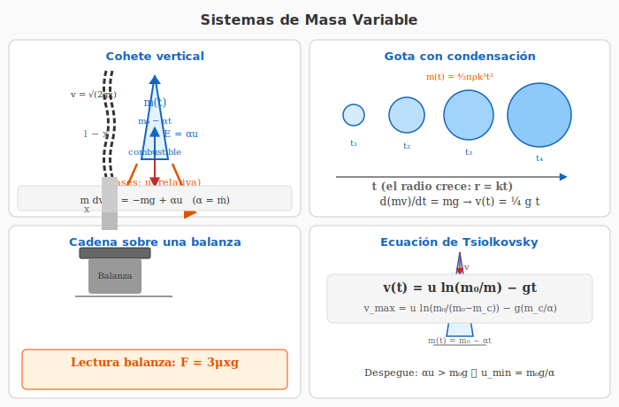

# 8. Sistemas de Masa Variable

## Introducción

Los **sistemas de masa variable** son aquellos en los que la masa del cuerpo cambia con el tiempo. Ejemplos típicos: cohetes (pierden masa al expulsar combustible), gotas de agua que se condensan (ganan masa), cadenas que se acumulan sobre una superficie.

La segunda ley de Newton en su forma más general es:

$$\boxed{\sum\vec{F}_{ext} = \frac{d\vec{p}}{dt} = \frac{d(m\vec{v})}{dt}}$$

Cuando la masa es constante: $\sum\vec{F} = m\vec{a}$.
Cuando la masa varía: hay que derivar el producto $m\vec{v}$.

---

## Diagrama — Sistemas de Masa Variable

*Figura 1: Izquierda superior: cohete vertical con empuje $E = \alpha u$ y peso $mg$. Derecha superior: gota que crece por condensación ($r = kt$). Izquierda inferior: cadena cayendo sobre una balanza. Derecha inferior: ecuación de Tsiolkovsky.*

---

## Ecuación General de un Sistema de Masa Variable

### Derivación

Consideremos un sistema que **expulsa** (o **incorpora**) masa a una tasa $\dot{m} = dm/dt$ con una velocidad relativa $\vec{u}$ respecto al cuerpo principal.

$$m\frac{d\vec{v}}{dt} = \sum\vec{F}_{ext} + \dot{m}\,\vec{u}$$

Los signos:
- **Expulsión** (cohete): $\dot{m} < 0$ (la masa disminuye), la fuerza de empuje es $|\dot{m}|\vec{u}$ en dirección opuesta a $\vec{u}$
- **Incorporación** (gota que se condensa): $\dot{m} > 0$ (la masa aumenta), la fuerza es $\dot{m}\vec{u}$

### Explicación intuitiva

La variación de momento lineal del sistema es:

$$\frac{d\vec{p}}{dt} = \frac{d}{dt}(m\vec{v}) = \dot{m}\vec{v} + m\vec{a}$$

Pero además, la masa expulsada/incorporada lleva su propio momento. Considerando el sistema completo (cuerpo + masa expulsada), la ecuación correcta resulta:

$$\boxed{m(t)\frac{d\vec{v}}{dt} = \sum\vec{F}_{ext} + \dot{m}\,\vec{u}}$$

donde $\vec{u}$ es la velocidad de la masa expulsada/incorporada **relativa al cuerpo**.

---

## Cohete en Ausencia de Gravedad

### Ecuación del cohete (Ecuación de Tsiolkovsky)

Si no hay fuerzas externas ($\sum\vec{F}_{ext} = 0$):

$$m\frac{dv}{dt} = -\dot{m}u$$

donde $u$ es la velocidad de expulsión de los gases (positiva, en dirección opuesta al movimiento del cohete), y $\dot{m} > 0$ es la tasa de expulsión de masa (en valor absoluto).

Reordenando:

$$dv = -u\frac{dm}{m}$$

Integrando desde $t = 0$ (masa $m_0$, velocidad $v_0$) hasta $t$ (masa $m(t)$, velocidad $v(t)$):

$$\int_{v_0}^{v(t)} dv = -u\int_{m_0}^{m(t)}\frac{dm}{m}$$

$$\boxed{v(t) = v_0 + u\ln\frac{m_0}{m(t)}}$$

### Características importantes
- La velocidad final **no depende** de la tasa de expulsión $\dot{m}$, solo de la **velocidad de expulsión** $u$ y de la **razón de masas** $m_0/m(t)$.
- El logaritmo natural significa que se necesita una gran fracción de combustible para alcanzar altas velocidades.

---

## Cohete Vertical con Gravedad (Ejercicios 15 y 16)

### Ecuación de movimiento

Incluyendo el peso como fuerza externa:

$$m(t)\frac{dv}{dt} = -m(t)g + \dot{m}u$$

donde el signo $+$ en $\dot{m}u$ es porque los gases se expulsan hacia abajo ($\vec{u}$ hacia abajo) y el empuje es hacia arriba.

### Masa en función del tiempo

Para una tasa de expulsión constante $\dot{m} = \alpha$:

$$m(t) = m_0 - \alpha t$$

### Condición de despegue

El cohete despega cuando el **empuje** supera al peso:

$$\alpha u > m_0g$$

$$\boxed{u > \frac{m_0g}{\alpha}}$$

Esta es la **velocidad mínima de expulsión** para que el cohete pueda despegar (Ejercicio 15a).

### Velocidad durante el vuelo

Sustituyendo $m(t) = m_0 - \alpha t$ en la ecuación del cohete:

$$(m_0 - \alpha t)\frac{dv}{dt} = -(m_0 - \alpha t)g + \alpha u$$

Separando variables e integrando (con $v_0 = 0$):

$$dv = \left(-g + \frac{\alpha u}{m_0 - \alpha t}\right)dt$$

$$v(t) = -gt + u\ln\frac{m_0}{m_0 - \alpha t}$$

$$\boxed{v(t) = u\ln\frac{m_0}{m_0 - \alpha t} - gt}$$

### Velocidad al agotar combustible (Ejercicio 16)

Si el combustible total es $m_c$, se agota en $t_c = m_c/\alpha$. La velocidad en ese instante:

$$\boxed{v_{max} = u\ln\frac{m_0}{m_0 - m_c} - g\frac{m_c}{\alpha}}$$

---

## Gota con Condensación (Ejercicio 17)

### Planteamiento

Una gota de agua esférica cae por condensación. Su radio crece a ritmo constante:

$$\frac{dr}{dt} = k \quad\Longrightarrow\quad r(t) = kt$$

La masa de la gota (esférica, densidad $\rho$):

$$m(t) = \frac{4}{3}\pi\rho\,r(t)^3 = \frac{4}{3}\pi\rho\,k^3 t^3$$

### Ecuación diferencial del movimiento

La gota incorpora masa del vapor circundante. La velocidad relativa de la masa incorporada respecto a la gota es $\vec{u} = 0$ (el vapor está en reposo respecto al aire).

La ecuación de masa variable:

$$m\frac{dv}{dt} = mg + \dot{m}u = mg$$

(porque $u = 0$ cuando la masa incorporada está inicialmente en reposo)

Sin embargo, hay que considerar que la masa incorporada **no tenía momento** antes de unirse a la gota. La derivada del momento total:

$$\frac{dp}{dt} = \frac{d(mv)}{dt} = m\dot{v} + \dot{m}v = mg$$

$$m\dot{v} = mg - \dot{m}v$$

O equivalentemente:

$$\boxed{\frac{d}{dt}\left(\frac{4}{3}\pi\rho k^3 t^3\,v\right) = \frac{4}{3}\pi\rho k^3 t^3\,g}$$

### Solución para $v(t)$

La ecuación $\frac{d(mv)}{dt} = mg$ se integra directamente:

$$\int_0^{m(t)v(t)} d(mv) = \int_0^t m(t')g\,dt'$$

$$m(t)v(t) = g\int_0^t \frac{4}{3}\pi\rho k^3 t'^3\,dt' = \frac{4}{3}\pi\rho k^3 g\cdot\frac{t^4}{4}$$

$$m(t)v(t) = \frac{1}{3}\pi\rho k^3 g\,t^4$$

Como $m(t) = \frac{4}{3}\pi\rho k^3 t^3$:

$$\frac{4}{3}\pi\rho k^3 t^3 \cdot v(t) = \frac{1}{3}\pi\rho k^3 g\,t^4$$

$$\boxed{v(t) = \frac{g}{4}\,t}$$

**Interpretación:** La velocidad crece linealmente con el tiempo (como en caída libre), pero con una aceleración efectiva $g/4$ en lugar de $g$. La condensación constante hace que la aceleración sea menor porque hay que acelerar también la masa recién incorporada.

---

## Cadena sobre una Balanza (Ejercicio 18)

### Planteamiento

Una cadena de longitud $l$ y masa por unidad de longitud $\mu$ se deja caer sobre una balanza desde el reposo. Se busca la lectura de la balanza en función de la longitud $x$ de cadena que ya reposa sobre ella.

### Análisis

La balanza recibe dos contribuciones:
1. **Peso de la porción ya depositada:** $\mu x g$
2. **Impacto de la cadena que llega:** fuerza adicional por el cambio de momento

### Fuerza de impacto

Cuando un elemento $dm$ de cadena llega a la balanza con velocidad $v$, su momento cambia de $v\,dm$ a $0$ (se detiene). La fuerza adicional es:

$$F_{impacto} = \frac{dp}{dt} = v\frac{dm}{dt}$$

La cadena cae desde el reposo. La porción que aún no ha llegado a la balanza tiene longitud $l - x$ y su centro de masa ha caído una distancia relacionada.

La velocidad de caída de un eslabón cuando llega a la balanza se obtiene de conservación de energía. La porción que cae tiene masa $\mu(l - x)$ y su centro de masa desciende, pero un enfoque más directo es:

La cadena cae libremente. Cada eslabón cae una distancia $x$ (desde la altura inicial hasta la balanza) partiendo del reposo:

$$v = \sqrt{2gx}$$

La tasa a la que llega masa a la balanza:

$$\frac{dm}{dt} = \mu\frac{dx}{dt} = \mu v = \mu\sqrt{2gx}$$

### Fuerza total sobre la balanza

$$F = \underbrace{\mu x g}_{\text{peso}} + \underbrace{v\frac{dm}{dt}}_{\text{impacto}}$$

$$F = \mu x g + \sqrt{2gx} \cdot \mu\sqrt{2gx}$$

$$F = \mu x g + \mu \cdot 2gx$$

$$\boxed{F = 3\mu x g}$$

**Interpretación:** La lectura de la balanza es **el triple** del peso de la porción ya depositada. Una parte ($\mu x g$) es el peso estático, y el doble ($2\mu x g$) proviene del impacto de la cadena que llega.

---

## Resumen de Estrategias

| Sistema | $\dot{m}$ | $\vec{u}$ | Ecuación clave |
|---|---|---|---|
| Cohete (gravedad) | $-\alpha$ (expulsa) | $u$ hacia abajo | $m\dot{v} = -mg + \alpha u$ |
| Cohete (sin gravedad) | $-\alpha$ | $u$ | $v = u\ln(m_0/m)$ |
| Gota (condensación) | $> 0$ (incorpora) | $u = 0$ | $d(mv)/dt = mg$ |
| Cadena (acumulación) | $> 0$ | $u = -v$ (relativa) | $F = \dot{p} = \mu x g + v\dot{m}$ |

### Pasos generales para resolver problemas de masa variable

1. **Identificar** si el sistema gana o pierde masa.
2. **Determinar** la tasa $\dot{m}$ y la velocidad relativa $\vec{u}$.
3. **Escribir** $m(t)$ en función del tiempo.
4. **Aplicar** $m\dot{v} = \sum F_{ext} + \dot{m}\vec{u}$ (o equivalentemente $\frac{d(mv)}{dt} = \sum F_{ext}$).
5. **Integrar** con condiciones iniciales.

---

*Este es el último tema de la Unidad 2 — Dinámica.*