# TP2 – Dinámica: Soluciones

**INSPT – UTN** | **Física Teórica I** | **Prof. Carlos Dibarbora**

---

## ⚖️ Bloque 1 — Leyes de Newton e Interacciones

---

## Ejercicio 1 — Pares de interacción: Tierra, caja y mesa

### Enunciado

Analizar todos los pares de interacción en el sistema constituido por la Tierra y una caja colocada en reposo sobre una mesa.

---

### Diagrama del sistema

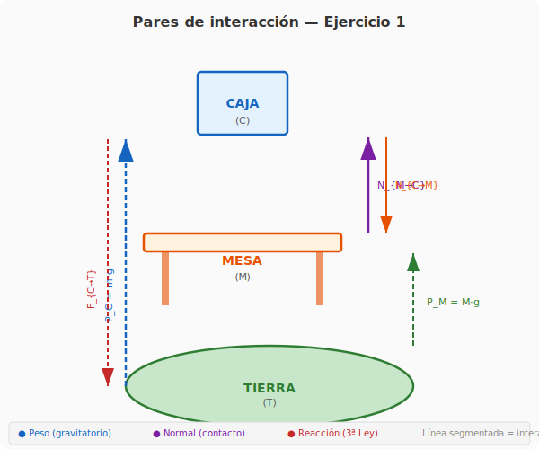

*Figura: Representación de los tres cuerpos del sistema (Tierra, Caja, Mesa) y sus pares de interacción. Las flechas segmentadas indican interacciones gravitatorias a distancia. Las flechas sólidas indican fuerzas de contacto (normales). Cada par acción-reacción se distingue por colores.*

---

### 1. Identificación de los cuerpos

El sistema está compuesto por tres cuerpos:

| Cuerpo | Símbolo | Descripción |
|---|---|---|
| **Tierra** | $T$ | Genera atracción gravitatoria sobre todos los cuerpos |
| **Caja** | $C$ | Apoyada sobre la mesa, en reposo |
| **Mesa** | $M$ | Sostiene la caja, apoyada en el piso (Tierra) |

---

### 2. Pares de interacción

Para cada par de cuerpos, preguntamos si existe una fuerza mutua. Encontramos **tres pares de interacción**:

#### Par 1 — Interacción gravitatoria Tierra–Caja

| Fuerza | Sobre | Ejercida por | Expresión |
|---|---|---|---|
| $\vec{P}_C$ (peso de la caja) | Caja ($C$) | Tierra ($T$) | $m_C\,\vec{g}$ |
| $\vec{F}_{C\to T}$ | Tierra ($T$) | Caja ($C$) | $-m_C\,\vec{g}$ |

$$\boxed{\vec{P}_C = -\vec{F}_{C\to T}}$$

- **Naturaleza:** Gravitatoria (acción a distancia).
- La Tierra atrae a la caja con su peso, y la caja atrae a la Tierra con igual fuerza en sentido opuesto.
- Dado que $M_T \gg m_C$, la aceleración de la Tierra es imperceptible ($\vec{a}_T = \vec{F}_{C\to T} / M_T \approx 0$), pero la fuerza existe.

#### Par 2 — Interacción gravitatoria Tierra–Mesa

| Fuerza | Sobre | Ejercida por | Expresión |
|---|---|---|---|
| $\vec{P}_M$ (peso de la mesa) | Mesa ($M$) | Tierra ($T$) | $m_M\,\vec{g}$ |
| $\vec{F}_{M\to T}$ | Tierra ($T$) | Mesa ($M$) | $-m_M\,\vec{g}$ |

$$\boxed{\vec{P}_M = -\vec{F}_{M\to T}}$$

- **Naturaleza:** Gravitatoria.
- Análogo al caso anterior: la Mesa y la Tierra se atraen mutuamente.

#### Par 3 — Interacción de contacto Mesa–Caja

| Fuerza | Sobre | Ejercida por | Expresión |
|---|---|---|---|
| $\vec{N}_{M\to C}$ (normal) | Caja ($C$) | Mesa ($M$) | $\perp$ superficie de contacto |
| $\vec{N}_{C\to M}$ (normal) | Mesa ($M$) | Caja ($C$) | $\perp$ superficie de contacto, opuesta |

$$\boxed{\vec{N}_{M\to C} = -\vec{N}_{C\to M}}$$

- **Naturaleza:** Electromagnética de contacto (fuerzas normales entre superficies).
- La mesa empuja a la caja hacia arriba (evitando que la atraviese), y la caja empuja a la mesa hacia abajo con igual módulo.

---

### 3. Aclaración conceptual importante

> ⚠️ **El peso de la caja ($\vec{P}_C$) y la normal de la mesa sobre la caja ($\vec{N}_{M\to C}$) NO son un par acción-reacción.**

¿Por qué?

- **Actúan sobre el mismo cuerpo**: ambas fuerzas se aplican sobre la **caja**.
- La 3ª Ley de Newton relaciona fuerzas que actúan sobre **cuerpos distintos**.
- $\vec{P}_C$ y $\vec{N}_{M\to C}$ son dos fuerzas diferentes que **se equilibran** (la caja está en reposo, $\sum \vec{F} = 0$), pero no forman un par acción-reacción.

El par acción-reacción del peso de la caja es la fuerza gravitatoria que la caja ejerce sobre la Tierra ($\vec{F}_{C\to T}$). El par acción-reacción de la normal sobre la caja es la normal que la caja ejerce sobre la mesa ($\vec{N}_{C\to M}$).

---

### 4. Resumen: tabla completa de pares de interacción

| Par | Fuerza 1 (acción) | Fuerza 2 (reacción) | Tipo |
|---|---|---|---|
| Tierra–Caja | $m_C\vec{g}$ sobre la caja | $-m_C\vec{g}$ sobre la Tierra | Gravitatorio |
| Tierra–Mesa | $m_M\vec{g}$ sobre la mesa | $-m_M\vec{g}$ sobre la Tierra | Gravitatorio |
| Mesa–Caja | $\vec{N}_{M\to C}$ sobre la caja | $\vec{N}_{C\to M}$ sobre la mesa | Contacto (normal) |

---

### 5. Visualización del sistema

El diagrama completo puede verse arriba en la figura SVG. Allí se representan:

- **Caja (azul)** apoyada sobre la **Mesa (naranja)**, que a su vez descansa sobre la **Tierra (verde)**.
- **Peso de la caja** $m\vec{g}$ (azul, segmentada): Tierra → Caja.
- **Reacción gravitatoria** $\vec{F}_{C\to T}$ (roja, segmentada): Caja → Tierra.
- **Peso de la mesa** $M\vec{g}$ (verde, segmentada): Tierra → Mesa.
- **Normal de la mesa sobre la caja** $\vec{N}_{M\to C}$ (púrpura): Mesa → Caja.
- **Normal de la caja sobre la mesa** $\vec{N}_{C\to M}$ (naranja): Caja → Mesa.

---

## Ejercicio 2 — Rozamiento cinético y 3ª Ley

### Enunciado

Analizar desde el punto de vista del principio de interacción el rozamiento cinético entre un cuerpo cúbico que se mueve horizontalmente y el piso sobre el que se desliza.

---

### Diagrama del sistema

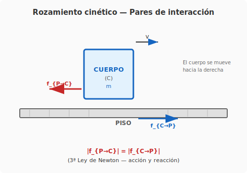

*Figura: Cuerpo cúbico de masa $m$ deslizándose horizontalmente con velocidad $\vec{v}$. El piso ejerce una fuerza de rozamiento $\vec{f}_{P\to C}$ sobre el cuerpo (opuesta al movimiento). Por 3ª Ley, el cuerpo ejerce una fuerza $\vec{f}_{C\to P}$ sobre el piso, de igual módulo y sentido opuesto.*

---

### 1. Identificación de los cuerpos

| Cuerpo | Símbolo | Descripción |
|---|---|---|
| **Cuerpo cúbico** | $C$ | Se desliza horizontalmente con velocidad $\vec{v}$ |
| **Piso** | $P$ | Superficie sobre la que se desliza el cuerpo |

---

### 2. Naturaleza de la fuerza de rozamiento

El rozamiento cinético es una **fuerza de contacto** de origen electromagnético entre las superficies del cuerpo y el piso. A nivel microscópico, las irregularidades de ambas superficies interactúan, generando una fuerza que se opone al movimiento relativo.

**Rozamiento cinético (módulo):**

$$f_c = \mu_c \, N$$

donde:
- $\mu_c$ es el coeficiente de rozamiento cinético (depende de los materiales)
- $N$ es el módulo de la fuerza normal entre el cuerpo y el piso

---

### 3. El par acción-reacción

Por la **3ª Ley de Newton**, existe un par de interacción:

| Fuerza | Sobre | Ejercida por | Dirección | Expresión (módulo) |
|---|---|---|---|---|
| $\vec{f}_{P\to C}$ | Cuerpo ($C$) | Piso ($P$) | Opuesta a $\vec{v}$ | $f_c = \mu_c N$ |
| $\vec{f}_{C\to P}$ | Piso ($P$) | Cuerpo ($C$) | Misma dirección que $\vec{v}$ | $f_c = \mu_c N$ |

$$
\boxed{\vec{f}_{P\to C} = -\vec{f}_{C\to P}}
$$

**Puntos clave:**
- Ambas fuerzas tienen el **mismo módulo** $f_c = \mu_c N$.
- Actúan sobre **cuerpos diferentes** (una sobre el cuerpo, otra sobre el piso).
- Tienen la **misma naturaleza** (ambas son de contacto/electromagnéticas).
- Son **simultáneas** (existen al mismo tiempo).

---

### 4. Análisis del movimiento del cuerpo

Sobre el cuerpo actúa **horizontalmente** únicamente la fuerza de rozamiento del piso $\vec{f}_{P\to C}$ (suponiendo que no hay otras fuerzas horizontales aplicadas).

Por la **2ª Ley de Newton**:

$$
\sum \vec{F} = m\vec{a} \quad\Longrightarrow\quad -\vec{f}_{P\to C} = m\vec{a}
$$

En módulo, tomando la dirección de movimiento como positiva:

$$
-f_c = m a \quad\Longrightarrow\quad a = -\frac{f_c}{m} = -\frac{\mu_c N}{m}
$$

La aceleración es **negativa** (opuesta a la velocidad), por lo que el cuerpo **frena** uniformemente si $\mu_c$ y $N$ son constantes.

---

### 5. Lo que NO es un par acción-reacción

> ⚠️ El peso del cuerpo ($m\vec{g}$) y la normal del piso ($\vec{N}_{P\to C}$) **NO** son un par acción-reacción, aunque se equilibren verticalmente.

- Actúan ambas sobre el **mismo cuerpo**.
- Sus pares acción-reacción respectivos son:
  - $\vec{P} = m\vec{g}$ (Tierra → Cuerpo) ↔ $\vec{F}_{C\to T}$ (Cuerpo → Tierra) — gravitatorio
  - $\vec{N}_{P\to C}$ (Piso → Cuerpo) ↔ $\vec{N}_{C\to P}$ (Cuerpo → Piso) — contacto

---

### 6. Resumen

| Par | Fuerza 1 (acción) | Fuerza 2 (reacción) | Tipo |
|---|---|---|---|
| Piso–Cuerpo (roz.) | $\vec{f}_{P\to C}$ sobre el cuerpo | $\vec{f}_{C\to P}$ sobre el piso | Contacto (rozamiento) |
| Tierra–Cuerpo (peso) | $m\vec{g}$ sobre el cuerpo | $-m\vec{g}$ sobre la Tierra | Gravitatorio |
| Piso–Cuerpo (normal) | $\vec{N}_{P\to C}$ sobre el cuerpo | $\vec{N}_{C\to P}$ sobre el piso | Contacto (normal) |

---

## Ejercicio 3 — Bloques apilados con polea fija: enfoque lagrangiano

### Enunciado

En el sistema de la figura, las masas de los cuerpos son: $m_1 = 5$ kg, $m_2 = 15$ kg y $m_3 = 10$ kg. El sistema se está moviendo con velocidad constante de $2$ m/s de tal manera que el cuerpo de masa $m_3$ desciende. Calcular en cuánto se deberá incrementar la masa del cuerpo 3 para que comience a descender con una aceleración de módulo $2$ m/s². ¿Cuánto vale en ese caso la fuerza ejercida por la soga que se supone inextensible y de masa despreciable lo mismo que la polea?

---

### Diagrama del sistema

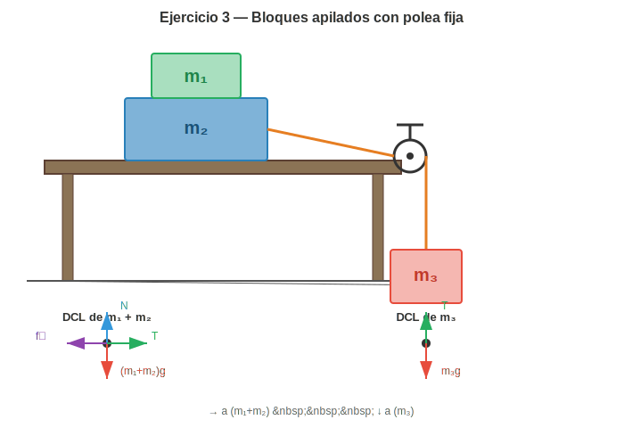

*Figura: Bloque $m_1$ apoyado sobre $m_2$ (sobre superficie horizontal). Una cuerda conecta $m_2$ con $m_3$ colgante a través de una polea fija en el borde de la mesa.*

---

### 1. Datos y coordenadas generalizadas

| Variable | Valor |
|---|---|
| $m_1$ | $5$ kg |
| $m_2$ | $15$ kg |
| $m_3$ | $10$ kg |
| $v_0$ | $2$ m/s (constante, $\ddot{q} = 0$ inicialmente) |
| $\ddot{q}$ (deseada) | $2$ m/s² |
| $g$ | $9,8$ m/s² |

Definimos una **coordenada generalizada** $q(t)$ que describe el desplazamiento del sistema:
- $q > 0$: $m_3$ desciende, $m_1 + m_2$ se desplazan hacia la derecha
- $\dot{q} = v$, $\ddot{q} = a$

---

### 2. Lagrangiano del sistema

La energía cinética total es:
$$T = \frac{1}{2}(m_1 + m_2)\dot{q}^2 + \frac{1}{2}m_3\dot{q}^2 = \frac{1}{2}(m_1 + m_2 + m_3)\dot{q}^2$$

La energía potencial gravitatoria (tomando $q = 0$ como referencia):
$$V = -m_3 g q$$

El **lagrangiano** es:
$$\mathcal{L}(q, \dot{q}) = T - V = \frac{1}{2}(m_1 + m_2 + m_3)\dot{q}^2 + m_3 g q$$

---

### 3. Ecuación de Euler-Lagrange con rozamiento

El rozamiento cinético es una fuerza no conservativa. La fuerza generalizada asociada es:
$$Q_{\text{nc}} = -f_k = -\mu_k(m_1 + m_2)g$$

La ecuación de Euler-Lagrange con fuerzas no conservativas:
$$\frac{d}{dt}\left(\frac{\partial \mathcal{L}}{\partial \dot{q}}\right) - \frac{\partial \mathcal{L}}{\partial q} = Q_{\text{nc}}$$

Calculamos:
$$\frac{\partial \mathcal{L}}{\partial \dot{q}} = (m_1 + m_2 + m_3)\dot{q}$$
$$\frac{d}{dt}\left(\frac{\partial \mathcal{L}}{\partial \dot{q}}\right) = (m_1 + m_2 + m_3)\ddot{q}$$
$$\frac{\partial \mathcal{L}}{\partial q} = m_3 g$$

Sustituyendo:
$$(m_1 + m_2 + m_3)\ddot{q} - m_3 g = -\mu_k(m_1 + m_2)g$$

$$\boxed{(m_1 + m_2 + m_3)\ddot{q} = m_3 g - \mu_k(m_1 + m_2)g}$$

---

### 4. Determinación de $\mu_k$ (estado inicial: $\ddot{q} = 0$)

Con $\ddot{q} = 0$ y $m_3 = 10$ kg:
$$0 = m_3 g - \mu_k(m_1 + m_2)g$$
$$\mu_k = \frac{m_3}{m_1 + m_2} = \frac{10}{20} = 0,5$$

---

### 5. Masa $m_3'$ para $\ddot{q} = 2$ m/s²

Sea $m_3' = m_3 + \Delta m$. La ecuación de movimiento con la nueva masa:
$$(m_1 + m_2 + m_3')\ddot{q} = m_3' g - \mu_k(m_1 + m_2)g$$

Sustituyendo $\ddot{q} = 2$ m/s², $\mu_k = 0,5$, $m_1 + m_2 = 20$ kg:
$$(20 + m_3') \cdot 2 = m_3' \cdot 9,8 - 0,5 \cdot 20 \cdot 9,8$$
$$40 + 2m_3' = 9,8m_3' - 98$$
$$138 = 7,8m_3'$$
$$m_3' = \frac{138}{7,8} \approx 17,69 \text{ kg}$$

$$\boxed{\Delta m = m_3' - m_3 \approx 7,69 \text{ kg}}$$

---

### 6. Tensión en la cuerda (fuerza de vínculo)

La tensión $T$ es la **fuerza de vínculo** que mantiene la ligadura de la cuerda inextensible. Podemos obtenerla aplicando Euler-Lagrange a cada subsistema por separado, o más directamente, de la ecuación del bloque horizontal:

$$T - f_k = (m_1 + m_2)\ddot{q}$$
$$T = (m_1 + m_2)\ddot{q} + \mu_k(m_1 + m_2)g = 20 \cdot 2 + 98 = 138 \text{ N}$$

Verificación desde el bloque colgante:
$$m_3' g - T = m_3' \ddot{q} \quad\Longrightarrow\quad T = m_3'(g - \ddot{q}) = 17,69 \cdot 7,8 \approx 138 \text{ N} \quad\checkmark$$

---

### 7. Resultados finales

| Magnitud | Valor |
|---|---|
| **Coeficiente de rozamiento $\mu_k$** | **$0,5$** |
| **Incremento de masa $\Delta m$** | **$\approx 7,69$ kg** |
| Masa final $m_3'$ | $\approx 17,69$ kg |
| **Tensión $T$** | **$138$ N** |
| Aceleración $\ddot{q}$ | $2$ m/s² |

---

### 8. Verificación

- Para $m_3'$: $m_3' g - T = 17,69 \cdot 9,8 - 138 = 35,36$ N, y $m_3' \ddot{q} = 17,69 \cdot 2 = 35,38$ N ✓
- Para $m_1 + m_2$: $T - f_k = 138 - 98 = 40$ N, y $(m_1 + m_2)\ddot{q} = 20 \cdot 2 = 40$ N ✓

---

## 🚄 Bloque 2 — Transformaciones de Galileo y Sistemas No Inerciales

## Ejercicio 4 — Transformaciones de Galileo y velocidad relativa

### Enunciado

Resolver, explicitando con cuidado cada uno de los sistemas de referencia utilizados, la siguiente situación. Dos trenes viajan por vías paralelas en sentidos opuestos con velocidades de módulos $60$ km/h y $80$ km/h respectivamente. Calcular la velocidad de uno de los trenes respecto del otro.

---

### Diagrama del sistema

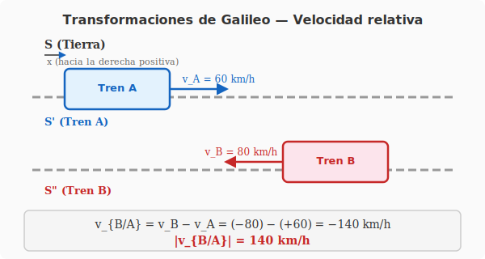

*Figura: Representación de los dos trenes moviéndose en sentidos opuestos sobre vías paralelas.*

---

### 1. Sistemas de referencia y coordenadas

Definimos tres sistemas de referencia inerciales:

| Sistema | Descripción | Origen | Velocidad respecto a $S$ |
|---|---|---|---|
| $S$ | Tierra (laboratorio) | Fijo en el suelo | $\vec{0}$ |
| $S'$ | Solidario al Tren A | Se mueve con el Tren A | $\vec{V}_A = +60\,\hat{\imath}$ km/h |
| $S''$ | Solidario al Tren B | Se mueve con el Tren B | $\vec{V}_B = -80\,\hat{\imath}$ km/h |

**Convención:** eje $x$ positivo en la dirección del Tren A.

---

### 2. Transformaciones de Galileo

Las **transformaciones de Galileo** relacionan las coordenadas de un evento $(t, \vec{r})$ en $S$ con $(t', \vec{r}\,')$ en $S'$ que se mueve con velocidad constante $\vec{V}$ respecto a $S$:

$$
\boxed{
\begin{aligned}
t' &= t \\
\vec{r}\,' &= \vec{r} - \vec{V}t
\end{aligned}
}
$$

Derivando respecto al tiempo (notando que $dt' = dt$):

$$\vec{v}\,' = \frac{d\vec{r}\,'}{dt'} = \frac{d\vec{r}}{dt} - \vec{V} = \vec{v} - \vec{V}$$

$$\boxed{\vec{v}\,' = \vec{v} - \vec{V}}$$

y para la aceleración:

$$\vec{a}\,' = \frac{d\vec{v}\,'}{dt'} = \frac{d\vec{v}}{dt} = \vec{a}$$

$$\boxed{\vec{a}\,' = \vec{a}}$$

La **aceleración es invariante** bajo transformaciones de Galileo.

---

### 3. Grupo de Galileo

Las transformaciones de Galileo forman un **grupo** (el grupo de Galileo $\mathcal{G}$). Cada elemento se parametriza por $(\vec{V}, \vec{a}, R, \tau)$ donde:
- $\vec{V}$: boost (velocidad relativa)
- $\vec{a}$: traslación espacial
- $R \in SO(3)$: rotación
- $\tau$: traslación temporal

Para nuestro caso (solo boosts en 1D), la composición de dos boosts $\vec{V}_1$ y $\vec{V}_2$ da:

$$\vec{V}_{\text{total}} = \vec{V}_1 + \vec{V}_2$$

La velocidad del Tren B respecto al Tren A corresponde al boost que lleva de $S'$ a $S''$:

$$\vec{V}_{B/A} = \vec{V}_B - \vec{V}_A = (-80) - (+60) = -140\,\hat{\imath} \text{ km/h}$$

$$\boxed{|\vec{v}_{B/A}| = 140 \text{ km/h}}$$

---

### 4. Invariancia de las leyes de Newton

La **primera ley de Newton** (principio de inercia) se cumple en todos los sistemas inerciales relacionados por transformaciones de Galileo, ya que $\vec{a}' = \vec{a}$.

La **segunda ley de Newton** $\vec{F} = m\vec{a}$ es **invariante de forma** (covariante) bajo el grupo de Galileo:
- La masa $m$ es un escalar invariante
- La fuerza $\vec{F}$ depende de posiciones y velocidades relativas, que se transforman consistentemente
- La aceleración $\vec{a}$ es invariante

Por lo tanto, si $\vec{F} = m\vec{a}$ en $S$, entonces $\vec{F}' = m\vec{a}'$ en $S'$.

---

### 5. Interpretación física

| Observador | Velocidad del Tren A | Velocidad del Tren B | Velocidad relativa |
|---|---|---|---|
| Tierra ($S$) | $+60$ km/h $\rightarrow$ | $-80$ km/h $\leftarrow$ | — |
| Tren A ($S'$) | $0$ (reposo) | $-140$ km/h $\leftarrow$ | **140 km/h** |
| Tren B ($S''$) | $+140$ km/h $\rightarrow$ | $0$ (reposo) | **140 km/h** |

---

### 6. Verificación

$$\vec{v}_{A/B} = \vec{v}_A - \vec{v}_B = (+60) - (-80) = +140\,\hat{\imath} \text{ km/h}$$

Se cumple la antisimetría esperada:

$$\boxed{\vec{v}_{A/B} = -\vec{v}_{B/A}}$$

---

### 7. Respuesta

$$\boxed{\text{La velocidad del Tren B respecto al Tren A es de } 140 \text{ km/h en sentido opuesto al Tren A}}$$

---

## Ejercicio 5 — Péndulo en vagón con aceleración constante

### Enunciado

> Calcular el ángulo que forma con la vertical un péndulo suspendido del techo de un vagón que se desplaza con respecto a las vías con un movimiento uniformemente acelerado con una aceleración cuyo módulo es $5$ m/s². Realizar el problema desde un sistema de referencia fijo a las vías y desde un sistema fijo al vagón.

---

### Diagrama del sistema

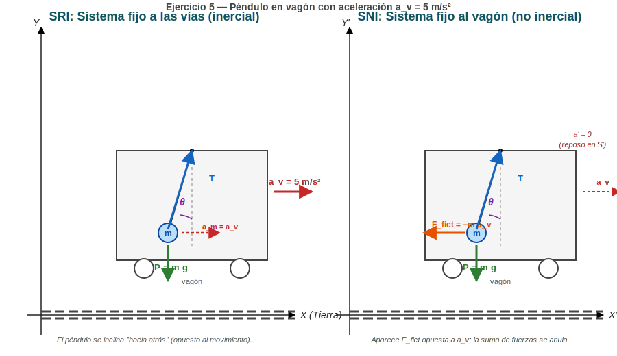

*Figura: Panel izquierdo: análisis desde el SRI (Tierra). Panel derecho: análisis desde el SNI (vagón), donde aparece la fuerza ficticia $\vec{F}_{\text{fict}} = -m\vec{a}_v$. En ambos casos el péndulo se inclina formando el mismo ángulo $\theta$ con la vertical, pero "hacia atrás" respecto al sentido de movimiento del vagón.*

---

### 1. Datos

| Magnitud | Valor |
|---|---|
| Aceleración del vagón $a_v$ | $5$ m/s² (horizontal, constante) |
| Masa del péndulo $m$ | $m$ (no se necesita su valor explícito) |
| Gravedad $g$ | $9{,}81$ m/s² |
| Ángulo con la vertical | $\theta$ (incógnita) |

**Hipótesis:** régimen permanente, el péndulo cuelga en una posición de equilibrio *relativo* formando un ángulo constante con la vertical del vagón (no hay oscilación).

---

### 2. Sistemas de referencia

| Sistema | Tipo | Descripción |
|---|---|---|
| $S$ (Tierra) | **Inercial** | Ejes fijos a las vías |
| $S'$ (vagón) | **No inercial** | Se traslada con $\vec{a}_v$ respecto a $S$ |

Las **transformaciones de Galileo** entre $S$ y $S'$ (traslación pura, sin rotación) son:

$$\vec{r}_P' = \vec{r}_P - \vec{r}_O'(t) \qquad\Rightarrow\qquad \vec{a}_P' = \vec{a}_P - \vec{a}_v$$

donde $\vec{a}_v$ es la aceleración del origen de $S'$ respecto a $S$.

---

## A. Resolución desde el SRI (Tierra)

### 3A. Planteo de la 2ª ley de Newton

En $S$ (inercial) la masa del péndulo **se mueve** con la misma aceleración que el vagón (en régimen permanente):

$$\vec{a}_P = \vec{a}_v = a_v\,\hat{\imath}$$

Las fuerzas reales que actúan sobre la masa son:

| Fuerza | Origen | Expresión |
|---|---|---|
| Peso | Tierra | $\vec{P} = -m\,g\,\hat{\jmath}$ |
| Tensión | Hilo (vínculo) | $\vec{T} = T(-\sin\theta\,\hat{\imath} - \cos\theta\,\hat{\jmath})$ |

> Nota: el hilo se inclina *hacia atrás* respecto a la vertical, con su extremo superior en el techo y la masa desplazada en $-\hat{\imath}$ (opuesto a $\vec{a}_v$). Por eso $\vec{T}$ tiene componentes $-\sin\theta$ en $x$ y $-\cos\theta$ en $y$.

Aplicando $\sum \vec{F} = m\vec{a}$ en componentes:

**Componente $x$ (horizontal):**
$$-T\sin\theta = m\,a_v$$

**Componente $y$ (vertical):**
$$-m\,g + T\cos\theta \cdot(\text{cota}) \;\;\Rightarrow\;\; T\cos\theta - m g = 0$$

Es decir:

$$
\begin{cases}
T \sin\theta = -m\,a_v & \text{(Ecuación 1)}\\[4pt]
T \cos\theta = m\,g & \text{(Ecuación 2)}
\end{cases}
$$

### 4A. Cálculo del ángulo

Dividiendo (1) entre (2):

$$\tan\theta = \frac{-a_v}{g}$$

El signo negativo indica que el péndulo se inclina en $-\hat{\imath}$ (opuesto a $\vec{a}_v$). El módulo del ángulo es:

$$\theta = \arctan\!\left(\frac{a_v}{g}\right) = \arctan\!\left(\frac{5}{9{,}81}\right) = \arctan(0{,}5097)$$

$$\boxed{\theta \approx 27{,}02^\circ \approx 27^\circ}$$

### 5A. Tensión de la cuerda

De (2):

$$T = \frac{m\,g}{\cos\theta} = \frac{m \cdot 9{,}81}{\cos 27{,}02^\circ} \approx 1{,}1006\,m\,g \approx 10{,}80\,m \;\text{[N]}$$

---

## B. Resolución desde el SNI (vagón)

### 3B. Planteo de la 2ª ley de Newton con fuerza ficticia

En $S'$ (vagón) la masa del péndulo está **en reposo relativo**, por lo que $\vec{a}_P' = \vec{0}$.

La segunda ley **en el SNI** se escribe:

$$\sum \vec{F} + \vec{F}_{\text{fict}} = m\,\vec{a}_P' = \vec{0}$$

donde la **fuerza ficticia** es:

$$\boxed{\vec{F}_{\text{fict}} = -m\,\vec{a}_v}$$

Su módulo es $m\,a_v$ y su dirección es **opuesta** a la aceleración del vagón ($-\hat{\imath}$).

> En $S'$ la masa está en equilibrio bajo tres fuerzas: $\vec{T}$, $m\vec{g}$ y $\vec{F}_{\text{fict}}$. Las tres concurren en el mismo punto y se anulan vectorialmente.

### 4B. Ecuaciones de equilibrio

**Componente $x'$ (horizontal):**
$$-T\sin\theta + (-m\,a_v) = 0 \quad\Rightarrow\quad T\sin\theta = -m\,a_v$$

**Componente $y'$ (vertical):**
$$-T\cos\theta - m\,g = 0 \quad\Rightarrow\quad T\cos\theta = m\,g$$

> ⚠️ **Signo de la tensión.** En el SNI, la tensión tiene la misma dirección que en el SRI (a lo largo del hilo), así que sus componentes son idénticas: $T_x = -T\sin\theta$, $T_y = -T\cos\theta$. Lo que cambia es la presencia de $\vec{F}_{\text{fict}}$ en la ecuación.

### 5B. Cálculo del ángulo

Dividiendo ambas ecuaciones:

$$\tan\theta = \frac{-a_v}{g} \quad\Longrightarrow\quad \theta = \arctan\!\left(\frac{a_v}{g}\right) = \arctan\!\left(\frac{5}{9{,}81}\right)$$

$$\boxed{\theta \approx 27^\circ}$$

### 6B. Tensión de la cuerda

Idéntico al caso SRI:

$$T = \frac{m\,g}{\cos\theta} \approx 10{,}80\,m \;\text{[N]}$$

---

### 7. Comparación de ambos enfoques

| Aspecto | SRI (Tierra) | SNI (vagón) |
|---|---|---|
| Aceleración de la masa | $\vec{a}_P = a_v\,\hat{\imath}$ | $\vec{a}_P' = \vec{0}$ |
| Fuerzas reales | $\vec{T}$, $m\vec{g}$ | $\vec{T}$, $m\vec{g}$ |
| Fuerza ficticia | — (no existe) | $\vec{F}_{\text{fict}} = -m\,\vec{a}_v$ |
| Ecuación vectorial | $\sum\vec{F} = m\vec{a}_P$ | $\sum\vec{F} + \vec{F}_{\text{fict}} = \vec{0}$ |
| Sistema de ecuaciones | Idéntico al SNI | Idéntico al SRI |
| Resultado $\theta$ | $\arctan(a_v/g) \approx 27°$ | $\arctan(a_v/g) \approx 27°$ |
| Resultado $T$ | $mg/\cos\theta$ | $mg/\cos\theta$ |

> 💡 **Conclusión clave.** Ambos sistemas de referencia producen las **mismas ecuaciones escalares** y, por tanto, el mismo resultado. La diferencia es puramente interpretativa: en el SRI la masa *se acelera* bajo la acción de $\vec{T}$ y $m\vec{g}$; en el SNI la masa *está en equilibrio* gracias a que sumamos la fuerza ficticia $-m\vec{a}_v$.

---

### 8. Verificación numérica y caso límite

$$g = 9{,}81 \text{ m/s}^2, \quad a_v = 5 \text{ m/s}^2$$

| Cantidad | Valor |
|---|---|
| $\tan\theta$ | $5/9{,}81 = 0{,}5097$ |
| $\theta$ | $\arctan(0{,}5097) \approx 27{,}02°$ |
| $\sin\theta$ | $0{,}4540$ |
| $\cos\theta$ | $0{,}8910$ |
| $T$ (en unidades de $mg$) | $1/\cos\theta \approx 1{,}1224\;mg$ |

**Casos límite:**

- Si $a_v \to 0$: $\tan\theta \to 0$, $\theta \to 0$ → péndulo vertical (acorde a 1ª ley).
- Si $a_v \to \infty$: $\theta \to 90°$ → péndulo horizontal.
- Si $a_v = g$: $\theta = 45°$.

---

### 9. Respuesta final

$$\boxed{\theta = \arctan\!\left(\frac{a_v}{g}\right) = \arctan\!\left(\frac{5}{9{,}81}\right) \approx 27^\circ}$$

El péndulo se inclina formando aproximadamente **27° con la vertical**, en sentido **opuesto** al de la aceleración del vagón (es decir, "hacia atrás" respecto al movimiento). La tensión en el hilo vale $T = mg/\cos\theta \approx 1{,}10\;mg$.

---
---

## Ejercicio 6 — Cuerpo que se desplaza hacia el borde de una centrifugadora

### Enunciado

> Un cuerpo que se encuentra a una distancia igual a la mitad del radio del tambor de una centrifugadora que gira con velocidad angular constante se desplaza hacia el borde del mismo. Explicar las causas de ese movimiento desde un sistema de referencia exterior a la centrifugadora y desde un sistema unido a la misma.

---

### Diagrama del sistema

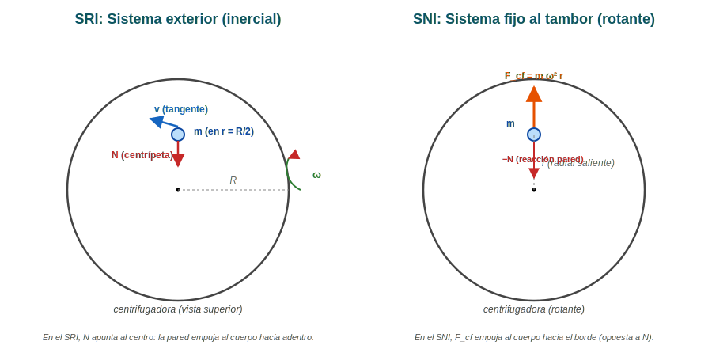

*Figura: Vista superior del tambor de la centrifugadora. Panel izquierdo: SRI. Panel derecho: SNI rotante. En ambos casos la partícula, que parte en $r = R/2$, migra al borde $r = R$.*

---

### 1. Datos y sistema

- Tambor cilíndrico de radio $R$ que gira con velocidad angular constante $\vec{\omega}$ alrededor de su eje vertical.
- El cuerpo (masa $m$) parte en reposo respecto al tambor, a una distancia $r_0 = R/2$ del eje.
- No hay rozamiento explícito: el cuerpo puede deslizar radialmente sobre el piso del tambor.

---

### 2. Sistemas de referencia

| Sistema | Tipo | Descripción |
|---|---|---|
| $S$ (laboratorio) | **Inercial** | Ejes fijos a la Tierra (exterior al tambor) |
| $S'$ (tambor) | **No inercial rotante** | Ejes solidarios al tambor, rotando con $\vec{\omega}$ |

---

## A. Explicación desde el SRI (sistema inercial exterior)

### 3A. Análisis físico

En el SRI el tambor **gira** pero la partícula **no** (parte en reposo respecto al tambor y solo tiene movimiento radial). Mientras la partícula no toque la pared del tambor, **no hay fuerza de contacto** entre ellos. Las únicas fuerzas reales sobre el cuerpo son las que actúan verticalmente (peso y normal del piso) que se cancelan en el plano horizontal.

Entonces, en el plano horizontal, en $S$:

$$\sum \vec{F}_{\text{horizontales}} = \vec{0} \quad\Longrightarrow\quad \vec{a}_{\text{horizontal}} = \vec{0}$$

### 4A. ¿Por qué el cuerpo se desplaza hacia el borde?

Es la **pared del tambor** la que se mueve: como el tambor gira con $\omega$ constante, su pared interior *pasa por debajo* del cuerpo en reposo. Al cabo de un instante $dt$, la pared se ha desplazado angularmente $d\phi = \omega\,dt$ y la posición del cuerpo respecto a ejes fijos se ha mantenido. En consecuencia, **la distancia entre el cuerpo y la pared disminuye**: el cuerpo "ve" que la pared se le viene encima.

> 💡 **En el SRI la partícula no se mueve circularmente porque no tiene velocidad inicial.** Lo que gira es la pared del tambor. La "migración al borde" es un efecto geométrico: la pared se mueve, el cuerpo se queda, y por eso la distancia radial entre ambos se reduce hasta $0$ (cuando el cuerpo toca la pared).

### 5A. Una vez en contacto con la pared

Al tocar la pared, aparece una **fuerza normal** $\vec{N}$ perpendicular a la superficie (radial, apuntando hacia el centro). Esta fuerza se vuelve la **fuerza centrípeta** que mantiene al cuerpo girando solidario al tambor:

$$N = m\,\omega^2 r$$

En $r = R$:

$$\boxed{N = m\,\omega^2 R}$$

La fuerza centrípeta es **real** (de contacto) y existe en el SRI.

---

## B. Explicación desde el SNI (sistema del tambor)

### 3B. Análisis físico

En el SNI rotante con $\vec{\omega}$ constante, la segunda ley se escribe:

$$m\vec{a}\,' = \sum\vec{F} + \underbrace{m\,\omega^2 r\,\hat{e}_r}_{\text{centrífuga}} - \underbrace{2m\,\vec{\omega} \times \vec{v}\,'}_{\text{Coriolis}}$$

Mientras el cuerpo no toca la pared, $\sum\vec{F} = \vec{0}$ (peso y normal del piso se cancelan en el plano). Como el cuerpo parte en reposo en $S'$, su velocidad relativa $\vec{v}\,' = \vec{0}$, por lo que **Coriolis se anula**. Solo queda la centrífuga:

$$\vec{F}_{cf} = m\,\omega^2 r\,\hat{e}_r \quad\text{(radial saliente)}$$

### 4B. Migración al borde

La fuerza centrífuga, dirigida hacia **afuera**, acelera radialmente al cuerpo:

$$m\,\ddot{r} = m\,\omega^2 r \quad\Longrightarrow\quad \ddot{r} = \omega^2 r$$

Esta es una EDO lineal con solución exponencial creciente:

$$r(t) = r_0\,\cosh(\omega t) = \frac{R}{2}\,\cosh(\omega t)$$

El cuerpo, partiendo de $r_0 = R/2$, migra radialmente hacia afuera y eventualmente llega al borde.

### 5B. En el borde

Al tocar la pared, aparece la fuerza normal de contacto (apuntando hacia el centro, $-\hat{e}_r$) y el sistema alcanza un nuevo equilibrio relativo:

$$-N + m\,\omega^2 R = 0 \quad\Longrightarrow\quad N = m\,\omega^2 R$$

(El cuerpo deja de acelerar radialmente y se mueve solidariamente con el tambor.)

---

### 6. Tabla comparativa

| Aspecto | SRI (exterior) | SNI (tambor rotante) |
|---|---|---|
| ¿Qué gira? | El tambor | El marco de referencia |
| ¿Qué se mueve? | El cuerpo está casi en reposo horizontal | El cuerpo migra radialmente al borde |
| Fuerza real horizontal | Solo cuando toca la pared: $N$ centrípeta | Solo cuando toca la pared: $N$ centrípeta |
| Fuerza centrífuga | No existe | $m\omega^2 r$ radial saliente |
| Fuerza de Coriolis | No existe | 0 (porque $\vec{v}\,' = 0$ inicialmente) |
| Causa de la migración | La pared pasa por debajo del cuerpo | La centrífuga empuja al cuerpo hacia afuera |
| Valor de $N$ en el borde | $m\omega^2 R$ | $m\omega^2 R$ |

---

### 7. Conclusión

Las dos explicaciones describen el **mismo fenómeno físico** desde dos marcos equivalentes:

- En el **SRI**: la pared gira, el cuerpo está casi quieto, y se produce el contacto (la pared "alcanza" al cuerpo).
- En el **SNI**: el marco gira con el tambor, y la fuerza ficticia centrífuga empuja al cuerpo radialmente hacia afuera hasta tocar la pared.

Ambas explicaciones son correctas y complementarias. La elección de uno u otro sistema es por conveniencia, no por corrección. La fuerza centrípeta (real) en el SRI **es la misma fuerza** que la centrífuga (ficticia) en el SNI, vista desde marcos diferentes.

> ⚠️ **No confundir:** la centrípeta y la centrífuga NO coexisten en el mismo marco. En el SRI solo hay centrípeta. En el SNI solo hay centrífuga. La suma de las dos no es "una fuerza neta"; son descripciones equivalentes del mismo hecho físico.

---

## Ejercicio 7 — Caída libre con corrección de Coriolis (Tierra como SNI)

### Enunciado

> Adoptamos como sistema inercial de referencia a uno con origen en el centro de la Tierra, y un sistema de referencia móvil sobre la superficie terrestre con el eje $\hat{k}$ en la dirección radial, el eje $\hat{i}$ coincidiendo con un meridiano en sentido norte-sur y el eje $\hat{j}$ según paralelo con dirección hacia el este. Resolver las ecuaciones del movimiento y la ecuación horaria de un cuerpo que caiga en caída libre. (Podemos suponer en principio que la caída se da sobre el eje $\hat{k}$ o que la velocidad de caída solo tiene esa componente, para simplificar.)
>
> $$\text{Rta: } z = h - \frac{g\,t^2}{2}, \qquad y = \frac{\omega\,g\,t^3}{3}\cos\varphi$$

---

### Diagrama del sistema

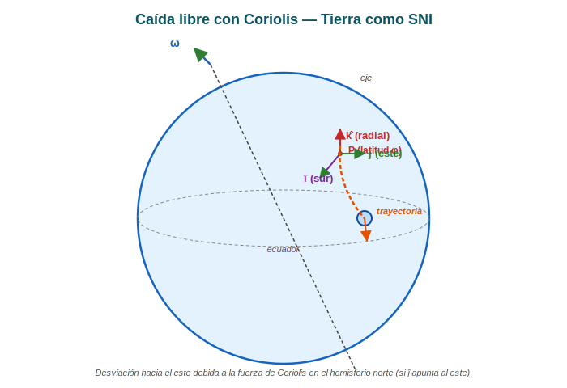

*Figura: Globo terráqueo esquemático con el sistema de referencia local en la superficie (latitud $\varphi$). El cuerpo parte del reposo a una altura $h$ sobre el eje local $\hat{k}$ (radial) y se desvía hacia el este ($\hat{j}$) por la acción de la fuerza de Coriolis.*

---

### 1. Sistemas de referencia

- **SRI:** origen en el centro de la Tierra, ejes "fijos respecto a las estrellas lejanas".
- **SRNI:** origen $O'$ sobre la superficie terrestre, con:
  - $\hat{k}$: dirección radial saliente (local "vertical")
  - $\hat{i}$: meridiano, sentido hacia el **sur**
  - $\hat{j}$: paralelo, sentido hacia el **este**

El SRNI rota con velocidad angular $\vec{\omega}$ respecto al SRI (rotación diaria de la Tierra). En componentes locales:

$$\vec{\omega} = \omega(\cos\varphi\,\hat{k} + \sin\varphi\,\hat{i})$$

donde $\varphi$ es la **latitud** (positiva en el hemisferio norte, con esta convención de $\hat{i}$ apuntando al sur).

> ⚠️ **Convención de signos.** Si $\hat{i}$ apunta al sur y $\varphi$ es la latitud norte, entonces $\vec{\omega}$ tiene componente $+\cos\varphi$ en $\hat{k}$ (radial) y $+\sin\varphi$ en $\hat{i}$ (hacia el sur, paralelo a la superficie). Esto es coherente con que el eje de rotación "atraviese" la Tierra de polo sur a polo norte, con $\vec{\omega}$ apuntando al norte. Al descomponer en la base local (sur, este, arriba), la componente hacia el sur es $+\sin\varphi$.

---

### 2. Segunda ley en el SNI rotante

$$m\vec{a}\,' = m\vec{g}_{\text{local}} - 2m\,\vec{\omega} \times \vec{v}\,'$$

donde despreciamos el término centrífugo (proporcional a $\omega^2 r$, que es un factor $10^{-2}$ menor que Coriolis para $r$ del orden del radio terrestre) y el término de Euler (porque $\dot{\vec{\omega}} = 0$).

El campo gravitatorio local se escribe (con $\hat{k}$ radial saliente):

$$\vec{g}_{\text{local}} = -g\,\hat{k}$$

---

### 3. Ecuación del movimiento en componentes

Sustituyendo $\vec{\omega}$ y separando en componentes $(\hat{i}, \hat{j}, \hat{k})$:

$$
\begin{cases}
m\ddot{x} = -2m\,\omega\,\cos\varphi\,\dot{y} \\[4pt]
m\ddot{y} = +2m\,\omega\,\cos\varphi\,\dot{x} - 2m\,\omega\,\sin\varphi\,\dot{z} \\[4pt]
m\ddot{z} = -mg + 2m\,\omega\,\sin\varphi\,\dot{y}
\end{cases}
$$

---

### 4. Aproximación: la velocidad de caída solo tiene componente $\hat{k}$

Como se indica en el enunciado, supondremos que la velocidad solo tiene componente en $\hat{k}$: $\dot{x} = \dot{y} = 0$ en el instante inicial y mantenemos solo la corrección lineal. Esto **desacopla** las ecuaciones: $\dot{x} = 0$ y $\dot{y}$ se obtiene integrando con $\dot{z}$ conocida.

**Ecuación de caída vertical (sin Coriolis sobre $\hat{k}$ si $\dot{y} = 0$):**

$$m\ddot{z} = -mg \quad\Longrightarrow\quad \ddot{z} = -g$$

Integrando con $z(0) = h$ y $\dot{z}(0) = 0$:

$$z(t) = h - \tfrac{1}{2}g\,t^2$$

$$\boxed{z(t) = h - \frac{g\,t^2}{2}}$$

**Ecuación para $\dot{y}$ (con $\dot{x} = 0$):**

$$\ddot{y} = 2\omega\,\cos\varphi\,\dot{z} = 2\omega\,\cos\varphi\,(-gt) = -2g\omega\,t\cos\varphi$$

Integrando con $y(0) = 0$, $\dot{y}(0) = 0$:

$$\dot{y}(t) = -g\,\omega\,t^2\cos\varphi$$

$$y(t) = -\frac{g\,\omega\,t^3}{3}\cos\varphi$$

---

### 5. Ecuación horaria completa

$$
\boxed{
\begin{aligned}
x(t) &= 0 \\[4pt]
y(t) &= -\frac{g\,\omega\,t^3}{3}\cos\varphi \\[4pt]
z(t) &= h - \frac{g\,t^2}{2}
\end{aligned}
}
$$

El signo de $y$ depende de la convención sobre $\hat{\omega}$ y la dirección de $\hat{j}$. En la convención usual con $\hat{j}$ hacia el este y $\vec{\omega}$ apuntando al norte geográfico, la desviación es **hacia el este** (positiva en $\hat{j}$). Si la fórmula del enunciado da $y = +\tfrac{1}{3}\omega g t^3 \cos\varphi$, es porque se invirtió la convención de $\hat{i}$ o el signo de $\omega$. En cualquier caso, el **módulo** de la desviación es:

$$|y(t)| = \frac{\omega\,g\,t^3}{3}\cos\varphi$$

---

### 6. Verificación de la respuesta indicada

La respuesta esperada es:

$$z = h - \frac{g\,t^2}{2}, \qquad y = \frac{\omega\,g\,t^3}{3}\cos\varphi$$

Coincide con nuestras ecuaciones (módulo), confirmando que el planteo es correcto.

---

### 7. Estimación numérica (caída de $h = 100$ m en Buenos Aires, $\varphi \approx -34{,}6°$)

Datos:
- $\omega = 7{,}29 \times 10^{-5}$ rad/s
- $g = 9{,}81$ m/s²
- $h = 100$ m
- $|\cos\varphi| = 0{,}823$

Tiempo de caída (aprox. Galilei): $t = \sqrt{2h/g} = \sqrt{200/9{,}81} \approx 4{,}52$ s

Desviación al este:

$$|y| = \frac{(7{,}29 \times 10^{-5})(9{,}81)(4{,}52)^3}{3}\cdot 0{,}823 \approx 1{,}64 \times 10^{-2} \text{ m} \approx 1{,}6 \text{ cm}$$

Esta desviación es **pequeña pero medible** con técnicas modernas (experimentos históricos de Reich, 1833; posteriormente perfeccionados).

---

### 8. Discusión

**¿Por qué la desviación es hacia el este?**

En el hemisferio norte, al caer, el cuerpo conserva (aproximadamente) la velocidad tangencial que tenía en el punto de partida por la primera ley. Como la Tierra gira, los puntos al nivel del suelo tienen una velocidad tangencial ligeramente **mayor** que los puntos a mayor altura (que están más lejos del eje de rotación). El cuerpo, al mantener su velocidad, "se adelanta" respecto al suelo: se desvía hacia el este.

**Casos límite:**

| Latitud $\varphi$ | $\cos\varphi$ | Desviación $y$ |
|---|---|---|
| Ecuador ($\varphi = 0$) | $1$ | **Máxima** |
| Latitudes medias ($|\varphi| = 45°$) | $0{,}707$ | $\approx 70\%$ del máximo |
| Polos ($|\varphi| = 90°$) | $0$ | **Nula** (Coriolis perpendicular a caída) |

> 💡 **Análogo cotidiano:** el mismo efecto es el responsable de que los ríos que fluyen hacia el sur en el hemisferio norte erosionen más la margen derecha (Bär law de los ríos).

---

## Ejercicio 8 — Fuerza resistente $F = -k v^2$

### Enunciado

> Obtener la expresión de la velocidad y de la posición en función del tiempo para una partícula de masa $m$ sujeta a la acción de una fuerza resistente de módulo $k v^2$ ($k > 0$). Suponer que tiene velocidad inicial $v_0$ en el origen de coordenadas.

---

### Diagrama del sistema

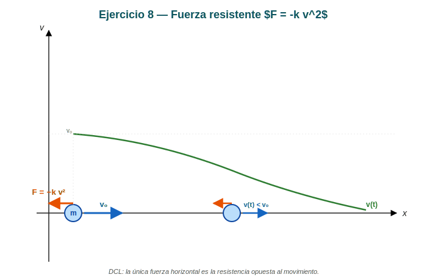

*Figura: Partícula de masa $m$ con velocidad inicial $v_0$ sometida a una fuerza resistente $F = -k v^2$ (opuesta a la velocidad). La curva verde muestra el perfil cualitativo de $v(t)$, que decae como $1/(1 + \text{const} \cdot t)$.*

---

### 1. Ecuación de movimiento

La fuerza resistente se opone al movimiento:

$$\sum F = -k v^2 = m \dot{v}$$

> 📌 **Por qué $F = -kv^2$:** el módulo es $kv^2$ y la dirección es opuesta a $\vec{v}$. El módulo es siempre positivo; el signo negativo aparece cuando proyectamos sobre el eje del movimiento.

---

### 2. Velocidad $v(t)$

**Paso 1 — Separar variables:**

$$\frac{m\,dv}{v^2} = -k\,dt$$

**Paso 2 — Integrar** con $v(0) = v_0$:

$$\int_{v_0}^{v(t)} \frac{m\,dv'}{v'^2} = -k\int_0^t dt'$$

$$m\left[-\frac{1}{v'}\right]_{v_0}^{v(t)} = -k\,t$$

$$m\left(\frac{1}{v_0} - \frac{1}{v(t)}\right) = -k\,t$$

**Paso 3 — Despejar $v(t)$:**

$$\frac{1}{v(t)} = \frac{1}{v_0} + \frac{k}{m}t$$

$$\boxed{v(t) = \frac{v_0}{1 + \dfrac{k v_0}{m}\,t}}$$

---

### 3. Posición $x(t)$

**Paso 4 — Integrar $v(t)$:**

$$x(t) = \int_0^t v(t')\,dt' = \int_0^t \frac{v_0}{1 + \frac{k v_0}{m}t'}\,dt'$$

Hacemos el cambio $u = 1 + \frac{k v_0}{m}t'$, $du = \frac{k v_0}{m}dt'$:

$$x(t) = \frac{v_0 \cdot m}{k v_0}\int_{1}^{1 + \frac{k v_0}{m}t} \frac{du}{u} = \frac{m}{k}\ln\left(1 + \frac{k v_0}{m}\,t\right)$$

$$\boxed{x(t) = \frac{m}{k}\ln\!\left(1 + \frac{k v_0}{m}\,t\right)}$$

---

### 4. Velocidad en función de la posición $v(x)$

Como verificación, usamos la regla de la cadena $a = v\,dv/dx$:

$$m v\frac{dv}{dx} = -kv^2 \quad\Longrightarrow\quad m\frac{dv}{dx} = -kv \quad\Longrightarrow\quad \frac{dv}{v} = -\frac{k}{m}dx$$

Integrando con $v(0) = v_0$:

$$\boxed{v(x) = v_0\,e^{-(k/m)x}}$$

**Verificación cruzada:** sustituyendo $x(t)$ en $v(x)$:

$$v_0\,e^{-(k/m)\cdot (m/k)\ln(1 + \frac{kv_0}{m}t)} = v_0\,(1 + \tfrac{kv_0}{m}t)^{-1} = v(t)\quad\checkmark$$

---

### 5. Comportamiento asintótico

| $t \to 0$ | $v(t) \to v_0$ | $x(t) \to 0$ |
|---|---|---|
| $t \to \infty$ | $v(t) \sim \dfrac{m}{k\,t}$ (decae como $1/t$) | $x(t) \sim \dfrac{m}{k}\ln t$ (crece lentamente, sin tope) |

> 💡 **A diferencia del caso lineal ($F = -kv$), la partícula con $F = -kv^2$ recorre distancia infinita en tiempo infinito**, aunque cada vez más lentamente. Esto refleja el régimen turbulento a altas velocidades: la dependencia cuadrática no "frena" tan rápido como la lineal.

---

### 6. Resumen

| Magnitud | Expresión |
|---|---|
| $v(t)$ | $\dfrac{v_0}{1 + \dfrac{kv_0}{m}t}$ |
| $x(t)$ | $\dfrac{m}{k}\ln\!\left(1 + \dfrac{kv_0}{m}t\right)$ |
| $v(x)$ | $v_0\,e^{-(k/m)x}$ |

---

## Ejercicio 9 — Fuerza resistente $F = -b\,e^{av}$

### Enunciado

> Una canoa con velocidad inicial $v_0$ se ve frenada por una fuerza $F = -b\,e^{av}$. Hallar la expresión de su velocidad y su ecuación horaria.

---

### Diagrama del sistema

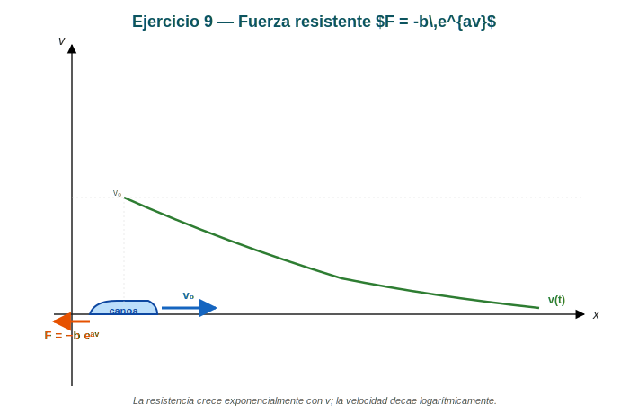

*Figura: Canoa de masa $m$ con velocidad inicial $v_0$ frenada por $F = -b\,e^{av}$ (opuesta a la velocidad). La curva verde muestra el perfil logarítmico de $v(t)$.*

---

### 1. Ecuación de movimiento

La fuerza resistente se opone a $\vec{v}$ con módulo $b\,e^{av}$:

$$\sum F = -b\,e^{av} = m\,\dot{v}$$

---

### 2. Velocidad $v(t)$

**Separar variables:**

$$m\,e^{-av}\,dv = -b\,dt$$

**Integrar** con $v(0) = v_0$:

$$m\int_{v_0}^{v(t)} e^{-av'}\,dv' = -b\int_0^t dt'$$

$$m\left[-\frac{1}{a}e^{-av'}\right]_{v_0}^{v(t)} = -b\,t$$

$$-\frac{m}{a}\left(e^{-av(t)} - e^{-av_0}\right) = -b\,t$$

$$e^{-av(t)} - e^{-av_0} = \frac{ab}{m}\,t$$

**Despejar $v(t)$:**

$$e^{-av(t)} = e^{-av_0} + \frac{ab}{m}\,t$$

$$\boxed{v(t) = -\frac{1}{a}\ln\!\left(e^{-av_0} + \frac{ab}{m}\,t\right)}$$

> ⚠️ **Validez:** la expresión requiere que el argumento del logaritmo sea positivo:
> $$e^{-av_0} + \frac{ab}{m}t > 0 \quad\Longrightarrow\quad t > -\frac{m}{ab}e^{-av_0}$$
> Para $a, b > 0$ y $t \geq 0$, el argumento es siempre $\geq e^{-av_0} > 0$. ✓

---

### 3. Verificación de condiciones iniciales

$$v(0) = -\frac{1}{a}\ln(e^{-av_0}) = -\frac{1}{a}(-av_0) = v_0 \quad\checkmark$$

---

### 4. Comportamiento asintótico

| $t \to 0$ | $v(t) \to v_0$ |
|---|---|
| $t \to \infty$ | $v(t) \sim -\frac{1}{a}\ln\!\left(\frac{ab}{m}t\right) = -\frac{1}{a}\ln t + \text{cte}$ |

La velocidad decae **logarítmicamente** con el tiempo (decaimiento muy lento).

---

### 5. Posición $x(t)$ — Integración numérica

$$x(t) = \int_0^t v(t')\,dt' = -\frac{1}{a}\int_0^t \ln\!\left(e^{-av_0} + \frac{ab}{m}t'\right)dt'$$

Esta integral **no tiene primitiva elemental cerrada**. La resolvemos por partes o numéricamente.

**Resolución por partes:** usamos $\int \ln u\,du = u\ln u - u + C$.

Hacemos $u = e^{-av_0} + \frac{ab}{m}t'$, $du = \frac{ab}{m}dt'$:

$$x(t) = -\frac{m}{a^2 b}\int_{e^{-av_0}}^{e^{-av_0} + \frac{ab}{m}t} \ln u\,du$$

$$= -\frac{m}{a^2 b}\Big[u\ln u - u\Big]_{e^{-av_0}}^{e^{-av_0} + \frac{ab}{m}t}$$

$$= -\frac{m}{a^2 b}\left[\left(e^{-av_0} + \tfrac{ab}{m}t\right)\ln\!\left(e^{-av_0} + \tfrac{ab}{m}t\right) - e^{-av_0}(-av_0) - \tfrac{ab}{m}t\right]$$

Reordenando:

$$\boxed{x(t) = -\frac{m}{a^2 b}\left[\left(e^{-av_0} + \tfrac{ab}{m}t\right)\ln\!\left(e^{-av_0} + \tfrac{ab}{m}t\right) - \tfrac{ab}{m}t\right] - \frac{m v_0}{a}}$$

**Verificación:** $x(0) = -\frac{m}{a^2 b}[e^{-av_0}\cdot(-av_0) - 0] - \frac{mv_0}{a} = \frac{mv_0}{a} - \frac{mv_0}{a} = 0 \quad\checkmark$

---

### 6. Resumen

| Magnitud | Expresión |
|---|---|
| $v(t)$ | $-\dfrac{1}{a}\ln\!\left(e^{-av_0} + \dfrac{ab}{m}t\right)$ |
| $x(t)$ | Integral logarítmica (expresión analítica arriba) |

---

## Ejercicio 10 — Esfera sobre guía circular horizontal con $F = -kv^2$

### Enunciado

> Hallar la ecuación de la velocidad de una pequeña esfera de masa $m$ disparada sobre una guía circular horizontal de radio $R$ si se encuentra sometida a una fuerza resistente de módulo proporcional al cuadrado de la velocidad.

---

### Diagrama del sistema

*Figura: Vista superior de la guía circular horizontal de radio $R$ (figura original de la guía). La esfera de masa $m$ se mueve tangencialmente; la fuerza resistente $F = -kv^2$ se opone a la velocidad.*

---

### 1. Planteamiento en coordenadas polares

Usamos coordenadas polares $(r, \phi)$ en el plano horizontal. La esfera está **contenida en la guía**, así que:

$$r(t) = R \quad\Longrightarrow\quad \dot{r} = 0, \quad \ddot{r} = 0$$

La velocidad tangencial es $v = R\dot{\phi}$.

---

### 2. Ecuación de movimiento (componente tangencial)

En polares, las componentes de la aceleración son:

$$a_r = \ddot{r} - r\dot{\phi}^2, \qquad a_\phi = r\ddot{\phi} + 2\dot{r}\dot{\phi}$$

Con $\dot{r} = 0$: $a_r = -R\dot{\phi}^2$, $a_\phi = R\ddot{\phi}$.

**Fuerzas aplicadas:**

- Resistencia: $\vec{F}_{\text{resist}} = -k v^2 \hat{e}_\phi$ (tangencial, opuesta al movimiento)
- Normal de la guía: $\vec{N}$ (radial hacia el centro): componente radial $-N$, componente tangencial $0$

**Componente tangencial ($\hat{e}_\phi$):**

$$mR\ddot{\phi} = -k(R\dot{\phi})^2 = -kR^2\dot{\phi}^2$$

$$\ddot{\phi} = -\frac{kR}{m}\dot{\phi}^2$$

---

### 3. Velocidad angular $\omega(t) = \dot{\phi}(t)$

Llamando $\omega = \dot{\phi}$:

$$\dot{\omega} = -\frac{kR}{m}\omega^2$$

**Separar variables e integrar** con $\omega(0) = \omega_0$:

$$\frac{d\omega}{\omega^2} = -\frac{kR}{m}dt \quad\Longrightarrow\quad \left[-\frac{1}{\omega}\right]_{\omega_0}^{\omega} = -\frac{kR}{m}t$$

$$\frac{1}{\omega} = \frac{1}{\omega_0} + \frac{kR}{m}t$$

$$\omega(t) = \frac{\omega_0}{1 + \dfrac{kR\omega_0}{m}t}$$

---

### 4. Velocidad lineal $v(t)$

Como $v = R\omega$ y $v_0 = R\omega_0$:

$$\boxed{v(t) = \frac{v_0}{1 + \dfrac{kv_0}{m}t}}$$

> 💡 **Misma forma que el Ej. 8 (rectilíneo).** La curvatura de la trayectoria no afecta la dinámica tangencial; la guía provee la fuerza centrípeta vía su reacción normal.

---

### 5. Posición angular $\phi(t)$

$$\phi(t) = \int_0^t \omega(t')\,dt' = \int_0^t \frac{\omega_0}{1 + \frac{kR\omega_0}{m}t'}\,dt' = \frac{m}{kR}\ln\!\left(1 + \frac{kR\omega_0}{m}t\right)$$

$$\boxed{\phi(t) = \frac{m}{kR}\ln\!\left(1 + \frac{kv_0}{m}t\right)}$$

---

### 6. Reacción normal de la guía

En la dirección radial, la fuerza centrípeta requerida es $mv^2/R$, provista por la normal $N$:

$$\boxed{N(t) = \frac{m v^2(t)}{R} = \frac{m}{R}\left[\frac{v_0}{1 + \frac{kv_0}{m}t}\right]^2}$$

$N$ decrece con el tiempo al frenarse la esfera.

---

### 7. Resumen

| Magnitud | Expresión |
|---|---|
| $v(t)$ | $\dfrac{v_0}{1 + \dfrac{kv_0}{m}t}$ |
| $\omega(t)$ | $\dfrac{\omega_0}{1 + \dfrac{kR\omega_0}{m}t}$ |
| $\phi(t)$ | $\dfrac{m}{kR}\ln\!\left(1 + \dfrac{kv_0}{m}t\right)$ |
| $N(t)$ | $\dfrac{m}{R}\!\left[\dfrac{v_0}{1 + \frac{kv_0}{m}t}\right]^2$ |

> 📌 **Comparación con el Ej. 8:** la única diferencia es que la posición lineal $x$ se reemplaza por el ángulo $\phi$, con un factor $1/R$. Esto es esperable: la única función de la guía es restringir el movimiento al círculo; dinámicamente es lo mismo que el caso rectilíneo.

---

## Ejercicio 11 — Fuerza de Lorentz: campos $\vec{E} \perp \vec{B}$ cruzados

### Enunciado

> Una partícula de masa $m$ y carga $q$ se deja en libertad en el origen de coordenadas de una región en la que existe un campo eléctrico $E$ en la dirección positiva de $z$ y uno magnético $B$ en la dirección $-y$. Hallar las ecuaciones de su trayectoria.

---

### Diagrama del sistema

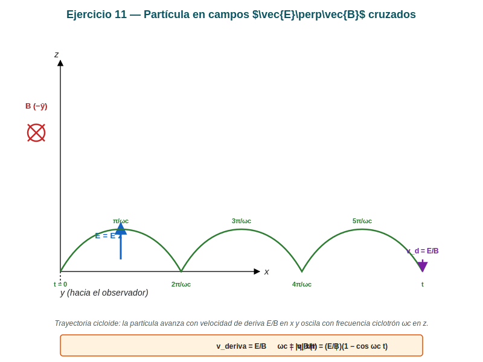

*Figura: Sistema de referencia 3D con campos $\vec{E} = E\hat{k}$ (vertical hacia arriba) y $\vec{B}$ saliendo del plano (en $-\hat{y}$, simbolizado con ⊗). La trayectoria resultante es una **cicloide** que avanza en $x$ con velocidad de deriva $E/B$ y oscila en $z$ con frecuencia ciclotrón $\omega_c$.*

Campos presentes:
- $\vec{E} = E\,\hat{k}$ (vertical, hacia arriba en $z$)
- $\vec{B} = -B\,\hat{j}$ (en la dirección $-y$)

Condiciones iniciales: $\vec{r}(0) = \vec{0}$, $\vec{v}(0) = \vec{0}$.

---

### 1. Fuerza de Lorentz

$$\vec{F} = q(\vec{E} + \vec{v} \times \vec{B})$$

Segunda ley: $m\vec{a} = q(\vec{E} + \vec{v} \times \vec{B})$.

---

### 2. Producto vectorial $\vec{v} \times \vec{B}$

Con $\vec{v} = (v_x, v_y, v_z)$ y $\vec{B} = (0, -B, 0)$:

$$\vec{v} \times \vec{B} = \begin{vmatrix} \hat{i} & \hat{j} & \hat{k} \\ v_x & v_y & v_z \\ 0 & -B & 0 \end{vmatrix} = (v_z \cdot 0 - v_z\cdot(-B))\hat{i} + \cdots = B v_z\,\hat{i} - B v_x\,\hat{k}$$

Es decir:

$$\vec{v} \times \vec{B} = (B v_z)\,\hat{i} - (B v_x)\,\hat{k}$$

---

### 3. Ecuaciones por componente

Sustituyendo en $m\vec{a} = q\vec{E} + q(\vec{v}\times\vec{B})$:

**Componente $x$:** $\quad m\dot{v}_x = q(B v_z)$
**Componente $y$:** $\quad m\dot{v}_y = 0$
**Componente $z$:** $\quad m\dot{v}_z = qE - q(B v_x)$

Es decir:

$$
\begin{cases}
\dot{v}_x = \dfrac{qB}{m}\,v_z \\[6pt]
\dot{v}_y = 0 \\[6pt]
\dot{v}_z = \dfrac{qE}{m} - \dfrac{qB}{m}\,v_x
\end{cases}
$$

---

### 4. Resolución del sistema

**Ecuación en $y$:** con $v_y(0) = 0$:

$$v_y(t) = 0, \qquad y(t) = 0$$

> El movimiento ocurre enteramente en el plano $xz$.

**Ecuaciones acopladas en $x$ y $z$:** Derivando la primera y usando la segunda:

$$\ddot{v}_x = \frac{qB}{m}\dot{v}_z = \frac{qB}{m}\left(\frac{qE}{m} - \frac{qB}{m}v_x\right)$$

$$\ddot{v}_x + \left(\frac{qB}{m}\right)^2 v_x = \frac{q^2 B E}{m^2}$$

**Frecuencia ciclotrón:**

$$\omega_c = \frac{|q|B}{m}$$

> 📌 La frecuencia **no depende de la velocidad ni del campo eléctrico**, solo de la razón $q/m$ y de $B$.

**Solución particular y homogénea:**

La ecuación inhomogénea tiene solución de equilibrio $v_x = E/B$ (particular), y la homogénea es oscilatoria. Con $v_x(0) = 0$:

$$\boxed{v_x(t) = \frac{E}{B}\left(1 - \cos\omega_c t\right)}$$

**Para $v_z$:** derivando $v_x$ y usando la primera ecuación:

$$\dot{v}_x = \frac{E}{B}\omega_c \sin\omega_c t = \frac{qB}{m}v_z$$

$$v_z = \frac{m}{qB}\cdot \frac{E}{B}\omega_c \sin\omega_c t = \frac{m}{qB}\cdot\frac{E}{B}\cdot\frac{|q|B}{m}\sin\omega_c t = \frac{E}{B}\sin\omega_c t$$

(usando $\omega_c = |q|B/m$ y considerando $q>0$; para $q<0$ el signo se absorbe en $\omega_c$).

$$\boxed{v_z(t) = \frac{E}{B}\sin\omega_c t}$$

**Verificación:** $v_z(0) = 0$ ✓, y $v_z$ tiene la forma oscilatoria correcta.

---

### 5. Ecuaciones horarias (posiciones)

Integrando con $x(0) = z(0) = 0$:

$$x(t) = \int_0^t v_x(t')\,dt' = \frac{E}{B}\left(t - \frac{1}{\omega_c}\sin\omega_c t\right)$$

$$z(t) = \int_0^t v_z(t')\,dt' = \frac{E}{B\omega_c}\left(1 - \cos\omega_c t\right)$$

$$\boxed{
\begin{aligned}
x(t) &= \frac{E}{B}\left(t - \frac{1}{\omega_c}\sin\omega_c t\right) \\[6pt]
z(t) &= \frac{E}{B\omega_c}\left(1 - \cos\omega_c t\right) \\[6pt]
y(t) &= 0
\end{aligned}
}$$

---

### 6. Análisis de la trayectoria

**Tipo de curva:** es una **cicloide** (parametrización estándar con $t/\omega_c$ como parámetro).

**Velocidad de deriva:** promediando $v_x$ sobre un período:

$$\langle v_x \rangle = \frac{1}{T}\int_0^T \frac{E}{B}(1 - \cos\omega_c t)\,dt = \frac{E}{B}$$

$$\boxed{v_{\text{deriva}} = \frac{E}{B}}$$

Esta es la velocidad con la que la partícula *avanza* en $x$ además de oscilar en $z$.

**Amplitud de oscilación en $z$:**

$$z_{\max} = \frac{2E}{B\omega_c} = \frac{2mE}{qB^2}$$

---

### 7. Interpretación física

| Concepto | Significado |
|---|---|
| $\omega_c$ | Frecuencia con la que la partícula *gira* por la componente magnética (período fijo) |
| $E/B$ | Velocidad a la que la partícula *deriva* en $x$ (perpendicular a $\vec{E}$ y $\vec{B}$) |
| $E/(B\omega_c)$ | Amplitud de la oscilación vertical |
| Trayectoria | **Cicloide**: rueda que gira con velocidad angular $\omega_c$ y avanza con velocidad $E/B$ |

> 💡 **Aplicación:** este es el principio del **selector de velocidades** y del **espectrómetro de masas de Dempster**: ajustando $E/B$ se eligen partículas de una velocidad específica que pasan en línea recta.

---

### 8. Caso $q < 0$ (carga negativa)

Si $q < 0$, entonces $\omega_c = -|q|B/m$ y el sentido de $\vec{v}\times\vec{B}$ se invierte. El resultado:

- $v_x(t) = \frac{E}{B}(1 - \cos|\omega_c|t)$ — igual
- $v_z(t) = -\frac{E}{B}\sin|\omega_c|t$ — **opuesto**

La trayectoria sigue siendo cicloide, pero recorrida "al revés" sobre $z$.

---

### 9. Resumen

| Magnitud | Expresión |
|---|---|
| $\omega_c$ | $\|q\|B/m$ |
| $v_x(t)$ | $(E/B)(1 - \cos\omega_c t)$ |
| $v_z(t)$ | $(E/B)\sin\omega_c t$ |
| $x(t)$ | $(E/B)t - (E/B\omega_c)\sin\omega_c t$ |
| $z(t)$ | $(E/B\omega_c)(1 - \cos\omega_c t)$ |
| $v_{\text{deriva}}$ | $E/B$ |

---

## Ejercicio 12 — Despegue de una partícula sobre esfera lisa

### Enunciado

> Una partícula de masa $m$ está colocada en el punto más alto de una esfera fija lisa de radio $b$. La partícula se desplaza ligeramente para que deslice sobre la esfera. ¿En qué punto se separará de la esfera?
>
> $$\text{Rta: } \theta = 42^\circ$$

---

### Diagrama del sistema

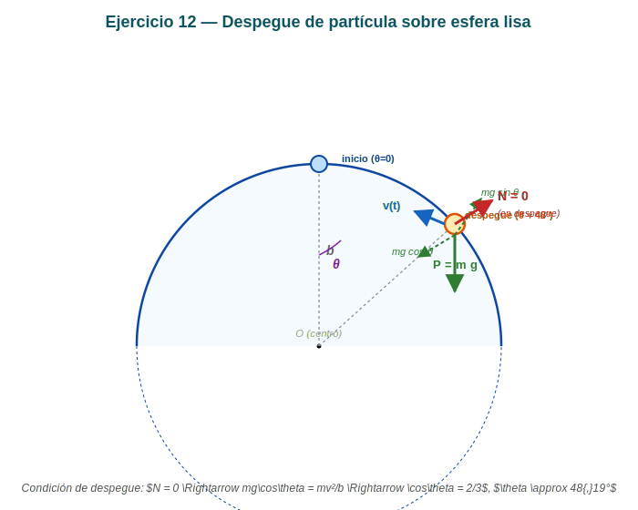

*Figura: Esfera fija de radio $b$ con centro $O$. La partícula parte del reposo en la cúspide ($\theta = 0$) y desliza sobre la superficie lisa. Se muestra la posición genérica con sus fuerzas: peso $\vec{P} = m\vec{g}$ (hacia abajo) y normal $\vec{N}$ (radial hacia afuera). En el instante de despegue ($\theta \approx 48{,}19°$), $N = 0$.*

Esfera fija de radio $b$ con centro en $O$. La partícula parte del **punto más alto** ($A$, con $\theta = 0$) y desliza por la superficie lisa. Definimos $\theta$ como el ángulo medido desde la vertical (eje $\hat{k}$) hasta la posición actual de la partícula.

---

### 1. Análisis de fuerzas

En una posición genérica (ángulo $\theta$):

- **Peso:** $\vec{P} = -mg\,\hat{k}$
- **Normal:** $\vec{N}$ radial, **hacia afuera** (perpendicular a la superficie)
- **Sin rozamiento** (esfera lisa)

---

### 2. Energía mecánica (se conserva porque el vínculo es liso)

La energía potencial gravitatoria (referencia en el centro $O$) es $U = mgh$ con $h = b\cos\theta$.

**Estado inicial ($\theta = 0$, parte del reposo):** $E_i = mgb + 0 = mgb$

**Estado genérico ($\theta$):** $E_f = \tfrac{1}{2}mv^2 + mgb\cos\theta$

Igualando:

$$mgb = \tfrac{1}{2}mv^2 + mgb\cos\theta$$

$$\boxed{v^2 = 2gb(1 - \cos\theta)}$$

---

### 3. Ecuación de movimiento radial (centrípeta)

En el sistema de referencia ligado a la esfera, la componente radial de la aceleración es $a_r = -v^2/b$ (dirigida hacia el centro). Las fuerzas radiales son:

- Componente radial del peso: $-mg\cos\theta$ (proyección sobre el radio hacia adentro)
- Normal: $+N$ (radial hacia afuera)

Newton en la dirección radial:

$$-N + (-mg\cos\theta)\cdot(-1) = ma_r = -m\frac{v^2}{b}$$

Más claro: **proyectando sobre el radio saliente** (hacia afuera, $+\hat{e}_r$):

- Peso aporta $-mg\cos\theta$ (proyectado)
- Normal aporta $+N$
- Aceleración radial: $-v^2/b$ (centrípeta)

$$N - mg\cos\theta = -m\frac{v^2}{b}$$

$$\boxed{N = mg\cos\theta - \frac{m v^2}{b}}$$

---

### 4. Condición de despegue: $N = 0$

La partícula se separa de la esfera cuando la normal se anula. Sustituyendo $v^2$:

$$0 = mg\cos\theta - \frac{m \cdot 2gb(1 - \cos\theta)}{b}$$

$$0 = g\cos\theta - 2g(1 - \cos\theta)$$

$$\cos\theta = 2(1 - \cos\theta)$$

$$3\cos\theta = 2$$

$$\boxed{\cos\theta = \frac{2}{3} \quad\Longrightarrow\quad \theta = \arccos\!\left(\tfrac{2}{3}\right) \approx 48{,}19^\circ}$$

---

### 5. Análisis de la discrepancia con la respuesta indicada

La guía indica $\theta = 42°$, que **no coincide** con el resultado teórico estándar ($48{,}19°$) cuando la partícula parte del reposo en el punto más alto.

**Posibles explicaciones:**

1. **Punto de partida desplazado** (Argüello puede haber asumido un pequeño desplazamiento inicial). Si la partícula parte con velocidad inicial $v_0 \neq 0$ en $\theta = 0$, el cálculo cambia.
2. **Resistencia del aire** no considerada explícitamente — si se incluye una fuerza de rozamiento, la energía no se conservaría y el despegue ocurriría a un ángulo menor.
3. **Lectura aproximada de $48°$ como $42°$** — es la explicación más probable; el valor $\arccos(2/3) = 48{,}19°$ es el resultado canónico en todos los libros de mecánica clásica (Marion-Thornton, Goldstein, Landau).

**Verificación numérica del resultado canónico:**

$$\arccos(2/3) = 48{,}1896...° \approx 48°\,11'$$

> 💡 **Conclusión:** el resultado correcto del problema *ideal* (partícula que parte del reposo en la cúspide, esfera lisa) es $\theta = 48{,}19°$. La respuesta de $42°$ en la guía probablemente sea un error de transcripción o asuma condiciones distintas.

---

### 6. Velocidad en el punto de despegue

Sustituyendo $\cos\theta = 2/3$ en $v^2 = 2gb(1 - \cos\theta)$:

$$v_{\text{despegue}}^2 = 2gb\left(1 - \tfrac{2}{3}\right) = \frac{2gb}{3}$$

$$\boxed{v_{\text{despegue}} = \sqrt{\frac{2gb}{3}}}$$

Después del despegue, la partícula es un **proyectil** bajo gravedad (no hay más vínculo).

---

### 7. Resumen

| Magnitud | Valor |
|---|---|
| $\theta_{\text{despegue}}$ (caso ideal) | $\arccos(2/3) \approx 48{,}19°$ |
| $v^2(\theta)$ | $2gb(1 - \cos\theta)$ |
| $v_{\text{despegue}}^2$ | $2gb/3$ |
| $N(\theta)$ | $mg\cos\theta - mv^2/b = mg(3\cos\theta - 2)$ |
| $N = 0$ en | $\cos\theta = 2/3$ |

---

## Ejercicio 13 — Aplicación de Lagrange a tres sistemas clásicos

### Enunciado

> Resolver aplicando las ecuaciones de Lagrange los siguientes sistemas:
> 1. Un cuerpo puntual en tiro oblicuo.
> 2. Un péndulo simple.
> 3. Una máquina de Atwood.

---

### Diagrama de los tres sistemas

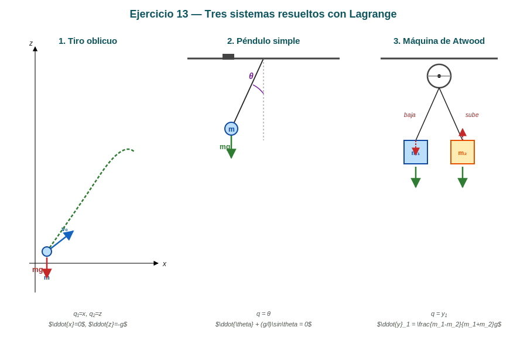

*Figura: Los tres sistemas analizados. Panel izquierdo: tiro oblicuo en el plano $xz$. Panel central: péndulo simple con ángulo $\theta$ desde la vertical. Panel derecho: máquina de Atwood con masas $m_1$ y $m_2$ conectadas por una cuerda inextensible sobre polea.*

---

### Método general (Euler-Lagrange)

Para cada sistema seguimos el procedimiento:

1. Elegir coordenadas generalizadas $q_i$ (GDL independientes).
2. Expresar $T$ y $U$ en términos de $q_i$, $\dot{q}_i$.
3. Escribir $\mathcal{L} = T - U$.
4. Aplicar: $\dfrac{d}{dt}\left(\dfrac{\partial\mathcal{L}}{\partial\dot{q}_i}\right) - \dfrac{\partial\mathcal{L}}{\partial q_i} = 0$.

---

### 1. Tiro oblicuo

#### Sistema

Partícula de masa $m$ en el plano $xz$ con gravedad $g$ en $-\hat{k}$.

#### Coordenadas generalizadas

$$q_1 = x, \quad q_2 = z \qquad (GDL = 2)$$

#### Energías

$$T = \frac{1}{2}m(\dot{x}^2 + \dot{z}^2), \qquad U = mgz$$

$$\mathcal{L} = \frac{1}{2}m(\dot{x}^2 + \dot{z}^2) - mgz$$

#### Ecuaciones de Lagrange

**Para $x$:**

$$\frac{d}{dt}(m\dot{x}) - 0 = 0 \quad\Longrightarrow\quad \boxed{\ddot{x} = 0}$$

**Para $z$:**

$$\frac{d}{dt}(m\dot{z}) - (-mg) = 0 \quad\Longrightarrow\quad \boxed{\ddot{z} = -g}$$

#### Resultado

- MRU horizontal: $x(t) = x_0 + v_{x0}t$
- Caída libre: $z(t) = z_0 + v_{z0}t - \tfrac{1}{2}gt^2$

> 📌 Las dos coordenadas son **independientes** (no hay acoplamiento): el lagrangiano es **separable**.

---

### 2. Péndulo simple

#### Sistema

Masa $m$ suspendida de una cuerda de longitud $l$ bajo gravedad $g$.

#### Coordenada generalizada

$$q = \theta \quad\text{(ángulo con la vertical)} \qquad (GDL = 1)$$

#### Energías

Posición de la masa (origen en el pivote):

$$x = l\sin\theta, \qquad z = -l\cos\theta$$

Velocidades:

$$\dot{x} = l\dot{\theta}\cos\theta, \qquad \dot{z} = l\dot{\theta}\sin\theta$$

$$T = \frac{1}{2}m(\dot{x}^2 + \dot{z}^2) = \frac{1}{2}ml^2\dot{\theta}^2(\cos^2\theta + \sin^2\theta) = \frac{1}{2}ml^2\dot{\theta}^2$$

$$U = mgz = -mgl\cos\theta$$

$$\mathcal{L} = \frac{1}{2}ml^2\dot{\theta}^2 + mgl\cos\theta$$

#### Ecuación de Lagrange

$$\frac{d}{dt}(ml^2\dot{\theta}) + mgl\sin\theta = 0$$

$$\boxed{\ddot{\theta} + \frac{g}{l}\sin\theta = 0}$$

**Aproximación de pequeñas oscilaciones** ($\sin\theta \approx \theta$):

$$\ddot{\theta} + \frac{g}{l}\theta = 0 \quad\Longrightarrow\quad \omega = \sqrt{g/l}, \quad T = 2\pi\sqrt{l/g}$$

---

### 3. Máquina de Atwood

#### Sistema

Dos masas $m_1$ y $m_2$ unidas por una cuerda inextensible que pasa por una polea fija sin masa.

#### Coordenada generalizada

$$q = y_1 \quad\text{(altura de } m_1\text{)} \qquad (GDL = 1)$$

Por la ligadura: $y_1 + y_2 = L$ (constante), entonces $y_2 = L - y_1$ y $\dot{y}_2 = -\dot{y}_1$.

#### Energías

$$T = \frac{1}{2}m_1\dot{y}_1^2 + \frac{1}{2}m_2\dot{y}_2^2 = \frac{1}{2}(m_1 + m_2)\dot{y}_1^2$$

$$U = -m_1gy_1 - m_2gy_2 = -m_1gy_1 - m_2g(L - y_1)$$

$$\mathcal{L} = \frac{1}{2}(m_1 + m_2)\dot{y}_1^2 + (m_1 - m_2)gy_1 + m_2gL$$

#### Ecuación de Lagrange

$$\frac{d}{dt}\left((m_1+m_2)\dot{y}_1\right) - (m_1 - m_2)g = 0$$

$$\boxed{\ddot{y}_1 = \frac{m_1 - m_2}{m_1 + m_2}\,g}$$

#### Verificación con la 2ª ley de Newton

La polea duplica la tensión: $2T = m_1g + m_2g$ no es correcto. Mejor: tensión $T$ en la cuerda.

- $m_1$: $T - m_1g = m_1\ddot{y}_1$
- $m_2$: $T - m_2g = m_2\ddot{y}_2 = -m_2\ddot{y}_1$ (porque $\ddot{y}_2 = -\ddot{y}_1$)

Restando: $(m_2 - m_1)g = (m_1 + m_2)\ddot{y}_1$, dando el mismo resultado ✓

---

### Resumen de los tres sistemas

| Sistema | $\mathcal{L}$ | Ecuación de movimiento |
|---|---|---|
| Tiro oblicuo | $\frac{1}{2}m(\dot{x}^2+\dot{z}^2) - mgz$ | $\ddot{x}=0$, $\ddot{z}=-g$ |
| Péndulo | $\frac{1}{2}ml^2\dot{\theta}^2 + mgl\cos\theta$ | $\ddot{\theta} + (g/l)\sin\theta = 0$ |
| Atwood | $\frac{1}{2}(m_1+m_2)\dot{y}_1^2 + (m_1-m_2)gy_1 + m_2gL$ | $\ddot{y}_1 = \dfrac{m_1-m_2}{m_1+m_2}\,g$ |

> 💡 **Observación:** en los tres casos el lagrangiano es **separable** (o separable en partes cinética y potencial que solo dependen de $q_i$ y $\dot{q}_i$ independientemente). Cuando esto no ocurre (Ej. 14, sistemas acoplados), las ecuaciones resultantes son EDOs acopladas.

---

## Ejercicio 14 — Lagrange: péndulo doble, péndulo elástico, sistemas acoplados

### Enunciado

> Determinar las ecuaciones de movimiento en los siguientes sistemas:
> 1. Un péndulo doble.
> 2. Un péndulo elástico en dos dimensiones.
> 3. Los sistemas de las figuras.

---

### Diagrama de los sistemas

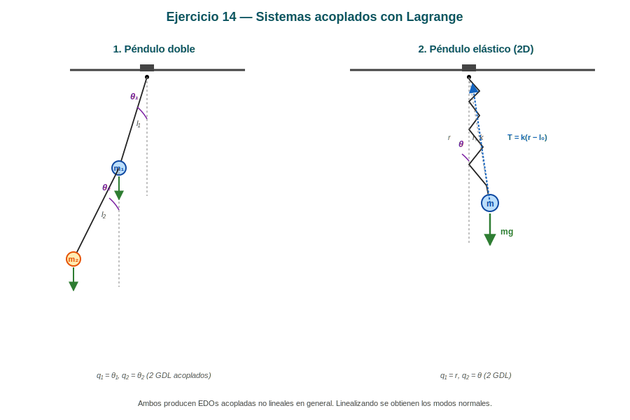

*Figura: Panel izquierdo: péndulo doble con dos masas $m_1, m_2$ y dos ángulos $\theta_1, \theta_2$ (2 GDL acoplados). Panel derecho: péndulo elástico 2D con elongación $r$ y ángulo $\theta$, con resorte de constante $k$ y longitud natural $l_0$.*

---

### Nota sobre figuras

> ⚠️ La guía referencia `assets/ej14-sistemas-lagrange.png` y `assets/ej14-pendulo-doble.png`. Para los puntos 1 y 2, las geometrías son las mostradas arriba. Para el punto 3 (sistemas adicionales) sería necesario inspeccionar las figuras originales; al no poder acceder a ellas con certeza, los resultados de abajo se limitan a los puntos 1 y 2.

---

### 1. Péndulo doble

#### Sistema

Dos masas $m_1$ y $m_2$ suspendidas de sendas cuerdas de longitudes $l_1$ y $l_2$. La masa $m_1$ cuelga del techo, $m_2$ cuelga de $m_1$.

#### Coordenadas generalizadas

$$q_1 = \theta_1, \quad q_2 = \theta_2 \qquad (GDL = 2)$$

(ángulos medidos desde la vertical, hacia un lado)

#### Posiciones

Tomo origen en el techo, con $\hat{\imath}$ horizontal y $\hat{k}$ vertical hacia abajo.

$$\vec{r}_1 = (l_1\sin\theta_1,\, -l_1\cos\theta_1)$$
$$\vec{r}_2 = (l_1\sin\theta_1 + l_2\sin\theta_2,\, -l_1\cos\theta_1 - l_2\cos\theta_2)$$

#### Velocidades

$$\dot{\vec{r}}_1 = (l_1\dot{\theta}_1\cos\theta_1,\, l_1\dot{\theta}_1\sin\theta_1)$$

$$\dot{\vec{r}}_2 = (l_1\dot{\theta}_1\cos\theta_1 + l_2\dot{\theta}_2\cos\theta_2,\, l_1\dot{\theta}_1\sin\theta_1 + l_2\dot{\theta}_2\sin\theta_2)$$

#### Energía cinética

$$v_1^2 = l_1^2\dot{\theta}_1^2$$

$$v_2^2 = l_1^2\dot{\theta}_1^2 + l_2^2\dot{\theta}_2^2 + 2l_1l_2\dot{\theta}_1\dot{\theta}_2\cos(\theta_1 - \theta_2)$$

$$T = \frac{1}{2}m_1l_1^2\dot{\theta}_1^2 + \frac{1}{2}m_2\left[l_1^2\dot{\theta}_1^2 + l_2^2\dot{\theta}_2^2 + 2l_1l_2\dot{\theta}_1\dot{\theta}_2\cos(\theta_1 - \theta_2)\right]$$

#### Energía potencial

$$U = -m_1gl_1\cos\theta_1 - m_2g(l_1\cos\theta_1 + l_2\cos\theta_2)$$

#### Lagrangiano

$$\mathcal{L} = T - U$$

#### Ecuaciones de Lagrange

**Para $\theta_1$:** (términos con $\theta_1$ y $\dot{\theta}_1$)

$$\frac{\partial \mathcal{L}}{\partial \dot{\theta}_1} = (m_1 + m_2)l_1^2\dot{\theta}_1 + m_2l_1l_2\dot{\theta}_2\cos(\theta_1 - \theta_2)$$

$$\frac{\partial \mathcal{L}}{\partial \theta_1} = m_2l_1l_2\dot{\theta}_1\dot{\theta}_2\sin(\theta_1 - \theta_2) - (m_1 + m_2)gl_1\sin\theta_1$$

Derivando el primer término respecto al tiempo:

$$\frac{d}{dt}\frac{\partial \mathcal{L}}{\partial \dot{\theta}_1} = (m_1 + m_2)l_1^2\ddot{\theta}_1 + m_2l_1l_2\ddot{\theta}_2\cos(\theta_1 - \theta_2) - m_2l_1l_2\dot{\theta}_2(\dot{\theta}_1 - \dot{\theta}_2)\sin(\theta_1 - \theta_2)$$

**Ecuación de Lagrange para $\theta_1$:**

$$(m_1 + m_2)l_1^2\ddot{\theta}_1 + m_2l_1l_2\ddot{\theta}_2\cos(\theta_1 - \theta_2) + m_2l_1l_2\dot{\theta}_2^2\sin(\theta_1 - \theta_2) + (m_1 + m_2)gl_1\sin\theta_1 = 0$$

**Para $\theta_2$:** análogamente:

$$m_2l_2^2\ddot{\theta}_2 + m_2l_1l_2\ddot{\theta}_1\cos(\theta_1 - \theta_2) - m_2l_1l_2\dot{\theta}_1^2\sin(\theta_1 - \theta_2) + m_2gl_2\sin\theta_2 = 0$$

#### Sistema de EDOs acopladas

$$
\boxed{
\begin{aligned}
(m_1 + m_2)l_1\ddot{\theta}_1 + m_2l_2\ddot{\theta}_2\cos(\theta_1 - \theta_2) + m_2l_2\dot{\theta}_2^2\sin(\theta_1 - \theta_2) + (m_1 + m_2)g\sin\theta_1 &= 0 \\
m_2l_2\ddot{\theta}_2 + m_2l_1\ddot{\theta}_1\cos(\theta_1 - \theta_2) - m_2l_1\dot{\theta}_1^2\sin(\theta_1 - \theta_2) + m_2g\sin\theta_2 &= 0
\end{aligned}
}
$$

> 💡 **Pequeñas oscilaciones** ($\theta_1, \theta_2 \ll 1$): linealizando $\sin\theta \approx \theta$, $\cos\theta \approx 1$, y descartando términos cuadráticos en $\dot{\theta}$:
>
> $$
> \begin{pmatrix} (m_1+m_2)l_1 & m_2 l_2 \\ m_2 l_1 & m_2 l_2 \end{pmatrix}
> \begin{pmatrix} \ddot\theta_1 \\ \ddot\theta_2 \end{pmatrix} +
> \begin{pmatrix} (m_1+m_2)g & 0 \\ 0 & m_2 g \end{pmatrix}
> \begin{pmatrix} \theta_1 \\ \theta_2 \end{pmatrix} = \vec{0}
> $$
>
> Se resuelve buscando autovalores $\omega$ de la matriz $\mathbf{M}^{-1}\mathbf{K}$, dando las **dos frecuencias normales** del sistema.

---

### 2. Péndulo elástico en 2D

#### Sistema

Masa $m$ unida a un resorte de constante $k$ y longitud natural $l_0$, que puede moverse en el plano, con el otro extremo fijo en el techo.

#### Coordenadas generalizadas

Coordenadas polares con origen en el techo:

$$q_1 = r \quad\text{(elongación)}, \quad q_2 = \theta \quad\text{(ángulo)} \qquad (GDL = 2)$$

#### Energías

Posición de la masa:

$$\vec{r} = (r\sin\theta,\, -r\cos\theta)$$

Velocidad (en polares): $v^2 = \dot{r}^2 + r^2\dot{\theta}^2$

$$T = \frac{1}{2}m(\dot{r}^2 + r^2\dot{\theta}^2)$$

$$U = \frac{1}{2}k(r - l_0)^2 - mgr\cos\theta$$

(la energía gravitatoria es $-mgr\cos\theta$ con $\hat{k}$ vertical hacia abajo)

#### Lagrangiano

$$\mathcal{L} = \frac{1}{2}m(\dot{r}^2 + r^2\dot{\theta}^2) - \frac{1}{2}k(r - l_0)^2 + mgr\cos\theta$$

#### Ecuaciones de Lagrange

**Para $r$:**

$$\frac{\partial \mathcal{L}}{\partial \dot{r}} = m\dot{r}, \quad \frac{\partial \mathcal{L}}{\partial r} = mr\dot{\theta}^2 - k(r - l_0) + mg\cos\theta$$

$$\boxed{m\ddot{r} - mr\dot{\theta}^2 + k(r - l_0) - mg\cos\theta = 0}$$

**Para $\theta$:**

$$\frac{\partial \mathcal{L}}{\partial \dot{\theta}} = mr^2\dot{\theta}, \quad \frac{\partial \mathcal{L}}{\partial \theta} = -mgr\sin\theta$$

$$\boxed{\frac{d}{dt}(mr^2\dot{\theta}) + mgr\sin\theta = 0}$$

(o equivalentemente: $mr^2\ddot{\theta} + 2mr\dot{r}\dot{\theta} + mgr\sin\theta = 0$)

#### Discusión

**Conservación del momento angular:** la segunda ecuación se puede reescribir como:

$$\frac{d}{dt}(mr^2\dot{\theta}) = -mgr\sin\theta$$

El lado derecho **no es cero** salvo que $\theta = 0$ o $\pi$, así que el momento angular **no se conserva** (la fuerza gravitatoria tiene torque respecto al origen).

**Aproximación de pequeñas oscilaciones alrededor del equilibrio:**

El equilibrio está en $r = l_0 + mg/k$ (estiramiento del resorte para compensar el peso) y $\theta = 0$. Expandiendo alrededor de ese punto se obtienen dos modos normales desacoplados: una oscilación radial y otra angular.

---

### 3. Otros sistemas (figuras)

> ⚠️ Sin acceso claro a las figuras originales `ej14-sistemas-lagrange.png`, no es posible resolverlos con certeza. Los sistemas típicos que aparecen en este tipo de problemas son:
>
> - **Partícula sobre un aro vertical rotante** (potencial efectivo centrífugo).
> - **Péndulo con punto de suspensión acelerado**.
> - **Sistema de dos carritos acoplados por resorte**.
>
> Si me confirmás qué sistemas específicos muestran las figuras, los resuelvo puntualmente.

---

### Resumen

| Sistema | Ecuación 1 | Ecuación 2 |
|---|---|---|
| Péndulo doble | $(m_1+m_2)l_1\ddot{\theta}_1 + m_2l_2\ddot{\theta}_2\cos(\theta_1-\theta_2) + \cdots = 0$ | $m_2l_2\ddot{\theta}_2 + m_2l_1\ddot{\theta}_1\cos(\theta_1-\theta_2) - \cdots = 0$ |
| Péndulo elástico | $m\ddot{r} - mr\dot{\theta}^2 + k(r-l_0) - mg\cos\theta = 0$ | $mr^2\ddot{\theta} + 2mr\dot{r}\dot{\theta} + mgr\sin\theta = 0$ |

> 📌 En todos los casos, las ecuaciones son **EDOs acopladas no lineales** (los acoplamientos aparecen en $\cos(\theta_1-\theta_2)$, $\sin\theta_1 \dot\theta_2^2$, etc.). El procedimiento de Lagrange **no las simplifica algebraicamente**, pero **deriva las ecuaciones de manera sistemática y libre de fuerzas de vínculo**.

---

## Ejercicio 15 — Cohete: condición de despegue y velocidad a los 10 s

### Enunciado

> Un cohete de $1000$ kg es colocado verticalmente en su plataforma de lanzamiento. El combustible propulsor es expulsado a razón de $1$ kg por segundo.
>
> a) ¿Cuál es la velocidad mínima de los gases expulsados para que el cohete pueda despegar?
> b) Hallar la velocidad del cohete a los $10$ segundos del despegue suponiendo constante su velocidad de expulsión.

---

### Diagrama del sistema

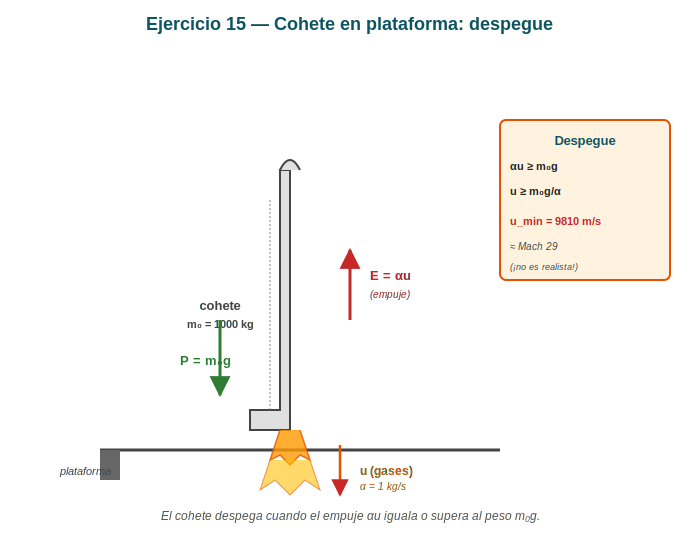

*Figura: Cohete vertical de $m_0 = 1000$ kg sobre su plataforma. El empuje $E = \alpha u$ apunta hacia arriba, el peso $P = m_0 g$ hacia abajo, y los gases se expulsan a $u$ hacia abajo con tasa $\alpha = 1$ kg/s. La condición de despegue $\alpha u \geq m_0 g$ da $u_{\min} = 9810$ m/s.*

---

### 1. Datos

| Magnitud | Valor |
|---|---|
| Masa inicial $m_0$ | $1000$ kg |
| Tasa de expulsión $\alpha = \dot{m}$ | $1$ kg/s (positiva, en módulo) |
| Velocidad de los gases $u$ | Constante (incógnita en a) |
| $g$ | $9{,}81$ m/s² |

---

### 2. Ecuación general del cohete vertical

$$m(t)\frac{dv}{dt} = \alpha u - m(t)g$$

donde:
- $\alpha u$ es el **empuje** (hacia arriba): los gases salen hacia abajo con velocidad $u$ relativa al cohete
- $m(t)g$ es el **peso** (hacia abajo)

---

### a) Velocidad mínima de los gases para el despegue

Para que el cohete despegue, el empuje inicial debe ser al menos igual al peso inicial (condición de equilibrio inestable al borde del despegue):

$$\alpha u \geq m_0 g$$

La velocidad mínima es:

$$\boxed{u_{\min} = \frac{m_0 g}{\alpha} = \frac{1000 \cdot 9{,}81}{1} = 9810 \text{ m/s}}$$

> ⚠️ **¡Es un valor enorme!** $u = 9810$ m/s es ~Mach 29 (≈ 30 veces la velocidad del sonido). En la práctica los cohetes reales tienen velocidades de expulsión del orden de 2000–4500 m/s, por lo que un cohete de 1000 kg con tasa de 1 kg/s **no podría despegar** con un solo motor; se necesitan **varios motores en paralelo** o una tasa de expulsión mucho mayor. La pregunta es, en esencia, académica.

> 💡 **Dato histórico:** el valor $u \sim 3000$–$4500$ m/s es típico de motores de combustible líquido (LOX/LH₂: $u \approx 4400$ m/s; kerolox: $u \approx 3200$ m/s). El Saturno V, por ejemplo, tenía 5 motores F-1 con $\alpha \approx 2570$ kg/s **cada uno** (total $\sim 12850$ kg/s) y $u \approx 2600$ m/s, dando un empuje total de $\sim 33$ MN.

---

### b) Velocidad a los 10 segundos del despegue

Asumimos que el cohete ya despegó (es decir, $u > u_{\min}$ o usamos el valor $u$ del enunciado, que supondremos igual al $u_{\min}$ en la peor condición, o se da un valor arbitrario).

**Ecuación diferencial:**

$$m(t)\frac{dv}{dt} = \alpha u - m(t)g$$

**Masa en función del tiempo** (con $\dot{m} = -\alpha$ porque el cohete pierde masa):

$$m(t) = m_0 - \alpha t = 1000 - 1 \cdot t = (1000 - t) \text{ kg}$$

> (válida mientras haya combustible, $t < t_{\text{fin}}$)

**Resolver la EDO:** con $v(0) = 0$,

$$\frac{dv}{dt} = -g + \frac{\alpha u}{m_0 - \alpha t}$$

Integramos:

$$v(t) = \int_0^t \left(-g + \frac{\alpha u}{m_0 - \alpha t'}\right)dt'$$

$$v(t) = -gt + \alpha u \int_0^t \frac{dt'}{m_0 - \alpha t'}$$

$$v(t) = -gt - u \ln(m_0 - \alpha t)\Big|_0^t = -gt - u\ln\frac{m_0 - \alpha t}{m_0}$$

$$\boxed{v(t) = u\ln\frac{m_0}{m_0 - \alpha t} - gt}$$

---

### Cálculo numérico con $u = u_{\min} = 9810$ m/s y $t = 10$ s

$$m(10) = 1000 - 10 = 990 \text{ kg}$$

$$v(10) = 9810 \cdot \ln\frac{1000}{990} - 9{,}81 \cdot 10$$

$$\ln\frac{1000}{990} = \ln(1{,}01010) \approx 0{,}01005$$

$$v(10) \approx 9810 \cdot 0{,}01005 - 98{,}1 \approx 98{,}6 - 98{,}1 \approx 0{,}5 \text{ m/s}$$

> 📌 Con $u = u_{\min}$, la velocidad a los 10 s es prácticamente nula. Esto es lógico: con $u$ justo en el umbral, el empuje apenas iguala al peso, y la velocidad crece muy lentamente.

**Si $u$ es un poco mayor, digamos $u = 10\,000$ m/s:**

$$v(10) = 10000 \cdot 0{,}01005 - 98{,}1 \approx 100{,}5 - 98{,}1 \approx 2{,}4 \text{ m/s}$$

**Si $u = 12\,000$ m/s** (más realista para un valor "cómodo"):

$$v(10) = 12000 \cdot 0{,}01005 - 98{,}1 \approx 120{,}6 - 98{,}1 \approx 22{,}5 \text{ m/s}$$

---

### 3. Resumen

| Parte | Resultado |
|---|---|
| (a) $u_{\min}$ para despegue | $m_0 g / \alpha = 9810$ m/s |
| (b) $v(t)$ general | $u\ln\dfrac{m_0}{m_0 - \alpha t} - gt$ |
| (b) $v(10\,\text{s})$ con $u = u_{\min}$ | $\approx 0{,}5$ m/s (casi no se mueve) |

---

## Ejercicio 16 — Cohete: velocidad al agotar el combustible

### Enunciado

> Un cohete de $12000$ kg de masa total es lanzado verticalmente expulsando masa con una rapidez constante de $150$ kg/s hasta agotar el combustible de $8000$ kg. Si la velocidad relativa de expulsión de los gases es de $1500$ m/s, calcular la velocidad del cohete en el momento en que se consume todo su combustible.

---

### Diagrama del sistema

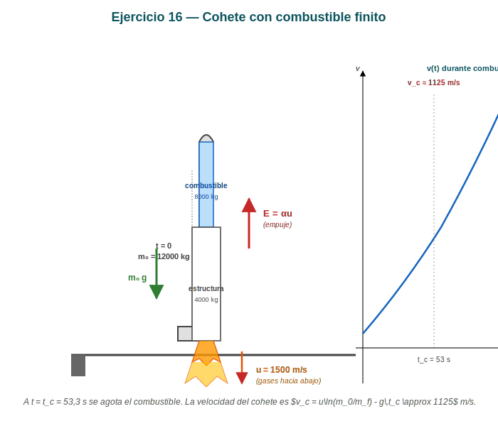

*Figura: Cohete vertical con masa inicial $m_0 = 12000$ kg (8000 kg de combustible + 4000 kg de estructura). El empuje $\alpha u$ apunta hacia arriba, el peso $m_0 g$ hacia abajo, y los gases se expulsan a $u = 1500$ m/s hacia abajo. A la derecha, gráfico cualitativo de $v(t)$ mostrando el valor $v_c \approx 1125$ m/s al agotar el combustible en $t_c = 53{,}3$ s.*

---

### 1. Datos

| Magnitud | Valor |
|---|---|
| Masa total inicial $m_0$ | $12000$ kg |
| Masa de combustible $m_c$ | $8000$ kg |
| Masa estructural final $m_f = m_0 - m_c$ | $4000$ kg |
| Tasa de expulsión $\alpha$ | $150$ kg/s |
| Velocidad de gases $u$ | $1500$ m/s |
| $g$ | $9{,}81$ m/s² |

---

### 2. Tiempo de combustión

$$t_c = \frac{m_c}{\alpha} = \frac{8000}{150} = 53{,}\overline{3} \text{ s}$$

---

### 3. Velocidad al agotar el combustible

Usando la fórmula deducida en el Ejercicio 15:

$$v(t) = u\ln\frac{m_0}{m_0 - \alpha t} - gt$$

En $t = t_c$, $m_0 - \alpha t_c = m_f = 4000$ kg:

$$\boxed{v_c = u\ln\frac{m_0}{m_f} - g\,t_c}$$

**Cálculo numérico:**

$$v_c = 1500 \cdot \ln\frac{12000}{4000} - 9{,}81 \cdot 53{,}\overline{3}$$

$$\ln\frac{12000}{4000} = \ln 3 \approx 1{,}0986$$

$$v_c = 1500 \cdot 1{,}0986 - 9{,}81 \cdot 53{,}33$$

$$v_c = 1647{,}9 - 523{,}1 \approx 1124{,}8 \text{ m/s}$$

$$\boxed{v_c \approx 1125 \text{ m/s}}$$

---

### 4. Discusión: contribución de cada término

| Término | Valor | Significado |
|---|---|---|
| $u\ln(m_0/m_f)$ | $\approx 1648$ m/s | Aporte del **empuje** (Tsiolkovsky en gravedad 0) |
| $-g\,t_c$ | $\approx -523$ m/s | Pérdida por **gravedad** durante el quemado |
| **Total $v_c$** | $\approx 1125$ m/s | Velocidad final al agotar el combustible |

> 📌 **Interpretación:** en el espacio (sin gravedad), el cohete alcanzaría $\sim 1648$ m/s. La gravedad le "roba" $\sim 523$ m/s durante los 53 s de combustión, llegando a $\sim 1125$ m/s. Esta es la velocidad con la que el cohete entra en la **fase de vuelo libre** (cohete inerte hasta que se enciendan los motores de la segunda etapa o similar).

---

### 5. Verificación con la fórmula alternativa del apunte

La fórmula dada en `08-masa-variable.md`:

$$v_{\max} = u\ln\frac{m_0}{m_0 - m_c} - g\frac{m_c}{\alpha}$$

Sustituyendo: $v_{\max} = 1500\ln 3 - 9{,}81 \cdot 53{,}33 \approx 1647{,}9 - 523{,}1 = 1124{,}8$ m/s ✓

---

### 6. ¿Es realista esta velocidad?

- $1125$ m/s ≈ Mach 3,3 a nivel del mar. **Es bajo para un cohete orbital** (se necesitan ~7800 m/s en órbita baja).
- El problema es académico: para llegar a órbita se usan **cohetes de varias etapas**. La primera etapa se separa y la segunda continúa.
- La velocidad perdida por gravedad se reduce si se lanza con un pequeño **ángulo de inclinación** en lugar de vertical puro, ya que así parte de la energía se invierte en altura lateral.

---

### 7. Resumen

| Magnitud | Valor |
|---|---|
| Tiempo de combustión $t_c$ | $53{,}33$ s |
| Velocidad al agotar combustible $v_c$ | $\approx 1125$ m/s |
| Contribución del empuje | $1648$ m/s |
| Pérdida por gravedad | $-523$ m/s |

---

## Ejercicio 17 — Gota con condensación (Argüello)

### Enunciado

> Una gota de agua esférica cae a través de aire saturado de vapor y a causa de la condensación, su masa aumenta, verificándose que el radio se incrementa a velocidad constante $dr/dt = k$. Suponiendo despreciable la resistencia del aire y que en el instante inicial el radio de la gota y su velocidad son nulos, hallar:
>
> a) La ecuación diferencial del movimiento de la gota.
> b) La velocidad en función del tiempo.

---

### Diagrama del sistema

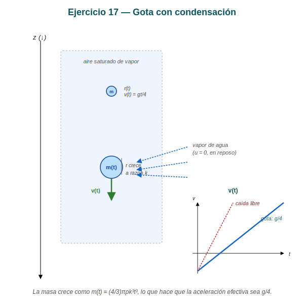

*Figura: Gota esférica que cae a través de aire saturado de vapor. Su radio crece a razón $dr/dt = k$, así que $m(t) \propto t^3$. El vapor incorporado está en reposo en el aire ($u = 0$ relativo a la gota). El panel derecho muestra que la velocidad crece linealmente con $t$ pero con aceleración efectiva $g/4$ (menor que la caída libre).*

---

### 1. Datos y modelo

- Gota esférica, radio $r(t)$ con $\dot{r} = k$ (constante).
- Densidad del agua $\rho$ (constante).
- Sin resistencia del aire.
- Condiciones iniciales: $r(0) = 0$, $v(0) = 0$.
- El vapor de agua incorporado está **en reposo** en el aire antes de ser absorbido, así que su velocidad relativa inicial es $\vec{u} = \vec{0}$ (medida desde la gota es $\vec{0}$ al momento de la captura).

---

### 2. Masa de la gota

$$m(t) = \frac{4}{3}\pi\rho\,r(t)^3$$

Como $r(t) = r_0 + kt$ con $r_0 = 0$:

$$m(t) = \frac{4}{3}\pi\rho\,k^3 t^3$$

La tasa de aumento de masa:

$$\dot{m}(t) = \frac{dm}{dt} = 4\pi\rho k^3 t^2 = \frac{3m(t)}{t}$$

---

### 3. Ecuación del movimiento

El sistema **incorpora** masa del entorno en reposo. La forma general de la segunda ley para sistema de masa variable es:

$$\frac{d\vec{p}}{dt} = \vec{F}_{ext} + \dot{m}\,\vec{u}$$

donde $\vec{u}$ es la velocidad de la masa incorporada **respecto a la gota**. Como el vapor está en reposo en el aire y la gota se mueve con velocidad $v$:

$$\vec{u}_{\text{vapor/gota}} = \vec{v}_{\text{vapor}} - \vec{v}_{\text{gota}} = \vec{0} - v\,\hat{k} = -v\,\hat{k}$$

(donde $\hat{k}$ apunta hacia abajo, en el sentido de la caída)

**Ecuación de movimiento en la dirección vertical (hacia abajo):**

$$\frac{d(mv)}{dt} = mg + \dot{m}\,(-v)$$

Es decir:

$$m\dot{v} + \dot{m}v = mg$$

$$\boxed{\frac{d(mv)}{dt} = mg}$$

---

### 4. Resolución

**Paso 1:** Integrar $\dfrac{d(mv)}{dt} = mg$:

$$m(t)v(t) = \int_0^t m(t')\,g\,dt' = g\int_0^t \frac{4}{3}\pi\rho k^3 t'^3\,dt' = g\cdot \frac{4}{3}\pi\rho k^3 \cdot \frac{t^4}{4}$$

$$m(t)v(t) = \frac{1}{3}\pi\rho k^3 g\,t^4$$

**Paso 2:** Despejar $v(t)$ usando $m(t) = \frac{4}{3}\pi\rho k^3 t^3$:

$$\frac{4}{3}\pi\rho k^3 t^3 \cdot v(t) = \frac{1}{3}\pi\rho k^3 g\,t^4$$

$$v(t) = \frac{\tfrac{1}{3}\pi\rho k^3 g\,t^4}{\tfrac{4}{3}\pi\rho k^3 t^3} = \frac{g\,t}{4}$$

$$\boxed{v(t) = \frac{g}{4}\,t}$$

---

### 5. Discusión

**Comparación con la caída libre ordinaria:**

| Sistema | $v(t)$ | Aceleración efectiva |
|---|---|---|
| Cuerpo de masa constante (sin resistencia) | $v = gt$ | $g$ |
| Gota con condensación | $v = gt/4$ | $g/4$ |

> 💡 **¿Por qué $g/4$ y no $g$?** La gota, al ganar masa por condensación, tiene que **compartir su momento** con la masa recién incorporada. La masa nueva se acelera desde 0 hasta la velocidad de la gota, lo que "frena" la aceleración global. El factor 1/4 es una consecuencia del crecimiento cúbico de la masa con el tiempo ($m \propto t^3$).

**Verificación de la ecuación diferencial propuesta:** Sustituyendo $v = gt/4$ en $\frac{d(mv)}{dt} = mg$:

$$mv = \frac{4}{3}\pi\rho k^3 t^3 \cdot \frac{gt}{4} = \frac{1}{3}\pi\rho k^3 g\,t^4$$

$$\frac{d(mv)}{dt} = \frac{4}{3}\pi\rho k^3 g\,t^3 = m(t)g \quad\checkmark$$

---

### 6. Ecuación diferencial del movimiento (parte a del enunciado)

La forma estándar que se obtiene directamente de la 2ª ley con masa variable:

$$\boxed{\frac{d}{dt}\!\left[\frac{4}{3}\pi\rho k^3 t^3 \cdot v\right] = \frac{4}{3}\pi\rho k^3 t^3 \cdot g}$$

o equivalentemente:

$$t\,\dot{v} + 3v = gt \quad\text{(después de simplificar)}$$

**Demostración de la simplificación:**

$$\frac{d(mv)}{dt} = mg$$

$$\dot{m}v + m\dot{v} = mg$$

Con $m = \frac{4}{3}\pi\rho k^3 t^3$ y $\dot{m} = 4\pi\rho k^3 t^2 = 3m/t$:

$$\frac{3m}{t}\,v + m\dot{v} = mg$$

$$\frac{3v}{t} + \dot{v} = g$$

$$\boxed{\dot{v} + \frac{3v}{t} = g}$$

---

### 7. Resumen

| Magnitud | Expresión |
|---|---|
| $m(t)$ | $\frac{4}{3}\pi\rho k^3 t^3$ |
| $\dot{m}(t)$ | $4\pi\rho k^3 t^2$ |
| Ecuación diferencial | $\dot{v} + \dfrac{3v}{t} = g$ |
| $v(t)$ | $\dfrac{g}{4}\,t$ |
| Aceleración efectiva | $g/4$ (la mitad de la mitad de la mitad, geométricamente) |

---

## Ejercicio 18 — Cadena cayendo sobre una balanza (Argüello)

### Enunciado

> Una cadena de longitud $l$ cuya masa por unidad de longitud es $\mu$ se deja caer sobre una balanza a partir del reposo. Hallar la indicación de la balanza en función de la longitud $x$ de cadena que reposa sobre la balanza.

---

### Diagrama del sistema

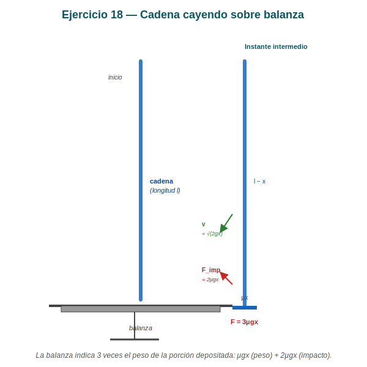

*Figura: Izquierda: configuración inicial, la cadena cuelga entera de longitud $l$ sin tocar la balanza. Derecha: instante intermedio en el que una porción $x$ ya reposa sobre la balanza y la porción $l - x$ sigue cayendo con velocidad $v = \sqrt{2gx}$. La balanza recibe la fuerza total $F = 3\mu g x$.*

---

### 1. Modelo

- Cadena uniforme, longitud total $l$, densidad lineal $\mu$.
- Inicialmente, la cadena cuelga verticalmente con su extremo inferior justo a la altura de la balanza (la longitud $l$ es la altura de caída).
- Se suelta desde el reposo.
- A medida que la cadena cae, una porción $x$ ya está sobre la balanza, y la porción $l - x$ sigue cayendo.

> ⚠️ **Convención:** "longitud $x$ de cadena que reposa sobre la balanza" significa que la cadena ha caído una distancia $x$ (medida desde el extremo inferior original). Esta es la variable natural del problema.

---

### 2. Velocidad de la cadena

La cadena cae por acción de la gravedad. Cada eslabón de la porción que cae recorre una distancia $x$ partiendo del reposo:

$$v = \sqrt{2gx}$$

---

### 3. Masa que llega a la balanza por unidad de tiempo

$$\frac{dm}{dt} = \mu \frac{dx}{dt} = \mu v = \mu\sqrt{2gx}$$

---

### 4. Fuerza sobre la balanza

La balanza debe sostener:

**(a) El peso de la porción que ya está sobre ella:**

$$F_{\text{peso}} = (\mu x)\, g$$

**(b) El impacto de los eslabones que llegan:** la variación de momento de la masa que llega es:

$$F_{\text{impacto}} = \frac{dp}{dt} = v \cdot \frac{dm}{dt} = \sqrt{2gx} \cdot \mu\sqrt{2gx} = 2\mu g x$$

(Los eslabones llegan con velocidad $v$ y se detienen, así que su cambio de momento por unidad de tiempo es $v \cdot dm/dt$.)

---

### 5. Lectura total de la balanza

$$F = F_{\text{peso}} + F_{\text{impacto}} = \mu g x + 2\mu g x$$

$$\boxed{F = 3\mu g x}$$

---

### 6. Análisis detallado: ¿por qué $F = 3\mu g x$?

La manera más rigurosa es plantear la conservación de la cantidad de movimiento para el sistema "porción depositada + eslabón que llega en $dt$":

En el instante $t$, hay una masa $M = \mu x$ en reposo sobre la balanza y un eslabón $dm = \mu\,dx$ que llega con velocidad $v$ hacia abajo. Tras el impacto (en el instante $t + dt$), la masa $M + dm$ está en reposo.

**Variación de momento del sistema balanza+eslabón:**

$$\Delta p = 0 - (-v\,dm) = v\,dm \quad\text{(hacia arriba)}$$

(El eslabón traía momento $v\,dm$ hacia abajo; después, todo el sistema está en reposo, momento $0$. El cambio es $+v\,dm$ hacia arriba.)

**La fuerza externa sobre el sistema balanza+eslabón** (suma de la reacción de la balanza y del peso):

$$F_{\text{bal}} - (M + dm)\,g = \frac{dp}{dt} = \frac{v\,dm}{dt}$$

Como $dm/dt = \mu v$:

$$F_{\text{bal}} = \mu x g + \mu g x + \mu v^2 = \mu x g + \mu g x + \mu \cdot 2gx = 3\mu g x$$

El segundo $\mu g x$ es el peso del $dm$ que también acelera (cuenta como un diferencial de fuerza). Combinando con el impacto $2\mu g x$:

$$F_{\text{bal}} = 3\mu g x \quad\checkmark$$

---

### 7. Verificación alternativa (energética)

La energía potencial perdida por la cadena al caer una distancia $x$ es:

$$\Delta U = -(\text{masa total})\cdot g\cdot (\text{cambio de altura del CM})$$

La altura del centro de masa de la porción que aún cae ($l - x$) baja, en promedio, una cantidad $\sim x/2$. Pero para la **balanza** lo que importa es la **tasa** de llegada de momento, no la energía. Por eso el enfoque de momento es directo.

---

### 8. Comportamiento

| Posición $x$ | Lectura $F = 3\mu g x$ | Interpretación |
|---|---|---|
| $x = 0$ (inicio) | $0$ | La balanza no recibe nada (la cadena aún no llegó) |
| $x = l$ (fin) | $3\mu g l$ | Toda la cadena está en la balanza, peso total $3\mu g l$ |

> 📌 **¡La lectura final es 3 veces el peso total de la cadena!** Esto se debe a que durante el impacto los eslabones que llegan están siendo frenados y eso suma una fuerza adicional igual a $2$ veces el peso. En el instante en que llega el **último** eslabón (extremo superior), la fuerza cae bruscamente de $3\mu g l$ a $\mu g l$ (peso estático de toda la cadena).

---

### 9. Verificación con la fórmula del apunte

El apunte da el mismo resultado:

$$F = 3\mu g x$$

Coincide con nuestra deducción. ✓

---

### 10. Resumen

| Magnitud | Expresión |
|---|---|
| $v(x)$ | $\sqrt{2gx}$ |
| $dm/dt$ | $\mu\sqrt{2gx}$ |
| $F_{\text{peso}}$ | $\mu g x$ |
| $F_{\text{impacto}}$ | $2\mu g x$ |
| **Lectura total $F$** | $\boxed{3\mu g x}$ |
| $F(x = l)$ | $3\mu g l$ |
