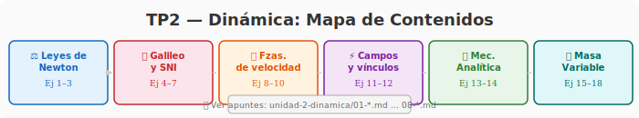
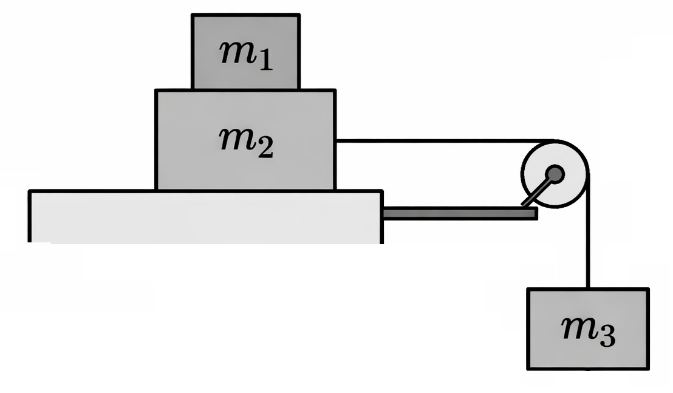
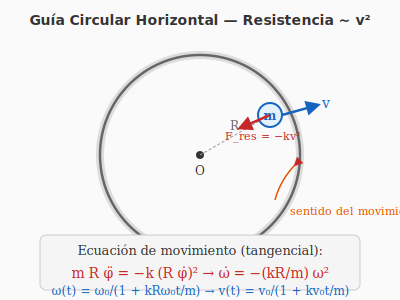
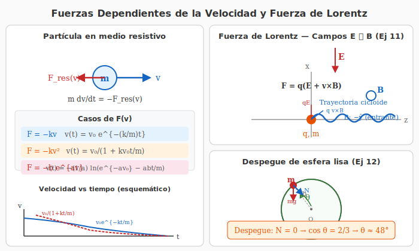
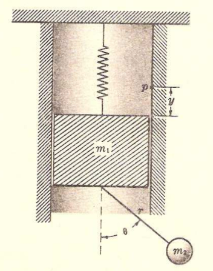
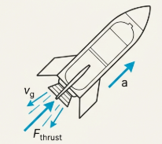
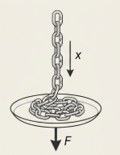
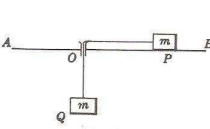
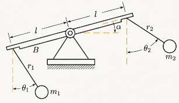

# TP2 – Dinámica

**INSPT – UTN** | **Física Teórica I** | **Prof. Carlos Dibarbora**

---

## Cómo usar este archivo

Cada ejercicio tiene tres estados posibles:

| Símbolo | Significado |
|---|---|
| `- [ ]` | Sin hacer |
| `- [~]` | Intentado / con dudas — volver a revisar |
| `- [x]` | Dominado (resuelto correctamente) |

Los badges debajo de cada ejercicio indican concepto, dificultad y tiempo orientativo. **Actualiza la tabla de progreso al final de cada sesión.**

---

## 🗺️ Mapa de Contenidos

---

## 📊 Progreso General

| Bloque | Total | ✅ | 🔄 | % |
|---|---|---|---|---|
| Leyes de Newton e Interacciones | 3 | 0 | 0 | 0% |
| Transformaciones de Galileo y Sist. No Inerciales | 4 | 0 | 0 | 0% |
| Fuerzas Dependientes de la Velocidad | 3 | 0 | 0 | 0% |
| Fuerzas Dependientes de la Posición y Campos | 2 | 0 | 0 | 0% |
| Mecánica Analítica (Lagrange) | 2 | 0 | 0 | 0% |
| Sistemas de Masa Variable | 4 | 0 | 0 | 0% |
| **Total** | **18** | **0** | **0** | **0%** |

---

  ⚖️ Bloque 1 — Leyes de Newton e Interacciones

## Ejercicio 1.

  ⚖️ Bloque 1
  🎯 Pares de interacción, 3ª Ley
  ⭐ Fácil
  ⏱️ 10 min

Analizar todos los pares de interacción en el sistema constituido por la Tierra y una caja colocada en reposo sobre una mesa.

  <strong style="font-size: 0.95em;">Estado:</strong>
  <input type="checkbox" style="width: 18px; height: 18px; cursor: pointer; accent-color: #1565c0;" />

---

## Ejercicio 2.

  ⚖️ Bloque 1
  🎯 Rozamiento, 3ª Ley
  ⭐ Fácil
  ⏱️ 10 min

Analizar desde el punto de vista del principio de interacción el rozamiento cinético entre un cuerpo cúbico que se mueve horizontalmente y el piso sobre el que se desliza.

  <strong style="font-size: 0.95em;">Estado:</strong>
  <input type="checkbox" style="width: 18px; height: 18px; cursor: pointer; accent-color: #1565c0;" />

---

## Ejercicio 3.

  ⚖️ Bloque 1
  🎯 Poleas, tensión, DCL
  ⭐⭐ Intermedio
  ⏱️ 25 min

### Diagrama del sistema

*Figura: Sistema de poleas del Ejercicio 3 (reproducido del PDF original). Las masas $m_1=5$ kg, $m_2=15$ kg, $m_3=10$ kg están conectadas por sogas inextensibles a través de una polea fija y una móvil.*

En el sistema de la figura, las masas de los cuerpos son: $m_1 = 5$ kg, $m_2 = 15$ kg y $m_3 = 10$ kg. El sistema se está moviendo con velocidad constante de $2$ m/s de tal manera que el cuerpo de masa $m_3$ desciende. Calcular en cuánto se deberá incrementar la masa del cuerpo 3 para que comience a descender con una aceleración de módulo $2$ m/s². ¿Cuánto vale en ese caso la fuerza ejercida por la soga que se supone inextensible y de masa despreciable lo mismo que la polea?

  <strong style="font-size: 0.95em;">Estado:</strong>
  <input type="checkbox" style="width: 18px; height: 18px; cursor: pointer; accent-color: #1565c0;" />

---

  🚄 Bloque 2 — Transformaciones de Galileo y Sistemas No Inerciales

## Ejercicio 4.

  🚄 Bloque 2
  🎯 Transformaciones de Galileo
  ⭐ Fácil
  ⏱️ 10 min

Resolver, explicitando con cuidado cada uno de los sistemas de referencia utilizados, la siguiente situación. Dos trenes viajan por vías paralelas en sentidos opuestos con velocidades de módulos $60$ km/h y $80$ km/h respectivamente. Calcular la velocidad de uno de los trenes respecto del otro.

  <strong style="font-size: 0.95em;">Estado:</strong>
  <input type="checkbox" style="width: 18px; height: 18px; cursor: pointer; accent-color: #1565c0;" />

---

## Ejercicio 5.

  🚄 Bloque 2
  🎯 Sistemas no inerciales, fuerza ficticia
  ⭐⭐ Intermedio
  ⏱️ 20 min

Calcular el ángulo que forma con la vertical un péndulo suspendido del techo de un vagón que se desplaza con respecto a las vías con un movimiento uniformemente acelerado con una aceleración cuyo módulo es $5$ m/s². Realizar el problema desde un sistema de referencia fijo a las vías y desde un sistema fijo al vagón.

  <strong style="font-size: 0.95em;">Estado:</strong>
  <input type="checkbox" style="width: 18px; height: 18px; cursor: pointer; accent-color: #1565c0;" />

---

## Ejercicio 6.

  🚄 Bloque 2
  🎯 Fuerza centrífuga, sistemas rotantes
  ⭐⭐ Intermedio
  ⏱️ 15 min

Un cuerpo que se encuentra a una distancia igual a la mitad del radio del tambor de una centrifugadora que gira con velocidad angular constante se desplaza hacia el borde del mismo. Explicar las causas de ese movimiento desde un sistema de referencia exterior a la centrifugadora y desde un sistema unido a la misma.

  <strong style="font-size: 0.95em;">Estado:</strong>
  <input type="checkbox" style="width: 18px; height: 18px; cursor: pointer; accent-color: #1565c0;" />

---

## Ejercicio 7.

  🚄 Bloque 2
  🎯 Caída libre, Coriolis, SR terrestre
  ⭐⭐⭐ Difícil
  ⏱️ 30 min

Adoptamos como sistema inercial de referencia a uno con origen en el centro de la Tierra, y un sistema de referencia móvil sobre la superficie terrestre con el eje $\hat{k}$ en la dirección radial, el eje $\hat{i}$ coincidiendo con un meridiano en sentido norte-sur y el eje $\hat{j}$ según paralelo con dirección hacia el este. Resolver las ecuaciones del movimiento y la ecuación horaria de un cuerpo que caiga en caída libre. (Podemos suponer en principio que la caída se da sobre el eje $\hat{k}$ o que la velocidad de caída solo tiene esa componente, para simplificar.)

$$ \text{Rta: } z = h - \frac{g\,t^2}{2}, \qquad y = \frac{\omega\,g\,t^3}{3}\cos\varphi $$

  <strong style="font-size: 0.95em;">Estado:</strong>
  <input type="checkbox" style="width: 18px; height: 18px; cursor: pointer; accent-color: #1565c0;" />

---

  🌊 Bloque 3 — Fuerzas Dependientes de la Velocidad

## Ejercicio 8.

  🌊 Bloque 3
  🎯 Resistencia cuadrática, EDO
  ⭐⭐ Intermedio
  ⏱️ 20 min

Obtener la expresión de la velocidad y de la posición en función del tiempo para una partícula de masa $m$ sujeta a la acción de una fuerza resistente de módulo $k v^2$ ($k > 0$). Suponer que tiene velocidad inicial $v_0$ en el origen de coordenadas.

  <strong style="font-size: 0.95em;">Estado:</strong>
  <input type="checkbox" style="width: 18px; height: 18px; cursor: pointer; accent-color: #1565c0;" />

---

## Ejercicio 9.

  🌊 Bloque 3
  🎯 Resistencia exponencial, EDO no lineal
  ⭐⭐⭐ Difícil
  ⏱️ 25 min

Una canoa con velocidad inicial $v_0$ se ve frenada por una fuerza $F = -b\,e^{av}$. Hallar la expresión de su velocidad y su ecuación horaria.

  <strong style="font-size: 0.95em;">Estado:</strong>
  <input type="checkbox" style="width: 18px; height: 18px; cursor: pointer; accent-color: #1565c0;" />

---

## Ejercicio 10.

  🌊 Bloque 3
  🎯 Resistencia cuadrática, guía circular
  ⭐⭐⭐ Difícil
  ⏱️ 25 min

Hallar la ecuación de la velocidad de una pequeña esfera de masa $m$ disparada sobre una guía circular horizontal de radio $R$ si se encuentra sometida a una fuerza resistente de módulo proporcional al cuadrado de la velocidad.

*Figura: Esfera de masa $m$ moviéndose sobre una guía circular horizontal de radio $R$, sometida a una fuerza resistente $F = -kv^2$ (opuesta a la velocidad tangencial).*

  <strong style="font-size: 0.95em;">Estado:</strong>
  <input type="checkbox" style="width: 18px; height: 18px; cursor: pointer; accent-color: #1565c0;" />

---

  ⚡ Bloque 4 — Fuerzas Dependientes de la Posición y Campos

## Ejercicio 11.

  ⚡ Bloque 4
  🎯 Fuerza de Lorentz, E y B
  ⭐⭐⭐ Difícil
  ⏱️ 30 min

Una partícula de masa $m$ y carga $q$ se deja en libertad en el origen de coordenadas de una región en la que existe un campo eléctrico $E$ en la dirección positiva de $z$ y uno magnético $B$ en la dirección $-y$. Hallar las ecuaciones de su trayectoria.

*Figura: Panel derecho superior — partícula cargada en campos $\vec{E}$ (vertical, $+z$) y $\vec{B}$ (entrante, $-y$), mostrando la trayectoria cicloide resultante.*

  <strong style="font-size: 0.95em;">Estado:</strong>
  <input type="checkbox" style="width: 18px; height: 18px; cursor: pointer; accent-color: #1565c0;" />

---

## Ejercicio 12.

  ⚡ Bloque 4
  🎯 Esfera lisa, fuerza de vínculo, despegue
  ⭐⭐ Intermedio
  ⏱️ 20 min

    
Una partícula de masa $m$ está colocada en el punto más alto de una esfera fija lisa de radio $b$. La partícula se desplaza ligeramente para que deslice sobre la esfera. ¿En qué punto se separará de la esfera?

*Figura: Panel derecho inferior — esfera lisa de radio $b$ con partícula deslizando, mostrando fuerzas (peso $mg$ y normal $N$), ángulo $\theta$ y condición de despegue $N=0$.*

$$ \text{Rta: } \theta = 42^\circ $$

  <strong style="font-size: 0.95em;">Estado:</strong>
  <input type="checkbox" style="width: 18px; height: 18px; cursor: pointer; accent-color: #1565c0;" />

---

  📐 Bloque 5 — Mecánica Analítica (Lagrange)

## Ejercicio 13.

  📐 Bloque 5
  🎯 Ecuaciones de Lagrange
  ⭐⭐ Intermedio
  ⏱️ 30 min

Resolver aplicando las ecuaciones de Lagrange los siguientes sistemas:

1. Un cuerpo puntual en tiro oblicuo.
2. Un péndulo simple.
3. Una máquina de Atwood.

  <strong style="font-size: 0.95em;">Estado:</strong>
  <input type="checkbox" style="width: 18px; height: 18px; cursor: pointer; accent-color: #1565c0;" />

---

## Ejercicio 14.

  📐 Bloque 5
  🎯 Lagrange, sistemas acoplados
  ⭐⭐⭐ Difícil
  ⏱️ 35 min

Determinar las ecuaciones de movimiento en los siguientes sistemas:

1. Un péndulo doble.
2. Un péndulo elástico en dos dimensiones.
3. Los sistemas de las siguientes figuras.

### Figuras de los sistemas

*Figura: Sistemas para determinar ecuaciones de movimiento mediante Lagrange (reproducido del PDF original).*

### Diagrama adicional — Péndulo doble

  <strong style="font-size: 0.95em;">Estado:</strong>
  <input type="checkbox" style="width: 18px; height: 18px; cursor: pointer; accent-color: #1565c0;" />

---

  🚀 Bloque 6 — Sistemas de Masa Variable

## Ejercicio 15.

  🚀 Bloque 6
  🎯 Cohete, empuje, masa variable
  ⭐⭐ Intermedio
  ⏱️ 20 min

Un cohete de $1000$ kg es colocado verticalmente en su plataforma de lanzamiento. El combustible propulsor es expulsado a razón de $1$ kg por segundo.

a) ¿Cuál es la velocidad mínima de los gases expulsados para que el cohete pueda despegar?
b) Hallar la velocidad del cohete a los $10$ segundos del despegue suponiendo constante su velocidad de expulsión.

  <strong style="font-size: 0.95em;">Estado:</strong>
  <input type="checkbox" style="width: 18px; height: 18px; cursor: pointer; accent-color: #1565c0;" />

---

## Ejercicio 16.

  🚀 Bloque 6
  🎯 Cohete, combustible finito
  ⭐⭐ Intermedio
  ⏱️ 20 min

Un cohete de $12000$ kg de masa total es lanzado verticalmente expulsando masa con una rapidez constante de $150$ kg/s hasta agotar el combustible de $8000$ kg. Si la velocidad relativa de expulsión de los gases es de $1500$ m/s, calcular la velocidad del cohete en el momento en que se consume todo su combustible.

  <strong style="font-size: 0.95em;">Estado:</strong>
  <input type="checkbox" style="width: 18px; height: 18px; cursor: pointer; accent-color: #1565c0;" />

---

## Ejercicio 17.

  🚀 Bloque 6
  🎯 Masa variable, condensación, EDO
  ⭐⭐⭐ Difícil
  ⏱️ 30 min

(del Argüello) Una gota de agua esférica cae a través de aire saturado de vapor y a causa de la condensación, su masa aumenta, verificándose que el radio se incrementa a velocidad constante $dr/dt = k$. Suponiendo despreciable la resistencia del aire y que en el instante inicial el radio de la gota y su velocidad son nulos, hallar:

a) La ecuación diferencial del movimiento de la gota.
b) La velocidad en función del tiempo.

  <strong style="font-size: 0.95em;">Estado:</strong>
  <input type="checkbox" style="width: 18px; height: 18px; cursor: pointer; accent-color: #1565c0;" />

---

## Ejercicio 18.

  🚀 Bloque 6
  🎯 Cadena, masa variable, balanza
  ⭐⭐⭐ Difícil
  ⏱️ 25 min

(del Argüello) Una cadena de longitud $l$ cuya masa por unidad de longitud es $\mu$ se deja caer sobre una balanza a partir del reposo. Hallar la indicación de la balanza en función de la longitud $x$ de cadena que reposa sobre la balanza.

  <strong style="font-size: 0.95em;">Estado:</strong>
  <input type="checkbox" style="width: 18px; height: 18px; cursor: pointer; accent-color: #1565c0;" />

---