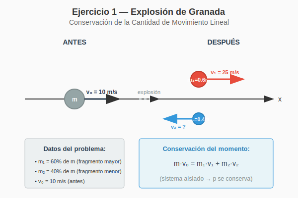

# Ejercicio 1 — Solución

**INSPT – UTN** | **Física Teórica I** | **Prof. Carlos Dibarbora**  
**Unidad 6:** Sistemas de Puntos Materiales y Cinemática del Rígido  
**Bloque:** Conservación de la Cantidad de Movimiento  
**Dificultad:** ⭐ Fácil | **Tiempo estimado:** 15 min

---

## 📋 Enunciado

Una granada que se desplaza a una velocidad de módulo 10 m/s estalló dividiéndose en dos partes. La mayor tiene una masa del 60% de la original y siguió moviéndose en la misma dirección y sentido, pero su velocidad aumentó a 25 m/s. Hallar la velocidad de la otra parte.

---

## 🎯 Conceptos Fundamentales

### 1. Sistema Aislado y Conservación del Momento Lineal

Cuando un sistema **no está sujeto a fuerzas externas netas**, la cantidad de movimiento lineal total se conserva:

$$\boxed{\vec{p}_{\text{inicial}} = \vec{p}_{\text{final}}}$$

En el caso de una explosión:
- Las fuerzas internas (la explosión) son **mucho mayores** que cualquier fuerza externa durante el brevísimo intervalo de tiempo del evento
- Por lo tanto, podemos considerar el sistema como **aislado** durante la explosión
- El momento lineal total **antes** debe igualar al momento lineal total **después**

### 2. Expresión Matemática

Para un sistema de $n$ partículas:

$$\vec{p}_{\text{total}} = \sum_{i=1}^{n} m_i \vec{v}_i$$

En nuestro caso (granada → 2 fragmentos):

$$\underbrace{m \vec{v}_0}_{\text{antes}} = \underbrace{m_1 \vec{v}_1 + m_2 \vec{v}_2}_{\text{después}}$$

---

## 📊 Diagrama del Problema

*Figura 1: Esquema del sistema antes y después de la explosión. Notar que el fragmento menor sale en dirección opuesta (indicado por la flecha azul apuntando hacia la izquierda).*

---

## ✏️ Resolución Paso a Paso

### **Paso 1: Identificar los datos del problema**

| Magnitud | Símbolo | Valor |
|----------|---------|-------|
| Masa total de la granada | $m$ | $m$ (desconocida, pero no necesaria) |
| Velocidad inicial | $\vec{v}_0$ | $10\ \text{m/s}\ \hat{i}$ |
| Masa del fragmento mayor | $m_1$ | $0.6m$ |
| Velocidad del fragmento mayor | $\vec{v}_1$ | $25\ \text{m/s}\ \hat{i}$ |
| Masa del fragmento menor | $m_2$ | $0.4m$ |
| Velocidad del fragmento menor | $\vec{v}_2$ | **?** (incógnita) |

> 💡 **Nota importante:** Elegimos el eje $x$ positivo en la dirección del movimiento inicial de la granada. Esto define nuestro sistema de referencia.

---

### **Paso 2: Plantear la conservación del momento lineal**

La ecuación vectorial de conservación es:

$$m \vec{v}_0 = m_1 \vec{v}_1 + m_2 \vec{v}_2$$

Sustituimos las masas en función de $m$:

$$m \vec{v}_0 = (0.6m) \vec{v}_1 + (0.4m) \vec{v}_2$$

---

### **Paso 3: Simplificar la ecuación**

Como $m \neq 0$, podemos dividir toda la ecuación por $m$:

$$\require{cancel}$$
$$\cancel{m} \vec{v}_0 = 0.6\cancel{m} \vec{v}_1 + 0.4\cancel{m} \vec{v}_2$$

$$\boxed{\vec{v}_0 = 0.6 \vec{v}_1 + 0.4 \vec{v}_2}$$

> 🎯 **Observación clave:** La masa total $m$ se cancela. ¡No necesitamos conocerla para resolver el problema!

---

### **Paso 4: Trabajar en una dimensión**

Dado que todos los vectores están sobre la misma recta (eje $x$), podemos trabajar con las componentes escalares. Usamos la convención:
- **Positivo (+)** → misma dirección y sentido que $\vec{v}_0$
- **Negativo (−)** → dirección opuesta

La ecuación escalar es:

$$v_0 = 0.6 v_1 + 0.4 v_2$$

donde $v_0$, $v_1$, y $v_2$ son las componentes $x$ de las velocidades (pueden ser positivas o negativas).

---

### **Paso 5: Sustituir los valores conocidos**

$$10 = 0.6(25) + 0.4 v_2$$

---

### **Paso 6: Resolver algebraicamente para $v_2$**

**Paso 6.1:** Calcular el producto:

$$10 = 15 + 0.4 v_2$$

**Paso 6.2:** Despejar el término con la incógnita (restar 15 a ambos lados):

$$10 - 15 = 0.4 v_2$$

$$-5 = 0.4 v_2$$

**Paso 6.3:** Despejar $v_2$ (dividir ambos lados por 0.4):

$$v_2 = \frac{-5}{0.4}$$

**Paso 6.4:** Calcular el valor numérico:

$$v_2 = -12.5\ \text{m/s}$$

---

### **Paso 7: Interpretar el resultado**

El signo **negativo** indica que la velocidad del fragmento menor tiene **sentido opuesto** al movimiento original de la granada.

Podemos expresar la respuesta de dos maneras equivalentes:

| Forma | Expresión |
|-------|-----------|
| **Vectorial** | $\vec{v}_2 = -12.5\ \text{m/s}\ \hat{i}$ |
| **Módulo y dirección** | $|\vec{v}_2| = 12.5\ \text{m/s}$, dirección opuesta a $\vec{v}_0$ |

---

## ✅ Respuesta Final

$$\boxed{\vec{v}_2 = -12.5\ \text{m/s}\ \hat{i}}$$

O equivalentemente:

$$\boxed{|\vec{v}_2| = 12.5\ \text{m/s}\ \text{en dirección opuesta al movimiento original}}$$

> ⚠️ **Nota sobre la respuesta del enunciado:** El enunciado indica "Rta: 12 m/s". Esto parece ser una aproximación o redondeo. El cálculo exacto da **12.5 m/s**.

---

## 🔍 Verificación del Resultado

Podemos verificar que el momento se conserva calculando el momento total después de la explosión:

**Momento inicial:**
$$p_{\text{inicial}} = m \cdot 10 = 10m$$

**Momento final:**
$$p_{\text{final}} = m_1 v_1 + m_2 v_2 = (0.6m)(25) + (0.4m)(-12.5)$$
$$p_{\text{final}} = 15m - 5m = 10m$$

✅ **¡Verificado!** $p_{\text{inicial}} = p_{\text{final}} = 10m$

---

## 💡 Análisis Físico Adicional

### ¿Por qué el fragmento menor sale hacia atrás?

Esto puede parecer contraintuitivo, pero tiene una explicación física clara:

1. **El fragmento mayor "roba" momento**: Al salir disparado hacia adelante con una velocidad mayor que la original (25 m/s vs 10 m/s), adquiere más momento del que tenía originalmente esa porción de la granada.

2. **Compensación necesaria**: Para conservar el momento total, el fragmento menor debe tener momento en dirección **opuesta** que compense el "exceso" del fragmento mayor.

3. **Analogía con un cañón**: Es similar al retroceso de un cañón cuando dispara una bala. La bala sale hacia adelante, y el cañón retrocede.

### Balance energético (opcional)

Aunque no se pide en el ejercicio, podemos notar que:

- **Energía cinética inicial:** $E_{c,i} = \frac{1}{2} m (10)^2 = 50m$
- **Energía cinética final:** 
  $$E_{c,f} = \frac{1}{2}(0.6m)(25)^2 + \frac{1}{2}(0.4m)(12.5)^2 = 187.5m + 31.25m = 218.75m$$

La energía cinética **aumentó** considerablemente ($218.75m > 50m$). Esto es esperable porque:
- La explosión convierte **energía química** (del explosivo) en energía cinética
- En una explosión, la energía **no** se conserva (hay fuentes internas de energía)
- Lo que **sí** se conserva es el momento lineal (porque no hay fuerzas externas)

---

## 📚 Extensiones y Variaciones

### Variación 1: ¿Qué pasaría si ambos fragmentos salieran hacia adelante?

Si impusiéramos que $v_2 > 0$, entonces de la ecuación:

$$10 = 0.6(25) + 0.4 v_2$$

obtendríamos $v_2 = -12.5$, que es negativo. Esto significa que **es imposible** que ambos fragmentos salgan hacia adelante con los datos dados. El fragmento mayor ya tiene demasiado momento.

### Variación 2: ¿Cuál sería la velocidad máxima posible del fragmento mayor?

Si quisiéramos que el fragmento menor quede en reposo ($v_2 = 0$):

$$10 = 0.6 v_1 + 0.4(0)$$
$$v_1 = \frac{10}{0.6} \approx 16.67\ \text{m/s}$$

Por lo tanto, si $v_1 > 16.67\ \text{m/s}$, necesariamente $v_2 < 0$ (el fragmento menor retrocede).

---

## 🧠 Preguntas para Reflexionar

1. **¿Depende el resultado de la masa total de la granada?** 
   - No, como vimos, la masa se cancela en la ecuación.

2. **¿Qué pasaría si la granada explotara en 3 fragmentos?**
   - Tendríamos una ecuación vectorial con 3 términos en el lado derecho, pero el principio es el mismo. Necesitaríamos más datos para resolverlo.

3. **¿Se conserva la energía mecánica en una explosión?**
   - No, porque hay conversión de energía química en energía mecánica. Solo se conserva el momento lineal.

---

## 📖 Referencias Relacionadas

- **Unidad 6 — Teoría:** [01-sistemas-puntos-materiales.md](./01-sistemas-puntos-materiales.md)
- **TP5:** [tp5-sistemas-cinematica-rigida.md](./tp5-sistemas-cinematica-rigida.md)
- **Tema relacionado:** Colisiones elásticas e inelásticas (Ejercicios 6-9 del TP5)

---

*Solución elaborada con el marco BAMAD-Analyst | Última actualización: 2026*
