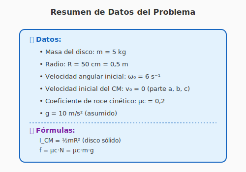
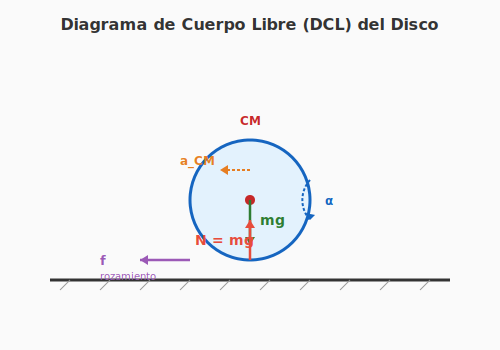
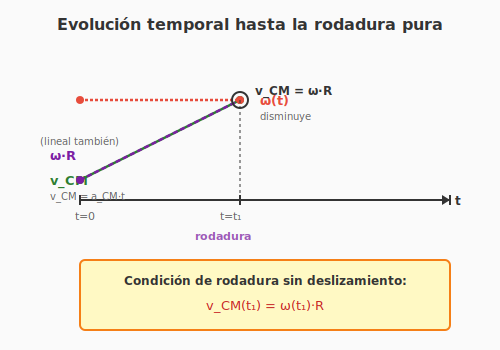

# Guía Detallada: Ejercicio 19 - Disco con Rozamiento

**INSPT – UTN** | **Física Teórica I** | **Prof. Carlos Dibarbora**

---

## 📋 Enunciado completo

> Un disco homogéneo de radio $R = 50$ cm y masa $m = 5$ kg está, inicialmente, girando en un plano vertical en torno a un eje (perpendicular al dibujo) que pasa por su centro de masa con velocidad angular $\omega_0 = 6$ s⁻¹. Se pone en contacto el disco con una superficie horizontal con rozamiento. Transcurrido un cierto tiempo, el disco comenzará a rodar sin deslizar.

**Calcular:**
- **a)** La velocidad angular del disco cuando entra en rodadura.
- **b)** El trabajo realizado por la fuerza de rozamiento.
- **c)** Sabiendo que $\mu_c = 0,2$, calcular el tiempo hasta la rodadura.
- **d)** Caso general con $v_0 \neq 0$: $\omega$ final para $v_0 = 6$ m/s y $v_0 = 1,5$ m/s.

---

## 🎯 ¿Qué está pasando físicamente?

Antes de empezar con las cuentas, **entendamos qué le pasa al disco**:

1. **Inicialmente** ($t = 0$): El disco está girando en el aire con $\omega_0 = 6$ s⁻¹, pero su centro de masa **no se mueve** ($v_{CM} = 0$).

2. **Cuando toca el piso**: El punto de contacto del disco con la superficie **se mueve hacia atrás** (en sentido contrario al que tendría si rodara). Esto significa que **hay deslizamiento**.

3. **El rozamiento actúa**: La fricción cinética ($\mu_c$) intenta "frenar" ese deslizamiento, lo que produce:
   - Una **fuerza horizontal** sobre el disco → el CM **empieza a moverse**
   - Un **torque** sobre el disco → la rotación **disminuye**

4. **Después de un tiempo $t_1$**: Se llega al estado de **rodadura pura**, donde el punto de contacto está **instantáneamente en reposo** ($v_{CM} = \omega R$).

### 🎨 Diagrama: Situación inicial

**Interpretación:** El disco arranca con velocidad angular $\omega_0$ pero sin traslación. Apenas toca el piso, el rozamiento empieza a actuar.

---

## 📚 Datos del problema

### 🎨 Resumen de datos

| Variable | Valor | Unidades |
|----------|-------|----------|
| Masa ($m$) | 5 | kg |
| Radio ($R$) | 0,5 | m |
| Velocidad angular inicial ($\omega_0$) | 6 | s⁻¹ |
| Velocidad inicial del CM ($v_0$) | 0 (parte a, b, c) | m/s |
| Coeficiente de roce cinético ($\mu_c$) | 0,2 | adimensional |
| Gravedad ($g$) | 10 | m/s² |

**Momento de inercia** (disco sólido homogéneo):
$$I_{CM} = \frac{1}{2} m R^2 = \frac{1}{2} \cdot 5 \cdot (0,5)^2 = 0,625 \text{ kg·m}^2$$

---

## 📐 Diagrama de Cuerpo Libre (DCL)

### 🎨 Diagrama de fuerzas

**Las fuerzas que actúan sobre el disco son:**

1. **Peso** ($P = mg$): vertical hacia abajo
2. **Normal** ($N$): vertical hacia arriba
3. **Rozamiento** ($f$): **horizontal**, en el sentido del movimiento eventual

> **¿Por qué el rozamiento apunta hacia la derecha?** Porque el disco "patina" hacia atrás (el punto de contacto se mueve hacia la izquierda), entonces el rozamiento intenta llevarlo hacia adelante.

> **¡Importante!** En dirección vertical el disco está en equilibrio:
> $$N = mg = 5 \cdot 10 = 50 \text{ N}$$

---

## 📐 Parte (a): Velocidad angular en el momento de la rodadura

### Planteo de las ecuaciones

**Ecuación de traslación** (Newton en el eje horizontal):

$$f = m \cdot a_{CM}$$

La fuerza de rozamiento es $f = \mu_c \cdot N = \mu_c \cdot mg$, así que:

$$a_{CM} = \frac{f}{m} = \mu_c \cdot g$$

**Para nuestro problema:**
$$a_{CM} = 0,2 \cdot 10 = 2 \text{ m/s}^2$$

> **¡La aceleración del CM es constante!** Es solo el coeficiente de roce por la gravedad.

**Ecuación de rotación** (Newton para rotación, torques alrededor del CM):

$$\tau = I_{CM} \cdot \alpha$$

El único torque es el del rozamiento (el peso y la normal pasan por el CM, no producen torque):

$$f \cdot R = I_{CM} \cdot \alpha$$

$$\alpha = \frac{f \cdot R}{I_{CM}} = \frac{\mu_c \cdot mg \cdot R}{\frac{1}{2}mR^2} = \frac{2 \mu_c \cdot g}{R}$$

**Para nuestro problema:**
$$\alpha = \frac{2 \cdot 0,2 \cdot 10}{0,5} = 8 \text{ rad/s}^2$$

> **¡La desaceleración angular también es constante!**

### Condición de rodadura sin deslizamiento

La **condición clave** es: cuando el disco **deja de patinar**, el punto de contacto está instantáneamente en reposo:

$$\boxed{v_{CM}(t_1) = \omega(t_1) \cdot R}$$

### Funciones del movimiento

Como $a_{CM}$ y $\alpha$ son constantes, podemos escribir:

$$v_{CM}(t) = v_0 + a_{CM} \cdot t$$
$$\omega(t) = \omega_0 - \alpha \cdot t$$

Para nuestro caso, $v_0 = 0$:
$$v_{CM}(t) = a_{CM} \cdot t = 2t$$
$$\omega(t) = \omega_0 - \alpha \cdot t = 6 - 8t$$

### 🎨 Evolución temporal

**Interpretación:** La velocidad lineal $v_{CM}$ crece linealmente, mientras que $\omega \cdot R$ también crece (porque $\omega$ decrece linealmente, pero ¡ojo! ¡hay un error común aquí!). Veamos la gráfica completa:

| Tiempo | $v_{CM}$ (m/s) | $\omega$ (rad/s) | $\omega R$ (m/s) |
|--------|----------------|------------------|-------------------|
| $t = 0$ | 0 | 6 | 3,0 |
| $t = 0,25$ | 0,5 | 4 | 2,0 |
| $t = 0,5$ | 1,0 | 2 | 1,0 |
| $t = 0,75$ | 1,5 | 0 | 0 |
| $t = t_1$ | $a_{CM} \cdot t_1$ | $\omega_0 - \alpha t_1$ | $(\omega_0 - \alpha t_1) R$ |

### Encontrar el tiempo $t_1$

Imponemos la condición de rodadura en $t_1$:

$$v_{CM}(t_1) = \omega(t_1) \cdot R$$

$$a_{CM} \cdot t_1 = (\omega_0 - \alpha \cdot t_1) \cdot R$$

Despejamos $t_1$:

$$a_{CM} \cdot t_1 + \alpha \cdot R \cdot t_1 = \omega_0 \cdot R$$

$$t_1 (a_{CM} + \alpha R) = \omega_0 R$$

$$\boxed{t_1 = \frac{\omega_0 R}{a_{CM} + \alpha R}}$$

**Sustituyendo:**
$$t_1 = \frac{6 \cdot 0,5}{2 + 8 \cdot 0,5} = \frac{3}{2 + 4} = \frac{3}{6} = 0,5 \text{ s}$$

### Encontrar $\omega$ final

$$\omega(t_1) = \omega_0 - \alpha \cdot t_1 = 6 - 8 \cdot 0,5 = 6 - 4 = \boxed{2 \text{ rad/s}}$$

**Verificación** (debe cumplirse la condición de rodadura):
- $v_{CM}(t_1) = 2 \cdot 0,5 = 1$ m/s
- $\omega(t_1) \cdot R = 2 \cdot 0,5 = 1$ m/s ✓

### 📋 Resumen parte (a)

| Variable | Valor |
|----------|-------|
| $t_1$ (tiempo a rodadura) | 0,5 s |
| $\omega(t_1)$ (vel. angular final) | **2 rad/s** |
| $v_{CM}(t_1)$ (vel. lineal final) | 1 m/s |

---

## 📐 Parte (b): Trabajo realizado por el rozamiento

### Concepto clave: ¿Por qué el rozamiento hace trabajo si "no disipa"?

En la **rodadura pura**, el rozamiento es **estático** y **no disipa energía** (el punto de contacto no se mueve).

Pero en este problema, **durante la transición** hay deslizamiento, así que el rozamiento **SÍ disipa energía**. Por eso el trabajo del rozamiento es **negativo** (siempre disipa).

### Cálculo usando teorema trabajo-energía

$$W_{roz} = \Delta K = K_f - K_i$$

**Energía cinética inicial** (solo rotación, $v_0 = 0$):
$$K_i = \frac{1}{2} m v_0^2 + \frac{1}{2} I_{CM} \omega_0^2 = 0 + \frac{1}{2} \cdot 0,625 \cdot 6^2$$

$$K_i = 0,5 \cdot 0,625 \cdot 36 = 11,25 \text{ J}$$

**Energía cinética final** (traslación + rotación):
$$K_f = \frac{1}{2} m v_{CM}^2 + \frac{1}{2} I_{CM} \omega^2$$

Con $v_{CM} = 1$ m/s y $\omega = 2$ rad/s:
$$K_f = \frac{1}{2} \cdot 5 \cdot 1^2 + \frac{1}{2} \cdot 0,625 \cdot 2^2$$

$$K_f = 2,5 + 1,25 = 3,75 \text{ J}$$

**Trabajo del rozamiento:**
$$\boxed{W_{roz} = K_f - K_i = 3,75 - 11,25 = -7,5 \text{ J}}$$

> **Interpretación:** El rozamiento disipó **7,5 J** de energía (la diferencia entre la energía inicial de rotación y la energía final mixta).

### 💡 Verificación alternativa

También podemos calcular el trabajo directamente:

$$W_{roz} = -f \cdot d_{deslizamiento}$$

donde $d_{deslizamiento}$ es la distancia que el punto de contacto "patinó" respecto al piso.

Para nuestro problema:
$$W_{roz} = -\mu_c \cdot mg \cdot d_{deslizamiento}$$

Calculamos $d_{deslizamiento}$:

$$d_{deslizamiento} = \int_0^{t_1} [v_{CM}(t) - \omega(t) R] \, dt$$

Sustituyendo:
$$= \int_0^{0,5} [2t - (6 - 8t) \cdot 0,5] \, dt$$

$$= \int_0^{0,5} [2t - 3 + 4t] \, dt = \int_0^{0,5} [6t - 3] \, dt$$

$$= \left[3t^2 - 3t\right]_0^{0,5} = [3 \cdot 0,25 - 1,5] = 0,75 - 1,5 = -0,75 \text{ m}$$

¡El signo negativo indica que durante la primera mitad el punto de contacto va hacia atrás!

$$W_{roz} = -0,2 \cdot 5 \cdot 10 \cdot 0,75 = -7,5 \text{ J} \checkmark$$

---

## 📐 Parte (c): Tiempo hasta la rodadura

Ya lo calculamos en la parte (a), pero lo enfatizamos aquí:

$$\boxed{t_1 = \frac{\omega_0 R}{\mu_c g + 2\mu_c g} = \frac{\omega_0 R}{3\mu_c g}}$$

> **¿Por qué aparece $3\mu_c g$?** Porque $a_{CM} + \alpha R = \mu_c g + 2\mu_c g = 3\mu_c g$.

Sustituyendo:
$$t_1 = \frac{6 \cdot 0,5}{3 \cdot 0,2 \cdot 10} = \frac{3}{6} = 0,5 \text{ s}$$

> **Nota:** Solo depende de $\omega_0$, $R$ y $\mu_c g$. No depende de $m$.

---

## 📐 Parte (d): Caso general con $v_0 \neq 0$

### Planteo

Ahora el disco **arranca con velocidad inicial** $v_0$ (no solo rotando, sino también trasladándose). Las ecuaciones son:

$$v_{CM}(t) = v_0 + a_{CM} \cdot t$$
$$\omega(t) = \omega_0 - \alpha \cdot t$$

(con $a_{CM}$ y $\alpha$ iguales que antes)

La condición de rodadura sigue siendo:
$$v_{CM}(t_1) = \omega(t_1) \cdot R$$

### Resolución general

Sustituyendo:

$$v_0 + a_{CM} t_1 = (\omega_0 - \alpha t_1) R$$

$$v_0 + a_{CM} t_1 + \alpha R t_1 = \omega_0 R$$

$$t_1 (a_{CM} + \alpha R) = \omega_0 R - v_0$$

$$t_1 = \frac{\omega_0 R - v_0}{a_{CM} + \alpha R}$$

Y la velocidad angular final:

$$\omega(t_1) = \omega_0 - \alpha t_1$$

Sustituyendo $t_1$ y simplificando:

$$\omega(t_1) = \omega_0 - \alpha \cdot \frac{\omega_0 R - v_0}{a_{CM} + \alpha R}$$

$$\omega(t_1) = \frac{\omega_0 (a_{CM} + \alpha R) - \alpha (\omega_0 R - v_0)}{a_{CM} + \alpha R}$$

$$\omega(t_1) = \frac{\omega_0 a_{CM} + \alpha v_0}{a_{CM} + \alpha R}$$

Sustituyendo $a_{CM} = \mu_c g$ y $\alpha = 2\mu_c g / R$:

$$\omega(t_1) = \frac{\omega_0 \cdot \mu_c g + (2\mu_c g / R) \cdot v_0}{\mu_c g + (2\mu_c g / R) \cdot R}$$

$$\omega(t_1) = \frac{\omega_0 \mu_c g + 2\mu_c g \cdot v_0 / R}{3\mu_c g}$$

$$\boxed{\omega(t_1) = \frac{\omega_0 + 2 v_0 / R}{3}}$$

### 🎯 ¡Fórmula general elegante!

$$\omega_f = \frac{\omega_0 + 2 v_0/R}{3}$$

### Caso particular: cuando $v_0 = 0$

$$\omega_f = \frac{\omega_0 + 0}{3} = \frac{\omega_0}{3}$$

Verificación: $\omega_f = 6/3 = 2$ rad/s ✓ (coincide con parte a)

### Caso particular: cuando $\omega_0 = 0$ y $v_0 = R\omega_f$ (ya rueda)

$$\omega_f = \frac{0 + 2\omega_f}{3} = \frac{2\omega_f}{3}$$

¡Esto solo se cumple si $\omega_f = 0$! Confirma que **si ya rueda, sigue rodando**.

---

### Aplicación numérica

#### Caso (d.a): $v_0 = 6$ m/s

$$\omega_f = \frac{\omega_0 + 2 v_0/R}{3} = \frac{6 + 2 \cdot 6 / 0,5}{3} = \frac{6 + 24}{3} = \frac{30}{3} = \boxed{10 \text{ s}^{-1}}$$

**Verificación:**
- $v_{CM}(t_1) = 6 + 2 t_1$
- $\omega(t_1) \cdot R = (6 - 8t_1) \cdot 0,5 = 3 - 4 t_1$
- Igualando: $6 + 2t_1 = 3 - 4t_1$ → $6t_1 = -3$ → $t_1 = -0,5$ s (¡negativo!)

**¿Qué significa un tiempo negativo?** Significa que **el estado de rodadura ya ocurrió en el pasado**. Veamos:

$$t_1 = \frac{\omega_0 R - v_0}{3\mu_c g} = \frac{3 - 6}{6} = -0,5 \text{ s}$$

Como $t_1 < 0$, significa que **el disco ya estaba rodando en $t = 0$** (o más bien, que el rozamiento lo llevó al estado de rodadura **en el pasado**).

> **Interpretación física:** Con $v_0 = 6$ m/s y $\omega_0 = 6$ s⁻¹, el disco está **"sub-patínando"**: la velocidad lineal del CM es mayor que la que correspondería a la rodadura ($\omega_0 R = 3$ m/s, $v_0 = 6$ m/s). El rozamiento **aumenta** $\omega$ para llevarlo a la rodadura.

#### Caso (d.b): $v_0 = 1,5$ m/s

$$\omega_f = \frac{6 + 2 \cdot 1,5 / 0,5}{3} = \frac{6 + 6}{3} = \frac{12}{3} = \boxed{4 \text{ s}^{-1}}$$

**Verificación:**
- $v_{CM}(t_1) = 1,5 + 2 t_1$
- $\omega(t_1) \cdot R = (6 - 8t_1) \cdot 0,5 = 3 - 4 t_1$
- Igualando: $1,5 + 2t_1 = 3 - 4t_1$ → $6t_1 = 1,5$ → $t_1 = 0,25$ s

¡Tiempo positivo! El disco llega a la rodadura en $t_1 = 0,25$ s.

> **Interpretación física:** Con $v_0 = 1,5$ m/s y $\omega_0 = 6$ s⁻¹, el disco **sobre-patina**: $\omega_0 R = 3$ m/s $> v_0 = 1,5$ m/s. El rozamiento **disminuye** $\omega$ para llevarlo a la rodadura.

---

## 📊 Comparación de los casos (parte d)

| Caso | $v_0$ (m/s) | $\omega_0 R$ (m/s) | ¿Quién "gana"? | $\omega_f$ (s⁻¹) |
|------|-------------|---------------------|------------------|---------------------|
| (d.a) | 6 | 3 | $v_0$ es mayor | **10** (¡mayor que $\omega_0$!) |
| (d.b) | 1,5 | 3 | $\omega_0$ es mayor | **4** (menor que $\omega_0$) |

### 🔍 Explicación intuitiva

**Caso (d.a):** Si $v_0 > \omega_0 R$, el disco "patina hacia adelante" (el CM se mueve más rápido de lo que la rotación justifica). El rozamiento **frena la traslación** y **acelera la rotación** → $\omega_f > \omega_0$.

**Caso (d.b):** Si $v_0 < \omega_0 R$, el disco "patina hacia atrás" (la rotación es más rápida de lo que el movimiento del CM justifica). El rozamiento **acelera la traslación** y **frena la rotación** → $\omega_f < \omega_0$.

> **Regla mnemotécnica:**
> - Si $v_0 > \omega_0 R$: el rozamiento **aumenta $\omega$** (lo acelera)
> - Si $v_0 < \omega_0 R$: el rozamiento **disminuye $\omega$** (lo frena)
> - En ambos casos, el rozamiento **acerca** el sistema al estado de rodadura

---

## 🎯 Resumen final

### Parte (a)
$$\omega_f = 2 \text{ rad/s}$$

### Parte (b)
$$W_{roz} = -7,5 \text{ J}$$

### Parte (c)
$$t_1 = 0,5 \text{ s}$$

### Parte (d)
- Caso (d.a): $\omega_f = 10$ s⁻¹
- Caso (d.b): $\omega_f = 4$ s⁻¹

---

## 🔑 Conceptos clave aprendidos

1. **El rozamiento cinético disipa energía** (trabajo negativo) durante el deslizamiento.
2. **$a_{CM}$ y $\alpha$ son constantes** (no dependen del tiempo ni de $v$, $\omega$).
3. **La condición de rodadura** es $v_{CM} = \omega R$ (punto de contacto instantáneamente en reposo).
4. **Hay una fórmula general elegante**: $\omega_f = (\omega_0 + 2v_0/R)/3$.
5. **El rozamiento siempre acerca al sistema a la rodadura**, ya sea acelerando o frenando la rotación.

---

## 📚 Aplicaciones en la vida real

Este fenómeno se ve en muchas situaciones cotidianas:

- **Bola de bowling**: inicialmente desliza, después rueda
- **Neumático de auto** al arrancar sobre hielo
- **Disco de hockey** sobre la pista
- **Llantas de bicicleta** al frenar bruscamente

---

## � Conexión con el Teorema de König: "L orbital" vs "L de spin"

Tu profesor usa los términos **"L orbital"** y **"L de spin"** que vienen directamente del **Teorema de König para momento angular**. Veamos cómo se aplican a este ejercicio.

### 📐 Los dos tipos de momento angular en el Ejercicio 19

Durante todo el proceso (desde $t = 0$ hasta la rodadura), el disco tiene **dos contribuciones independientes** al momento angular total respecto al centro de masa:

#### 1️⃣ **L orbital** (momento angular orbital del CM)

Es el momento angular que tendría **una partícula puntual** de masa $m$ ubicada en el CM, moviéndose con velocidad $v_{CM}$.

**Magnitud:**
$$L_{orbital} = m \cdot v_{CM} \cdot R_{CM-a-O}$$

Como calculamos el momento angular respecto al **CM** mismo, el brazo es cero, así que:
$$\boxed{L_{orbital\,(respecto\,al\,CM)} = m \cdot v_{CM} \cdot 0 = 0}$$

> **¡Ojo!** Si calculás el momento respecto a un **punto fijo en el piso** (no el CM), entonces sí hay brazo. Pero respecto al CM, el L orbital es cero porque $\vec{r}_{CM} = 0$.

#### 2️⃣ **L de spin** (momento angular de rotación propia)

Es el momento angular debido a la **rotación del cuerpo alrededor de su propio CM**:

$$\boxed{L_{spin} = I_{CM} \cdot \omega}$$

Para nuestro disco:
$$L_{spin} = \frac{1}{2} m R^2 \cdot \omega = 0,625 \cdot \omega$$

### 📊 Evolución temporal de ambos

Como König lo dice: el momento angular total es la suma de ambos:

$$\vec{L}_{total} = \vec{L}_{orbital} + \vec{L}_{spin}$$

Veamos cómo cambian en el tiempo durante la transición a rodadura:

| Tiempo | $v_{CM}$ (m/s) | $\omega$ (rad/s) | $L_{orbital\,(vs\,CM)}$ | $L_{spin}$ (kg·m²/s) | $L_{total\,(vs\,CM)}$ |
|--------|----------------|------------------|--------------------------|-----------------------|------------------------|
| $t = 0$ | 0 | 6 | 0 | $0,625 \cdot 6 = 3,75$ | 3,75 |
| $t = 0,25$ s | 0,5 | 4 | 0 | $0,625 \cdot 4 = 2,50$ | 2,50 |
| $t = 0,5$ s (rodadura) | 1,0 | 2 | 0 | $0,625 \cdot 2 = 1,25$ | 1,25 |

### 🔍 ¿Por qué $L_{orbital} = 0$ respecto al CM?

En el Ejercicio 19, cuando hablamos del momento angular, lo natural es calcularlo **respecto al CM** (porque el CM se mueve complicadamente). Pero respecto al CM, $\vec{r} = 0$, así que:

$$\vec{L}_{orbital} = \vec{r}_{CM} \times m\vec{v}_{CM} = \vec{0} \times m\vec{v}_{CM} = 0$$

> **Interpretación:** El "L orbital" que menciona tu profesor generalmente se calcula **respecto a un punto fijo externo** (por ejemplo, el centro instantáneo de rotación). Ahí sí hay un brazo distinto de cero.

### 📌 Cálculo alternativo: L respecto al punto de contacto

Si calculamos el momento angular respecto al **punto de contacto con el piso** (que llamaremos $P$):

**Distancia del CM al punto de contacto:** $r = R$

**Velocidad del CM:** $v_{CM}$

Entonces:
$$L_{orbital\,(P)} = m \cdot v_{CM} \cdot R$$

**Pero hay una sutileza:** en el momento de la **rodadura pura**, el punto de contacto está instantáneamente en reposo, así que **todo el momento angular es de spin puro**:

$$L_{total\,(P)} = L_{orbital\,(P)} + L_{spin\,(P)}$$

**Al momento de la rodadura** ($t = t_1 = 0,5$ s):

$$L_{orbital\,(P)} = m v_{CM} R = 5 \cdot 1 \cdot 0,5 = 2,5 \text{ kg·m}^2/\text{s}$$

Para el spin, hay que aplicar el **Teorema de Steiner** al tensor (o equivalentemente, usar König):

$$L_{spin\,(P)} = I_P \cdot \omega$$

donde $I_P$ es el momento de inercia respecto al punto de contacto. Por Steiner:

$$I_P = I_{CM} + mR^2 = \frac{1}{2}mR^2 + mR^2 = \frac{3}{2}mR^2$$

$$I_P = \frac{3}{2} \cdot 5 \cdot 0,25 = 1,875 \text{ kg·m}^2$$

$$L_{spin\,(P)} = 1,875 \cdot 2 = 3,75 \text{ kg·m}^2/\text{s}$$

**Total:**
$$L_{total\,(P)} = 2,5 + 3,75 = 6,25 \text{ kg·m}^2/\text{s}$$

### 💡 Verificación de consistencia

Podemos verificar usando König "completo" desde el inicio ($t = 0$):

A $t = 0$: el disco solo está girando, $v_{CM} = 0$. El momento angular respecto al CM es solo spin:
$$L_{total\,(CM)} = I_{CM} \cdot \omega_0 = 0,625 \cdot 6 = 3,75 \text{ kg·m}^2/\text{s}$$

A $t = t_1$: 
$$L_{total\,(CM)} = I_{CM} \cdot \omega_f = 0,625 \cdot 2 = 1,25 \text{ kg·m}^2/\text{s}$$

**¿Por qué cambió $L_{total}$?** Porque el **rozamiento aplicó un torque externo** durante el deslizamiento, que cambió el momento angular. Esto **no es un sistema aislado**.

### 📋 Tabla resumen: Términos de tu profesor ↔ Nuestras fórmulas

| Tu profesor | Nuestra notación | Fórmula | ¿Cuándo es cero? |
|-------------|------------------|---------|-------------------|
| **"L orbital"** (respecto al CM) | $\vec{L}_{orbital} = \vec{r}_{CM} \times m\vec{v}_{CM}$ | $m v_{CM} \cdot r_{CM-O}$ | **Siempre cero** si calculamos respecto al CM |
| **"L de spin"** | $\vec{L}_{spin} = I_{CM} \vec{\omega}$ | $\frac{1}{2} m R^2 \cdot \omega$ | Cuando $\omega = 0$ (no gira) |
| **"L total"** | $\vec{L}_{total} = \vec{L}_{orbital} + \vec{L}_{spin}$ | (suma vectorial) | Solo si todo es cero |

### 🎯 Aplicación conceptual al Ejercicio 19

| Concepto | Conexión con el ejercicio |
|----------|---------------------------|
| **König para $T$** | $T = \frac{1}{2}mv_{CM}^2 + \frac{1}{2}I_{CM}\omega^2$ → la energía se reparte entre traslación y rotación |
| **König para $\vec{L}$** | $\vec{L} = \vec{L}_{orbital} + \vec{L}_{spin}$ → el momento angular también se reparte |
| **Steiner** | $I_P = I_{CM} + mR^2$ → permite calcular momentos respecto a puntos externos |
| **Conservación de $\vec{L}$** | En el Ej. 19 **NO se conserva** (rozamiento es torque externo) |

---

## �📚 Referencias

- **Goldstein**, *Classical Mechanics*, Cap. 5 (Movimiento de cuerpos rígidos)
- **Hibbeler**, *Engineering Mechanics: Dynamics*, Cap. 17 (Cinemática plana de cuerpos rígidos)
