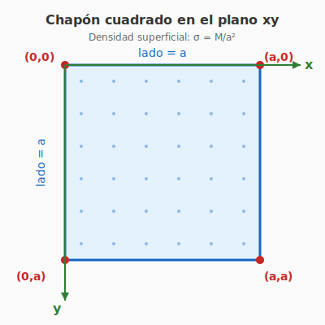
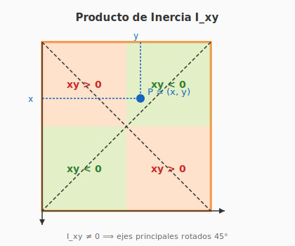
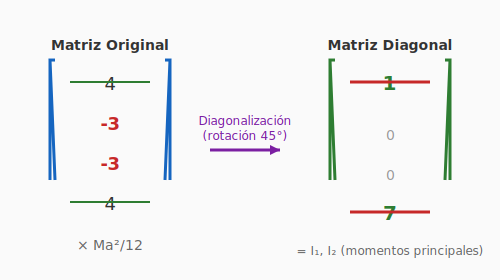
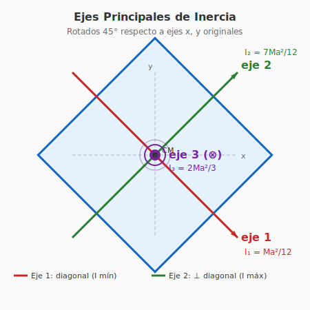

# Solución Ejercicio 25: Chapón cuadrado (Matriz de inercia y ejes principales)

**INSPT – UTN** | **Física Teórica I** | **Prof. Carlos Dibarbora**

---

## 📋 Enunciado

Calcular la **matriz de inercia** para un chapón cuadrado de lado $a$ y masa $M$ con vértices en $(0,0)$, $(0,a)$, $(a,0)$ y $(a,a)$. Obtener los **ejes principales de inercia** para el chapón, y sus **momentos de inercia** respecto a esos ejes.

### 🎨 Diagrama: Chapón en el plano xy

**Interpretación:** El chapón es una lámina cuadrada de lado $a$ en el plano $xy$, con vértices en los puntos indicados. La masa está distribuida uniformemente (densidad $\sigma = M/a^2$).

---

## 🎯 Estrategia

1. Calcular la **densidad superficial** de masa $\sigma = M/a^2$
2. Integrar sobre el área del cuadrado para obtener $I_{xx}$, $I_{yy}$, $I_{zz}$ y los productos de inercia $I_{xy}$, $I_{xz}$, $I_{yz}$
3. Construir la matriz de inercia
4. Diagonalizar la matriz para encontrar ejes principales y momentos principales

---

## 📐 Paso 1: Densidad superficial

El chapón es una lámina delgada de masa $M$ y área $a^2$, por lo tanto la densidad superficial es:

$$\sigma = \frac{M}{a^2}$$

El elemento de masa es:

$$dm = \sigma \, dA = \frac{M}{a^2} \, dx \, dy$$

---

## 📐 Paso 2: Cálculo de $I_{xx}$

El momento de inercia respecto al eje $x$ (que pasa por el origen) es:

$$I_{xx} = \int (y^2 + z^2) \, dm$$

Como el chapón está contenido en el plano $xy$, tenemos $z = 0$ para todos los puntos. Por lo tanto:

$$I_{xx} = \int y^2 \, dm = \int_0^a \int_0^a y^2 \cdot \frac{M}{a^2} \, dx \, dy$$

Resolviendo:

$$I_{xx} = \frac{M}{a^2} \int_0^a dx \int_0^a y^2 \, dy = \frac{M}{a^2} \cdot a \cdot \frac{a^3}{3}$$

$$\boxed{I_{xx} = \frac{M a^2}{3}}$$

---

## 📐 Paso 3: Cálculo de $I_{yy}$

Por simetría (el cuadrado es simétrico respecto al intercambio $x \leftrightarrow y$):

$$I_{yy} = \int x^2 \, dm = \int_0^a \int_0^a x^2 \cdot \frac{M}{a^2} \, dx \, dy$$

Resolviendo:

$$I_{yy} = \frac{M}{a^2} \int_0^a x^2 \, dx \int_0^a dy = \frac{M}{a^2} \cdot \frac{a^3}{3} \cdot a$$

$$\boxed{I_{yy} = \frac{M a^2}{3}}$$

> **Observación:** $I_{xx} = I_{yy}$ por la simetría del cuadrado.

---

## 📐 Paso 4: Cálculo de $I_{zz}$

El momento de inercia respecto al eje $z$ (perpendicular al chapón, pasando por el origen):

$$I_{zz} = \int (x^2 + y^2) \, dm$$

Esto es igual a $I_{xx} + I_{yy}$:

$$I_{zz} = \frac{M}{a^2} \int_0^a \int_0^a (x^2 + y^2) \, dx \, dy$$

Resolviendo:

$$I_{zz} = \frac{M}{a^2} \left[ \int_0^a x^2 dx \int_0^a dy + \int_0^a dx \int_0^a y^2 dy \right]$$

$$I_{zz} = \frac{M}{a^2} \left[ \frac{a^3}{3} \cdot a + a \cdot \frac{a^3}{3} \right] = \frac{M}{a^2} \cdot \frac{2a^4}{3}$$

$$\boxed{I_{zz} = \frac{2 M a^2}{3}}$$

---

## 📐 Paso 5: Cálculo de los productos de inercia

### Producto $I_{xy}$:

$$I_{xy} = \int x y \, dm = \int_0^a \int_0^a xy \cdot \frac{M}{a^2} \, dx \, dy$$

$$I_{xy} = \frac{M}{a^2} \int_0^a x \, dx \int_0^a y \, dy = \frac{M}{a^2} \cdot \frac{a^2}{2} \cdot \frac{a^2}{2}$$

$$\boxed{I_{xy} = \frac{M a^2}{4}}$$

### 🎨 Diagrama: Interpretación geométrica de $I_{xy}$

**Interpretación:** El producto de inercia $I_{xy}$ es **no nulo** porque el producto $xy$ es positivo en los cuadrantes 1° y 3° (rojos) y negativo en el 2° y 4° (verdes). La integral neta es **positiva** ($I_{xy} = Ma^2/4 > 0$), lo que indica el **acoplamiento** entre ejes $x$ e $y$, que se elimina al rotar 45° (ejes diagonales).

---

### Productos $I_{xz}$ e $I_{yz}$:

Como el chapón está en el plano $z = 0$, tenemos $z = 0$ en toda la integración:

$$I_{xz} = \int x z \, dm = 0$$

$$I_{yz} = \int y z \, dm = 0$$

$$\boxed{I_{xz} = I_{yz} = 0}$$

---

## 📐 Paso 6: Matriz de Inercia

Reuniendo todos los componentes:

$$\mathbf{I} = \begin{pmatrix}
I_{xx} & -I_{xy} & -I_{xz} \\
-I_{xy} & I_{yy} & -I_{yz} \\
-I_{xz} & -I_{yz} & I_{zz}
\end{pmatrix} = \begin{pmatrix}
\dfrac{Ma^2}{3} & -\dfrac{Ma^2}{4} & 0 \\
-\dfrac{Ma^2}{4} & \dfrac{Ma^2}{3} & 0 \\
0 & 0 & \dfrac{2Ma^2}{3}
\end{pmatrix}$$

Factorizando $\dfrac{Ma^2}{12}$:

$$\boxed{\mathbf{I} = \frac{Ma^2}{12} \begin{pmatrix} 4 & -3 & 0 \\ -3 & 4 & 0 \\ 0 & 0 & 8 \end{pmatrix}}$$

---

## 📐 Paso 7: Ejes Principales de Inercia

Para encontrar los ejes principales, debemos **diagonalizar** la matriz. El eje $z$ ya es un eje principal (porque $I_{xz} = I_{yz} = 0$), con momento principal:

$$I_3 = I_{zz} = \frac{2Ma^2}{3}$$

Para el subespacio $xy$, debemos diagonalizar la matriz $2 \times 2$:

$$\mathbf{I}_{xy} = \frac{Ma^2}{12} \begin{pmatrix} 4 & -3 \\ -3 & 4 \end{pmatrix}$$

### Ecuación característica:

$$\det(\mathbf{I}_{xy} - \lambda \mathbf{I}_2) = 0$$

$$\det \begin{pmatrix} 4 - \lambda & -3 \\ -3 & 4 - \lambda \end{pmatrix} = 0$$

$$(4 - \lambda)^2 - 9 = 0$$

$$(4 - \lambda)^2 = 9$$

$$4 - \lambda = \pm 3$$

Por lo tanto:

$$\lambda_1 = 1, \quad \lambda_2 = 7$$

### Momentos principales:

$$I_1 = \frac{Ma^2}{12} \cdot 1 = \frac{Ma^2}{12}$$

$$I_2 = \frac{Ma^2}{12} \cdot 7 = \frac{7Ma^2}{12}$$

$$I_3 = \frac{2Ma^2}{3} = \frac{8Ma^2}{12}$$

### Verificación (traza):

$$I_1 + I_2 = \frac{Ma^2}{12} + \frac{7Ma^2}{12} = \frac{8Ma^2}{12} = \frac{2Ma^2}{3} \checkmark$$

Esto confirma que la traza se conserva: $I_{xx} + I_{yy} = I_1 + I_2$

---

## 📐 Paso 8: Direcciones de los ejes principales

### 🎨 Diagrama: Diagonalización de la matriz 2×2

**Interpretación:** La matriz original tiene elementos **fuera de la diagonal** ($-3$), que representan el **acoplamiento** entre los ejes $x$ e $y$. Al rotar el sistema de coordenadas 45°, la matriz se **diagonaliza**: los elementos fuera de la diagonal se anulan y aparecen los **momentos principales** $I_1 = Ma^2/12$ (mínimo) e $I_2 = 7Ma^2/12$ (máximo) en la diagonal.

---

### Para $I_1 = \dfrac{Ma^2}{12}$ (autovalor $\lambda_1 = 1$):

$$(\mathbf{I}_{xy} - \lambda_1 \mathbf{I}_2) \vec{v}_1 = 0$$

$$\begin{pmatrix} 3 & -3 \\ -3 & 3 \end{pmatrix} \vec{v}_1 = 0$$

Esto da $v_{1x} = v_{1y}$, por lo tanto:

$$\vec{v}_1 = \frac{1}{\sqrt{2}}(1, 1, 0)$$

**Dirección:** diagonal del cuadrado (a 45°)

### Para $I_2 = \dfrac{7Ma^2}{12}$ (autovalor $\lambda_2 = 7$):

$$\begin{pmatrix} -3 & -3 \\ -3 & -3 \end{pmatrix} \vec{v}_2 = 0$$

Esto da $v_{2x} = -v_{2y}$, por lo tanto:

$$\vec{v}_2 = \frac{1}{\sqrt{2}}(1, -1, 0)$$

**Dirección:** otra diagonal del cuadrado (a -45°)

### Para $I_3 = \dfrac{2Ma^2}{12}$ (eje $z$):

$$\vec{v}_3 = (0, 0, 1)$$

---

## ✅ Resultados Finales

### Matriz de Inercia (en ejes $x, y, z$ originales):

$$\mathbf{I} = \frac{Ma^2}{12} \begin{pmatrix} 4 & -3 & 0 \\ -3 & 4 & 0 \\ 0 & 0 & 8 \end{pmatrix}$$

### Momentos Principales de Inercia:

| Momento Principal | Valor | Dirección |
|-------------------|-------|-----------|
| $I_1$ | $\dfrac{Ma^2}{12}$ | $\vec{v}_1 = \dfrac{1}{\sqrt{2}}(1, 1, 0)$ (diagonal a 45°) |
| $I_2$ | $\dfrac{7Ma^2}{12}$ | $\vec{v}_2 = \dfrac{1}{\sqrt{2}}(1, -1, 0)$ (diagonal a -45°) |
| $I_3$ | $\dfrac{8Ma^2}{12} = \dfrac{2Ma^2}{3}$ | $\vec{v}_3 = (0, 0, 1)$ (eje $z$) |

### Matriz Diagonal (en ejes principales):

$$\mathbf{I}_{\text{principal}} = \begin{pmatrix}
\dfrac{Ma^2}{12} & 0 & 0 \\
0 & \dfrac{7Ma^2}{12} & 0 \\
0 & 0 & \dfrac{8Ma^2}{12}
\end{pmatrix}$$

---

## 🔍 Interpretación Física

- **$I_1$ (mínimo):** El eje a 45° pasa por la **diagonal** del cuadrado, donde la masa está más **concentrada** cerca del eje → menor momento de inercia.

- **$I_2$ (máximo en el plano):** El eje perpendicular a la diagonal pasa por los **lados** del cuadrado, donde la masa está más **alejada** del eje → mayor momento de inercia.

- **$I_3$ (eje perpendicular):** Es la suma $I_1 + I_2$ (regla de perpendicular para figuras planas): $\frac{Ma^2}{12} + \frac{7Ma^2}{12} = \frac{8Ma^2}{12} = \frac{2Ma^2}{3}$ ✓

---

### 🎨 Diagrama: Ejes principales de inercia

**Interpretación:** Los ejes principales de inercia están **rotados 45°** respecto a los ejes $x, y$ originales. El eje 1 (por la diagonal) tiene el momento de inercia **mínimo** porque la masa está más concentrada cerca de ese eje. El eje 2 (perpendicular a la diagonal) tiene el momento **máximo** en el plano. El eje 3 es perpendicular al chapón.

---

## 📚 Referencias

- Goldstein, *Classical Mechanics*, Cap. 5
- Marion & Thornton, *Classical Dynamics*, Cap. 11
- Landau & Lifshitz, *Mechanics*, §32 (Tensor de Inercia)
