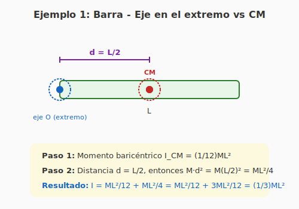
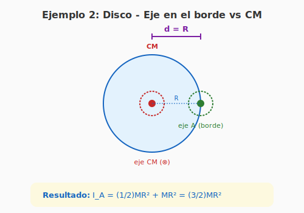
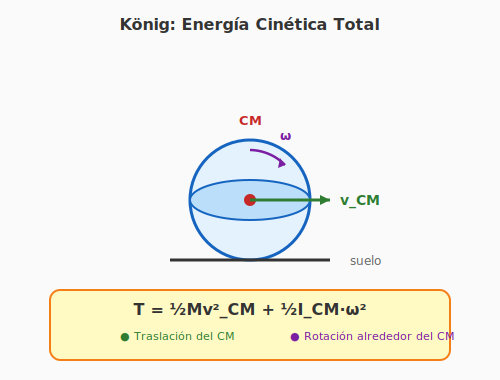
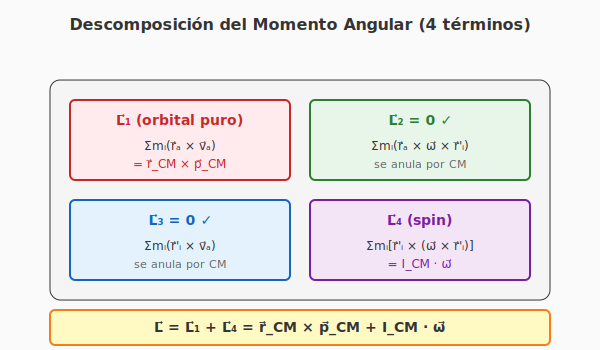
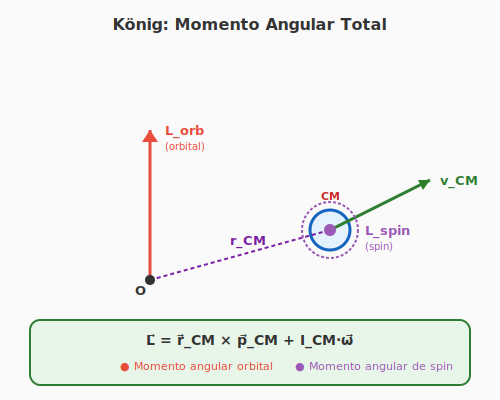
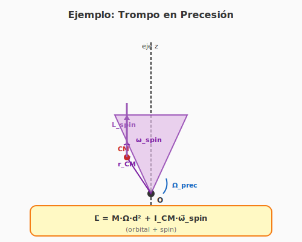
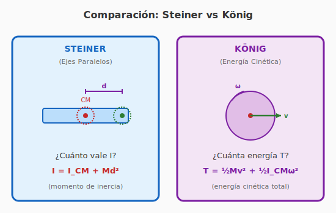

# Teoremas de König y Steiner (Ejes Paralelos y Energía Cinética)

**INSPT – UTN** | **Física Teórica I** | **Prof. Carlos Dibarbora**

---

## ⚠️ Aclaración importante: NO son el mismo teorema

En este documento presento **dos teoremas diferentes** que suelen confundirse:

| Teorema | ¿Qué calcula? | Fórmula |
|---------|---------------|---------|
| **Teorema de Steiner** (ejes paralelos) | Momento de inercia respecto a un eje paralelo al baricéntrico | $I = I_{\text{CM}} + Md^2$ |
| **Teorema de König** (energía cinética) | Energía cinética total separando traslación y rotación | $T = \frac{1}{2}Mv_{\text{CM}}^2 + \frac{1}{2}I_{\text{CM}}\omega^2$ |

> **Resumen rápido:** **Steiner** te da el **momento de inercia**; **König** te da la **energía cinética total**.

Aunque son diferentes, están **íntimamente relacionados** y se usan juntos frecuentemente en problemas de cuerpos rígidos.

---

# 📘 Parte 1: Teorema de Steiner (Ejes Paralelos)

## 🎯 ¿Qué es el Teorema de Steiner?

El **Teorema de Steiner** (también conocido como **Teorema de los Ejes Paralelos** o **Teorema de Huygens-Steiner**) nos permite:

> **Calcular el momento de inercia respecto a CUALQUIER eje paralelo, si conocemos el momento de inercia respecto al eje que pasa por el centro de masa (CM).**

### 👤 ¿Quién fue Steiner?

**Jakob Steiner** (1796–1863) fue un matemático **suizo**, nacido en Utzenstorf (Cantón de Berna, Suiza). Es considerado uno de los **más grandes geómetras** desde Apolonio de Perga. Trabajó principalmente en geometría sintética y publicó este teorema sobre momentos de inercia.

> **Dato histórico:** En realidad, este teorema ya había sido publicado antes por **Christiaan Huygens** (1629–1695), matemático y físico **holandés**, en su trabajo sobre oscilaciones de cuerpos rígidos. Por eso también se lo llama **Teorema de Huygens-Steiner**.

### 🌍 ¿En qué países se usa cada nombre?

| Nombre | Países |
|--------|--------|
| **Steiner** | Alemania, Austria, Suiza, Italia, Rusia, Europa del Este |
| **Huygens-Steiner** | Holanda, algunos textos de física teórica |
| **Parallel axis theorem** | Reino Unido, EE.UU., Australia (en inglés) |
| **Teorema de los ejes paralelos** | Latinoamérica, España (nombre genérico) |

---

## 📚 Enunciado del Teorema de Steiner

**Si un cuerpo rígido de masa $M$ tiene un momento de inercia $I_{\text{CM}}$ respecto a un eje que pasa por su centro de masa, entonces el momento de inercia $I$ respecto a cualquier eje paralelo al anterior, separado una distancia $d$, es:**

$$\boxed{I = I_{\text{CM}} + M d^2}$$

**Donde:**
- $I$: momento de inercia respecto al eje que **NO** pasa por el CM
- $I_{\text{CM}}$: momento de inercia respecto al eje **baricéntrico** (que pasa por el CM)
- $M$: masa total del cuerpo
- $d$: distancia perpendicular entre los dos ejes paralelos

### 🎨 Diagrama: Visualización del teorema

**Interpretación del diagrama:**
- El **eje rojo** pasa por el centro de masa (CM) → momento $I_{\text{CM}}$
- El **eje verde** es paralelo al rojo, separado una distancia $d$ → momento $I$
- Los dos ejes son **paralelos** (cruzan el papel perpendicularmente, por eso se dibujan con $\otimes$)

---

## 🔍 Demostración del Teorema de Steiner

### Paso 1: Plantear el problema

Consideremos un sistema de partículas con masas $m_i$ en posiciones $\vec{r}_i$ relativas al **origen arbitrario** $O$. El momento de inercia respecto al eje que pasa por $O$ es:

$$I_O = \sum_i m_i r_i^2$$

donde $r_i$ es la **distancia perpendicular** desde la partícula $i$ hasta el eje.

### Paso 2: Definir el centro de masa

Definimos el vector de posición del CM:
$$\vec{r}_{\text{CM}} = \frac{1}{M} \sum_i m_i \vec{r}_i$$

La distancia del CM al eje es:
$$d = |\vec{r}_{\text{CM}} \cdot \hat{n}|$$

donde $\hat{n}$ es el vector unitario paralelo al eje.

### Paso 3: Usar coordenadas relativas al CM

Es más conveniente medir las posiciones desde el CM. Definimos:
$$\vec{r}_i = \vec{r}_{\text{CM}} + \vec{r}_i'$$

donde $\vec{r}_i'$ es la posición de la partícula relativa al CM.

### Paso 4: Calcular $I_O$ en términos de $\vec{r}_i'$

La distancia perpendicular desde la partícula hasta el eje es:
$$r_i^2 = |\vec{r}_{\text{CM}} + \vec{r}_i'|^2 - (\vec{r}_{\text{CM}} + \vec{r}_i') \cdot \hat{n}|^2$$

Expandiendo el cuadrado:
$$r_i^2 = |\vec{r}_{\text{CM}}|^2 + 2 \vec{r}_{\text{CM}} \cdot \vec{r}_i' + |\vec{r}_i'|^2 - \text{(términos con } \hat{n}\text{)}$$

Para ejes paralelos (los términos con $\hat{n}$ se cancelan convenientemente):
$$r_i^2 = d^2 + 2 \vec{r}_{\text{CM}} \cdot \vec{r}_i' + r_i'^2$$

### Paso 5: Sumar sobre todas las partículas

Multiplicamos por $m_i$ y sumamos:

$$I_O = \sum_i m_i r_i^2 = \sum_i m_i (d^2 + 2 \vec{r}_{\text{CM}} \cdot \vec{r}_i' + r_i'^2)$$

Separando los tres términos:

$$I_O = d^2 \sum_i m_i + 2 \vec{r}_{\text{CM}} \cdot \sum_i m_i \vec{r}_i' + \sum_i m_i r_i'^2$$

### Paso 6: Evaluar cada término

**Primer término:**
$$d^2 \sum_i m_i = M d^2$$

**Segundo término:** Como $\vec{r}_i' = \vec{r}_i - \vec{r}_{\text{CM}}$:
$$\sum_i m_i \vec{r}_i' = \sum_i m_i \vec{r}_i - \vec{r}_{\text{CM}} \sum_i m_i = M \vec{r}_{\text{CM}} - M \vec{r}_{\text{CM}} = 0$$

**¡Este término se anula porque el CM es el "centro de masa"!** Por definición, el promedio ponderado de las posiciones relativas al CM es cero.

**Tercer término:**
$$\sum_i m_i r_i'^2 = I_{\text{CM}}$$

Es exactamente el momento de inercia respecto al eje que pasa por el CM.

### Paso 7: Resultado final

Juntando todo:

$$\boxed{I_O = I_{\text{CM}} + M d^2}$$

¡Queda demostrado el teorema de Steiner! 🎉

---

## 💡 Ejemplo 1 (Steiner): Barra homogénea (eje en el extremo)

**Problema:** Calcular el momento de inercia de una barra homogénea de masa $M$ y longitud $L$ respecto a un eje perpendicular que pasa por uno de sus extremos.

### 🎨 Diagrama del problema

### Solución paso a paso

**Paso 1: Conocer el momento baricéntrico**

Para una barra homogénea respecto al CM (ya calculado en la teoría):
$$I_{\text{CM}} = \frac{1}{12} M L^2$$

**Paso 2: Identificar la distancia $d$**

El CM está en el centro de la barra. El eje en el extremo está a una distancia:
$$d = \frac{L}{2}$$

**Paso 3: Aplicar el teorema de Steiner**

$$I = I_{\text{CM}} + M d^2 = \frac{1}{12} M L^2 + M \left(\frac{L}{2}\right)^2$$

$$I = \frac{1}{12} M L^2 + M \cdot \frac{L^2}{4}$$

**Paso 4: Simplificar**

$$I = \frac{1}{12} M L^2 + \frac{3}{12} M L^2 = \frac{1 + 3}{12} M L^2$$

$$\boxed{I = \frac{1}{3} M L^2}$$

### Verificación

Podríamos verificar este resultado integrando directamente:

$$I = \int_0^L x^2 \frac{M}{L} dx = \frac{M}{L} \cdot \frac{L^3}{3} = \frac{1}{3} M L^2 \checkmark$$

¡Coincide! El teorema de Steiner nos ahorró el cálculo de la integral.

---

## 💡 Ejemplo 2 (Steiner): Disco sólido (eje en el borde)

**Problema:** Calcular el momento de inercia de un disco sólido de masa $M$ y radio $R$ respecto a un eje perpendicular que pasa por un punto de su circunferencia.

### 🎨 Diagrama del problema

### Solución paso a paso

**Paso 1: Conocer el momento baricéntrico**

Para un disco sólido respecto a su eje central:
$$I_{\text{CM}} = \frac{1}{2} M R^2$$

**Paso 2: Identificar la distancia $d$**

El CM está en el centro del disco. El eje en el borde está a una distancia:
$$d = R$$

**Paso 3: Aplicar el teorema de Steiner**

$$I_A = I_{\text{CM}} + M d^2 = \frac{1}{2} M R^2 + M R^2$$

$$\boxed{I_A = \frac{3}{2} M R^2}$$

### Aplicación práctica

Este resultado es útil para el **Ejercicio 16 del TP6** (disco que rota alrededor de un punto de su periferia), donde necesitamos $I_A = \frac{3}{2} M R^2$.

---

## 📋 Tabla de momentos de inercia comunes (usando Steiner)

| Cuerpo | $I_{\text{CM}}$ (eje baricéntrico) | Eje paralelo | $I$ |
|--------|-----------------------------------|--------------|-----|
| Barra ($M, L$) | $\frac{1}{12}ML^2$ (⊥ al CM) | Extremo | $\frac{1}{3}ML^2$ |
| Disco ($M, R$) | $\frac{1}{2}MR^2$ (central) | Borde | $\frac{3}{2}MR^2$ |
| Esfera ($M, R$) | $\frac{2}{5}MR^2$ (diámetro) | Distancia $d$ | $\frac{2}{5}MR^2 + Md^2$ |
| Cilindro ($M, R$) | $\frac{1}{2}MR^2$ (eje) | Distancia $d$ | $\frac{1}{2}MR^2 + Md^2$ |
| Aro ($M, R$) | $MR^2$ (diámetro) | Borde | $2MR^2$ |

---

# 📗 Parte 2: Teorema de König (Energía Cinética)

## 🎯 ¿Qué es el Teorema de König?

El **Teorema de König** nos permite:

> **Calcular la energía cinética total de un cuerpo rígido separando el movimiento en dos partes: la traslación del centro de masa y la rotación alrededor del CM.**

Es **especialmente útil** cuando un cuerpo se mueve y rota al mismo tiempo (por ejemplo, una rueda que rueda por una calle, o un cilindro que baja por una rampa).

### 👤 ¿Quién fue König?

**Samuel König** (1712–1757) fue un matemático y filósofo **alemán** (nacido en Büdingen, Alemania). Aunque su nombre se asocia a este teorema, en realidad fue demostrado por **Christian Huygens** y luego formalizado por König. También hay otra familia de matemáticos **König húngaros** (Julius König, Dénes Kőnig), pero están asociados a **otros teoremas** (teoría de conjuntos, grafos).

> **Dato histórico:** König trabajó en la Academia de Ciencias de Berlín y tuvo una famosa disputa con **Voltaire** y **Maupertuis** sobre el principio de mínima acción. Era un pensador versátil que incursionó en matemáticas, filosofía y física.

### 🌍 ¿En qué países se usa cada nombre?

| Nombre | Países |
|--------|--------|
| **König** | Alemania, Austria, Rusia, Europa del Este, Latinoamérica |
| **König-Huygens** | Francia, algunos textos avanzados |
| **Teorema de la energía cinética** | España (nombre genérico) |
| **Koenig's theorem** | Inglaterra, EE.UU. (en inglés) |

---

## 📚 Enunciado del Teorema de König

**La energía cinética total $T$ de un cuerpo rígido se puede escribir como la suma de dos términos:**

$$\boxed{T = \underbrace{\frac{1}{2} M v_{\text{CM}}^2}_{\text{traslación del CM}} + \underbrace{\frac{1}{2} I_{\text{CM}} \omega^2}_{\text{rotación alrededor del CM}}}$$

**Donde:**
- $M$: masa total del cuerpo
- $v_{\text{CM}}$: velocidad del centro de masa
- $I_{\text{CM}}$: momento de inercia respecto a un eje que pasa por el CM (paralelo al eje instantáneo de rotación)
- $\omega$: velocidad angular del cuerpo

### 🎯 ¿Por qué es tan útil este teorema?

Sin este teorema, calcular la energía cinética de un cuerpo que se mueve Y rota simultáneamente sería **muy complicado**, porque tendríamos que sumar la energía cinética de cada partícula individualmente:

$$T = \sum_i \frac{1}{2} m_i v_i^2$$

¡Con König es mucho más simple! Solo necesitamos:
1. La velocidad del CM ($v_{\text{CM}}$)
2. La velocidad angular ($\omega$)
3. El momento de inercia baricéntrico ($I_{\text{CM}}$)

### 🎨 Diagrama: König para energía cinética

**Interpretación:** Un cilindro que **rueda sin deslizar** tiene **dos contribuciones** a su energía:
- **Traslación del CM** (vector verde $v_{\text{CM}}$)
- **Rotación alrededor del CM** (vector violeta $\omega$)

König dice que simplemente **sumamos ambas contribuciones** para obtener la energía total.

---

## 🔍 Demostración del Teorema de König

### Paso 1: Energía cinética de cada partícula

La energía cinética total es la suma de las energías cinéticas de todas las partículas:

$$T = \sum_i \frac{1}{2} m_i v_i^2$$

### Paso 2: Expresar $v_i$ en términos del CM

La velocidad de cada partícula se puede descomponer en:
- La velocidad del CM: $\vec{v}_{\text{CM}}$
- La velocidad relativa al CM: $\vec{v}_i'$

Entonces:
$$\vec{v}_i = \vec{v}_{\text{CM}} + \vec{v}_i'$$

La magnitud al cuadrado es:
$$v_i^2 = v_{\text{CM}}^2 + 2 \vec{v}_{\text{CM}} \cdot \vec{v}_i' + v_i'^2$$

### Paso 3: Sustituir en la energía

$$T = \sum_i \frac{1}{2} m_i \left( v_{\text{CM}}^2 + 2 \vec{v}_{\text{CM}} \cdot \vec{v}_i' + v_i'^2 \right)$$

Separando en tres sumas:

$$T = \frac{1}{2} v_{\text{CM}}^2 \sum_i m_i + \vec{v}_{\text{CM}} \cdot \sum_i m_i \vec{v}_i' + \frac{1}{2} \sum_i m_i v_i'^2$$

### Paso 4: Evaluar cada término

**Primer término:**
$$\frac{1}{2} v_{\text{CM}}^2 \sum_i m_i = \frac{1}{2} M v_{\text{CM}}^2$$

**Segundo término:** Por definición del CM, $\sum_i m_i \vec{r}_i' = 0$, entonces $\sum_i m_i \vec{v}_i' = 0$. Por lo tanto, **este término se anula**.

**Tercer término:**
$$\frac{1}{2} \sum_i m_i v_i'^2 = \frac{1}{2} I_{\text{CM}} \omega^2$$

(Esto se debe a que para rotación pura alrededor del CM, $\sum_i m_i v_i'^2 = I_{\text{CM}} \omega^2$).

### Paso 5: Resultado final

$$\boxed{T = \frac{1}{2} M v_{\text{CM}}^2 + \frac{1}{2} I_{\text{CM}} \omega^2}$$

¡Queda demostrado el teorema de König! 🎉

---

## 💡 Ejemplo 3 (König): Cilindro rodando por una superficie

**Problema:** Un cilindro sólido de masa $M = 2$ kg y radio $R = 0,3$ m rueda sin deslizar con velocidad $v_{\text{CM}} = 4$ m/s. Calcular su energía cinética total.

### Datos
- Masa: $M = 2$ kg
- Radio: $R = 0,3$ m
- Velocidad del CM: $v_{\text{CM}} = 4$ m/s
- Momento baricéntrico (cilindro sólido): $I_{\text{CM}} = \frac{1}{2}MR^2$

### Solución paso a paso

**Paso 1: Calcular el momento baricéntrico**

$$I_{\text{CM}} = \frac{1}{2} M R^2 = \frac{1}{2} \cdot 2 \cdot (0,3)^2 = \frac{1}{2} \cdot 2 \cdot 0,09 = 0,09 \text{ kg·m}^2$$

**Paso 2: Encontrar la velocidad angular**

Como rueda sin deslizar: $v_{\text{CM}} = \omega R$, entonces:

$$\omega = \frac{v_{\text{CM}}}{R} = \frac{4}{0,3} = 13,33 \text{ rad/s}$$

**Paso 3: Aplicar el teorema de König**

**Término de traslación:**
$$T_{\text{tras}} = \frac{1}{2} M v_{\text{CM}}^2 = \frac{1}{2} \cdot 2 \cdot (4)^2 = \frac{1}{2} \cdot 2 \cdot 16 = 16 \text{ J}$$

**Término de rotación:**
$$T_{\text{rot}} = \frac{1}{2} I_{\text{CM}} \omega^2 = \frac{1}{2} \cdot 0,09 \cdot (13,33)^2 \approx 8 \text{ J}$$

**Energía total:**
$$T = T_{\text{tras}} + T_{\text{rot}} = 16 + 8 = \boxed{24 \text{ J}}$$

### 💡 Interpretación física

Notá que para un cilindro sólido, la energía se reparte así:
- **2/3** de la energía es de traslación ($\frac{1}{2}Mv_{\text{CM}}^2$)
- **1/3** de la energía es de rotación ($\frac{1}{2}I_{\text{CM}}\omega^2 = \frac{1}{4}Mv_{\text{CM}}^2$)

> **Dato curioso:** Para un cilindro hueco (aro), la mitad de la energía es de rotación. Por eso los aros son más difíciles de detener rodando.

---

## 💡 Ejemplo 3.5 (König): Versión para momento angular

El **Teorema de König** también se aplica al **momento angular total** $\vec{L}$ de un cuerpo rígido. Esta es la versión que mostró tu profesor en la pizarra.

### Enunciado (versión momento angular)

**El momento angular total $\vec{L}$ de un cuerpo rígido, calculado respecto a un punto fijo $O$, se puede descomponer en dos partes:**

$$\boxed{\vec{L} = \underbrace{\vec{r}_{\text{CM}} \times \vec{p}_{\text{CM}}}_{\text{momento angular orbital}} + \underbrace{\mathbf{I}_{\text{CM}} \vec{\omega}}_{\text{momento angular de spin}}}$$

**Donde:**
- $\vec{r}_{\text{CM}}$: vector posición del CM respecto a $O$
- $\vec{p}_{\text{CM}} = M\vec{v}_{\text{CM}}$: momento lineal del CM
- $\mathbf{I}_{\text{CM}}$: tensor de inercia respecto al CM
- $\vec{\omega}$: velocidad angular del cuerpo

### 🔍 Demostración (siguiendo la pizarra de tu profesor)

**Paso 1: Momento angular total**

El momento angular total de un sistema de partículas respecto al origen $O$ es:

$$\vec{L} = \sum_i m_i (\vec{r}_i \times \vec{v}_i)$$

donde $\vec{r}_i$ y $\vec{v}_i$ son la posición y velocidad de la partícula $i$.

**Paso 2: Descomposición de $\vec{r}_i$ y $\vec{v}_i$**

Definimos:
- $\vec{r}_i = \vec{r}_a + \vec{r}_i'$ (donde $\vec{r}_a$ es la posición del CM y $\vec{r}_i'$ es la posición relativa al CM)
- $\vec{v}_i = \vec{v}_a + \vec{v}_i' = \vec{v}_a + \vec{\omega} \times \vec{r}_i'$

**Paso 3: Expandir el producto cruz**

Sustituyendo:
$$\vec{L} = \sum_i m_i (\vec{r}_a + \vec{r}_i') \times (\vec{v}_a + \vec{\omega} \times \vec{r}_i')$$

Esto genera **cuatro términos**:

$$\vec{L} = \underbrace{\sum_i m_i (\vec{r}_a \times \vec{v}_a)}_{\vec{L}_1} + \underbrace{\sum_i m_i (\vec{r}_a \times \vec{\omega} \times \vec{r}_i')}_{\vec{L}_2} + \underbrace{\sum_i m_i (\vec{r}_i' \times \vec{v}_a)}_{\vec{L}_3} + \underbrace{\sum_i m_i (\vec{r}_i' \times \vec{\omega} \times \vec{r}_i')}_{\vec{L}_4}$$

### 🎨 Diagrama: Los 4 términos de la descomposición

**Interpretación:** Los **dos términos nulos** ($\vec{L}_2$ y $\vec{L}_3$) se anulan gracias a la **definición del centro de masa**. Solo sobreviven $\vec{L}_1$ (orbital puro) y $\vec{L}_4$ (spin).

**Paso 4: Evaluar cada término**

**Término $\vec{L}_1$: Momento angular orbital "puro"**

$$\vec{L}_1 = \sum_i m_i (\vec{r}_a \times \vec{v}_a) = (\vec{r}_a \times \vec{v}_a) \underbrace{\sum_i m_i}_{=M} = M(\vec{r}_a \times \vec{v}_a) = \vec{r}_{\text{CM}} \times \vec{p}_{\text{CM}}$$

**Término $\vec{L}_2$: Se anula por definición de CM**

$$\vec{L}_2 = \sum_i m_i (\vec{r}_a \times \vec{\omega} \times \vec{r}_i') = \vec{r}_a \times \vec{\omega} \times \sum_i m_i \vec{r}_i' = 0$$

porque por definición del CM: $\sum_i m_i \vec{r}_i' = 0$

**Término $\vec{L}_3$: Se anula si el CM es el origen de referencia**

$$\vec{L}_3 = \sum_i m_i (\vec{r}_i' \times \vec{v}_a) = \left(\sum_i m_i \vec{r}_i'\right) \times \vec{v}_a = 0$$

(esto se anula porque otra vez $\sum_i m_i \vec{r}_i' = 0$)

> **Nota de tu profesor:** En la pizarra, $\vec{v}_a$ aparece como la velocidad del CM. Si el CM está en reposo ($\vec{v}_a = 0$), entonces $\vec{L}_3$ se anula trivialmente.

**Término $\vec{L}_4$: Momento angular de spin**

$$\vec{L}_4 = \sum_i m_i (\vec{r}_i' \times \vec{\omega} \times \vec{r}_i')$$

Usando la identidad del triple producto vectorial:
$$\vec{r}_i' \times (\vec{\omega} \times \vec{r}_i') = \vec{\omega} (\vec{r}_i' \cdot \vec{r}_i') - \vec{r}_i' (\vec{r}_i' \cdot \vec{\omega})$$

Sumando sobre todas las partículas:
$$\vec{L}_4 = \sum_i m_i [\vec{\omega} r_i'^2 - \vec{r}_i' (\vec{r}_i' \cdot \vec{\omega})]$$

Esto es exactamente la definición del **tensor de inercia baricéntrico** $\mathbf{I}_{\text{CM}}$ actuando sobre $\vec{\omega}$:

$$\vec{L}_4 = \mathbf{I}_{\text{CM}} \vec{\omega}$$

**Paso 5: Resultado final**

Sumando los términos no nulos:

$$\vec{L} = \vec{L}_1 + \vec{L}_4$$

$$\boxed{\vec{L} = \vec{r}_{\text{CM}} \times \vec{p}_{\text{CM}} + \mathbf{I}_{\text{CM}} \vec{\omega}}$$

¡Queda demostrada la versión de momento angular del Teorema de König! 🎉

### 🎨 Diagrama: König para momento angular

**Interpretación:** El momento angular total respecto al origen $O$ tiene dos contribuciones vectoriales:
- **Momento angular orbital** ($\vec{L}_{orb} = \vec{r}_{CM} \times \vec{p}_{CM}$): viene del CM "orbitando" alrededor de $O$
- **Momento angular de spin** ($\vec{L}_{spin} = \mathbf{I}_{CM} \vec{\omega}$): viene de la rotación sobre el propio eje del cuerpo

### 📋 Comparación de las tres versiones de König

| Versión | Magnitud | Fórmula |
|---------|----------|---------|
| **Energía cinética** | $T$ | $T = \frac{1}{2}Mv_{\text{CM}}^2 + \frac{1}{2}I_{\text{CM}}\omega^2$ |
| **Momento angular** (escalar) | $L$ | $L = L_{\text{orbital}} + I_{\text{CM}}\omega$ |
| **Momento angular** (vectorial) | $\vec{L}$ | $\vec{L} = \vec{r}_{\text{CM}} \times \vec{p}_{\text{CM}} + \mathbf{I}_{\text{CM}} \vec{\omega}$ |

> **Conclusión:** El Teorema de König tiene **dos versiones equivalentes**: una para **energía cinética** y otra para **momento angular**. Ambas separan la contribución del movimiento del CM de la rotación interna.

### 💡 Ejemplo: Aplicación a un trompo

**Problema:** Un trompo con momento de inercia $I_{\text{CM}} = 0,01$ kg·m² y masa $M = 0,5$ kg gira con velocidad angular $\omega = 100$ rad/s alrededor de su eje. El CM está a una distancia $d = 0,05$ m del punto de apoyo. Calcular el momento angular total respecto al punto de apoyo.

**Solución:**

**Momento angular orbital (del CM "orbitando" alrededor del punto de apoyo):**
$$L_{\text{orbital}} = M v_{\text{CM}} d$$

Pero además el trompo **precesa** con velocidad angular $\Omega$ alrededor del eje vertical. La velocidad del CM es:
$$v_{\text{CM}} = \Omega d$$

Entonces:
$$L_{\text{orbital}} = M \Omega d^2$$

**Momento angular de spin (rotación sobre su propio eje):**
$$L_{\text{spin}} = I_{\text{CM}} \omega$$

**Momento angular total:**
$$L = M \Omega d^2 + I_{\text{CM}} \omega$$

Esto es la base para entender la **precesión** (Ej. 27-29 del TP6).

### 🎨 Diagrama: Trompo con precesión

**Interpretación:** Un trompo tiene **dos rotaciones simultáneas**:
- **Spin** ($\omega_{spin}$): rotación rápida sobre su propio eje (vector violeta)
- **Precesión** ($\Omega_{prec}$): rotación lenta alrededor del eje vertical (vector azul)

König separa el momento angular en estas dos contribuciones.

### 🎨 Diagrama: Comparación visual Steiner vs König

**Interpretación:** La imagen resume las diferencias clave:

| | Steiner (izquierda) | König (derecha) |
|---|---|---|
| **Pregunta** | ¿Cuánto vale $I$? | ¿Cuánta energía $T$? |
| **Fórmula** | $I = I_{CM} + Md²$ | $T = ½Mv² + ½I_{CM}ω²$ |
| **Visual** | Eje CM + eje paralelo | CM moviéndose + rotación |

---

Aunque son teoremas diferentes, **Steiner y König se complementan**:

| Situación | Teorema a usar |
|-----------|----------------|
| Necesito el **momento de inercia** respecto a un eje que no pasa por el CM | **Steiner**: $I = I_{\text{CM}} + Md^2$ |
| Necesito la **energía cinética total** de un cuerpo que se mueve y rota | **König**: $T = \frac{1}{2}Mv_{\text{CM}}^2 + \frac{1}{2}I_{\text{CM}}\omega^2$ |
| Necesito la energía cinética usando un eje que no pasa por el CM | **Ambos juntos** (ver siguiente ejemplo) |

## 💡 Ejemplo 4: Combinando Steiner y König

**Problema:** Un cilindro rueda sin deslizar. Calcular su energía cinética usando el teorema de König, **pero aplicado a un eje que no pasa por el CM** (por ejemplo, el punto de contacto con el piso).

### Solución con König "puro"

Usamos König directamente con el momento baricéntrico:

$$T = \frac{1}{2} M v_{\text{CM}}^2 + \frac{1}{2} I_{\text{CM}} \omega^2$$

### Solución alternativa con Steiner + König

**Paso 1: Usar Steiner para encontrar el momento respecto al punto de contacto**

El punto de contacto está a una distancia $d = R$ del CM:

$$I_{\text{contacto}} = I_{\text{CM}} + M R^2 = \frac{1}{2} M R^2 + M R^2 = \frac{3}{2} M R^2$$

**Paso 2: Notar que el punto de contacto está instantáneamente en reposo**

Como el cilindro rueda sin deslizar, el punto de contacto con el piso tiene velocidad instantánea **cero**. Por lo tanto, **toda la energía cinética es de rotación pura alrededor del punto de contacto**:

$$T = \frac{1}{2} I_{\text{contacto}} \omega^2 = \frac{1}{2} \cdot \frac{3}{2} M R^2 \cdot \omega^2 = \frac{3}{4} M R^2 \omega^2$$

Usando $v_{\text{CM}} = \omega R$:

$$T = \frac{3}{4} M v_{\text{CM}}^2$$

**Paso 3: Verificar que ambas formas dan el mismo resultado**

Con König "puro":
$$T = \frac{1}{2} M v_{\text{CM}}^2 + \frac{1}{2} \cdot \frac{1}{2} M R^2 \cdot \omega^2 = \frac{1}{2} M v_{\text{CM}}^2 + \frac{1}{4} M R^2 \omega^2$$

Usando $v_{\text{CM}}^2 = R^2 \omega^2$:
$$T = \frac{1}{2} M v_{\text{CM}}^2 + \frac{1}{4} M v_{\text{CM}}^2 = \frac{3}{4} M v_{\text{CM}}^2 \checkmark$$

¡Las dos formas dan el mismo resultado! Esto demuestra que **Steiner y König son consistentes entre sí**.

---

## 🎯 Aplicaciones en el TP6

| Teorema | Ejercicios del TP6 |
|---------|---------------------|
| **Steiner** | Ej. 9 (barra en pared), Ej. 11 (varilla + disco), Ej. 16 (disco en periferia), Ej. 21b |
| **König** | Ej. 3 (disco rodando), Ej. 4 (esfera en planos), Ej. 8 (aro con resorte), Ej. 11 (varilla + disco) |
| **Ambos juntos** | Ej. 11, Ej. 12 (cilindro con tabla) |

---

## 📚 Referencias

1. **Goldstein**, *Classical Mechanics*, Cap. 5, Sec. 5.2 (Steiner) y Sec. 5.3 (König)
2. **Landau & Lifshitz**, *Mechanics*, §32 (Tensor de inercia)
3. **Marion & Thornton**, *Classical Dynamics*, Cap. 11
4. **Hibbeler**, *Engineering Mechanics: Dynamics*, Cap. 17
