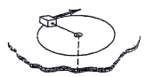
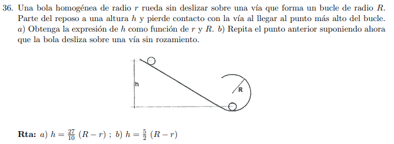
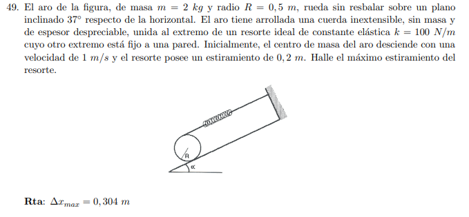

# TP6 - Dinámica del Rígido

**INSPT – UTN** | **Física Teórica I** | **Prof. Carlos Dibarbora**

---

## 📝 Enunciados (2026)

### Ejercicio 1: Piedra de amolar (Fricción y torque)
Una piedra de amolar de 60 kg y 0,6 m de diámetro tiene un momento de inercia alrededor de su eje de rotación de 2,7 kg·m². Ud. presiona contra el borde con un cuchillo con una fuerza normal de 50 N. Entre la piedra y el cuchillo el coeficiente de rozamiento cinético es de 0,6 y hay un momento de fricción de 5 N·m entre el eje de la piedra y los cojinetes.

a) ¿Cuál es módulo de la fuerza que debe aplicarse al extremo de una manivela de 0,5 m de brazo para llevar a la piedra desde el reposo hasta 120 rpm en 9 segundos?
b) Una vez que la piedra alcanza esa velocidad angular, ¿qué fuerza tangencial en el extremo de la manivela se necesita para mantenerla constante?

  🔄 Torque
  🛠️ Fricción
  ⭐⭐⭐ Difícil
  ⏱️ 40 min

- [ ] Sin empezar

**Pistas:**
- Usa $\tau = I\alpha$ para encontrar $\alpha$
- $\omega_f = \omega_0 + \alpha t$ → despeja $\alpha$
- Fuerza tangencial: $F_t = \frac{\tau}{r}$

---

### Ejercicio 2: Máquina de Atwood (Polea con masa)
En una máquina de Atwood, calcular la aceleración de los bloques y las fuerzas en la cuerda si esta no resbala sobre la polea.

  🔄 Atwood
  📐 Polea
  ⭐⭐ Medio
  ⏱️ 25 min

- [ ] Sin empezar

**Pistas:**
- Momento de inercia de la polea: $I = \frac{1}{2}MR^2$
- Ecuaciones: $m_1g - T_1 = m_1a$, $T_2 - m_2g = m_2a$, $\tau = I\alpha = (T_1 - T_2)R$

---

### Ejercicio 3: Disco rodando (Conservación de energía)
Un disco sólido rueda sin resbalar sobre una superficie plana con una rapidez constante de 2 m/s. ¿Hasta qué altura máxima puede subir por una rampa de 30°?

  🔄 Rodadura
  ⚡ Energía
  ⭐⭐ Medio
  ⏱️ 20 min

- [ ] Sin empezar

**Pistas:**
- Energía inicial: $E_i = \frac{1}{2}mv^2 + \frac{1}{2}I\omega^2$ (con $v = \omega R$)
- Energía final: $E_f = mgh$
- Conservación: $E_i = E_f$

---

### Ejercicio 4: Esfera rodando (Plano inclinado)
Se deja caer una esfera desde la parte superior de un plano inclinado 37° cuya altura es 8 m. La esfera, debido al rozamiento rueda sin deslizar hasta la parte inferior, sigue rodando de igual manera por un plano horizontal hasta llegar a otro plano inclinado también 37° con el que tiene rozamiento despreciable. ¿Hasta qué altura asciende por este último plano?

  🔄 Esfera
  🎯 Conservación
  ⭐⭐⭐ Difícil
  ⏱️ 35 min

- [ ] Sin empezar

**Pistas:**
- Momento de inercia de esfera: $I = \frac{2}{5}mR^2$
- Energía se conserva (rozamiento no disipativo en rodadura sin deslizamiento)
- En el segundo plano (sin rozamiento), solo $K$ traslacional importa

---

### Ejercicio 5: Volante y placa (Acoplamiento)
El volante cilíndrico de un embrague tiene una masa de 2 kg, un radio de 0,20 m y gira a 500 rpm. La placa, también cilindrica, de 4 kg de masa y 0,10 m de radio gira a 2000 rpm. Calcular la velocidad angular común al acoplarse. ¿Se conserva la energía cinética en este proceso?

  🔄 Acoplamiento
  📐 L angular
  ⭐⭐⭐ Difícil
  ⏱️ 30 min

- [ ] Sin empezar

**Pistas:**
- Conservación de $L$: $I_1\omega_1 + I_2\omega_2 = (I_1 + I_2)\omega_f$
- $I_{\text{volante}} = \frac{1}{2}m_1R_1^2$, $I_{\text{placa}} = \frac{1}{2}m_2R_2^2$
- Energía: $E_i \neq E_f$ (disipación en acoplamiento)

---

### Ejercicio 6: Bloque girando (Cuerda enrollada)
Un pequeño bloque de 0,03 kg de masa gira en una mesa sin fricción atado por un cordón que pasa por un orificio como se indica en la figura. El bloque está inicialmente girando a una distancia de 0,2 m del agujero con una velocidad angular de 1,75 rad/s. Se tira del cordón hacia abajo acortando el radio de la circunferencia que describe el bloque a 0,1 m.

a) ¿Qué valor tiene ahora la velocidad angular?
b) Cuánto trabajo se efectuó al tirar del cordón?

  🔄 Conservación
  ⚡ Trabajo
  ⭐⭐ Medio
  ⏱️ 25 min

- [ ] Sin empezar

**Pistas:**
- Conservación de $L$: $mr_1^2\omega_1 = mr_2^2\omega_2$
- Trabajo: $W = \Delta E_c = \frac{1}{2}I_2\omega_2^2 - \frac{1}{2}I_1\omega_1^2$

---

### Ejercicio 7: Bola en bucle (Fuerza normal)
Una bola homogénea de radio $r$ rueda sin deslizar sobre una vía que forma un bucle de radio $R$. Parte del reposo a una altura $h$ y pierde contacto con la vía al llegar al punto más alto del bucle.

a) Obtenga la expresión de $h$ como función de $r$ y $R$.
b) Repita el punto anterior suponiendo ahora que la bola desliza sobre una vía sin rozamiento.

**Respuesta:** a) $h = \frac{27}{10}(R - r)$; b) $h = \frac{5}{2}(R - r)$

  🔄 Bucle
  🎯 Fuerza normal
  ⭐⭐⭐ Difícil
  ⏱️ 45 min

- [ ] Sin empezar

**Pistas:**
- En el punto más alto: $N = 0$ → $mg = \frac{mv^2}{R}$
- Conservación de energía: $mgh = \frac{1}{2}mv^2 + \frac{1}{2}I\omega^2 + mg(2R)$
- Para bola: $I = \frac{2}{5}mR^2$, $v = \omega R$

---

### Ejercicio 8: Aro con resorte (Plano inclinado)
El aro de la figura, de masa $m = 2$ kg y radio $R = 0,5$ m, rueda sin resbalar sobre un plano inclinado de 37° respecto de la horizontal.

El aro tiene arrollada una cuerda inextensible, sin masa y de espesor despreciable, unida al extremo de un resorte ideal de constante elástica $k = 100$ N/m cuyo otro extremo está fijo a una pared. Inicialmente, el centro de masa del aro desciende con una velocidad de 1 m/s y el resorte posee un estiramiento de 0,2 m. Halle el máximo estiramiento del resorte.

**Respuesta:** $\Delta x_{\text{max}} = 0,304$ m

  🔄 Aro
  ⚡ Resorte
  ⭐⭐⭐ Difícil
  ⏱️ 40 min

- [ ] Sin empezar

**Pistas:**
- Energía inicial: $E_i = \frac{1}{2}mv^2 + \frac{1}{2}I\omega^2 + \frac{1}{2}k(\Delta x)^2 + mgh$
- Energía final: $E_f = \frac{1}{2}k(\Delta x_{\text{max}})^2$
- Para aro: $I = mR^2$, $v = \omega R$

---

### Ejercicio 9: Barra sujeta a pared (Articulación)
Una barra homogénea de longitud $L$ y masa $m$ está sujeta a una pared mediante una articulación sin rozamiento (en el punto O) y una cuerda sujeta en su extremo. En un determinado momento se corta la cuerda:

a) Determinar la aceleración angular de la barra justo en el momento de cortar la cuerda.
b) Utilizando razonamientos energéticos, determinar la velocidad angular de la barra cuando llega a la posición vertical.

  🔄 Barra
  📐 Articulación
  ⭐⭐⭐ Difícil
  ⏱️ 35 min

- [ ] Sin empezar

**Pistas:**
- (a) $\tau = I\alpha$ → $\alpha = \frac{mg(L/2)}{I_O}$ donde $I_O = \frac{1}{3}mL^2$
- (b) Conservación de energía: $U_i = K_f$ → $mg\frac{L}{2} = \frac{1}{2}I_O\omega^2$

---

### Ejercicio 10: Disco con hilo (Fricción estática/cinética)
Un disco de masa 5 kg y radio $R = 0,5$ m posee una ranura delgada de $r = 0,3$ m donde se enrolla un hilo. El mismo está inicialmente en reposo apoyado sobre una superficie con roce ($\mu_e = 0,3$ y $\mu_c = 0,25$). Se tira del hilo con una fuerza $F$ como muestra la figura. Determinar:

a) La fuerza máxima $F$ que puede aplicarse sin que deslice.
b) La aceleración del CM y la aceleración angular si la fuerza aplicada es de 30 N.

**Respuesta:** a) $F = 20,45$ N; b) $a_{\text{CM}} = 3,5$ m/s², $\omega = -4,41$ s⁻² (antihorario)

  🔄 Disco
  🛠️ Fricción
  ⭐⭐⭐ Difícil
  ⏱️ 45 min

- [ ] Sin empezar

**Pistas:**
- (a) Condición de no deslizamiento: $F \leq \mu_e mg$
- (b) Ecuaciones: $\sum F_x = ma_{\text{CM}}$, $\sum \tau = I\alpha$, $a_{\text{CM}} = \alpha R$ (si no desliza)

---

### Ejercicio 11: Varilla con disco (Energía y momento angular)
Una varilla homogénea de 40 cm de longitud y masa 1 kg está rígidamente unida a un disco de masa 500 g y radio de 10 cm. El sistema gira en un plano vertical alrededor del punto fijo O. Si se suelta desde la posición horizontal, despreciando todo roce, hallar:

a) La velocidad del CM de la varilla cuando pasa por la posición vertical.
b) El momento cinético del disco respecto a O en ese instante (módulo y sentido).
c) El momento cinético del sistema respecto a O en ese instante (módulo y sentido).

**Respuesta:** Final 3/8/18 — a) 1,53 m/s; b) 0,63 N·m·s (normal y saliente); c) 1,05 kg·m²/s (normal y saliente)

  🔄 Varilla+Disco
  ⚡ Energía
  ⭐⭐⭐ Difícil
  ⏱️ 40 min

- [ ] Sin empezar

**Pistas:**
- (a) Conservación de energía: $U_i = K_f$ → $mg_{\text{total}}h_{\text{CM}} = \frac{1}{2}I_O\omega^2$
- Calcular $I_O$ del sistema usando teorema de ejes paralelos
- (b) $L_{\text{disco}} = I_{\text{disco,O}}\omega + m_{\text{disco}}r_{\text{CM}}v_{\text{CM}}$

---

### Ejercicio 12: Cilindro con tabla (Rozamiento máximo)
Un cilindro de masa $m = 15,0$ kg y radio $R$ reposa sobre un plano horizontal con rozamiento. Sobre el cilindro se apoya una tabla de masa $m_0 = 3m$ y se ejerce sobre ella una fuerza horizontal $F_0$. El coeficiente de rozamiento estático entre la tabla y el cilindro es $\mu_e = 0,55$. Asumiendo que el cilindro rueda sin resbalar sobre el piso, indique cuál es el máximo valor de $F_0$ para que la tabla no deslice respecto del cilindro.

**Respuesta:** Final 5/3/21 — Rta: 2227,5 N

  🔄 Rodadura
  🛠️ Rozamiento
  ⭐⭐⭐ Difícil
  ⏱️ 45 min

- [ ] Sin empezar

**Pistas:**
- Condición de no deslizamiento entre tabla y cilindro: $f_s \leq \mu_e N$
- Ecuaciones de movimiento para tabla y cilindro
- Relación entre aceleraciones: $a_{\text{tabla}} = a_{\text{superficie cilindro}}$

---

### Ejercicio 13: Regla y partícula (Choque inelástico)
Una regla homogénea de masa $M = 2$ kg y longitud $L = 58$ cm está en reposo apoyada sobre una superficie horizontal sin roce. Una partícula de igual masa se mueve hacia ella, como muestra la figura, con velocidad $v = 4,6$ m/s choca quedando unida a la regla. Determinar la velocidad angular del sistema después del choque.

**Respuesta:** FINAL 9/12/21 — Rta: 4,76 s⁻¹

  🔄 Choque
  📐 L angular
  ⭐⭐⭐ Difícil
  ⏱️ 35 min

- [ ] Sin empezar

**Pistas:**
- Conservación del momento angular respecto al punto de impacto
- $L_{\text{inicial}} = mv d$ donde $d$ es la distancia perpendicular desde el eje al vector de velocidad
- $L_{\text{final}} = I_{\text{sistema}}\omega$

---

### Ejercicio 14: Bloque y cilindro acoplados (Rozamiento)
Para el sistema de la figura la masa del bloque $m_b$ y la masa del cilindro $m_c$ son iguales ($m_b = m_c = 1$ kg) y los coeficientes de roce entre el cilindro y el piso y entre el bloque y el piso son $\mu_e = 0,3$ y $\mu_c = 0,1$. Al cilindro se le aplica una fuerza horizontal en el CM.

a) Si el cilindro rueda sin deslizar y $F = 3$ N indica el valor de las aceleraciones del bloque y la del CM del cilindro.
b) Calcular la fuerza $F$ para la cual el cilindro comienza a deslizar.

**Respuesta:** Final 14/2/18 MODIFICADO — a) $a_{\text{CM}} = 0,18$ m/s², $a_b = 0,36$ m/s²; b) $F_{\text{max}} = 6,4$ N

  🔄 Cilindro
  🛠️ Rozamiento
  ⭐⭐⭐ Difícil
  ⏱️ 40 min

- [ ] Sin empezar

**Pistas:**
- (a) Ecuaciones: $\sum F = ma_{\text{CM}}$, $\sum \tau = I\alpha$, condición de rodadura
- La fuerza de rozamiento entre bloque y cilindro acelera al bloque
- (b) Condición límite: $f_s = \mu_e N$ para el cilindro

---

### Ejercicio 15: Carretel y bloque (Aceleración)
Un carretel cilíndrico de masa $M = 3$ kg se encuentra unido mediante una cuerda ideal a un bloque de masa $m = 2$ kg como muestra la figura. El radio del cilindro interno es la mitad del radio externo $R$. El carretel tiene un momento de inercia respecto de su eje de simetría y rueda sin deslizar sobre el piso en torno al cilindro de menor radio. Indique cuál de los siguientes valores de la aceleración del centro de masa del carretel es el correcto.

**Respuesta:** FINAL 15/12/20 — Rta: 1,05 m/s²

  🔄 Carretel
  📐 Cuerda
  ⭐⭐⭐ Difícil
  ⏱️ 35 min

- [ ] Sin empezar

**Pistas:**
- Ecuaciones de movimiento: bloque ($mg - T = ma$), carretel ($T + f = Ma_{\text{CM}}$, $\tau = I\alpha$)
- Condición de rodadura: $a_{\text{CM}} = \alpha R_{\text{externo}}$
- Relación geométrica: $R_{\text{interno}} = R_{\text{externo}}/2$

---

### Ejercicio 16: Disco articulada (Rotación vertical)
Un disco de masa $m = 0,5$ kg y radio $R = 0,3$ m rota en el plano vertical alrededor de un eje sin roce que pasa por el punto A de su periferia. Si se suelta desde la posición mostrada, determinar:

a) La velocidad del extremo inferior del disco cuando pasa por la posición más baja.
b) El momento cinético orbital del disco respecto a A en ese instante (en módulo, dirección y sentido).

**Respuesta:** Final 21/12/17 — a) 4 m/s; b) 0,3 kg·m²/s (normal al plano y saliente)

  🔄 Disco
  ⚡ Energía
  ⭐⭐⭐ Difícil
  ⏱️ 35 min

- [ ] Sin empezar

**Pistas:**
- (a) Conservación de energía: $mgR = \frac{1}{2}I_A\omega^2$ donde $I_A = \frac{3}{2}mR^2$ (teorema ejes paralelos)
- Velocidad del extremo inferior: $v = \omega(2R)$
- (b) $L_A = I_A\omega$

---

### Ejercicio 17: Carretel y bloque colgante (Aceleración)
Un carretel cilíndrico de radio $R$ y masa $M = 2,3$ kg tiene arrollada una cuerda inextensible que pasa por una polea fija de masa despreciable de cuyo otro extremo cuelga un bloque de masa $m = 0,7$ kg. Si se deja el sistema en libertad, la aceleración del bloque, considerando sentido positivo hacia arriba, vale:

**Respuesta:** FINAL 29/12/20 — Rta: 0,45 m/s²

  🔄 Carretel
  📐 Polea
  ⭐⭐⭐ Difícil
  ⏱️ 30 min

- [ ] Sin empezar

**Pistas:**
- Ecuaciones: bloque ($T - mg = ma$), carretel ($\tau = TR = I\alpha$)
- Relación: $a = \alpha R$
- $I = \frac{1}{2}MR^2$ para cilindro sólido

---

### Ejercicio 18: Cilindro y tabla (Cupla aplicada)
Un cilindro de radio $R = 5,4$ m y masa $m = 3,3$ kg se encuentra apoyado sobre una tabla de igual masa que a su vez descansa sobre un piso horizontal sin rozamiento. Partiendo del reposo y mediante una cupla, se aplica al cilindro un momento $M = 2,8$ Nm durante un lapso $\Delta t = 2$ s, de tal modo que el cilindro rueda sin deslizar sobre la tabla ($\mu_e = 0,75$). Indique el valor de la velocidad del centro de masa del cilindro al cabo de dicho lapso de tiempo.

**Respuesta:** Final 12/3/21 — Rta: 0,157 m/s

  🔄 Cilindro
  🛠️ Cupla
  ⭐⭐⭐ Difícil
  ⏱️ 40 min

- [ ] Sin empezar

**Pistas:**
- Ecuaciones: cilindro ($\tau_{\text{cupla}} - fR = I\alpha$), tabla ($f = ma_{\text{tabla}}$)
- Condición de no deslizamiento: $a_{\text{CM}} = a_{\text{tabla}} - \alpha R$
- Impulso angular: $\Delta L = \tau_{\text{neto}}\Delta t$

---

### Ejercicio 19: Disco con rozamiento (Transición a rodadura)
Un disco homogéneo de radio $R = 50$ cm y masa $m = 5$ kg está, inicialmente, girando en un plano vertical en torno a un eje (perpendicular al dibujo) que pasa por su centro de masa con velocidad angular $\omega_0 = 6$ s⁻¹. Se pone en contacto el disco con una superficie horizontal con rozamiento. Transcurrido un cierto tiempo, el disco comenzará a rodar sin deslizar. Calcule:

a) La velocidad angular del disco cuando entra en rodadura.
b) El trabajo realizado por la fuerza de rozamiento.
c) Sabiendo que el coeficiente de roce cinético entre el cilindro y el plano es $\mu_c = 0,2$, calcule el tiempo transcurrido hasta que comienza a rodar sin deslizar.
d) Considere el mismo disco del problema anterior, girando con la misma velocidad angular inicial, pero que además posee una velocidad inicial del centro de masa $v_0$. Calcule la velocidad angular del disco al entrar en rodadura para los siguientes casos: a) $v_0 = 6$ m/s; b) $v_0 = 1,5$ m/s. Compare los valores obtenidos con el valor inicial $\omega_0$ y explique por qué en un caso es mayor y en el otro menor.

**Respuesta:** d) a) $\omega = 10$ s⁻¹; b) $\omega = 4$ s⁻¹

  🔄 Rodadura
  🛠️ Rozamiento
  ⭐⭐⭐ Difícil
  ⏱️ 50 min

- [ ] Sin empezar

**Pistas:**
- (a) Condición de rodadura: $v_{\text{CM}} = \omega R$
- Ecuaciones: $f = \mu_c mg = ma_{\text{CM}}$, $\tau = fR = I\alpha$
- (b) $W = \Delta K = K_f - K_i$
- (c) $v_{\text{CM}}(t) = a_{\text{CM}}t$, $\omega(t) = \omega_0 - \alpha t$, igualar $v_{\text{CM}} = \omega R$
- (d) Caso general: $v_{\text{CM}}(t) = v_0 + a_{\text{CM}}t$, $\omega(t) = \omega_0 - \alpha t$

---

## 📚 Parte 2: Momentos de Inercia y Tensor de Inercia

### Ejercicio 20: Sistema de masas en cuadrado (Momentos de inercia)
Las cuatro partículas de igual masa $m$ de la figura se ubican en los vértices de un cuadrado de lado $b$ ligadas por varillas rígidas de masas despreciables.

a) Encuentre el momento de inercia del sistema con respecto al eje AB.
b) Repita el punto anterior con respecto a un eje perpendicular al plano de la figura que pasa por el centro C del cuadrado.

**Respuesta:** a) $I_{AB} = 2mb^2$; b) $I_C = 2mb^2$

  🔄 I
  📐 Sistema
  ⭐⭐ Medio
  ⏱️ 25 min

- [ ] Sin empezar

**Pistas:**
- $I = \sum m_i r_i^2$ donde $r_i$ es la distancia al eje
- Para eje AB: solo masas en C y D contribuyen
- Para eje por C: todas las masas contribuyen con $r = b/\sqrt{2}$

---

### Ejercicio 21: Momentos de inercia de barra y esfera
Calcular los siguientes momentos de inercia:

a) El momento de inercia de una barra de longitud $L$ y masa $M$ respecto a uno de sus extremos.
b) El momento de inercia baricéntrico de la varilla. ¿Hay un solo momento de inercia baricéntrico? Explique esta simplificación.
c) El momento de inercia baricéntrico de una esfera homogénea de masa $M$ y radio $R$.

  🔄 I
  📐 Cálculo
  ⭐⭐ Medio
  ⏱️ 20 min

- [ ] Sin empezar

**Pistas:**
- (a) $I = \int_0^L x^2 \frac{M}{L} dx = \frac{1}{3}ML^2$
- (b) Teorema de ejes paralelos: $I_{\text{extremo}} = I_{\text{CM}} + M(L/2)^2$ → $I_{\text{CM}} = \frac{1}{12}ML^2$
- (c) $I_{\text{CM}} = \frac{2}{5}MR^2$

---

### Ejercicio 22: Matriz de inercia para una barra
Construir la matriz de inercia para una barra de masa $M$ y longitud $L$ colgada de uno de sus extremos, asumiendo una terna adecuada.

  🔄 Tensor
  📊 Matriz
  ⭐⭐⭐ Difícil
  ⏱️ 35 min

- [ ] Sin empezar

**Pistas:**
- Matriz: $\mathbf{I} = \begin{pmatrix} I_{xx} & -I_{xy} & -I_{xz} \\ -I_{xy} & I_{yy} & -I_{yz} \\ -I_{xz} & -I_{yz} & I_{zz} \end{pmatrix}$
- Para barra en eje $x$: $I_{xx} = 0$, $I_{yy} = I_{zz} = \frac{1}{3}ML^2$, productos de inercia = 0

---

### Ejercicio 23: Cilindro (Matriz de inercia)
Determinar los momentos de inercia de un cilindro circular sólido homogéneo de radio $a$, altura $h$ y masa $M$ con respecto a un eje que pasa por el eje del cilindro y con respecto a otro perpendicular a él que pasa por su centro de masa. Escribir la matriz asociada al tensor de inercia.

**Respuesta:** $I_{xx} = I_{yy} = M(3a^2 + h^2)/12$, $I_{zz} = M a^2/2$

  🔄 Cilindro
  📊 Matriz
  ⭐⭐⭐ Difícil
  ⏱️ 40 min

- [ ] Sin empezar

**Pistas:**
- $I_{zz} = \int_0^a r^2 \frac{M}{\pi a^2 h} 2\pi r h dr = \frac{1}{2}Ma^2$
- $I_{xx} = I_{yy} = \int (y^2 + z^2) dm$ (usar coordenadas cilíndricas)

---

### Ejercicio 24: Sistema de masas con ejes inclinados (Momentos de inercia)
Dado el sistema de masas puntuales de la figura, unidas por varillas rígidas de longitud $2a$ y masas despreciables ($m_1 = m$, $m_2 = 2m$, $m_3 = 3m$, $m_4 = 4m$):

a) Encuentre el momento de inercia del sistema con respecto al eje AB.
b) Repita el punto anterior con respecto al eje CD, inclinado respecto de AB un ángulo $\alpha = 37°$.
c) (Optativo) ¿Para qué valores del ángulo $\alpha$ el momento de inercia toma un valor extremo? ¿Cuándo se trata de un máximo y cuándo de un mínimo?

**Respuesta:** Problema 7 Rtas.: a) $I = 6ma^2$; b) $I = 5,28ma^2$; c) $\alpha = 0°$ (máximo) y $\alpha = 90°$ (mínimo)

  🔄 I
  📐 Ejes
  ⭐⭐⭐ Difícil
  ⏱️ 40 min

- [ ] Sin empezar

**Pistas:**
- $I = \sum m_i r_i^2$ donde $r_i$ es la distancia perpendicular al eje
- Para eje inclinado: calcular proyecciones de cada masa
- (c) Analizar $I(\alpha)$ como función del ángulo

---

### Ejercicio 25: Chapón cuadrado (Matriz de inercia y ejes principales)
Calcular la matriz de inercia para un chapón cuadrado de lado $a$ y masa $M$ con vértices en $(0,0)$, $(0,a)$, $(a,0)$ y $(a,a)$. Obtener los ejes principales de inercia para el chapón, y sus momentos de inercia respecto a esos ejes.

  🔄 Tensor
  📊 Ejes principales
  ⭐⭐⭐ Difícil
  ⏱️ 45 min

- [ ] Sin empezar

**Pistas:**
- Calcular $I_{xx}$, $I_{yy}$, $I_{zz}$ por integración sobre el área
- Productos de inercia: $I_{xy} = \int xy \, dm$
- Diagonalizar la matriz para encontrar ejes principales

---

### Ejercicio 26: Sistema de puntos materiales (Tensor de inercia completo)
Un sistema rígido está formado por tres puntos materiales de masas 2, 1 y 4 localizados respectivamente en los puntos $(1,-1,1)$; $(2,0,2)$; $(-1,1,0)$. Calcular:

a) La matriz representativa del tensor de inercia.
b) El momento angular, respecto del origen, si el sistema rota alrededor de este punto con velocidad angular $\vec{\Omega} = (3,-2,4)$. ¿Son colineales los vectores $\vec{L}_0$ y $\vec{\Omega}$?
c) La energía cinética del sistema.
d) Los momentos principales de inercia y las direcciones de los ejes principales de inercia.

**Respuesta:** Problema 8.23 Rtas:
a) $I = \begin{pmatrix} 12 & 6 & -6 \\ 6 & 16 & 2 \\ -6 & 2 & 16 \end{pmatrix}$
b) $\vec{L}_O = (0, -6, 42)$
c) $T = 90$
d) $I_{\text{diag}} = [18, 13 - \sqrt{73}, 13 + \sqrt{73}]$
Direcciones principales: $\vec{v}_1 = (0,1,1)$; $\vec{v}_2 = (-12/(1-\sqrt{73}), 1, -1)$; $\vec{v}_3 = (-12/(1+\sqrt{73}), 1, -1)$

  🔄 Tensor
  📊 Diagonalización
  ⭐⭐⭐ Difícil
  ⏱️ 50 min

- [ ] Sin empezar

**Pistas:**
- (a) $I_{xx} = \sum m_i(y_i^2 + z_i^2)$, $I_{xy} = -\sum m_i x_i y_i$, etc.
- (b) $\vec{L} = \mathbf{I} \cdot \vec{\Omega}$ (multiplicar matriz por vector)
- (c) $T = \frac{1}{2}\vec{\Omega} \cdot \vec{L}$
- (d) Resolver ecuación característica: $\det(\mathbf{I} - I\mathbf{I}) = 0$

---

## 📚 Parte 3: Movimiento Giroscópico

### Ejercicio 27: Giroscopo (Precesión)
Un giroscopo precesa alrededor de un eje vertical. Describir qué sucede con su velocidad angular de precesión si se hacen los siguientes cambios:

a) Se duplica la velocidad angular del volante.
b) Se duplica el momento de inercia del volante.
c) Se duplica la masa total.
d) Se duplica la distancia del pivote al centro de gravedad.
e) ¿Qué sucede si se duplican simultáneamente las cuatro variables?

  🔄 Giroscopo
  📐 Precesión
  ⭐⭐⭐ Difícil
  ⏱️ 40 min

- [ ] Sin empezar

**Pistas:**
- Velocidad de precesión: $\Omega = \frac{Mgd}{I\omega}$
- Analizar cada caso: $\Omega \propto \frac{1}{\omega}$, $\Omega \propto \frac{1}{I}$, $\Omega \propto M$, $\Omega \propto d$

---

### Ejercicio 28: Giroscopio estabilizador (Momento de torsión)
El giroscopio estabilizador de un barco es un disco sólido de 50.000 kg de masa, con un radio de 2 m que gira sobre un eje vertical con una velocidad angular de 600 rpm. Calcular el momento de torsión necesario para hacer que el eje precese a razón de un grado por segundo.

  🔄 Giroscopio
  🛠️ Torque
  ⭐⭐⭐ Difícil
  ⏱️ 35 min

- [ ] Sin empezar

**Pistas:**
- $\tau = \Omega \times L$ donde $\Omega = 1^\circ/\text{s} = \frac{\pi}{180}$ rad/s
- $L = I\omega = \frac{1}{2}MR^2 \omega$

---

### Ejercicio 29: Disco precesando
El centro de un disco homogéneo de masa $m = 0,1$ kg y radio $r = 5$ cm es mantenido a una distancia $R = 10$ cm del eje vertical $z$ mediante una varilla de masa despreciable, como muestra la figura. La articulación en el extremo de la varilla permite que esta pueda girar en un plano horizontal alrededor del eje $z$. El disco se encuentra girando alrededor del eje horizontal $y$ (dirección de la varilla) con velocidad angular $\omega = 100$ rad/s y en ningún momento toma contacto con el piso. Halle la velocidad angular $\Omega$ de precesión del disco en torno al eje $z$.

  🔄 Precesión
  📐 Disco
  ⭐⭐⭐ Difícil
  ⏱️ 45 min

- [ ] Sin empezar

**Pistas:**
- Ecuación giroscópica: $\vec{\tau} = \vec{\Omega} \times \vec{L}$
- $\tau = mgR$, $L = I\omega = \frac{1}{2}mr^2\omega$
- $\Omega = \frac{mgR}{I\omega}$

---

## 📚 Notas para el Estudiante

1. **Ecuación fundamental:** $\vec{\tau} = \frac{d\vec{L}}{dt}$ (análoga a $\vec{F} = \frac{d\vec{p}}{dt}$)
2. **Momento de inercia** depende de la distribución de masa y del eje
3. **Teorema de ejes paralelos:** $I = I_{\text{CM}} + Md^2$
4. **Rodadura sin deslizamiento:** $v_{\text{CM}} = \omega R$, energía se conserva
5. **Giroscopios:** $\vec{\tau} = \vec{\Omega} \times \vec{L}$ (precesión)

---

## 🔗 Referencias Bibliográficas

1. **Goldstein** - *Classical Mechanics* (Cap. 4-5: Rigid Body Dynamics)
2. **Landau & Lifshitz** - *Mechanics* (Vol. 1, Sec. 24-32: Motion of Rigid Bodies)
3. **Marion & Thornton** - *Classical Dynamics* (Cap. 11-12: Rigid Body Motion)
4. **Hibbeler** - *Engineering Mechanics: Dynamics* (Cap. 17-18: Planar Kinetics of a Rigid Body)

---

**¡Continúa con:** `01-ecuaciones-dinamica-rigida.md` (Teoría de torques y momento angular)